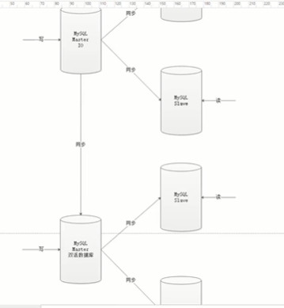

https://blog.csdn.net/weixin_42586723/article/details/106499751

数据库出现重复 ID

单一 mysql——>读写分离——>数据库同步

写数据水平扩展，复制数据库集群，双活



自增：

第二个也是自增，则同步时会冲突

两个节点的话可以设置步长不同，一个从 1 开始，一个从 2 开始

如果对接其他产品或则公司，

ID 必须唯一：

UUID

mysql 官方明确 ID 尽量越短越好，不建议使用 UUID 作为主键，

而且对 MYSQL 索引不利，如果主键在 Innodb 引擎下，由于 UUID 的无序性，可能会导致数据位置频繁变动，严重影响性能

推特的雪花算法：


Snowflake 生成的是 Long 类型的 ID，一个 Long 类型占 8 个字节，每个字节占 8 比特，也就是说一个 Long 类型占 64 个比特。

符号位第一位恒为 0

41 位时间戳表示所能容纳的总的毫秒数

工作进程位：

Java 进程中唯一，

序列号位：

根据这个算法的逻辑，只需要将这个算法用 Java 语言实现出来，封装为一个工具方法，那么各个业务应用可以直接使用该工具方法来获取分布式 ID，只需保证每个业务应用有自己的工作机器 id 即可，而不需要单独去搭建一个获取分布式 ID 的应用。**理论上 Snowflake 算法方案的 QPS 大约为 409.6w/s**

缺点：

**强依赖于机器时钟**，如果时钟回拨，会导致重复的 ID 生成，所以一般基于此的算法发现时钟回拨，都会抛异常处理，阻止 ID 生成，这可能导致服务不可用

全局时钟：

多个 JVM 获取的时间不同，

NTP 网络时间协议取时间

如果 JVM 已经跑到了 45 秒，但是全局时钟慢了一秒，去取时间时发现慢了一秒，需要回拨一秒，但是 44 秒的数据已经生成，回拨后再生成出错

服务部署在内网，只能自己部署时间服务器，导致回退

解决时钟问题：

不进行回拨，直接等待，所有暂停，等待时间到达这一时间，再进行生产

# 分布式 ID 的生成特性

- 全局唯一

  必须保证 ID 是全局性唯一

- 高可用低延时

  ID 生成响应要快，能够扛住高并发，延时足够低不至于成为业务瓶颈

- 数字类型趋势递增

  从 MySQL 存储引擎考虑，后面的 ID 必须必前面的大，并需要保证写入数据的性能

- 长度短

  能够提高查询效率，从 MySQL 数据库规范考虑，尤其是 ID 作为主键

- 信息安全

  如果 ID 连续生成，会导致被猜出从而泄漏业务信息，所以需要无规则

# 分布式 ID 生成方式

## UUID

- 简介

  UUID 具有全球唯一的特性，可以做分布式 ID，但不推荐

- 生成方式

  ```java
    public static void main(String[] args) {
      String uuid = UUID.randomUUID().toString().replaceAll("-", "");
      System.out.println(uuid);
    }
  
  ```


分析

  UUID 不适用于实际的业务需求，像用作订单号 UUID 这样的字符串没有丝毫意义，看不出和订单相关的有用信息；而对于数据库来说**用作业务主键 ID，它不仅太长而且还是字符串，存储性能差查询也很耗时**

- 优点

  生成简单，本地生成无网络消耗，具有全球唯一性

- 缺点

  长度过长 16 字节 128 位，36 位长度的字符串；
  
  存储以及查询对 MySQL 的性能消耗较大，MySQL 官方明确建议主键要尽量越短越好，作为**数据库主键 UUID 的无序性会导致数据位置频繁变动，严重影响性能**
  
  无序对业务不友好，查询效率低

## 数据库自增 ID

简介

基于数据库的 auto_increment 自增 ID 完全可以充当分布式 ID，具体实现：**需要一个单独的 MySQL 实例用来生成 ID**

生成方式

```sql
  CREATE DATABASE `SEQ_ID`;

  CREATE TABLE SEQID.SEQUENCE_ID (
      id bigint(20) unsigned NOT NULL auto_increment,
      value char(10) NOT NULL default '',
      PRIMARY KEY (id),
  ) ENGINE=MyISAM;
```

```


    insert into SEQUENCE_ID(value)  VALUES ('values');
```

分析

当需要一个 ID 的时候，向表中插入一条记录返回主键 ID，但存在致命缺点，访问量激增时 MySQL 本身就是系统瓶颈，不推荐

优点

实现简单，ID 单调自增，数值类型查询速度快

缺点

DB 单点存在宕机风险，无法扛住高并发场景

## 数据库多主模式

- 简介

  此方式是对上面数据库自增 ID 的高可用优化，采用主从模式集群。也就是两个 MySQL 实例都能单独生产自增 ID

  **需要设置起始值和自增步长**，避免生成重复 ID

- 生成方式

  1. MySQL_1 配置

  ```sql
    set @@auto_increment_offset = 1; --起始值
    set @@auto_increment_increment = 2; --步长
  ```

  1. MySQL_2 配置

  ```sql
  set @@auto_increment_offset = 2; --起始值
    set @@auto_increment_increment = 2; --步长
  ```

  1. 运行结果

  两个 MySQL 实例的自增 ID 分别是：

  1、3、5、7、9
  2、4、6、8、10

- 分析

  如果集群后的性能还是扛不住高并发，就要进行 MySQL 扩容增加节点

  

  水平扩展的数据库集群，有利于解决数据库单点压力的问题，同时为了 ID 生成特性，将**自增步长按照机器数量来设置**。

  增加第三台 MySQL 实例需要人工修改一、二两台 MySQL 实例的起始值和步长，把第三台机器的 ID 起始生成位置设定在比现有最大自增 ID 的位置远一些，但必须在一、二两台 MySQL 实例 ID 还没有增长到第三台 MySQL 实例的起始 ID 值的时候，否则自增 ID 就要出现重复了，**必要时可能还需要停机修改**。

- 优点

  解决 DB 单点问题

- 缺点

  不利于后续扩容，而且实际上单个数据库自身压力还是大，依旧无法满足高并发场景。

## 号段模式

- 简介

  号段模式是当下分布式 ID 生成器的主流实现方式之一，号段模式可以理解为从数据库批量的获取自增 ID，每次从数据库取出一个号段范围，例如 (1,1000] 代表 1000 个 ID，**具体的业务服务将本号段，生成 1~1000 的自增 ID 并加载到内存**。

- 生成方式

  ```sql
    CREATE TABLE id_generator (
      id int(10) NOT NULL,
      max_id bigint(20) NOT NULL COMMENT '当前最大id',
      step int(20) NOT NULL COMMENT '号段的布长',
      biz_type	int(20) NOT NULL COMMENT '业务类型',
      version int(20) NOT NULL COMMENT '版本号',
      PRIMARY KEY (`id`)
    )
  ```

  biz_type ：代表不同业务类型

  max_id ：当前最大的可用 id

  step ：代表号段的长度

  version ：是一个乐观锁，每次都更新 version，保证并发时数据的正确性

- 分析

  该批号段 ID 用完，再次向数据库申请新号段，对 max_id 字段做一次 update 操作，update max_id= max_id + step，update 成功则说明新号段获取成功，新的号段范围是(max_id ,max_id +step]

  ```sql
    update id_generator set max_id = #{max_id+step}, version = version + 1 where version = # {version} and biz_type = XXX
  ```

  获取分布式 ID 流程：

  1. 用户服务在注册一个用户时，需要一个用户 ID；会请求生成 ID 服务(是独立的应用)的接口

2. 生成 ID 的服务会去查询数据库，找到 user_tag 的 id，现在的 max_id 为 0，step=1000
3. 生成 ID 的服务把 max_id 和 step 返回给用户服务，并且把 max_id 更新为 max_id = max_id + step，即更新为 1000
4. 用户服务获得 max_id=0，step=1000；
5. 这个用户服务可以用[max_id + 1，max_id+step]区间的 ID，即为[1，1000]
6. 用户服务把这个区间保存到 jvm 中
7. 用户服务需要用到 ID 的时候，在区间[1，1000]中依次获取 id，可采用 AtomicLong 中的 getAndIncrement 方法。
8. 如果把区间的值用完了，再去请求生产 ID 的服务的接口，获取到 max_id 为 1000，即可以用[max_id + 1，max_id+step]区间的 ID，即为[1001，2000]

- 优点

  1. 扩张灵活，性能强能够撑起大部分业务场景。
  2. ID 号码是趋势递增的，满足数据库存储和查询性能要求。
  3. 可用性高，即使 ID 生成服务器不可用，也能够使得业务在短时间内可用，为排查问题争取时间。
  4. 可以自定义 max_id 的大小，方便业务迁移，方便机器横向扩张。

- 缺点

  由于多业务端可能同时操作，所以**采用版本号 version 乐观锁方式更新**

  1. ID 号码不够随机，完整的顺序递增可能带来安全问题。
  2. DB 宕机可能导致整个系统不可用，仍然存在这种风险，因为号段只能撑一段时间。
  3. 可能存在分布式环境各节点同一时间争抢分配 ID 号段的情况，这可能导致并发问题而出现 ID 重复生成

## Redis生成

- 简介

  Redis 也同样可以实现，原理就是利用 redis 的 incr 命令实现 ID 的原子性自增

- 生成方式

  ```sh
    set seq_id 1     // 初始化自增ID为1

    incr seq_id      // 增加1，并返回递增后的数值
  ```

- 分析

  用 redis 实现需要注意一点，要考虑到 redis 持久化的问题。redis 有两种持久化方式 RDB 和 AOF：

  1. RDB 会定时打一个快照进行持久化，假如连续自增但 redis 没及时持久化，而这会 Redis 挂掉了，重启 Redis 后会出现 ID 重复的情况。
  2. AOF 会对每条写命令进行持久化，即使 Redis 挂掉了也不会出现 ID 重复的情况，但由于 incr 命令的特殊性，会导致 Redis 重启恢复的数据时间过长。

- 优点

  有序递增，可读性强。

  能够满足一定性能。

- 缺点

  强依赖于 Redis，可能存在单点问题。

  占用宽带，而且需要考虑网络延时等问题带来地性能冲击。

## 雪花算法（SnowFlake）

简介

雪花算法（Snowflake）是 twitter 公司内部分布式项目采用的 ID 生成算法


### 分析：

Snowflake 生成的是 Long 类型的 ID，一个 Long 类型占 8 个字节，每个字节占 8 比特，也就是说一个 Long 类型占 64 个比特。

Snowflake ID 组成结构：**正数位（占 1 比特）+ 时间戳（占 41 比特）+ 机器 ID（占 5 比特）+ 数据中心（占 5 比特）+ 自增值（占 12 比特），总共 64 比特组成的一个 Long 类型**。

1. 第一个 bit 位（1bit）：Java 中 long 的最高位是符号位代表正负，正数是 0，负数是 1，一般生成 ID 都为正数，所以默认为 0。
2. 时间戳部分（41bit）：毫秒级的时间，不建议存当前时间戳，而是用（当前时间戳 - 固定开始时间戳）的差值，可以使产生的 ID 从更小的值开始；41 位的时间戳可以使用 69 年，(1L << 41) / (1000L _ 60 _ 60 _ 24 _ 365) = 69 年
3. 工作机器 id（10bit）：也被叫做 workId，这个可以灵活配置，机房或者机器号组合都可以。
4. 序列号部分（12bit），自增值支持同一毫秒内同一个节点可以生成 4096 个 ID

根据这个算法的逻辑，只需要将这个算法用 Java 语言实现出来，封装为一个工具方法，那么各个业务应用可以直接使用该工具方法来获取分布式 ID，只需保证每个业务应用有自己的工作机器 id 即可，而不需要单独去搭建一个获取分布式 ID 的应用。**理论上 Snowflake 算法方案的 QPS 大约为 409.6w/s**

- 优点

  1. 每秒能够生成百万个不同的 ID，性能佳。
  2. 时间戳值在高位，中间是固定的机器码，自增的序列在低位，整个 ID 是趋势递增的。
  3. 能够根据业务场景数据库节点布置灵活挑战 bit 位划分，灵活度高

- 缺点

  **强依赖于机器时钟**，如果时钟回拨，会导致重复的 ID 生成，所以一般基于此的算法发现时钟回拨，都会抛异常处理，阻止 ID 生成，这可能导致服务不可用

### 生成方式

```java
  /**
  * Twitter的SnowFlake算法,使用SnowFlake算法生成一个整数，然后转化为62进制变成一个短地址URL
  *
  * https://github.com/beyondfengyu/SnowFlake
  */
  public class SnowFlakeShortUrl {

      /**
      * 起始的时间戳
      */
      private final static long START_TIMESTAMP = 1480166465631L;

      /**
      * 每一部分占用的位数
      */
      private final static long SEQUENCE_BIT = 12;   //序列号占用的位数
      private final static long MACHINE_BIT = 5;     //机器标识占用的位数
      private final static long DATA_CENTER_BIT = 5; //数据中心占用的位数

      /**
      * 每一部分的最大值
      */
      private final static long MAX_SEQUENCE = -1L ^ (-1L << SEQUENCE_BIT);
      private final static long MAX_MACHINE_NUM = -1L ^ (-1L << MACHINE_BIT);
      private final static long MAX_DATA_CENTER_NUM = -1L ^ (-1L << DATA_CENTER_BIT);

      /**
      * 每一部分向左的位移
      */
      private final static long MACHINE_LEFT = SEQUENCE_BIT;
      private final static long DATA_CENTER_LEFT = SEQUENCE_BIT + MACHINE_BIT;
      private final static long TIMESTAMP_LEFT = DATA_CENTER_LEFT + DATA_CENTER_BIT;

      private long dataCenterId;  //数据中心
      private long machineId;     //机器标识
      private long sequence = 0L; //序列号
      private long lastTimeStamp = -1L;  //上一次时间戳

      private long getNextMill() {
          long mill = getNewTimeStamp();
          while (mill <= lastTimeStamp) {
              mill = getNewTimeStamp();
          }
          return mill;
      }

      private long getNewTimeStamp() {
          return System.currentTimeMillis();
      }

      /**
      * 根据指定的数据中心ID和机器标志ID生成指定的序列号
      *
      * @param dataCenterId 数据中心ID
      * @param machineId    机器标志ID
      */
      public SnowFlakeShortUrl(long dataCenterId, long machineId) {
          if (dataCenterId > MAX_DATA_CENTER_NUM || dataCenterId < 0) {
              throw new IllegalArgumentException("DtaCenterId can't be greater than MAX_DATA_CENTER_NUM or less than 0！");
          }
          if (machineId > MAX_MACHINE_NUM || machineId < 0) {
              throw new IllegalArgumentException("MachineId can't be greater than MAX_MACHINE_NUM or less than 0！");
          }
          this.dataCenterId = dataCenterId;
          this.machineId = machineId;
      }

      /**
      * 产生下一个ID
      *
      * @return
      */
      public synchronized long nextId() {
          long currTimeStamp = getNewTimeStamp();
          if (currTimeStamp < lastTimeStamp) {
              throw new RuntimeException("Clock moved backwards.  Refusing to generate id");
          }

          if (currTimeStamp == lastTimeStamp) {
              //相同毫秒内，序列号自增
              sequence = (sequence + 1) & MAX_SEQUENCE;
              //同一毫秒的序列数已经达到最大
              if (sequence == 0L) {
                  currTimeStamp = getNextMill();
              }
          } else {
              //不同毫秒内，序列号置为0
              sequence = 0L;
          }

          lastTimeStamp = currTimeStamp;

          return (currTimeStamp - START_TIMESTAMP) << TIMESTAMP_LEFT //时间戳部分
                  | dataCenterId << DATA_CENTER_LEFT       //数据中心部分
                  | machineId << MACHINE_LEFT             //机器标识部分
                  | sequence;                             //序列号部分
      }
      
        public static void main(String[] args) {
            SnowFlakeShortUrl snowFlake = new SnowFlakeShortUrl(2, 3);
    
            /**
              * 小知识点：
              * 1 << 4 指将数字1左移4位
              *
              * 1. 首先将1转换为二进制0000 0000 0000 0000 0000 0000 0000 0001（1个字节8个bit位）
              * 2. 然后把该数字高位（左侧）的4个零移出，其他的数字都朝左平移4位，最后在低位（右侧）的4个空位补零
              * 3. 则得到的最终结果是0000 0000 0000 0000 0000 0000 0001 0000，则转换为十进制是16
              **/
            for (int i = 0; i < (1 << 4); i++) {
                //10进制
                System.out.println(snowFlake.nextId());
            }
        }
    }
```

- 

## 百度 （Uidgenerator）

uid-generator 是由百度技术部开发，项目 GitHub 地址 https://github.com/baidu/uid-generator


### 分析

**uid-generator 是基于 Snowflake 算法实现的**，与原始的 snowflake 算法不同在于，uid-generator**支持自定义时间戳、工作机器 ID 和序列号**等各部分的位数，而且 uid-generator 中采用用户自定义 workId 的生成策略。

对于 uid-generator ID 组成结构：

workId，占用了 22 个 bit 位，时间占用了 28 个 bit 位，序列化占用了 13 个 bit 位，需要注意的是，和原始的 snowflake 不太一样，**时间的单位是秒，而不是毫秒，workId 也不一样，而且同一应用每次重启就会消费一个 workId**

**uid-generator 需要与数据库配合使用**，需要新增一个 WORKER_NODE 表。当应用启动时会向数据库表中去插入一条数据，**插入成功后返回的自增 ID 就是该机器的 workId 数据由 host，port 组成**


生成方式

https://github.com/baidu/uid-generator/blob/master/README.zh_cn.md


## 美团（Leaf）

Leaf 由美团开发，github 地址：https://github.com/Meituan-Dianping/Leaf

Leaf 同时支持**号段模式和 snowflake 算法模式**，可以切换使用

### 号段模式

分析：

美团技术团队 Leaf-segment 对此做了优化，**将获取一个号段的方式优化成获取两个号段，在一个号段用完之后不用立马去更新号段，还有一个缓存号段备用**，这样能够有效解决这种冲突问题，而且采用双 buffer 的方式，**在当前号段消耗了 10%的时候就去检查下一个号段有没有准备好，如果没有准备好就去更新下一个号段，当当前号段用完了就切换到下一个已经缓存好的号段去使用，同时在下一个号段消耗到 10%的时候，又去检测下一个号段有没有准备好，如此往复**。

1. 当前获取 ID 在 buffer1 中，每次获取 ID 在 buffer1 中获取
2. 当 buffer1 中的 Id 已经使用到了 100，也就是达到区间的 10%
3. 达到了 10%，先判断 buffer2 中有没有去获取过，如果没有就立即发起请求获取 ID 线程，此线程把获取到的 ID，设置到 buffer2 中。
4. 如果 buffer1 用完了，会自动切换到 buffer2
5. buffer2 用到 10%了，也会启动线程再次获取，设置到 buffer1 中
6. 依次往返

优点

1. 基本的数据库问题都解决了，而且行之有效。
2. 基于 JVM 存储双 buffer 的号段，减少了数据库查询，减少了网络依赖，效率更高。

缺点

1. segment 号段长度是固定的，业务量大时可能会频繁更新号段，因为原本分配的号段会一下子用完。
2. 如果号段长度设置的过长，但凡缓存中有号段没有消耗完，其他节点重新获取的号段与之前相比可能跨度会很大。

其他

针对上面的缺点，美团有重新提出**动态调整号段长度**的方案

假设服务 QPS 为 Q，号段长度为 L，号段更新周期为 T，那么 Q \* T = L。**最开始 L 长度是固定的，导致随着 Q 的增长，T 会越来越小**。但是本方案本质的需求是希望 T 是固定的。那么如果 L 可以和 Q 正相关的话，T 就可以趋近一个定值了。所以本方案每次更新号段的时候，会根据上一次更新号段的周期 T 和号段长度 step，来决定下一次的号段长度 nextStep，下面是一个简单的算法，意在说明动态更新的意思：

```txt
  T < 15min，nextStep = step * 2
  15min < T < 30min，nextStep = step
  T > 30min，nextStep = step / 2
```


生成方式

1. 先导入源码 https://github.com/Meituan-Dianping/Leaf
2. 在建一张表 leaf_alloc

```sql
  DROP TABLE IF EXISTS `leaf_alloc`;

  CREATE TABLE `leaf_alloc` (
    `biz_tag` varchar(128)  NOT NULL DEFAULT '' COMMENT '业务key',
    `max_id` bigint(20) NOT NULL DEFAULT '1' COMMENT '当前已经分配了的最大id',
    `step` int(11) NOT NULL COMMENT '初始步长，也是动态调整的最小步长',
    `description` varchar(256)  DEFAULT NULL COMMENT '业务key的描述',
    `update_time` timestamp NOT NULL DEFAULT CURRENT_TIMESTAMP ON UPDATE CURRENT_TIMESTAMP COMMENT '数据库维护的更新时间',
    PRIMARY KEY (`biz_tag`)
  ) ENGINE=InnoDB;
```

然后在项目中开启号段模式，配置对应的数据库信息，并关闭 snowflake 模式

```properties
leaf.name=com.sankuai.leaf.opensource.test
leaf.segment.enable=true
leaf.jdbc.url=jdbc:mysql://localhost:3306/leaf_test?useUnicode=true&characterEncoding=utf8&characterSetResults=utf8
leaf.jdbc.username=root
leaf.jdbc.password=root

leaf.snowflake.enable=false
#leaf.snowflake.zk.address=
#leaf.snowflake.port=
```

启动 leaf-server 模块的 LeafServerApplication

号段模式获取分布式自增 ID 的测试 url ：http：//localhost：8080/api/segment/get/leaf-segment-test

监控号段模式：http://localhost:8080/cache

### snowflake 模式

生成方式

配置说明

Leaf 的 snowflake 模式依赖于 ZooKeeper，不同于原始 snowflake 算法也主要是在 workId 的生成上，Leaf 中 workId 是基于 ZooKeeper 的顺序 Id 来生成的，**每个应用在使用 Leaf-snowflake 时，启动时都会都在 Zookeeper 中生成一个顺序 Id，相当于一台机器对应一个顺序节点，也就是一个 workId**。

配置

```properties
  leaf.snowflake.enable=true
  leaf.snowflake.zk.address=127.0.0.1
  leaf.snowflake.port=2181
```

测试

snowflake 模式获取分布式自增 ID 的测试 url：http://localhost:8080/api/snowflake/get/test

## 滴滴出品（TinyID）

Tinyid 由滴滴开发，Github 地址：https://github.com/didi/tinyid

Tinyid 是基于号段模式原理实现的与 Leaf 如出一辙，每个服务获取一个号段（1000,2000]、（2000,3000]、（3000,4000]


### 生成方式

1：Http 方式

导入 TInyid 源码

git clone https://github.com/didi/tinyid.git

创建数据表

```sql
  CREATE TABLE `tiny_id_info` (
    `id` bigint(20) unsigned NOT NULL AUTO_INCREMENT COMMENT '自增主键',
    `biz_type` varchar(63) NOT NULL DEFAULT '' COMMENT '业务类型，唯一',
    `begin_id` bigint(20) NOT NULL DEFAULT '0' COMMENT '开始id，仅记录初始值，无其他含义。初始化时begin_id和max_id应相同',
    `max_id` bigint(20) NOT NULL DEFAULT '0' COMMENT '当前最大id',
    `step` int(11) DEFAULT '0' COMMENT '步长',
    `delta` int(11) NOT NULL DEFAULT '1' COMMENT '每次id增量',
    `remainder` int(11) NOT NULL DEFAULT '0' COMMENT '余数',
    `create_time` timestamp NOT NULL DEFAULT '2010-01-01 00:00:00' COMMENT '创建时间',
    `update_time` timestamp NOT NULL DEFAULT '2010-01-01 00:00:00' COMMENT '更新时间',
    `version` bigint(20) NOT NULL DEFAULT '0' COMMENT '版本号',
    PRIMARY KEY (`id`),
    UNIQUE KEY `uniq_biz_type` (`biz_type`)
  ) ENGINE=InnoDB AUTO_INCREMENT=1 DEFAULT CHARSET=utf8 COMMENT 'id信息表';

  CREATE TABLE `tiny_id_token` (
    `id` int(11) unsigned NOT NULL AUTO_INCREMENT COMMENT '自增id',
    `token` varchar(255) NOT NULL DEFAULT '' COMMENT 'token',
    `biz_type` varchar(63) NOT NULL DEFAULT '' COMMENT '此token可访问的业务类型标识',
    `remark` varchar(255) NOT NULL DEFAULT '' COMMENT '备注',
    `create_time` timestamp NOT NULL DEFAULT '2010-01-01 00:00:00' COMMENT '创建时间',
    `update_time` timestamp NOT NULL DEFAULT '2010-01-01 00:00:00' COMMENT '更新时间',
    PRIMARY KEY (`id`)
  ) ENGINE=InnoDB AUTO_INCREMENT=1 DEFAULT CHARSET=utf8 COMMENT 'token信息表';

  INSERT INTO `tiny_id_info` (`id`, `biz_type`, `begin_id`, `max_id`, `step`, `delta`, `remainder`, `create_time`, `update_time`, `version`)
  VALUES
    (1, 'test', 1, 1, 100000, 1, 0, '2018-07-21 23:52:58', '2018-07-22 23:19:27', 1);

  INSERT INTO `tiny_id_info` (`id`, `biz_type`, `begin_id`, `max_id`, `step`, `delta`, `remainder`, `create_time`, `update_time`, `version`)
  VALUES
    (2, 'test_odd', 1, 1, 100000, 2, 1, '2018-07-21 23:52:58', '2018-07-23 00:39:24', 3);
    INSERT INTO `tiny_id_token` (`id`, `token`, `biz_type`, `remark`, `create_time`, `update_time`)
    VALUES
      (1, '0f673adf80504e2eaa552f5d791b644c', 'test', '1', '2017-12-14 16:36:46', '2017-12-14 16:36:48');
    
    INSERT INTO `tiny_id_token` (`id`, `token`, `biz_type`, `remark`, `create_time`, `update_time`)
    VALUES
      (2, '0f673adf80504e2eaa552f5d791b644c', 'test_odd', '1', '2017-12-14 16:36:46', '2017-12-14 16:36:48');

```
配置数据库

```properties
datasource.tinyid.names=primary
datasource.tinyid.primary.driver-class-name=com.mysql.jdbc.Driver
datasource.tinyid.primary.url=jdbc:mysql://ip:port/databaseName?autoReconnect=true&useUnicode=true&characterEncoding=UTF-8
datasource.tinyid.primary.username=root
datasource.tinyid.primary.password=123456
```

启动 tinyid-server 后测试

```html
获取分布式自增ID:
http://localhost:9999/tinyid/id/nextIdSimple?bizType=test&token=0f673adf80504e2eaa552f5d791b644c'
返回结果: 
3 批量获取分布式自增ID:
http://localhost:9999/tinyid/id/nextIdSimple?bizType=test&token=0f673adf80504e2eaa552f5d791b644c&batchSize=10'
返回结果: 4,5,6,7,8,9,10,11,12,13
```

tinyid-client(Java 客户端)

重复 Http 方式的（2）（3）操作

引入依赖

```xml
  <dependency>
      <groupId>com.xiaoju.uemc.tinyid</groupId>
      <artifactId>tinyid-client</artifactId>
      <version>${tinyid.version}</version>
  </dependency>
```

配置文件

```properties
tinyid.server =localhost:9999
tinyid.token =0f673adf80504e2eaa552f5d791b644c
```

test 、tinyid.token 是在数据库表中预先插入的数据，test 是具体业务类型，tinyid.token 表示可访问的业务类型

测试方式

```java
 // 获取单个分布式自增ID
 Long id =  TinyId.nextId("test");

  // 按需批量分布式自增ID
   List<Long> ids =  TinyId.nextId("test" ,10);
```


## 自研设计
