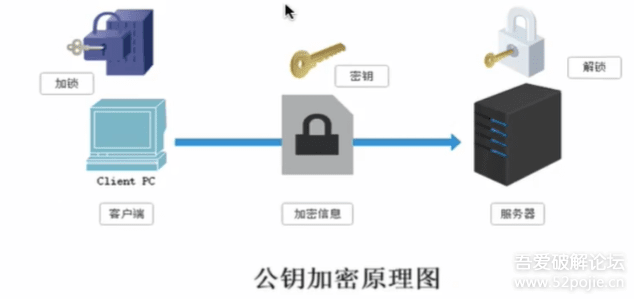
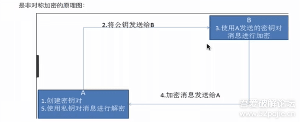
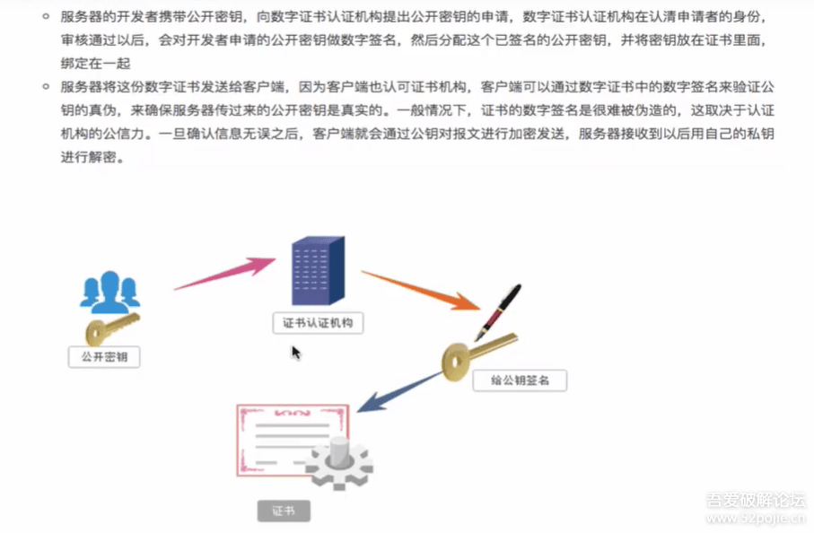
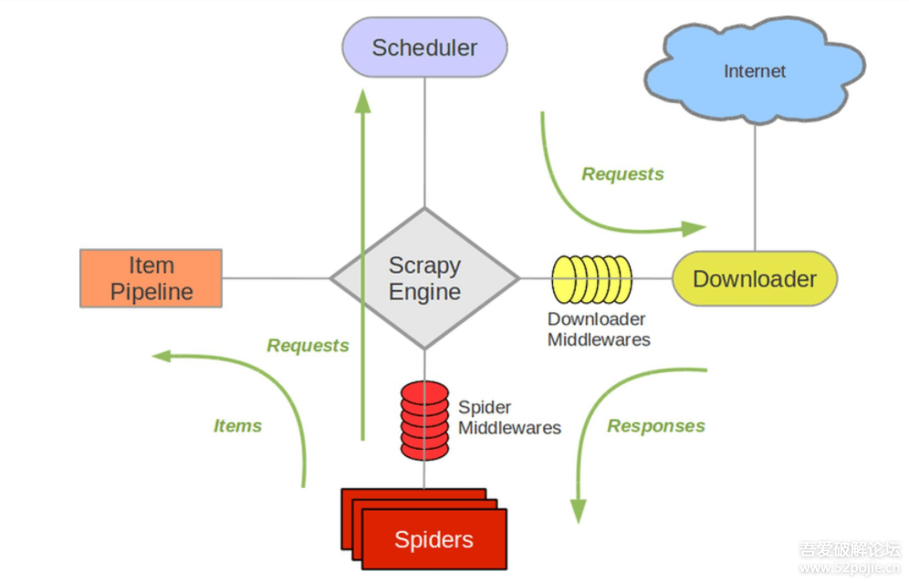

**技能项**：Scrapy、PySpider、Portia、Beautiful Soup、Cola(分布式爬虫框架)

# 一、爬虫基础简介

## 1. 爬虫简介

**什么是爬虫：**通过编写程序，模拟浏览器上网，然后让其去互联网上抓取数据的过程。

## 2. 爬虫合法性探究

**爬虫究竟是合法还是违法的？**

- 在法律中是不被禁止的
- 具有违法风险
- 善意爬虫 & 恶意爬虫

**爬虫带来的风险可以体现在如下两个方面：**

1. 爬虫干扰了被访问网站的正常运营
2. 爬虫抓取了受到法律保护的特定类型的数据或信息

**如何在编写使用的过程中避免进入局子的厄运？**

- 时常优化自己的程序，避免干扰被访问网站的正常运行
- 在使用，传播爬取到的数据时，审查抓取到的内容，如果发现了涉及到用户隐私或者商业机密等敏感内容，需要及时停止爬取或者传播。

## 3. 爬虫初试深入

**爬虫在使用场景中的分类：**

- **通用爬虫：**抓取系统的重要组成部分。抓取的是一整张页面数据。
- **聚焦爬虫：**是建立在通用爬虫的基础之上。抓取的是页面中特定的局部内容。
- **增量式爬虫：**监测网站中数据更新的情况。只会抓取网站中最新更新出来的数据。

**爬虫的矛与盾：**

- **反爬机制：**门户网站，可以通过制定相应的策略或者技术手段，防止爬虫程序进行网站数据的爬取。
- **反反爬策略：**爬虫程序，可以通过制定相关的策略或者技术手段，破解门户网站中具备的反爬机制，从而可以获取门户网站中相关的数据。

**robots.txt协议：**君子协议。规定了网站中那些数据可以被爬虫爬取，那些数据不允许被爬取。

例如：[www.tabao.com/robots.txt](https://www.tabao.com/robots.txt)

## 4. http&https协议

### （1）http协议

**概念：**就是服务器和客户端进行数据交互的一种形式。

**常用请求头信息：**

- **User-Agent：**请求载体的身份标识
- **Connection：**请求完毕后，是断开连接还是保持连接

**常用响应头信息：**

- **Content-Type：**服务器响应回客户端的数据类型

### （2）https协议

**概念：**安全的超文本传输协议

### （3）加密方式

- **对称秘钥加密**

  

  

- **非对称秘钥加密**

  存在缺点：第一个是如何保证接收端向发送端发出公开秘钥的时候，发送端确保收到的是预先要发送的，而不会被挟持，只要是发送秘钥，就有可能有被挟持的风险；第二个是非对称秘钥加密方式效率比较低，处理起来更为复杂，通信过程中使用就有一定的效率问题而影响通信速度。

  

  

- **证书秘钥加密：**

  - 服务器的开发者携带公开密钥，向数字证书认证机构提出公开密钥的申请，数字证书认证机构在认清申请者的身份审核通过以后，会对开发者申请的公开密钥做数字签名，然后分配这个已签名的公开密钥，并将密钥放在证书里面，绑定在一起；
  - 服务器将这份数字证书发送给客户端，因为客户端也认可证书机构，客户端可以通过数字证书中的数字签名来验证公钥的真伪，来确保服务器传过来的公开密钥是真实的。一般情况下，证书的数字签名是很难被伪造的，这取决于认证机构的公信力。一旦确认信息无误之后，客户端就会通过公钥对报文进行加密发送，服务器接收到以后用自己的私钥进行解密。

  


# 二、requests模块基础

## 1. requests第一血

**requests模块：**Python中原生的一款基于网络请求的模块，功能非常强大，简单便捷，效率极高。

**作用：**模拟浏览器发请求。

**如何使用：（requests模块的编码流程）**

- 指定 url
- 发起请求
- 获取响应数据
- 持久化存储

**环境的安装：**`pip install requests`

**实战编码：**

- 需求：爬取搜狗首页的数据

```
import requests
if __name__ == '__main__':
    #step1 指定url
    url = 'https://www.sogou.com/'
    #step2 发起请求
    #get方法会返回一个响应对象
    response = requests.get(url = url)
    #step3 获取响应数据，text返回的是字符串形式的响应数据
    page_text = response.text
    print(page_text)
    #step4 持久化存储
    with open('./sogou.html','w',encoding = 'utf-8') as fp:
        fp.write(page_text)
    print('爬取数据结束！')
```

## 2. requests巩固深入案例介绍

### （1）简易网页采集器

- UA检测
- UA伪装

```
#UA：User-Agent请求载体的身份标识
'''UA检测：门户网站的服务器会监测对应请求的载体身份标识，
如果检测到请求载体身份标识是某一款浏览器,说明该请求时一个正常的请求；
但是，如果检测到请求的载体身份不是基于某一款浏览器的，则表示该请求为不正常请求（爬虫）,
则服务器很有可能拒绝该次请求'''

#UA伪装：让爬虫对应的请求载体身份标识伪装成某一款浏览器，躲过UA检测
import requests
if __name__ == '__main__':
    #UA伪装：将对应的User-Agent封装到一个字典中
    headers = {
    'User-Agent':'Mozilla/5.0 (Windows NT 10.0; Win64; x64) AppleWebKit/537.36 (KHTML, like Gecko) Chrome/72.0.3626.121 Safari/537.36'
    }
    #step1 指定url query
    url = 'https://www.sogou.com/web'
    #处理url携带的参数 封装到字典中
    kw = input('Enter a word:')
    param ={
        'query':kw
    }
    #step2 对指定的url发起请求，对应的url是携带参数的，并且处理过程中处理了参数
    response = requests.get(url = url,params = param,headers = headers)
    #step3
    page_text = response.text
    #step4
    fileName = kw + '.html'
    with open(fileName,'w',encoding ='utf-8') as fp:
        fp.write(page_text)
    print(fileName,'保存成功！！')
```

### （2）破解百度翻译

- post请求（携带了参数）
- 响应数据是一组json数据

```
import requests
import json
if __name__ == '__main__':
    #step1 指定URL
    post_url = 'https://fanyi.baidu.com/sug'

    #step2 进行UA伪装
    headers = {
    'User-Agent':'Mozilla/5.0 (Windows NT 10.0; Win64; x64) AppleWebKit/537.36 (KHTML, like Gecko) Chrome/72.0.3626.121 Safari/537.36'
    }

    #step3 post请求参数处理（同get请求类似）
    word = input('Enter a word:\n')
    data = {
        'kw':word
    }

    #step4 请求发送
    response = requests.post(url = post_url,data = data,headers = headers)

    #step5 获取响应数据:json()方法返回的是obj  (如果确认响应数据是json类型-->通过Content-Type分辨，才可以直接用json方法)
    dict_obj = response.json()
    print(dict_obj)

    #step6 持久化存储
    fileName = word + '.json'
    fp = open(fileName,'w',encoding='utf-8')
    json.dump(dict_obj,fp = fp,ensure_ascii = False)

    print('Over!')
```

### （3）豆瓣电影

```
import requests
import json
if __name__ == '__main__':
    url = 'https://movie.douban.com/j/chart/top_list'
    param = {
        'type':'24',
        'interval_id':'100:90',
        'action':'',
        'start':'0',        #从库中的第几部电影去取
        'limit':'20'        #一次取出的个数
    }
    headers = {
    'User-Agent':'Mozilla/5.0 (Windows NT 10.0; Win64; x64) AppleWebKit/537.36 (KHTML, like Gecko) Chrome/72.0.3626.121 Safari/537.36'
    }
    response = requests.get(url = url,params = param,headers = headers)
    list_data = response.json()
    fp = open('./douban.json','w',encoding = 'utf-8')
    json.dump(list_data,fp = fp,ensure_ascii = False)
    print('Over!')
```

## 3. 作业---肯德基餐厅查询

```
import requests
import json

if __name__ == '__main__':
    post_url = 'https://www.kfc.com.cn/kfccda/ashx/GetStoreList.ashx?op=keyword'
    keyword = input('请输入要查询的城市：')

    data ={
        'cname': '',
        'pid': '',
        'keyword': keyword,
        'pageindex': '1',
        'pageSize': '10'
    }
    headers = {
    'User-Agent':'Mozilla/5.0 (Windows NT 10.0; Win64; x64) AppleWebKit/537.36 (KHTML, like Gecko) Chrome/72.0.3626.121 Safari/537.36'
    }
    response = requests.post(url = post_url, data = data, headers = headers)

    # 持久化存储
    # page_text = response.text
    # fileName = keyword + '.html'
    # with open(fileName, 'w', encoding= 'utf-8') as fp:
    #     fp.write(page_text)
    # print(fileName, 'Over!')

    # 直接打印出来
    page = response.json()
    for dict in page['Table1']:
        StoreName = dict['storeName']
        address = dict['addressDetail']
        print('StoreName:' + StoreName, 'address:' + address + '\n')
```

## 4. 综合练习---药监总局

- 爬取国家药品监督管理总局中**基于中华人民共和国化妆品生产许可证相关数据**（http://scxk.nmpa.gov.cn:81/xk/）
- **动态加载数据：**首页中对应的企业信息是通过 `ajax` 动态请求到的
- 通过对详情页url的观察发现：
  - url的域名都是一样的，只有携带的参数（id）不一样
  - id值可以从首页对应的 `ajax` 请求到的 `json` 串中获取
  - 域名和id值拼接出一个完整的企业对应的详情页的url
- **详情页的企业详情数据也是动态加载出来的！！！**
  - 观察后发现，所有 `post` 请求的url都是一样的，只有参数id值不同
  - 如果我们可以批量获取多家企业的id后，就可以就id和url形成一个完整的详情页对应详情数据的 `ajax` 请求的url

```
import requests
import json

if __name__ == '__main__':
    headers = {
        'User-Agent': 'Mozilla/5.0 (Windows NT 10.0; Win64; x64) AppleWebKit/537.36 (KHTML, like Gecko) Chrome/72.0.3626.121 Safari/537.36'
    }
    id_list = []  # 存储企业的id
    all_data_list = []  # 存储企业所有的详情数据
    # 批量获取不同企业的id值
    url = 'http://scxk.nmpa.gov.cn:81/xk/itownet/portalAction.do?method=getXkzsList'
    # 参数的封装
    for page in range(1, 11):
        page = str(page)
        data = {
            'on': 'true',
            'page': page,
            'pageSize': '15',
            'productName': '',
            'conditionType': '1',
            'applyname': '',
            'applysn': '',
        }
    json_ids = requests.post(url=url, headers=headers, data=data).json()
    # 从 json_ids 字典中拿到 list 对应的 value 值，对 value 值列表进行遍历
    for dic in json_ids['list']:
        id_list.append(dic['ID'])
    # print(id_list,'\n')

    # 获取企业详情数据,也是动态加载出来的，携带一个参数 id，其值可以通过前一步生成的 id列表提取
    post_url = 'http://scxk.nmpa.gov.cn:81/xk/itownet/portalAction.do?method=getXkzsById'
    for id in id_list:
        data = {
        'id': id
        }

        json_detail = requests.post(url=post_url, data=data, headers=headers).json()
        #print(json_detail, '-------------END----------')
        all_data_list.append(json_detail )
        all_data_list.append('---------------------------------------------------------')

    # 持久化存储all_data_list
    fp = open('./allData.json', 'w', encoding='utf-8')
    json.dump(all_data_list, fp=fp, ensure_ascii=False, indent= True)  # indent 自动排版
    print('Over!')
```

------

# 三、数据解析

## 1. 数据解析概述

- 聚焦爬虫：

  爬取页面中指定的页面内容。

  - 编码流程：1. 指定URL → 2. 发起请求 → 3. 获取响应数据 → 4. 数据解析 → 5. 持久化存储

- 数据解析分类：

  - 正则表达式
  - `bs4` 解析
  - `xpath` 解析（重点）

- 数据解析原理概述：

  解析的局部的文本内容都会在标签对应的属性中进行存储。

  - 进行指定标签的定位
  - 标签或者标签对应的属性中存储的数据值进行提取（解析）

## 2. 图片数据爬取---正则表达式

|       函数        |                             说明                             |
| :---------------: | :----------------------------------------------------------: |
|  **re.search()**  | 在一个字符串中搜索匹配正则表达式的第一个位置，**返回match对象** |
|  **re.match()**   |    从字符串的开始位置起匹配正则表达式，**返回match对象**     |
| **re.findall()**  |          搜搜字符串，以列表类型返回全部能匹配的子串          |
|  **re.split()**   | 将一个字符串按照正则表达式匹配结果进行分割，**返回列表类型** |
| **re.finditer()** | 搜索字符串，返回一个匹配结果的迭代类型，**每个迭代元素是match对象** |
|   **re.sub()**    | 在一个字符串中替换所有匹配正则表达式的子串，返回替换后的字符串 |

| 修饰符 |                             描述                             |
| :----: | :----------------------------------------------------------: |
|  re.I  |                     使匹配对大小写不敏感                     |
|  re.L  |                       做本地化识别匹配                       |
|  re.M  |                      多行匹配，影响^和$                      |
|  re.S  |                使.匹配包括换行在内的所有字符                 |
|  re.U  |      根据Unicode字符集解析字符，这个标志影响\w,\W,\b,\B      |
|  re.X  | 该标志通过给予你跟灵活的格式以便你将正则表达式写得更易于理解 |

```
常用的正则表达式

单字符：
                        .        :        除换行以外所有字符

                        [ ]        :         [aoe]  [a-w] 匹配集合中任意一个字符

                        \d        :        数字 [0-9]

                        \D        :        非数字

                        \w        :        数字、字母、下划线、中文

                        \W        :        非\w

                        \s         :        所有的空白字符包，包括空格、制表符、换页符等等，等价于[ \f \n \r \t \v ]

                        \S        :        非空白

数量修饰：
                         \*        :        任意多次        >=0

                        \+        :        至少一次        >=1

                        ?        :        可有可无        0次或者1次

                {m}          :        固定m次        hello{3,}

                {m,}        :        至少m次

                {m,n}        :        m-n次

边界：
                        \$        :        以某某结尾

                        ^        :        以某某开头

分组：
                        (ab)

贪婪模式：        .\*

非贪婪（惰性）模式：        .\*?

re.I        :        忽略大小写

re.M        :        多行匹配

re.S        :        单行匹配

re.sub        :        正则表达式，替换内容，字符串
'''正则练习'''
import re
#提取出python
key = "javapythonc++php"
re.findall('python', key)[0]

#提取出hello world
key = "<html><h1><hello world><h1></html>"
re.findall('<h1>(.*)<h1>', key)[0]

#提取170
string = '我喜欢身高为170的女孩’
re.findall('\d+', string)

#提取出http://和https://
key = 'http://www.baidu.com and https://boob.com'
re.findall('https?://', key)

#提取出hello
key = 'lalala<hTml><hello></HtMl>hahah'         #输出<hTml><hello></HtMl>
re.findall('<[Hh][Tt][mM][lL]>(.*)</[Hh][Tt][mM][lL]>', key)

#提取出hit.
key = 'bobo@hit.edu.com'        #想要匹配到hit
re.findall('h.*?\.', key)

#匹配sas和saas
key = 'sasa and sas and saaas'
re.findall('sa{1,2}s', key)
import requests
if __name__ == '__main__':
    #如何爬取图片
    url = 'https://pic.qiushibaike.com/system/pictures/12409/124098453/medium/YNPHJQC101MS31E1.jpg'
    #content返回的是二进制形式的图片数据
    #text(字符串)  content(二进制)        json(队形)
    img_data = requests.get(url = url).content
    with open('./qiutu.jpg', 'wb') as fp:
        fp.write(img_data)
```

## 3. 正则解析案例

```
# 需求：爬取糗事百科中糗图板块下所有的糗图图片
'''<div class="thumb">
<a href="/article/124098472" target="_blank">

</a>
</div>'''
import re
import os
import requests

if __name__ == '__main__':
    # 创建一个文件夹，保存所有的图片
    if not os.path.exists('./qiutuLibs'):
        os.mkdir('./qiutuLibs')

    url = 'https://www.qiushibaike.com/imgrank/ '
    headers = {
        'User-Agent': 'Mozilla/5.0 (Windows NT 10.0; Win64; x64) AppleWebKit/537.36 (KHTML, like Gecko) Chrome/72.0.3626.121 Safari/537.36'
    }
    # 使用通用爬虫对url对应的一整张页面进行爬取
    page_text = requests.get(url=url, headers=headers).text
    #print(page_text)

    #使用聚焦爬虫将页面中所有的糗图进行解析提取
    ex = '<div class="thumb">.*?'

    img_src_list = re.findall(ex, page_text, re.S)
    print(img_src_list)
    for src in img_src_list:
        #拼接出完整的图片url
        src = 'https:' + src
        img_data = requests.get(url = src, headers = headers).content
        #生成图片名称
        img_name = src.split('/')[-1]
        imgPath = './qiutuLibs/' + img_name
        with open(imgPath, 'wb') as fp:
            fp.write(img_data)
        print(img_name, '下载成功!')
```

------

```
# 对上述代码进行进一步处理，使得能够分页爬取图片
import re
import os
import requests

if __name__ == '__main__':
    # 创建一个文件夹，保存所有的图片
    if not os.path.exists('./qiutuLibs'):
        os.mkdir('./qiutuLibs')
    # 设置一个通用的url模板
    url = 'https://www.qiushibaike.com/imgrank/page/%d/'
    for pageNum in range(1, 11):
        # 对应页码的 url
        new_url = format(url % pageNum)
        headers = {
        'User-Agent': 'Mozilla/5.0 (Windows NT 10.0; Win64; x64) AppleWebKit/537.36 (KHTML, like Gecko) Chrome/72.0.3626.121 Safari/537.36'
        }
        # 使用通用爬虫对url对应的一整张页面进行爬取
        page_text = requests.get(url=new_url, headers=headers).text
        #print(page_text)

        #使用聚焦爬虫将页面中所有的糗图进行解析提取
        ex = '<div class="thumb">.*?'

        img_src_list = re.findall(ex, page_text, re.S)
        print(img_src_list)
        for src in img_src_list:
            #拼接出完整的图片url
            src = 'https:' + src
            img_data = requests.get(url = src, headers = headers).content
            #生成图片名称
            img_name = src.split('/')[-1]
            imgPath = './qiutuLibs/' + img_name
            with open(imgPath, 'wb') as fp:
                fp.write(img_data)
            print(img_name, '下载成功!')
```

## 4. bs4解析概述

- **数据解析的原理：**
  - 1. 标签定位
    2. 提取标签、标签属性中存储的数据值
- **bs4数据解析的原理：**
  - 1. 实例化一个`BeautifulSoup`对象，并且将页面源码数据加载到该对象中
    2. 通过调用`BeautifulSoup`对象中相关的属性或者方法进行标签定位和数据提取
- **环境安装：**`pip install bs4`      `pip install lxml`

## 5. bs4 解析具体讲解

- **如?***? BeautifulSoup 对象：**

- 导包，

  ```
  from bs4 import BeautifulSoup
  ```

  - 对象的实例化：

    - （1）将本地的 html 文档中的数据加载到该对象中；
    - （2）将互联网上获取的页面源码加载到该对象中。

  - 提供的用于数据解析的方法和属性：

    - `soup.tagName`：返回的是文档中第一次出现的 `tagName` 标签；
    - `soup.find(tagName)`：可以等同于`soup.tagName`；也可以进行属性定位；
    - `soup.find_all( )`：返回符合要求的所有标签；
    - `select('某种选择器(id,class,标签...选择器)')`返回的是一个列表；层级选择器

  - 获取标签之间的文本数据：

    ```
    soup.a.text/string/get_text( )
    ```

    - `text/get_text( )`：可以获取某一个标签中所有的文本内容
    - `string`：只可以获取该标签下面直系的文本内容

  - **获取标签中的属性值：**`soup.a['href']`

```
<html lang="en">
<head>
        <meta charset="UTF-8" />
        <title>测试bs4</title>
</head>
<body>
        <div>
                <p>百里守约</p>
        </div>
        <div class="song">
                <p>李清照</p>
                <p>王安石</p>
                <p>苏轼</p>
                <p>柳宗元</p>
                <a  title="赵匡胤" target="_self">
                        <span>this is span</span>
                宋朝是最强大的王朝，不是军队的强大，而是经济很强大，国民都很有钱</a>
                <a href="" class="du">总为浮云能蔽日,长安不见使人愁</a>
                
        </div>
        <div class="tang">
                <ul>
                        <li><a  title="qing">清明时节雨纷纷,路上行人欲断魂,借问酒家何处有,牧童遥指杏花村</a></li>
                        <li><a  title="qin">秦时明月汉时关,万里长征人未还,但使龙城飞将在,不教胡马度阴山</a></li>
                        <li><a  alt="qi">岐王宅里寻常见,崔九堂前几度闻,正是江南好风景,落花时节又逢君</a></li>
                        <li><a  class="du">杜甫</a></li>
                        <li><a  class="du">杜牧</a></li>
                        <li><b>杜小月</b></li>
                        <li><i>度蜜月</i></li>
                        <li><a  id="feng">凤凰台上凤凰游,凤去台空江自流,吴宫花草埋幽径,晋代衣冠成古丘</a></li>
                </ul>
        </div>
</body>
</html>
from bs4 import BeautifulSoup

if __name__ == '__main__':
    # 将本地的html文档中的数据加载到该对象中
    fp = open('./test.html', 'r', encoding='utf-8')
    soup = BeautifulSoup(fp, 'lxml')
    # print(soup)
    # page_text = response.text
    # soup = BeautifulSoup(page_text,'lxml')
    print(soup.a)  # soup.tagName 返回的是html中第一次出现的tagName标签
    print(soup.div)

    print(soup.find('div'))  # find(tagName) 等同于 soup.div
    print(soup.find('div', class_='song'))  # 属性定位

    print(soup.find_all('a'))  # 返回符合要求的所有标签（列表）

    print(soup.select('.tang'))  # 返回的是一个列表
    print(soup.select('.tang > ul > li > a')[0])  # 层级选择器   > 表示一个层级
    print(soup.select('.tang > ul  a')[0])  # 空格表示多个层级
    print(soup.select('.tang > ul  a')[0].text)
    print(soup.select('.tang > ul  a')[0].get_text())
    print(soup.select('.tang > ul  a')[0].string)
    print(soup.select('.tang > ul  a')[0]['href'])
```

## 6. bs4 解析案例实战

```
# 需求：爬取三国演义小说所有的章节标题和章节内容
# https://www.shicimingju.com/book/sanguoyanyi.html
import requests
from bs4 import BeautifulSoup
if __name__ == '__main__':
    #对首页的页面数据进行爬取
    headers = {
'User-Agent':'Mozilla/5.0 (Windows NT 10.0; Win64; x64) AppleWebKit/537.36 (KHTML, like Gecko) Chrome/72.0.3626.121 Safari/537.36'
    }
    url = 'https://www.shicimingju.com/book/sanguoyanyi.html'

    response = requests.get(url = url, headers = headers)
    response.encoding = 'utf-8'
    page_text = response.text

    #在首页中解析出章节的标题和详情页的url
    #实例化BeautifulSoup对象，需要将页面源码数据加载到该对象中
    soup = BeautifulSoup(page_text, 'lxml')
    # 解析章节标题和详情页的url
    li_list = soup.select('.book-mulu > ul > li')
    fp = open('./sanguo.txt', 'w', encoding = 'utf-8')
    for li in li_list:
        title = li.a.string
        detail_url ='http://www.shicimingju.com' + li.a['href']
        #对详情页发起请求，解析出章节内容
        detail_response = requests.get(url = detail_url, headers = headers)
        detail_response.encoding = 'utf-8'
        detail_page_text = detail_response.text
        #解析出详情页中相关的章节内容
        detail_soup = BeautifulSoup(detail_page_text, 'lxml')
        div_tag = detail_soup.find('div', class_ = 'chapter_content')
        #解析到了章节的内容
        content = div_tag.text
        fp.write(title + ':' + content + '\n')
        print(title, '爬取成功！')
```

## 7. xpath解析基础

- **xpath解析：**最常用且最便捷高效的一种解析方式。通用性。

- xpath解析原理：

  - （1）实例化一个etree的对象，且需要将被解析的页面源码数据加载到该对象中；
  - （2）调用etree对象中的xpath方法结合着xpath表达式实现标签的定位和内容的捕获。

- **环境的安装：**`pip install lxml`    (lxml解析器)

- **如?*

  桓鰁tree对象：

  ```
  from lxml import etree
  ```

  - （1）将本地的html文档中的源码数据加载到etree对象中：`etree.parse(filePath)`
  - （2）可以将从互联网上获取的源码数据加载到该对象中：`etree.HTML('page_text')`

- xpath('xpath表达式')：

  - 其中 / 表示从根节点定位或者表示一个层级；
  - // 表示多个层级或者从任意位置开始定位；
  - 属性定位：`tag[@attrName="attrValue"]`；
  - 索引定位：`tag[@attrName="attrValue"]/p[3]`，注意索引从1开始
  - 取文本：`/text( )` ：获取的是标签中直系的文本内容；`//text( )` ：标签中非直系的文本内容（所有的文本内容）
  - 取属性：`/@attrName  ==> img/@src`  

```
from lxml import etree
if __name__ == "__main__":
    #实例化好了一个etree对象，且将被解析的源码加载到了该对象中
    tree = etree.parse('test.html')
    # r = tree.xpath('/html/body/div')
    # r = tree.xpath('/html//div')
    # r = tree.xpath('//div')
    # r = tree.xpath('//div[@class="song"]')
    # r = tree.xpath('//div[@class="tang"]//li[5]/a/text()')[0]
    # r = tree.xpath('//li[7]//text()')
    # r = tree.xpath('//div[@class="tang"]//text()')
    r = tree.xpath('//div[@class="song"]/img/@src')

    print(r)
```

## 8. xpath实战-58二手房

```
#需求：爬取58二手房中的房源信息
#作者提醒：此处代码与视频课中有差别，原因是视频课拍摄时的网页源码和作者实际学习时网页源码有变化，作者代码于2021/02/26运行正常。
import requests
from lxml import etree
if __name__ == '__main__': 
    headers = {
    'User-Agent':'Mozilla/5.0 (Windows NT 10.0; Win64; x64) AppleWebKit/537.36 (KHTML, like Gecko) Chrome/72.0.3626.121 Safari/537.36'
    }
    #爬取页面源码数据
    url = 'https://bj.58.com/ershoufang/'
    page_text = requests.get(url = url,headers = headers).text

    #数据解析
    tree = etree.HTML(page_text)
    #存储的是标签对象
    div_list = tree.xpath('//section[@class="list"]/div')
    fp = open('58.txt','w',encoding = 'utf-8')
    for div in div_list:
        #页面数据的局部解析
        title = div.xpath('./a/div[2]//h3/text()')[0]
        fp.write(title + '\n\n')
print('---------------Over!------------------')
```

## 9. xpath解析案例

### （1）4k图片解析下载

```
#需求：解析下载图片数据 http://pic.netbian.com/4kmeinv/
import requests
from lxml import etree
import os
if __name__ == "__main__":
    url = 'http://pic.netbian.com/4kmeinv/'
    headers = {
        'User-Agent':'Mozilla/5.0 (Macintosh; Intel Mac OS X 10_12_0) AppleWebKit/537.36 (KHTML, like Gecko) Chrome/73.0.3683.103 Safari/537.36'
    }
    response = requests.get(url=url, headers=headers)
    # 手动设定响应数据的编码格式
    # response.encoding = 'utf-8'
    page_text = response.text

    #数据解析：src的属性值  alt属性
    tree = etree.HTML(page_text)
    li_list = tree.xpath('//div[@class="slist"]/ul/li')

    #创建一个文件夹
    if not os.path.exists('./picLibs'):
        os.mkdir('./picLibs')

    for li in li_list:
        img_src = 'http://pic.netbian.com'+li.xpath('./a/img/@src')[0]
        img_name = li.xpath('./a/img/@alt')[0]+'.jpg'
        #通用处理中文乱码的解决方案
        img_name = img_name.encode('iso-8859-1').decode('gbk')

        # print(img_name,img_src)
        # 请求图片进行持久化存储
        img_data = requests.get(url=img_src, headers=headers).content
        img_path = 'picLibs/'+img_name
        with open(img_path, 'wb') as fp:
            fp.write(img_data)
            print(img_name, '下载成功！！！')
print('------------------------OVER!---------------------------------')
```

### （2）全国城市名称爬取

```
# 需求：解析出所有城市名称  https://www.aqistudy.cn/historydata/
import requests
from lxml import etree

if __name__ == '__main__':
    '''headers = {
    'User-Agent':'Mozilla/5.0 (Windows NT 10.0; Win64; x64) AppleWebKit/537.36 (KHTML, like Gecko) Chrome/72.0.3626.121 Safari/537.36'
    }
    url = 'https://www.aqistudy.cn/historydata/'
    page_text = requests.get(url=url,headers=headers).text
    tree = etree.HTML(page_text)

    #数据解析
    hot_li_list = tree.xpath('//div[@class="bottom"]/ul/li')
    all_city_names = []
    #解析热门城市名字
    for li in hot_li_list:
        hot_city_names = li.xpath('./a/text()')[0]
        all_city_names.append(hot_city_names)

    #解析全部城市名字：
    city_names_list = tree.xpath('.//div[@class="bottom"]/ul/div[2]/li')
    for li in city_names_list:
        city_name = li.xpath('./a/text()')[0]
        all_city_names.append(city_name)

    print(all_city_names,len(all_city_names))'''

    # 第二种方法，一起解析

    headers = {
'User-Agent': 'Mozilla/5.0 (Windows NT 10.0; Win64; x64) AppleWebKit/537.36 (KHTML, like Gecko) Chrome/72.0.3626.121 Safari/537.36'
    }
    url = 'https://www.aqistudy.cn/historydata/'
    page_text = requests.get(url=url, headers=headers).text

    tree = etree.HTML(page_text)
    # 数据解析  解析到热门城市和全部城市对应的a标签
    # 热门城市标签层级div/ul/li/a
    # 全部城市标签层级div/ul/div[2]/li/a
    a_list = tree.xpath('//div[@class="bottom"]/ul/li/a | //div[@class="bottom"]/ul/div[2]/li/a ')
    all_city_names = []
    for a in a_list:
        a_name = a.xpath('./text()')[0]
        all_city_names.append(a_name)
    print(all_city_names, len(all_city_names))
```

## 10. xpath作业---爬取站长素材中免费简历模板

```
# 爬取站长素材中免费的简历模板  https://sc.chinaz.com/jianli/free.html
# 代码参考：https://blog.csdn.net/nanke_nk/article/details/108966854
import os
import requests
from lxml import etree

if __name__ == '__main__':
    if not os.path.exists('./jianli'):
        os.mkdir('./jianli')
    headers = {
        'User-Agent': 'Mozilla/5.0 (Windows NT 10.0; Win64; x64) AppleWebKit/537.36 (KHTML, like Gecko) Chrome/72.0.3626.121 Safari/537.36'
    }
    url = 'https://sc.chinaz.com/jianli/free_%d.html'
    page = int(input('您一共想要爬取多少页：'))
    for pageNum in range(1, page):
        if pageNum == 1:
            new_url = 'https://sc.chinaz.com/jianli/free.html'
        else:
            new_url = format(url%pageNum)
        page_text = requests.get(url = new_url, headers = headers).text
        tree = etree.HTML(page_text)
        url_div_list = tree.xpath('//*[@id="container"]/div')
        for detail_url in url_div_list:
            detail_url = 'https:' + detail_url.xpath('./a/@href')[0]

            detail_page_text = requests.get(url = detail_url, headers =headers).text
            tree = etree.HTML(detail_page_text)
            name = tree.xpath('//h1/text()')[0].encode('iso-8859-1').decode('utf-8')
            download_url = tree.xpath('//*[@id="down"]/div[2]/ul/li[1]/a/@href')[0]
            file_path = 'jianli/' + name + '.rar'
            download_content = requests.get(url = download_url, headers = headers).content
            with open(file_path, 'wb') as fp:
                fp.write(download_content)
            print(name, '下载完成')
print('-------------------------------OVER!---------------------------------------')
```


# 四、验证码

## 1. 验证码识别简介

**验证码和爬虫之间的爱恨情仇：**

- 反爬机制：验证码。识别验证码图片中的数据，用于模拟登录操作。

**识别验证码的操作：**

- 人工肉眼识别（不推荐）
- 第三方自动识别（推荐）

## 2. 云打码使用流程

<!--作者学习期间，该平台已经挂掉，故而使用超级鹰进行代替。同类打码平台可以自行百度选择-->

- 注册：用户中心身份
- 登录：用户中心身份
  - 查询余额，题分是否足够（第一次使用，绑定微信即可免费获赠1000题分；非首次使用，建议小额充值，1元即可）
  - 创建软件ID——用户中心左下角
  - 下载示例代码 ——开发文档

```python
#!/usr/bin/env python
# coding:utf-8

from lxml import etree
import requests
from hashlib import md5

class Chaojiying_Client(object):

        def __init__(self, username, password, soft_id):
                self.username = username
                password =  password.encode('utf8')
                self.password = md5(password).hexdigest()
                self.soft_id = soft_id
                self.base_params = {
                        'user': self.username,
                        'pass2': self.password,
                        'softid': self.soft_id,
                }
                self.headers = {
                        'Connection': 'Keep-Alive',
                        'User-Agent': 'Mozilla/4.0 (compatible; MSIE 8.0; Windows NT 5.1; Trident/4.0)',
                }

        def PostPic(self, im, codetype):
                """
                im: 图片字节
                codetype: 题目类型 参考 http://www.chaojiying.com/price.html
                """
                params = {
                        'codetype': codetype,
                }
                params.update(self.base_params)
                files = {'userfile': ('ccc.jpg', im)}
                r = requests.post('http://upload.chaojiying.net/Upload/Processing.php', data=params, files=files, headers=self.headers)
                return r.json()

        def ReportError(self, im_id):
                """
                im_id:报错题目的图片ID
                """
                params = {
                        'id': im_id,
                }
                params.update(self.base_params)
                r = requests.post('http://upload.chaojiying.net/Upload/ReportError.php', data=params, headers=self.headers)
                return r.json()

def tranformImgCode(imgPath,imgType):
        chaojiying = Chaojiying_Client('此处是账户', '此处是密码', '此处是软件ID')        #用户中心>>软件ID 生成一个替换 
        im = open(imgPath, 'rb').read()        
        return chaojiying.PostPic(im,imgType)['pic_str']        #1902 验证码类型  官方网站>>价格体系 3.4+版 

print(tranformImgCode('./a.jpg',1902))
```

## 3. 古诗文网验证码识别

```python
将本部分代码复制到上一节代码之后，因为要调用上述封装的tranformImgCode方法

session = requests.Session()

# 识别验证码图下载
headers = {
'User-Agent': 'Mozilla/5.0 (Windows NT 10.0; Win64; x64) AppleWebKit/537.36 (KHTML, like Gecko) Chrome/72.0.3626.121 Safari/537.36'
}
url = 'https://so.gushiwen.cn/user/login.aspx?from=http://so.gushiwen.cn/user/collect.aspx'
page_text = session.get(url=url, headers=headers).text
# 解析验证码图片的地址
tree = etree.HTML(page_text)
img_src = 'https://so.gushiwen.org' + tree.xpath('//*[@id="imgCode"]/@src')[0]
# 将验证码图片保存本地
img_data = session.get(img_src, headers=headers).content
with open('./code.jpg', 'wb') as fp:
        fp.write(img_data)

# 识别验证码
code_text = tranformImgCode('./code.jpg', 1902)
print(code_text)
login_url = 'https://so.gushiwen.cn/user/login.aspx?from=http%3a%2f%2fso.gushiwen.cn%2fuser%2fcollect.aspx'
data = {
        '__VIEWSTATE': 'f1ECt6+6MPtdTZMJtYOYS/7ww2d/DPy9t8JQcIt1QuOneLTbNQuYqPcCjZNbDAbfb9vj3k6f0M7EKTf0YqElM1k1A5ELwyTvUzBii+9LDRBbIMmc/jb0DJPsYfI=',
        '__VIEWSTATEGENERATOR': 'C93BE1AE',
        'from': 'http://so.gushiwen.cn/user/collect.aspx',
        'email': '账号',
        'pwd': '密码',
        'code': code_text,  # 动态变化
        'denglu': '登录',
        }
# 对点击登录按钮发起请求
page_text_login = session.post(url=login_url, headers=headers, data=data).text
with open('./gushiwen.html', 'w', encoding='utf-8') as fp:
        fp.write(page_text_login)
```

- 在请求参数中如果看到了一组乱序的请求参数，最好去验证这组请求参数是否为动态变化

  - 处理：
    - 方式1：常规来讲一般动态变化的请求参数会被隐藏在前台页面中，那么我们就要去前台页面源码中寻找；
    - 方式2：如果前台页面没有的话，我们就可以基于抓包工具进行全局搜索。

- **基于百度AI实现的爬虫给功能：**

  - 图像识别
  - 语音识别&合成
  - 自然语言处理

- **使用流程：**

  - 点击控制台进行登录

  - 选择想要实现的功能

  - 实现功能下创建一个app

  - 选择对应的 pythonSDK 文档进行代码实现

    \> 需求：https://duanziwang.com/
    \>
    \> 讲段子王中的段子内容爬取到本地，然后基于语音合成为mp3的音频文件，然后自己搭建一个web服务器，线上实时播放音频文件。

------

# 五、requests模块高级

## 1. 模拟登录实现流程梳理

**模拟登录：**爬取基于某些用户的用户信息。

**需求：**对人人网进行模拟登录

- 点击登录按钮后会发起一个post请求
- post请求中会携带登陆之前录入的相关的登录信息（用户名、密码、验证码.......）
- 验证码：每次请求都会动态变化

## 2. 人人网模拟登录

```
#1. 验证码的识别,获取验证码图片的文字数据
#2. 对post请求进行发送
#3. 对响应数据进行持久化存储

import requests
from lxml import etree
headers = {
    'User-Agent':'Mozilla/5.0 (Windows NT 10.0; Win64; x64) AppleWebKit/537.36 (KHTML, like Gecko) Chrome/72.0.3626.121 Safari/537.36'
    }
url = 'http://www.renren.com/SysHome.do'
page_text = response.get(url = url,headers = headers).text
tree = etree.HTML(page_text)
code_img_src = tree.xpath('//*[@id="verifyPic_login"]/@src')[0]
code_img_data = requests.get(url = code_img_src,headers = headers).content
with open('./code.jpg','wb') as fp:
    fp.write(code_img_data)

#下面需要使用打码平台提供的示例代码进行识别，云打码平台已挂
######了解视频代码使用思路即可，可自行使用其他打码平台实现操作，

#post请求发送
login_url = ' '
data = {

}
response = requests.post(url = login_url,headers = headers,data = data)
print(response.satus_code)

#login_page_text = response.text
#with open('renren.html','w',encoding = 'utf-8') #as fp:
    fp.write(login_page_text)
'''视频UP主的源代码'''

#编码流程：
#1.验证码的识别，获取验证码图片的文字数据
#2.对post请求进行发送（处理请求参数）
#3.对响应数据进行持久化存储

from CodeClass import YDMHttp
import requests
from lxml import etree
#封装识别验证码图片的函数
def getCodeText(imgPath,codeType):
    # 普通用户用户名
    username = 'bobo328410948'

    # 普通用户密码
    password = 'bobo328410948'

    # 软件ＩＤ，开发者分成必要参数。登录开发者后台【我的软件】获得！
    appid = 6003

    # 软件密钥，开发者分成必要参数。登录开发者后台【我的软件】获得！
    appkey = '1f4b564483ae5c907a1d34f8e2f2776c'

    # 图片文件：即将被识别的验证码图片的路径
    filename = imgPath

    # 验证码类型，# 例：1004表示4位字母数字，不同类型收费不同。请准确填写，否则影响识别率。在此查询所有类型 http://www.yundama.com/price.html
    codetype = codeType

    # 超时时间，秒
    timeout = 20
    result = None
    # 检查
    if (username == 'username'):
        print('请设置好相关参数再测试')
    else:
        # 初始化
        yundama = YDMHttp(username, password, appid, appkey)

        # 登陆云打码
        uid = yundama.login();
        print('uid: %s' % uid)

        # 查询余额
        balance = yundama.balance();
        print('balance: %s' % balance)

        # 开始识别，图片路径，验证码类型ID，超时时间（秒），识别结果
        cid, result = yundama.decode(filename, codetype, timeout);
        print('cid: %s, result: %s' % (cid, result))
    return result

#1.对验证码图片进行捕获和识别
headers = {
    'User-Agent': 'Mozilla/5.0 (Macintosh; Intel Mac OS X 10_12_0) AppleWebKit/537.36 (KHTML, like Gecko) Chrome/72.0.3626.121 Safari/537.36'
}
url = 'http://www.renren.com/SysHome.do'
page_text = requests.get(url=url,headers=headers).text
tree = etree.HTML(page_text)
code_img_src = tree.xpath('//*[@id="verifyPic_login"]/@src')[0]
code_img_data = requests.get(url=code_img_src,headers=headers).content
with open('./code.jpg','wb') as fp:
    fp.write(code_img_data)

#使用云打码提供的示例代码对验证码图片进行识别
result = getCodeText('code.jpg',1000)
print(result)
#post请求的发送（模拟登录）
login_url = 'http://www.renren.com/ajaxLogin/login?1=1&uniqueTimestamp=2019431046983'
data = {
    'email': 'www.zhangbowudi@qq.com',
    'icode': result,
    'origURL': 'http://www.renren.com/home',
    'domain': 'renren.com',
    'key_id': '1',
    'captcha_type': 'web_login',
    'password': '06768edabba49f5f6b762240b311ae5bfa4bcce70627231dd1f08b9c7c6f4375',
    'rkey': '1028219f2897941c98abdc0839a729df',
    'f':'https%3A%2F%2Fwww.baidu.com%2Flink%3Furl%3Dgds6TUs9Q1ojOatGda5mVsLKC34AYwc5XiN8OuImHRK%26wd%3D%26eqid%3D8e38ba9300429d7d000000035cedf53a',
}
response = requests.post(url=login_url,headers=headers,data=data)
print(response.text)
print(response.status_code)

# login_page_text = response.text
#
#
# with open('renren.html','w',encoding='utf-8') as fp:
#     fp.write(login_page_text)
```

## 3. 模拟登录cookie操作

- **需求：**爬取当前用户的相关用户信息（个人主页中显示的用户信息）

- **http/https协议：**无状态。

  没有请求到对应页面数据的原因：发起的第二次基于个人主页页面请求的时候，服务器并不知道该次请求是基于登录状态下的请求。

- **cookie：**用来让服务器端记录客户端的相关状态

  - 手动处理：抓包工具获取 `Cookie` 值，将值封装到 `headers` 中（不推荐）

  - 自动处理：

    `Cookie` 值的来源是哪里？模拟登录 `post` 请求后，由服务器端创建的。

    `session`会话对象：1. 可以进行请求的发送；2. 如果请求过程中产生了Cookie，则该Cookie会被自动存储/携带在该session对象中。

    创建一个**session**对象：`session = requests.Session( )`

    使用**session**对象进行模拟登录`post`请求的发送（Cookie会被存储在session中）

    **session**对象对个人主页对应的get请求进行发送（携带了Cookie）

```
#####基于前一节代码之上####
session = requests.Session()

#爬取当前用户的相关用户信息
'''手动获取Cookie（不推荐） headers = {
   ‘'Cookie':'xxxx'
    }'''
detail_url = 'http://www.renren.com/976279344/profile'
detail_page_test = session.get(url = detail_url,headers = headers).text
with open('bobo.html','w',encoding = 'utf-8' ) as fp:
    fp.write(detail_page_test)
```

## 4. 代{过}{滤}理理论讲解

- **代{过}{滤}理：**破解封 IP 这种反爬机制。
- **什么是代{过}{滤}理？**代{过}{滤}理服务器。
- 代{过}{滤}理的作用：
  - 突破自身 IP 被访问的限制
  - 可以隐藏自身真实的 IP，免受攻击
- 相关网站：
  - [快代{过}{滤}理](https://www.kuaidaili.com/)
  - 西祠代{过}{滤}理
  - www.goubanjia.com
- 代{过}{滤}理 ip 的类型：
  - http：只能应用到 http 协议对应的 url 中
  - https：只能应用到 https 协议对应的 url 中
- 代{过}{滤}理ip的匿名度：
  - 透明：服务器知道该次请求使用了代{过}{滤}理，也知道请求对应的真实 ip
  - 匿名：知道使用了代{过}{滤}理，不知道真实 ip
  - 高匿：不知道使用了代{过}{滤}理，也不知道真实 ip

## 5. 代{过}{滤}理在爬虫中的应用

```
import requests

url = 'http://www.baidu.com/s?wd=ip'
headers = {
    'User-Agent':'Mozilla/5.0 (Windows NT 10.0; Win64; x64) AppleWebKit/537.36 (KHTML, like Gecko) Chrome/72.0.3626.121 Safari/537.36'
    }
page_text = requests.get(url = url, headers = headers, proxies = {"http": "http://124.205.155.153:9090"}).text
with open('ip.html', 'w', encoding = 'utf-8') as fp:
    fp.write(page_text)
```

------

# 六、高性能异步爬虫

## 1. 异步爬虫概述

1：概念

- **同步：**不同程序单元为了完成某个任务，在执行过程中需靠某种通信方式以协调一致，称这些程序单元是同步执行的。 例如购物系统中更新商品库存，需要用 “行锁” 作为通信信号，让不同的更新请求强制排队顺序执行，那更新库存的操作是同步的。 简言之，同步意味着有序。
- **异步：**为完成某个任务，不同程序单元之间过程中无需通信协调，也能完成任务的方式，不相关的程序单元之间可以是异步的。 例如，爬虫下载网页。调度程序调用下载程序后，即可调度其他任务，而无需与该下载任务保持通信以协调行为。不同网页的下载、保存等操作都是无关的，也无需相互通知协调。这些异步操作的完成时刻并不确定。 简言之，异步意味着无序。
- **目的：**在爬虫中使用异步实现高性能的数据爬取操作。

```python
import requests

headers = {
    'User-Agent': 'Mozilla/5.0 (Windows NT 10.0; Win64; x64) AppleWebKit/537.36 (KHTML, like Gecko) Chrome/72.0.3626.121 Safari/537.36'
}
urls = [
    'https://downsc.chinaz.net/Files/DownLoad/jianli/202102/jianli14667.rar',
    'https://downsc.chinaz.net/Files/DownLoad/jianli/202102/jianli14665.rar',
    'https://downsc.chinaz.net/Files/DownLoad/jianli/202102/jianli14648.rar'
]

def get_content(url):
    print('正在爬取：', url)
    # get方法是一个阻塞的方法
    response = requests.get(url=url, headers=headers)
    if response.status_code == 200:
        return response.content

def parse_content(content):
    print('响应数据的长度为：', len(content))

for url in urls:
    content = get_content(url)
    parse_content(content)
```

2. 多线程and多进程

**异步爬虫的方式：**

- 多线程，多进程：（不建议）
  - 好处：可以为相关阻塞的操作单独开启线程或者进程，阻塞操作就可以异步执行
  - 弊端：无法无限制的开启多线程或者多进程

3. 线程池and进程池

- 线程池、进程池：（适当使用）
  - 好处：可以降低系统对进程或者线程创建和销毁的一个频率，从而很好地降低系统地开销。
  - 弊端：池中线程或进程地数量是有上限的。

## 2. 线程池的基本使用

```python
import time
#使用单线程串行方式执行
def get_page(str):
    print('正在下载：',str)
    time.sleep(2)
    print('下载成功：',str)

name_list = ['xiaozi','aa','bb','cc']
start_time = time.time()
for i in range(len(name_list)):
    get_page(name_list[i])
end_time = time.time()
print('%d second' % (end_time-start_time))
```

线程池
```python
#导入线程池模块对应的类
import time
from multiprocessing.dummy import Pool

#使用线程池方式执行
start_time = time.time()
def get_page(str):
    print('正在下载：', str)
    time.sleep(2)
    print('下载成功：', str)

name_list = ['xiaozi','aa','bb','cc']

#实例化一个线程池对象
pool = Pool(4)      #线程池开辟4个线程
#将列表中每一个列表元素传递给get_page进行处理
pool.map(get_page, name_list)

end_time = time.time()
print(end_time - start_time)
```

## 5. 线程池案例应用

```python
# 需求：爬取梨视频视频数据
import requests
import os
from multiprocessing.dummy import Pool
from lxml import etree
import random

headers = {
    'User-Agent': 'Mozilla/5.0 (Windows NT 10.0; Win64; x64) AppleWebKit/537.36 (KHTML, like Gecko) Chrome/72.0.3626.121 Safari/537.36'
}
# 原则：线程池处理的是阻塞且耗时的操作

if __name__ == '__main__':
    # 生成一个存放视频的文件夹
    if not os.path.exists('./video'):
        os.mkdir('./video')
        # 对下述url发起请求解析出视频详情页的url和视频的名称
    url = 'https://www.pearvideo.com/category_5'
    page_text = requests.get(url=url, headers=headers).text

    tree = etree.HTML(page_text)
    li_list = tree.xpath('//ul[@id="listvideoListUl"]/li')
urls = []  # 存储所有视频的链接和文字
for li in li_list:
    detail_url = 'https://www.pearvideo.com/' + li.xpath('./div/a/@href')[0]
    name = li.xpath('./div/a/div[2]/text()')[0] + '.mp4'
    # print(detail_url,name)

    # 对详情页的url发起请求
    detail_page_text = requests.get(url=detail_url, headers=headers).text
    # 从详情页中解析出视频的地址
    #### 视频的方法在2021/02/27 不可使用，梨视频又更改了页面源码，mp4是动态加载出来的，mp4文件经ajax请求得到，需要抓包ajax
    #### 参考 https://www.cnblogs.com/qianhu/p/14027192.html的操作
    detail_tree = etree.HTML(detail_page_text)
    name = detail_tree.xpath('//*[@id="detailsbd"]/div[1]/div[2]/div/div[1]/h1/text()')[0]
    str_ = str(li.xpath('./div/a/@href')[0]).split('_')[1]
    ajax_url = 'https://www.pearvideo.com/videoStatus.jsp?'
    params = {
        'contId': str_,
        'mrd': str(random.random())
    }
    ajax_headers = {
        'User-Agent': 'Mozilla/5.0 (Windows NT 10.0; Win64; x64) AppleWebKit/537.36 (KHTML, like Gecko) Chrome/72.0.3626.121 Safari/537.36',
        'Referer': 'https://www.pearvideo.com/video_' + str_
    }
    dic_obj = requests.get(url=ajax_url, params=params, headers=ajax_headers).json()
    video_url = dic_obj["videoInfo"]['videos']["srcUrl"]

    video_true_url = ''
    s_list = str(video_url).split('/')
    for i in range(0, len(s_list)):
        if i < len(s_list) - 1:
            video_true_url += s_list[i] + '/'
        else:
            ss_list = s_list[i].split('-')
            for j in range(0, len(ss_list)):
                if j == 0:
                    video_true_url += 'cont-' + str_ + '-'
                elif j == len(ss_list) - 1:
                    video_true_url += ss_list[j]
                else:
                    video_true_url += ss_list[j] + '-'
    dic = {
        'name': name,
        'url': video_true_url
    }
    urls.append(dic)

def get_video_data(dic):
    urll = dic['url']
    data = requests.get(url=urll, headers=headers).content
    path = './video/' + dic['name'] + '.mp4'
    print(dic['name'], '正在下载.......')
    # 持久化存储操作
    with open(path, 'wb') as fp:
        fp.write(data)
        print(dic['name']+ '.mp4', '下载成功！')

# 使用线程池对视频数据进行请求（较为耗时的阻塞操作）
pool = Pool(4)
pool.map(get_video_data, urls)

pool.close()
pool.join()
```

## 6. 协程

**协程：**英文叫做 Coroutine，又称微线程，纤程，协程是一种用户态的轻量级线程。 协程拥有自己的寄存器上下文和栈。协程调度切换时，将寄存器上下文和栈保存到其他地方，在切回来的时候，恢复先前保存的寄存器上下文和栈。因此协程能保留上一次调用时的状态，即所有局部状态的一个特定组合，每次过程重入时，就相当于进入上一次调用的状态。 协程本质上是个单进程，协程相对于多进程来说，无需线程上下文切换的开销，无需原子操作锁定及同步的开销，编程模型也非常简单。 我们可以使用协程来实现异步操作，比如在网络爬虫场景下，我们发出一个请求之后，需要等待一定的时间才能得到响应，但其实在这个等待过程中，程序可以干许多其他的事情，等到响应得到之后才切换回来继续处理，这样可以充分利用 CPU 和其他资源，这就是异步协程的优势。

**单线程+异步协程：（推荐）**

- `event_loop：`事件循环，相当于一个无限循环，我们可以把一些函数注册到这个事件循环上，当满足某些条件的时候，函数就会被循环执行。
- `coroutine：`协程对象，我们可以将协程对象注册到事件循环中，它会被事件循环调用，我们可以使用 async 关键字来定义一个方法，这个方法在调用时不会立即执行，而是返回一个协程对象。
- `task：`任务，他是对协程对象的进一步封装，包含了任务的各个状态。
- `future：`代表将来执行或还没有执行的任务，实际上和 task 没有本质区别。
- `async：`定义一个协程。
- `await：`用来挂起阻塞方法的执行。

2：简单操作

```python
import asyncio
async def request(url):
    print('正在请求的url是',url)
    print('请求成功,',url)
    return url
#asyncio修饰的函数，调用之后返回的一个协程对象
c = request('www.baidu.com')

# #创建一个事件循环对象
# loop = asyncio.get_event_loop()
#
# #将协程对象注册到loop中，然后启动loop
# loop.run_until_complete(c)

# #task的使用
# loop = asyncio.get_event_loop()
# #基于loop创建一个task任务对象
# task = loop.create_task(c)
# print(task)
#
# loop.run_until_complete(task)
# print(task)

# #future的使用
# loop = asyncio.get_event_loop()
# task = asyncio.ensure_future(c)
# loop.run_until_complete(task)
# print(task)

def callback_func(task):
    #result返回的就是任务对象中封装的协程对象对应函数的返回值
    print(task.result())
#绑定回调
loop = asyncio.get_event_loop()
task = asyncio.ensure_future(c)
#将回调函数绑定到任务对象中
task.add_done_callback(callback_func)
loop.run_until_complete(task)
```

3. 多任务异步协程实现

```python
import time
import asyncio

async def request(url):
    print('正在下载',url)
    #在异步协程中如果出现了同步模块相关的代码，那么就无法实现异步
    #time.sleep(2)
    #当asyncio中遇到阻塞操作，必须手动挂起
    await asyncio.sleep(2)
    print('下载完毕',url)

start = time.time()
urls =[
    'www.baidu.com',
    'www.sougou.com',
    'www.goubanjia.com'
]
#任务列表：存放多个任务对象
stasks = []
for url in urls:
    c = request(url)
    task = asyncio.ensure_future(c)
    stasks.append(task)

loop = asyncio.get_event_loop()
#需要将任务列表封装到wait中
loop.run_until_complete(asyncio.wait(stasks))

print(time.time()-start)
```

## 9. aiohttp 模块

1：简单使用

```python
######未能实现异步进程，还是同步操作
import requests
import asyncio
import time

start = time.time()
urls = [
    'http://127.0.0.1:1080/bobo',
    'http://127.0.0.1:1080/jay',
    'http://127.0.0.1:1080/tom'
]

async def get_page(url):
    print('正在下载', url)
    #requests模块发起的请求是基于同步的，不能在异步模块中使用，否则会中断异步操作，必须使用基于异步的网络请求模块进行url的请求发送
    #aiphttp模块引入
    response = requests.get(url = url)
    print('下载完毕', response.text)

tasks = []

for url in urls:
    c = get_page(url)
    task = asyncio.ensure_future(c)
    tasks.append(task)

loop = asyncio.get_event_loop()
loop.run_until_complete(asyncio.wait(tasks))

end = time.time()
print('总耗时：', end-start)
```

2： aiohttp + 多任务异步协程实现异步爬虫

环境的安装    

```shell
pip install aiohttp
```


```python
#使用aiohttp模块中的ClientSession
import asyncio
import time
import aiohttp

start = time.time()
urls = [
    'http://www.baidu.com',
    'http://www.sougou.com',
    'http://www.taobao.com'
]

async def get_page(url):
    async with aiohttp.ClientSession() as session:
        #get()、post():
        #headers,params/data,proxy='http://ip:port'
        async with await session.get(url) as response:
            #text()返回的是字符串形式的响应数据
            #read()返回的是二进制形式的响应数据
            #json()返回的是json对象
            #注意：在获取响应数据操作之前，一定要使用await手动挂起
            page_text = await response.text()
            #print(page_text)

tasks = []

for url in urls:
    c = get_page(url)
    task = asyncio.ensure_future(c)
    tasks.append(task)

loop = asyncio.get_event_loop()
loop.run_until_complete(asyncio.wait(tasks))

end = time.time()
print('总耗时：', end-start)
```

# 七、selenium

## 1. 简介

- **问题：**`selenium`模块和爬虫之间具有怎样的关联？

  - 便捷地获取网站中动态加载的数据

- 便捷实现模拟登录

- **什么是`selenium`模块？**

  基于浏览器自动化的一个模块。

## 2. selenium初试

**selenium使用流程：**

- 环境安装：`pip install selenium`
- 下载一个对应浏览器的驱动程序（以谷歌浏览器为例）
  - 下载路径：http://npm.taobao.org/mirrors/chromedriver/或者http://chromedriver.storage.googleapis.com/index.html
  - 驱动程序和浏览器的映射关系：http://blog.csdn.net/huilan_same/article/details/51896672
  - 实例化一个浏览器对象
  - 编写基于浏览器自动化的操作代码
    - 发起请求：`get(url)`
    - 标签定位：`find系列方法`
    - 标签交互：`send_keys('xxxxxx')`
    - 执行js程序：`excute_script('jsCode')`
    - 前进、后退：`forward( )、back( )`
    - 关闭浏览器：`quit( )`

```
# selenium操纵浏览器
#### Tip：作者Chrome是88版本，直接下载88的chromedriver成功运行

from selenium import webdriver
from lxml import etree
from time import sleep
# 实例化一个浏览器对象（传入浏览器的驱动程序）
bro = webdriver.Chrome(executable_path='./chromedriver.exe')
# 让浏览器发起一个指定的url对应请求
bro.get('http://scxk.nmpa.gov.cn:81/xk/')     

# 获取浏览器当前页面的页面源码数据
page_text = bro.page_source

# 解析企业名称
tree = etree.HTML(page_text)
li_list = tree.xpath('//ul[@id="gzlist"]/li')
for li in li_list:
    name = li.xpath('./dl/@title')[0]
    print(name)
sleep(5)
bro.quit()
```

## 3. selenium其他自动化操作

```
from selenium import webdriver
from time import sleep
bro = webdriver.Chrome(executable_path='./chromedriver.exe')
bro.get('https://www.taobao.com/')
# 标签定位
search_input = bro.find_element_by_id('q')
# 标签的交互
search_input.send_keys('iphone')
# 执行一组js程序   相当于F12--Console执行js代码
bro.execute_script('window.scrollTo(0,document.body.scrollHeight)')
sleep(2)
# 点击搜索按钮
btn = bro.find_element_by_css_selector('.btn-search')
btn.click()

bro.get('https://baidu.com/')
sleep(2)
# 回退
bro.back()
sleep(2)
# 前进
bro.forward()

sleep(5)
bro.quit()
```

## 4. iframe 处理+动作链

`**selenium`处理`iframe`：**

- 如果定位的标签存在于iframe标签之中，则必须使用`switch_to.frame(id)`

- 动作链（拖动）：

  ```
  from selenium.webdriver import ActionChains
  ```

  - 实例化一个动作链对象：`action = ActionChains(bro)`
  - `click_and_hold(div)`：长按且点击
  - `move_by_offset(x,y)`
  - `perform( )`：让动作链立即执行
  - `action.release( )`：释放动作链对象

```
from selenium import webdriver
from time import sleep
# 导入动作链对应的类
from selenium.webdriver import ActionChains

bro = webdriver.Chrome(executable_path='./chromedriver.exe')

bro.get('https://www.runoob.com/try/try.php?filename=jqueryui-example-droppable')

# 如果定位的标签是存在与iframe标签之中的，直接通过find方式会报错，则必须通过另外的操作来进行标签定位
bro.switch_to.frame('iframeResult')     #切换浏览器标签定位的作用域
div = bro.find_element_by_id('draggable')

# 动作链
action = ActionChains(bro)      #实例化动作链对象
# 点击并且长按指定的标签
action.click_and_hold(div)

for i in range(5):
    #perform 表示立即执行动作链操作
    #move_by_offset(x,y)   x表示水平方向，y表示竖直方向
    action.move_by_offset(11, 0).perform()
    sleep(0.3)

# 释放动作链
action.release()

bro.quit()
```

## 5. selenium模拟登录QQ空间

```
#模拟登录QQ空间，运行前需要将代码中“QQ号码”和“QQ密码”改写
from selenium import webdriver
from time import sleep

bro = webdriver.Chrome(executable_path='./chromedriver.exe')
bro.get('https://qzone.qq.com/')
bro.switch_to.frame('login_frame')

a_tag = bro.find_element_by_id('switcher_plogin')
a_tag.click()

userName_tag = bro.find_element_by_id('u')
password_tag = bro.find_element_by_id('p')
sleep(1)
userName_tag.send_keys('QQ号码')
password_tag.send_keys('QQ密码')
sleep(1)
btn = bro.find_element_by_id('login_button')
btn.click()

sleep(3)

bro.quit()
```

## 6. 无头浏览器+规避操作

```
from selenium import webdriver
from time import sleep
#实现无可视化界面
from selenium.webdriver.chrome.options import Options
#实现规避检测
from selenium.webdriver import ChromeOptions

#实现无可视化界面的操作
chrome_options = Options()
chrome_options.add_argument('--headless')
chrome_options.add_argument('--disable-gpu')

#实现规避检测
option = ChromeOptions()
option.add_experimental_option('excludeSwitches', ['enable-automation'])

#如何实现让selenium规避被检测到的风险
bro = webdriver.Chrome(executable_path='./chromedriver.exe', chrome_options=chrome_options,options=option)

#无可视化界面（无头浏览器） phantomJs
bro.get('https://www.baidu.com')

print(bro.page_source)
sleep(2)
bro.quit()
```

## 7. 超级鹰的基本使用

**超级鹰：**https://www.chaojiying.com/about.html

- 注册：普通用户
- 登录：普通用户
- 题分查询：充值
- 软件ID——创建一个软件ID
- 下载示例代码

## 8. 12306模拟登录

**编码流程：**

- 使用`selenium`打开登录界面
- 对当前`selenium`打开的这张界面进行截图
- 对截取的图片进行局部区域（验证码图片）的裁剪
  - 好处：将验证码图片和模拟登录进行一一对应
- 使用超级鹰识别验证码图片（坐标）

```
#!/usr/bin/env python
# coding:utf-8

import requests
from hashlib import md5

########下述为超级鹰示例代码
class Chaojiying_Client(object):

    def __init__(self, username, password, soft_id):
        self.username = username
        password =  password.encode('utf8')
        self.password = md5(password).hexdigest()
        self.soft_id = soft_id
        self.base_params = {
            'user': self.username,
            'pass2': self.password,
            'softid': self.soft_id,
        }
        self.headers = {
            'Connection': 'Keep-Alive',
            'User-Agent': 'Mozilla/4.0 (compatible; MSIE 8.0; Windows NT 5.1; Trident/4.0)',
        }

    def PostPic(self, im, codetype):
        """
        im: 图片字节
        codetype: 题目类型 参考 http://www.chaojiying.com/price.html
        """
        params = {
            'codetype': codetype,
        }
        params.update(self.base_params)
        files = {'userfile': ('ccc.jpg', im)}
        r = requests.post('http://upload.chaojiying.net/Upload/Processing.php', data=params, files=files, headers=self.headers)
        return r.json()

    def ReportError(self, im_id):
        """
        im_id:报错题目的图片ID
        """
        params = {
            'id': im_id,
        }
        params.update(self.base_params)
        r = requests.post('http://upload.chaojiying.net/Upload/ReportError.php', data=params, headers=self.headers)
        return r.json()

############上述为超级鹰的示例代码

# 使用selenium打开登录页面
from selenium import webdriver
import time
from PIL import Image
from selenium.webdriver import ActionChains

bro = webdriver.Chrome(executable_path='./chromedriver.exe')
bro.execute_cdp_cmd("Page.addScriptToEvaluateOnNewDocument", {
  "source": """
    Object.defineProperty(navigator, 'webdriver', {
      get: () => undefined
    })
  """
})

# bro.execute_script(script)
bro.get('https://kyfw.12306.cn/otn/resources/login.html')

#最大化浏览器窗口
bro.maximize_window()
time.sleep(1)

# 先点击选择  账号登录
zhanghao_tag = bro.find_element_by_class_name('login-hd-account')
zhanghao_tag.click()
time.sleep(1)

# save_screenshot就是将当前页面进行截图且保存
bro.save_screenshot('aa.png')

#确定验证码图片对应的左上角和右下角的坐标（裁剪的区域就确定）
code_img_ele = bro.find_element_by_class_name('touclick-wrapper')
location = code_img_ele.location  # 验证码图片左上角的坐标 x,y
print('location:', location)
size = code_img_ele.size  #验证码标签对应的长和宽
print('size:', size)

# 左上角和右下角坐标  #此处 *1.25 原因是作者window电脑默认显示布局为125%（电脑设置--显示--缩放与布局），不乘1.25取不到图片正确位置
rangle = (location['x']*1.25, location['y']*1.25, (location['x']+size['width'])*1.25, (location['y']+size['height'])*1.25)
# 至此验证码图片区域就确定下来了

i = Image.open('./aa.png')
code_img_name = './code.png'

# crop根据指定区域进行图片裁剪
frame = i.crop(rangle)
frame.save(code_img_name)
time.sleep(3)

# 将验证码图片提交给超级鹰进行识别

chaojiying = Chaojiying_Client('超级🦅账号', '超级🦅密码', '软件ID')
im = open('code.png', 'rb').read()
print(chaojiying.PostPic(im, 9004)['pic_str'])

result = chaojiying.PostPic(im, 9004)['pic_str']
all_list = []   #要存储即将被点击的点的坐标  [[x1,y1],[x2,y2]]
if '|' in result:
    list_1 = result.split('|')
    count_1 = len(list_1)
    for i in range(count_1):
        xy_list = []
        x = int(list_1[i].split(',')[0])
        y = int(list_1[i].split(',')[1])
        xy_list.append(x)
        xy_list.append(y)
        all_list.append(xy_list)
else:
    x = int(result.split(',')[0])
    y = int(result.split(',')[1])
    xy_list = []
    xy_list.append(x)
    xy_list.append(y)
    all_list.append(xy_list)
print(all_list)
# 遍历列表，使用动作链对每一个列表元素对应的x,y指定的位置进行点击操作
for l in all_list:
    x = l[0]
    y = l[1]
    #这里的/1.25，是因为，电脑设置125%，而网页是100%的，所以，要确定网页中对应位置，除以1.25即可
    ActionChains(bro).move_to_element_with_offset(code_img_ele, x/1.25, y/1.25).click().perform()
    time.sleep(1)

bro.find_element_by_id('J-userName').send_keys('12306账号')
time.sleep(1)
bro.find_element_by_id('J-password').send_keys('12306密码')
time.sleep(1)
bro.find_element_by_id('J-login').click()
time.sleep(5)

# # 滑块操作，12306检测selenium,,,,滑块总是刷新重试，
# action = ActionChains(bro)
# try:
#     slider = bro.find_element_by_css_selector('#nc_1_n1z')
#     action.click_and_hold(slider)
#     action.move_by_offset(300, 0).perform()
#     time.sleep(15)
#     action.release()
# except Exception as e:
#     print(e)

bro.quit()
```

------

# 八、scrapy框架

## 1. scrapy框架初识

- **什么是框架？**

  就是一个集成了很多功能并且具有很强通用性的一个项目模板。

- **如何学习框架？**

  专门学习框架封装的各种功能的详细用法。

- **什么是`scrapy`？**

  爬虫中封装好的一个明星框架。

  **功能：**高性能的持久化存储，异步的数据下载，高性能的数据解析，分布式

## 2. scrapy基本使用

**scrapy框架的基本使用：**

- 环境的安装：
  - mac or linux：`pip install scrapy`
  - windows:
    - `pip install wheel`
    - 下载twisted，下载地址：http://www.lfd.uci.edu/~gohlke/pythonlibs/#twisted
    - 安装twisted：`pip install Twisted-20.3.0-cp39-cp39-win_amd64.whl`
    - `pip install pywin32`
    - `pip install scrapy`
    - 测试：在终端里录入scrapy指令，没有报错即表示安装成功！
- 创建一个工程：`scrapy startproject xxxPro`
- `cd xxxPro`
- 在spiders子目录中创建一个爬虫文件
  - `scrapy genspider spiderName www.xxx.com`
- 执行工程：
  - `scrapy crawl spiderName`

```
###firstBlood__first
import scrapy

class FirstSpider(scrapy.Spider):
    #爬虫文件的名称：就是爬虫源文件的一个唯一标识
    name = 'first'
    #允许的域名：用来限定start_urls列表中哪些url可以进行请求发送
    # allowed_domains = ['www.baidu.com']

    #起始的url列表：该列表中存放的url会被scrapy自动进行请求的发送
    start_urls = ['https://www.baidu.com/', 'https://www.sogou.com/']

    #用作于数据解析：response参数表示的就是请求成功后对应的响应对象
    def parse(self, response):
        print(response)
```

## 3. scrapy数据解析操作

```
import scrapy

class QiubaiSpider(scrapy.Spider):
    name = 'qiubai'
    #allowed_domains = ['www.xxx.com']
    start_urls = ['https://www.qiushibaike.com/text/']

    def parse(self, response):
        #解析作者的名称+段子的内容
        div_list = response.xpath('//div[@id="col1 old-style-col1"]/div')
        for div in div_list:
            #xpath返回的是列表，当时列表元素一定是Selector类型的对象
            #extract可以将Selector对象中data参数存储的字符串提取出来
            author = div.xpath('./div[1]/a[2]/h2/text()')[0].extract()
            #列表调用了extract之后。则表示将列表中每一个Selector对象中data对应的字符串提取了出来
            content = div.xpath('./a[1]/div/span//text()').extract()
            content = ''.join(content)

            print(author,content)
            break
```

## 4. 基于终端指令的持久化存储

**scrapy持久化存储：**

- 基于终端指令：
  - 要求：只可以将parse方法的返回值存储到本地的文本文件中
  - 注意：持久化存储对应的文本文件类型只可以为：json、jsonlines、jl、csv、xml、marshal、pickle
  - 指令：`scrapy crawl xxx -o filePath`
  - 好处：简洁高效便捷
  - 缺点：局限性比较强（数据只可以存储到指定后缀的文本文件中）

## 5. 基于管道持久化存储操作

基于管道：

- 编码流程：
  - 数据解析
  - 在item类中定义相关的属性
  - 将解析的数据封装到item类型的对象
  - 将item类型的对象提交给管道进行持久化存储的操作
  - 在管道类的process_item中要将其接收到的item对象中存储的数据进行持久化存储操作
  - 在配置文件中开启管道
- 好处：
  - 通用性强。

**面试题：将爬取到的数据一份存储到本地，一份存储到数据库，如何实现？**

- 管道文件中一个管道类对应的是将数据存储到一种平台
- 爬虫文件提交的item只会给管道文件中第一个被执行的管道类接收
- `process_item`中的`return item`表示将item传递给下一个即将被执行的管道类

## 6. 全站数据爬取

**基于spider的全站数据爬取：**就是将网站中某板块下的全部页码对应的页面数据进行爬取。

- 爬取：校花网明星写真的名称
- 实现方式：
  - 将所有页面的`url`添加到`start_urls`列表（不推荐）
  - 自行手动进行请求发送（推荐）

```
'''------------校花网xiaohua.py----------------'''
# -*- coding: utf-8 -*-
import scrapy

class XiaohuaSpider(scrapy.Spider):
    name = 'xiaohua'
    # allowed_domains = ['www.xxx.com']
    start_urls = ['http://www.521609.com/tuku/mxxz/']

    #生成一个通用的url模板(不可变)
    url = 'http://www.521609.com/tuku/mxxz/index_%d.html'
    page_num = 2

    def parse(self, response):
        li_list = response.xpath('/html/body/div[4]/div[3]/ul/li')
        for li in li_list:
            img_name = li.xpath('./a/p/text()').extract_first()
            print(img_name)

        if self.page_num <= 28:
            new_url = format(self.url%self.page_num)
            self.page_num += 1
            #手动请求发送:callback回调函数是专门用作于数据解析
            yield scrapy.Request(url=new_url,callback=self.parse)

'''---------------校花网pipelines.py--------------------'''
# -*- coding: utf-8 -*-

# Define your item pipelines here
#
# Don't forget to add your pipeline to the ITEM_PIPELINES setting
# See: https://doc.scrapy.org/en/latest/topics/item-pipeline.html

class XiaohuaproPipeline(object):
    def process_item(self, item, spider):
        return item

'''----------------校花网settings.py部分代码---------------------------'''
ROBOTSTXT_OBEY = False
LOG_LEVEL = 'ERROR'
USER_AGENT = 'Mozilla/5.0 (Macintosh; Intel Mac OS X 10_12_0) AppleWebKit/537.36 (KHTML, like Gecko) Chrome/74.0.3729.169 Safari/537.36'
```

## 7. 五大核心组件

**五大核心组件：**




- Spiders：
  - 产生URL，对URL进行手动发送
  - 进行数据解析
- 引擎（Scrapy Engine）：
  - 数据流处理
  - 触发事务
- 调度器（Scheduler）：
  - **过滤器**去重
  - 去重后的请求对象压到**队列**中
- 下载器（Downloader）：
  - 负责获取页面数据并提供给引擎，而后提供给Spider
- 项目管道（Item Pipeline）：
  - 负责处理爬虫从网页中抽取的实体，页面被爬虫解析所需的数据存入item后，将被发送到管道，经过特定的次序处理数据，最后存入本地文件或者数据库。

## 8. 请求传参

- **使用场景：**如果爬取解析的数据不在同一张页面中。（深度爬取）
- **需求：**爬取boss的岗位名称和岗位描述

```
#### 我尝试着并未有啥结果.......等大佬
import scrapy
from bossPro.items import BossproItem

class BossSpider(scrapy.Spider):
    name = 'boss'
    # allowed_domains = ['www.xxx.com']
    start_urls = ['https://www.zhipin.com/c100010000/?page=1&ka=page-1']

    url = 'https://www.zhipin.com/c100010000/?page=%d'
    page_num = 2

   #回调函数接收item
    def parse_detail(self,response):
        item = response.meta['item']

        job_desc = response.xpath('//*[@id="main"]/div[3]/div/div[2]/div[2]/div[1]/div//text()').extract()
        job_desc = ''.join(job_desc)
        print(job_desc)
        item['job_desc'] = job_desc

        yield item

    #解析首页中的岗位名称
    def parse(self, response):
        li_list = response.xpath('//*[@id="main"]/div/div[2]/ul/li')
        for li in li_list:
            item = BossproItem()

            job_name = li.xpath('.//div/div[1]/div[1]/div/div[1]/span[1]/a/text()').extract_first()
            item['job_name'] = job_name
            print(job_name)
            detail_url = 'https://www.zhipin.com' + li.xpath('.//div/div[1]/div[1]/div/div[1]/span[1]/a/@href').extract_first()
            #对详情页发请求获取详情页的页面源码数据
            #手动请求的发送
            #请求传参：meta={}，可以将meta字典传递给请求对应的回调函数
            yield scrapy.Request(detail_url,callback=self.parse_detail,meta={'item':item})

        #分页操作
        if self.page_num <= 5:
            new_url = format(self.url%self.page_num)
            self.page_num += 1

            yield scrapy.Request(new_url,callback=self.parse)
```

## 9. scrapy图片爬取

**图片数据爬取之ImagesPipline：**

- 基于scrapy爬取字符串类型的数据和爬取图片类型的数据区别？
  - 字符串：只需要基于xpath进行解析且提交管道进行持久化存储
  - 图片：xpath解析出图片的src属性值，单独的对图片地址发起请求获取二进制类型的数据
- **ImagesPipeline：**
  - 只需要将img的src的属性值进行解析，提交到管道，管道就会对图片的src进行请求发送获取图片的二进制类型的数据，且还会帮我们进行持久化存储。
- **需求：**爬取站长素材的高清图片
- **使用流程：**
  - 数据解析（图片的地址）
  - 将存储图片地址的item提交到指定的管道类
  - 在管道文件中自己定制一个基于ImagesPipeLine的一个管道类
    - `get_media_request( )`
    - `file_path`
    - `item_completed`
  - 在配置文件中操作
    - 指定图片存储目录：`IMAGES_STORE = './imgs_ZYZhang'`
    - 指定开启的管道：自定制的管道类

```
'''----------------爬取站长素材高清图片  img.py-----------------------'''
# -*- coding: utf-8 -*-
import scrapy
from imgsPro.items import ImgsproItem

class ImgSpider(scrapy.Spider):
    name = 'img'
    # allowed_domains = ['www.xxx.com']
    start_urls = ['http://sc.chinaz.com/tupian/']

    def parse(self, response):
        div_list = response.xpath('//div[@id="container"]/div')
        for div in div_list:
            #注意：使用伪属性 src2
            src = 'https:' + div.xpath('./div/a/img/@src2').extract_first()

            item = ImgsproItem()
            item['src'] = src

            yield item
'''----------------------爬取站长素材高清图片  pipelines.py---------------------------'''            
# -*- coding: utf-8 -*-

# Define your item pipelines here
#
# Don't forget to add your pipeline to the ITEM_PIPELINES setting
# See: https://doc.scrapy.org/en/latest/topics/item-pipeline.html

# class ImgsproPipeline(object):
#     def process_item(self, item, spider):
#         return item

from scrapy.pipelines.images import ImagesPipeline
import scrapy
class imgsPileLine(ImagesPipeline):

    #可以根据图片地址进行图片数据的请求
    def get_media_requests(self, item, info):

        yield scrapy.Request(item['src'])

    #指定图片存储的路径
    def file_path(self, request, response=None, info=None):
        imgName = request.url.split('/')[-1]
        return imgName

    def item_completed(self, results, item, info):
        return item #返回给下一个即将被执行的管道类
'''---------------------------------爬取站长素材高清图片  items.py-----------------------------'''
# -*- coding: utf-8 -*-

# Define here the models for your scraped items
#
# See documentation in:
# https://doc.scrapy.org/en/latest/topics/items.html

import scrapy

class ImgsproItem(scrapy.Item):
    # define the fields for your item here like:
    src = scrapy.Field()
    # pass
'''------------------------------爬取站长素材高清图片 setting.py部分代码-------------------'''
#指定图片存储的目录
IMAGES_STORE = './imgs_ZYZhang'
ITEM_PIPELINES = {
   'imgsPro.pipelines.imgsPileLine': 300,
}
LOG_LEVEL = 'ERROR'
# Crawl responsibly by identifying yourself (and your website) on the user-agent
USER_AGENT = 'Mozilla/5.0 (Macintosh; Intel Mac OS X 10_12_0) AppleWebKit/537.36 (KHTML, like Gecko) Chrome/75.0.3770.100 Safari/537.36'

# Obey robots.txt rules
ROBOTSTXT_OBEY = False
```

## 10. 中间件

- 下载中间件：
  - 位置：引擎和下载器之间
  - 作用：批量拦截到整个工程中所有的请求和响应
  - 拦截请求：
    - UA伪装：`process_request`
    - 代{过}{滤}理IP：`process_exception:return request`
  - 拦截响应：
    - 篡改响应数据，响应对象
    - 网易新闻爬取

## 11. 网易新闻

**需求：**爬取网易新闻的新闻数据（标题和内容）

- 通过网易新闻的首页解析出几大板块对应的详情页的url（经验证，无动态加载）
- 每个板块点击后，其中的新闻标题都是动态加载出来的（动态加载）
- 通过解析出每一条新闻详情页的url，获取详情页的页面源码，解析出新闻内容

```
'''-------------------------------网易新闻  wangyi.py------------------------'''
# -*- coding: utf-8 -*-
import scrapy
from selenium import webdriver
from wangyiPro.items import WangyiproItem
class WangyiSpider(scrapy.Spider):
    name = 'wangyi'
    # allowed_domains = ['www.cccom']
    start_urls = ['https://news.163.com/']
    models_urls = []  #存储五个板块对应详情页的url
    #解析五大板块对应详情页的url

    #实例化一个浏览器对象
    def __init__(self):
        self.bro = webdriver.Chrome(executable_path='F:\PythonProjects\爬虫\动态加载数据处理\chromedriver.exe')

    def parse(self, response):
        li_list = response.xpath('//*[@id="index2016_wrap"]/div[1]/div[2]/div[2]/div[2]/div[2]/div/ul/li')
        alist = [3,4,6,7,8]
        for index in alist:
            model_url = li_list[index].xpath('./a/@href').extract_first()
            self.models_urls.append(model_url)

        #依次对每一个板块对应的页面进行请求
        for url in self.models_urls:      #对每一个板块的url进行请求发送
            yield scrapy.Request(url,callback=self.parse_model)

    #每一个板块对应的新闻标题相关的内容都是动态加载
    def parse_model(self,response):    #解析每一个板块页面中对应新闻的标题和新闻详情页的url
        # response.xpath()
        div_list = response.xpath('/html/body/div/div[3]/div[4]/div[1]/div/div/ul/li/div/div')
        for div in div_list:
            title = div.xpath('./div/div[1]/h3/a/text()').extract_first()
            new_detail_url = div.xpath('./div/div[1]/h3/a/@href').extract_first()

            item = WangyiproItem()
            item['title'] = title

            #对新闻详情页的url发起请求
            yield scrapy.Request(url=new_detail_url, callback=self.parse_detail, meta={'item': item})
    def parse_detail(self,response):       # 解析新闻内容
        content = response.xpath('//*[@id="content"]/div[2]//text()').extract()
        content = ''.join(content)
        item = response.meta['item']
        item['content'] = content

        yield item

    def closed(self, spider):
        self.bro.quit()

'''-------------------------------网易新闻  pipelines.py-----------------------------------'''
# -*- coding: utf-8 -*-

# Define your item pipelines here
#
# Don't forget to add your pipeline to the ITEM_PIPELINES setting
# See: https://doc.scrapy.org/en/latest/topics/item-pipeline.html

class WangyiproPipeline(object):
    def process_item(self, item, spider):
        print(item)
        return item
'''-------------------------------网易新闻  middlewares.py-------------------------'''
# -*- coding: utf-8 -*-

# Define here the models for your spider middleware
#
# See documentation in:
# https://doc.scrapy.org/en/latest/topics/spider-middleware.html

from scrapy import signals

from scrapy.http import HtmlResponse
from time import sleep
class WangyiproDownloaderMiddleware(object):
    # Not all methods need to be defined. If a method is not defined,
    # scrapy框架 acts as if the downloader middleware does not modify the
    # passed objects.

    def process_request(self, request, spider):
        # Called for each request that goes through the downloader
        # middleware.

        # Must either:
        # - return None: continue processing this request
        # - or return a Response object
        # - or return a Request object
        # - or raise IgnoreRequest: process_exception() methods of
        #   installed downloader middleware will be called
        return None

    # 通过该方法拦截五大板块对应的响应对象，进行篡改，使其满足需求
    def process_response(self, request, response, spider):    #spider爬虫对象
        bro = spider.bro  #获取了在爬虫类中定义的浏览器对象

        #挑选出指定的响应对象进行篡改
        #    通过url指定request
        #    通过request指定response
        if request.url in spider.models_urls:
            bro.get(request.url)   #五个板块对应的url进行请求
            sleep(3)
            page_text = bro.page_source  #包含了动态加载的新闻数据

            #response #五大板块对应的响应对象
            #针对定位到的这些response进行篡改
            #实例化一个新的响应对象（符合需求：包含动态加载出的新闻数据），替代原来旧的响应对象
            #如何获取动态加载出的新闻数据？
                #基于selenium便捷的获取动态加载数据
            new_response = HtmlResponse(url=request.url, body=page_text, encoding='utf-8', request=request)

            return new_response
        else:
            #response #其他请求对应的响应对象
            return response

    def process_exception(self, request, exception, spider):
        # Called when a download handler or a process_request()
        # (from other downloader middleware) raises an exception.

        # Must either:
        # - return None: continue processing this exception
        # - return a Response object: stops process_exception() chain
        # - return a Request object: stops process_exception() chain
        pass
'''-----------------------------网易新闻 setting.py部分代码---------------------------------'''
#USER_AGENT = 'wangyiPro (+http://www.yourdomain.com)'
USER_AGENT = 'Mozilla/5.0 (Macintosh; Intel Mac OS X 10_12_0) AppleWebKit/537.36 (KHTML, like Gecko) Chrome/74.0.3729.169 Safari/537.36'

# Obey robots.txt rules
ROBOTSTXT_OBEY = False
# Enable or disable downloader middlewares
# See https://doc.scrapy.org/en/latest/topics/downloader-middleware.html
DOWNLOADER_MIDDLEWARES = {
   'wangyiPro.middlewares.WangyiproDownloaderMiddleware': 543,
}
ITEM_PIPELINES = {
   'wangyiPro.pipelines.WangyiproPipeline': 300,
}
LOG_LEVEL = 'ERROR'
```

## 12. CrawlSpider的全站数据爬取

**CrawlSpider：**基于Spider的一个子类

- 全站数据爬取的方式

  - 基于Spider：手动请求发送
  - 基于CrawlSpider

- CrawlSpider的使用：

  - 创建一个工程
  - cd XXX
  - 创建爬虫文件（CrawlSpider）
    - `scrapy genspider -t crawl xxx  www.xxxx.com`
    - **链接提取器（LinkExtractor）：**根据指定规则（allow="正则"）进行指定链接的提取
    - **规则解析器（Rule）：**将链接提取器提取到的链接进行指定规则（callback）的解析操作

- 需求：

  爬取阳光热线网站中的编号，新闻标题，新闻内容，标号

  - 分析：爬取的数据没有在同一张页面中
  - 1. 可以使用链接提取器提取所有的页码链接
    2. 让链接提取器提取所有的问政详情页链接

```
'''---------------------阳光问政    sun.py---------------------------'''
'''网站页面源码跟视频课有改动，建议follow先改False爬一下，不然容易被封IP，有兴趣的可以改改，搞个代{过}{滤}理啥的再爬'''
# -*- coding: utf-8 -*-
import scrapy
from scrapy.linkextractors import LinkExtractor
from scrapy.spiders import CrawlSpider, Rule
from sunPro.items import SunproItem, DetailItem

# 需求：爬取阳光热线网站中的编号，新闻标题，新闻内容，标号
class SunSpider(CrawlSpider):
    name = 'sun'
    # allowed_domains = ['www.xxx.com']
    start_urls = ['http://wz.sun0769.com/political/index/politicsNewest?id=1&page=']

    #链接提取器：根据指定规则（allow="正则"）进行指定链接的提取
    link = LinkExtractor(allow=r'id=1&page=\d+')
    link_detail = LinkExtractor(allow=r'index\?id=\d+')
    rules = (
        #规则解析器：将链接提取器提取到的链接进行指定规则（callback）的解析操作
        Rule(link, callback='parse_item', follow=False),
        #follow=True：可以将链接提取器 继续作用到 链接提取器提取到的链接 所对应的页面中
        Rule(link_detail, callback='parse_detail')
    )
    #http://wz.sun0769.com/political/politics/index?id=490505
    #http://wz.sun0769.com/political/politics/index?id=490504

    # 解析新闻编号和新闻的标题
    # 如下两个解析方法中是不可以实现请求传参！
    # 无法将两个解析方法解析的数据存储到同一个item中，可以依次存储到两个item中
    def parse_item(self, response):
        #注意：xpath表达式中不可以出现tbody标签
        li_list = response.xpath('/html//div[2]/div[3]/ul[2]/li')
        for li in li_list:
            new_num = li.xpath('./span[1]/text()').extract_first()
            new_title = li.xpath('./span[3]/a/text()').extract_first()

            item = SunproItem()
            item['title'] = new_title
            item['new_num'] = new_num

            yield item

    #解析新闻内容和新闻编号
    def parse_detail(self,response):
        new_id = response.xpath('/html//div[3]/div[2]/div[2]/div[1]/span[4]/text()').extract_first().strip().replace("\r\n", "").replace(" ", "")
        new_content = response.xpath('/html//div[3]/div[2]/div[2]/div[2]/pre/text()').extract()
        new_content = ''.join(new_content)

        # print(new_id,new_content)
        item = DetailItem()
        item['content'] = new_content
        item['new_id'] = new_id

        yield item

'''-------------------------------pipelines.py------------------------------'''
# -*- coding: utf-8 -*-

# Define your item pipelines here
#
# Don't forget to add your pipeline to the ITEM_PIPELINES setting
# See: https://doc.scrapy.org/en/latest/topics/item-pipeline.html

class SunproPipeline(object):
    def process_item(self, item, spider):
        #如何判定item的类型
        #将数据写入数据库时，如何保证数据的一致性
        if item.__class__.__name__ == 'DetailItem':
            print(item['new_id'],item['content'])
        else:
            print(item['new_num'],item['title'])
        return item

'''---------------------------items.py----------------------'''
# -*- coding: utf-8 -*-

# Define here the models for your scraped items
#
# See documentation in:
# https://doc.scrapy.org/en/latest/topics/items.html

import scrapy

class SunproItem(scrapy.Item):
    # define the fields for your item here like:
    title = scrapy.Field()
    new_num = scrapy.Field()

class DetailItem(scrapy.Item):
    new_id = scrapy.Field()
    content = scrapy.Field()
```

## 13. 分布式概述及搭建

**分布式爬虫：**

- 概念：我们需要搭建一个分布式的机群，让其对一组资源进行分布联合爬取。
- 作用：提升爬取数据的效率

**如何实现分布式？**

- 安装一个scrapy-redis的组件
- 原生的scrapy是不可以实现分布式爬虫的，必须要让scrapy-redis组件一起实现分布式爬虫。

**为什么原生的scrapy不可以实现分布式？**

- 调度器不可以被分布式机群共享
- 管道不可以被分布式机群共享

**scrapy-redis组件作用：**

- 可以给原生的scrapy框架提供可以被共享的*管道*和*调度器*。

**scrapy-redis实现流程：**

- 创建一个工程

- 创建一个基于CrawlSpider的爬虫文件

- 修改当前的爬虫文件：

  - 导包：`from scrapy_redis.spiders import RedisCrawlSpider`
  - 将start_urls和allowed_domains进行注释
  - 添加一个新属性：redis_key = '  ' 可以被共享的调度器队列的名称
  - 编写数据解析相关的操作
  - 将当前爬虫类的父类修改成 RedisCrawlSpider

- 修改配置文件settings

  - 指定使用可以被共享的管道：

  - `ITEM_PIPELINES = { 'scrapy_redis.pipelines.RedisPipeline': 400 }`

  - 指定调度器：

  - 增加了一个去重容器类的配置，作用是用Redis的set集合来存储请求的指纹数据，从而实现请求去重的持久化

    `DUPEFILTER_CLASS = "scrapy_redis.dupefilter.RFPDupeFilter"`

    使用scrapy-redis组件自己的调度器

    `SCHEDULER = "scrapy_redis.scheduler.Scheduler"`

    配置调度器是否要持久化，也就是当爬虫结束了，要不要清空Redis中请求队列和去重指纹的set。如果是True，就表示要持久化存储，就不清数据，否则清空数据

    `SCHEDULER_PERSIST = True`

  - 指定redis服务器

- redis相关操作配置：

  - 配置redis的配置文件：
    - linux或者mac：`redis.conf`
    - windows：`redis.windows.conf`
    - 打开配置文件修改：
      - 将`bind 127.0.0.1`进行注释或删除
      - 关闭保护模式：`protected-mode yes`改为no
  - 结合着配置文件开启redis服务
    - redis-server 配置文件
    - 启动客户端：redis-cli

- 执行工程：

  - `scrapy runspider xxx.py`

- 向调度器的队列中放入一个起始的url：

  - 调度器的队列在redis的客户端中
  - `lpush xxx www.xxx.com`

- 爬取到的数据存储在了 redis 的 `proName:items` 这个数据结构中

## 14. 增量式爬虫

- **概念：**监测网站数据更新的情况，只会爬取网站最新更新出来的数据。
- 分析：
  - 指定一个起始url
  - 基于CrawlSpider获取其他页码链接
  - 基于Rule将其他页码链接进行请求
  - 从每一个页码对应的页面源码中解析出每一个电影详情页的URL
  - 核心：检测电影详情页的url之前有没有请求过
    - 将爬取过的电影详情页的url存储
    - 存储到redis的set数据结构
  - 对详情页的url发起请求，然后解析出电影的名称和简介
  - 进行持久化存储

------

# 九、补充——异步编程

**为什么要讲？**

- 这一部分的知识点不太容易学习（异步非阳塞、 asyncio）
- 异步相关话题和框架越来越多，例如：tornado、fastapi、django 3.x asgi、aiohttp都在异步→提升性能

**如何讲解？**

- 第一部分：协程
- 第二部分：asyncio模块进行异步编程
- 第三部分：实战案例

## 1. 协程

协程不是计算机提供，程序员人为创造。

协程（ Coroutine），也可以被称为微线程，是一种用户态内的上下文切换技术。简而言之，其实就是通过一个线程实现代码块相互切换执行。

```
def func1():
    print(1)
    ...
    print(2)
def func2():
    print(3)
    ...
    print(4)
func1()
func2()
```

**实现协程的集中方法：**

- greelet，早期模块
- yield关键字
- asyncio装饰器（py3.4及以后版本）
- async、await关键字（py3.5及以后版本）

### （1）greenlet实现协程

```
pip install greenlet
from greenlet import greenlet
def func1():
    print(1)
    gr2.switch()        #切换到func2函数
    print(2)
    gr2.switch()        #切换到func2函数，从上一次执行的位置继续向后执行
def func2():
    print(3)
    gr1.switch()        #切换到func1函数，从上一次执行的位置继续向后执行
    print(4)
gr1 = greenlet(func1)
gr2 = greenlet(func2)
gr1.switch()                #去执行func1函数
```

### （2）yield关键字

```
def func1():
    yield 1
    yield from func2()
    yield 2
def func2():
    yield 3
    yield 4
f1 = func1()
for item in f1:
    print(item)
```

### （3）asyncio装饰器

==遇到IO阻塞自动切换==

```
import asyncio
@asyncio.coroutine
def func1():
    print(1)
    yield from asyncio.sleep(2)                #遇到IO耗时操作，自动化切换到tasks中的其他任务
    print(2)
@asyncio.coroutine
def func2():
    print(3)
    yield from asyncio.sleep(2)                #遇到IO耗时操作，自动化切换到tasks中的其他任务
    print(4)
tasks = [
    asyncio.ensure_future(func1()),
    asyncio.ensure_future(func2())
]
loop = asyncio.get_event_loop()
loop.run_until_complete(asyncio.wait(tasks))
```

### （4）async、await关键字（推荐）

```
import asyncio
async def func1():
    print(1)
    await asyncio.sleep(2)                #遇到IO耗时操作，自动化切换到tasks中的其他任务
    print(2)
async def func2():
    print(3)
    await asyncio.sleep(2)                #遇到IO耗时操作，自动化切换到tasks中的其他任务
    print(4)

tasks = [
    asyncio.ensure_future(func1()),
    asyncio.ensure_future(func2())
]
loop = asyncio.get_event_loop()
loop.run_until_complete(asyncio.wait(tasks))
```

## 2. 协程的意义

在一个线程中，如果遇到IO等待的时间，线程不会等待，利用空闲的时间去做其他的事情。

需求：下载三张图片（网络IO）

```
'''普通的request方式'''
import requests

def download_image(url):
    print('开始下载：', url)
    response = requests.get(url)
    print('下载完成')

    file_name = url.rsplit('-')[-1]
    with open(file_name, mode='wb') as file_object:
        file_object.write(response.content)

if __name__ == '__main__':
    url_list = [
        'https://pic.netbian.com/uploads/allimg/210302/000706-1614614826df15.jpg',
        'https://pic.netbian.com/uploads/allimg/210228/010301-1614445381005c.jpg',
        'https://pic.netbian.com/uploads/allimg/190902/152344-1567409024af8c.jpg'
    ]
    for item in url_list:
        download_image(item)
'''使用aiohttp模块下载    协程方式'''
import aiohttp
import asyncio
import time

start = time.time()
async def fetch(session, url):
    print('发送请求：', url)
    async with session.get(url, verify_ssl = False) as response:
        content = await response.content.read()
        file_name = url.rsplit('-')[-1]
        with open(file_name, mode='wb') as file_object:
            file_object.write(content)
        print('下载完成', url)

async def main():
    async with aiohttp.ClientSession() as session:
        url_list = [
            'https://pic.netbian.com/uploads/allimg/210302/000706-1614614826df15.jpg',
            'https://pic.netbian.com/uploads/allimg/210228/010301-1614445381005c.jpg',
            'https://pic.netbian.com/uploads/allimg/190902/152344-1567409024af8c.jpg'
        ]
        tasks = [asyncio.create_task(fetch(session, url)) for url in url_list]
        await asyncio.wait(tasks)

if __name__ == '__main__':
    #asyncio.run(main())     #正常运行但是会报错,换成loop方式就ok
    loop = asyncio.get_event_loop()
    loop.run_until_complete(main())

print(time.time() - start)
```

## 3. 异步编程

### （1）事件循环

**概念：**理解为一个死循环，去检测并执行某些代码。

```
# 伪代码
任务列表 = [任务1 , 任务2 , 任务3 ....]
while True:
        可执行的任务列表，已完成的任务列表-->去任务列表中检测所有的任务，将“可执行”和“已完成”的任务返回
        for 就绪任务 in 可执行的任务列表:
                执行已就绪的任务
    for 已完成的任务 in 已完成的任务列表:
            在任务列表中移除 已完成的任务
    如果 任务列表 中的任务都已经完成，则终止循环。
import asyncio

# 去生成或获取一个事件循环
loop = asyncio.get_event_loop()
# 将任务task放到 任务列表
loop.run_until_complete(task)
```

### （2）快速上手

**协程函数：**定义函数时 `async def 函数名`

**协程对象：**执行 协程函数 得到的对象

```
async def func():
        pass
result = func()
```

<!--注意：执行协程函数创建协程对象，函数内部代码不会执行！-->

<!--如果想要运行协程函数内部代码，必须要将协程代码交给事件循环来处理。-->

```
import asyncio
async def func():
        print('快来打我吧！')
result = func()

loop = asyncio.get_event_loop()
loop.run_until_complete(result)
#asyncio.run(result)                #python3.7
```

### （3）await关键字

```
await 可等待的对象(协程对象、Future对象、Task对象)
'''示例一'''
import asyncio
async def func():
    print('来玩呀')
    response = await asyncio.sleep(2)
    print('结束', response)

asyncio.run(func())
'''示例二'''
import asyncio
async def others():
    print('start')
    await asyncio.sleep(2)
    print('end')
    return '返回值'
async def func():
    print('执行协程函数内部代码')

    #遇到IO操作挂起当前协程（任务），等IO操作完成以后再继续往下执行，当前协程挂起时，事件循环可以去执行其他区协程（任务
    response = await others()
    print('IO请求结束，结果为：', response)
asyncio.run(func())
'''示例三'''
import asyncio
async def others():
    print('start')
    await asyncio.sleep(2)
    print('end')
    return '返回值'
async def func():
    print('执行协程函数内部代码')

    #一个协程函数中可以有多个await关键字
    response1 = await others()
    print('IO请求结束，结果为：', response1)

    response2 = await others()
    print('IO请求结束，结果为：', response2)

asyncio.run(func())
```

<!--await就是等待对象的值得到结果之后再继续向下走。-->

### （4）Task对象

[Task对象官方文档](https://docs.python.org/zh-cn/3/library/asyncio-task.html?highlight=task#asyncio.Task)

**主要就是在事件循环中添加多个任务。**

Task 用于并发调度协程，`通过asyncio.create_task(协程对象)` 的方式创建 Task 对象，这样可以让协程加入事件循环中等待被调度执行。除了使用 `asyncio.create_task()` 函数之外，还可以使用低层级的 `loop.create_task()` 或者 `ensure_future()` 函数，不建议手动实例化 Task 对象

<!--注意：asyncio.create_task() 函数在 Python 3.7 中被加入，在Python 3.7之前，可以改用低层级的 asyncio.ensure_future() 函数。-->

```
'''示例1'''
import asyncio
async def func():
    print(1)
    await asyncio.sleep(2)
    print(2)
    return '返回值'
async def main():
    print('main开始')
    # 创建Task对象，将当前执行func函数任务添加到事件循环
    task1 = asyncio.create_task(func())
    # 创建Task对象，将当前执行func函数任务添加到事件循环
    task2 = asyncio.create_task(func())
    print('main结束')
    # 当执行某协程遇到IO操作时，会自动华切换执行其他任务
    # 此处的 await 是等待相对应的协程全部执行完毕并获取结果
    ret1 = await task1
    ret2 = await task2
    print(ret1,ret2)

asyncio.run(main())
'''示例2'''
import asyncio
async def func():
    print(1)
    await asyncio.sleep(2)
    print(2)
    return '返回值'
async def main():
    print('main开始')

    task_list = [
        asyncio.create_task(func(), name='n1'),
        asyncio.create_task(func(), name='n2')
    ]        #多个任务，更常使用列表形式
    print('main结束')    

    done, pending = await asyncio.wait(task_list, timeout=None)
    print(done)

asyncio.run(main())                        #loop事件循环首先创建，然后列表才创建进去
'''示例3'''
import asyncio

async def func():
    print(1)
    await asyncio.sleep(2)
    print(2)
    return '返回值'

#使用这段代码会报错，因为列表里的代码会立即加到事件循环中去，但是此时事件循环还没有创建
# task_list = [
#     asyncio.create_task(func(), name='n1'),
#     asyncio.create_task(func(), name='n2')
# ]
task_list = [
    func(),
    func()
]

done, pending = asyncio.run(asyncio.wait(task_list))
print(done)
```

### （5）asyncio.Future对象

[asyncio.Future官方文档](https://docs.python.org/zh-cn/3/library/asyncio-future.html?highlight=future#asyncio.Future)

**Task 对象继承 Future，Task 对象内部 await 结果的处理是基于 Future 对象来的。**

```
'''示例1'''
import asyncio
async def main():
    # 获取当前事件循环
    loop = asyncio.get_running_loop()

    # 创建一个任务（Future对象），这个任务什么都不干
    fut = loop.create_future()

    #  等待任务最终的结果（Future对象）,没有结果则会一直等下去。
    await fut

asyncio.run(main())
'''示例2'''
import asyncio
async def set_after(fut):
    await asyncio.sleep(2)
    fut.set_result('666')
async def main():
    #的获取当前事件循环
    loop = asyncio.get_running_loop()

    # 创建一个任务（Task对象），绑定了set_after函数，函数内部在2s之后，会给fut赋值
    # 即手动设置future任务的最终结果，那么fut就可以结束了
    await loop.create_task(set_after(fut))

    # 等待 future 对象获取最终结果，否则会一直等下去
    data = await fut
    print(data)

asyncio.run(main())
```

### （6）concurrent.futures.Future对象

[concurrent.futures官方文档](https://docs.python.org/zh-cn/3/library/concurrent.futures.html?highlight=future#module-concurrent.futures)

**使用进程池或者线程池实现异步操作时用到的对象。**

```
import time
from concurrent.futures import Future
from concurrent.futures.thread import ThreadPoolExecutor
from concurrent.futures.process import ProcessPoolExecutor

def func(value):
    time.sleep(1)
    print(value)

# 创建线程池
pool = ThreadPoolExecutor(max_workers= 5)
#创建进程池
#  pool = ProcessPoolExecutor(max_workers = 5)

for i in range(10):
    fut = pool.submit(func, i)
    print(fut)
```

以后写代码或许还有交叉使用。例如：crm项目80%都是属于基于协程异步编程 + MySQL（不支持）【线程或者进程做异步编程】

```
import time
import asyncio
import concurrent.futures

def func1():
    # 某个耗时操作
    time.sleep(2)
    return "SB"

async def main():
    loop = asyncio.get_running_loop()

    # 1.Run is the default loop's executor(默认ThreadPoolExecutor)
    # step1 ：内部调用ThreadPoolExecutor 的 submit 方法去线程池中申请一个线程去执行 func1 函数，并返回一个 concurrent.futures.Future 对象
    # step2 ：调用asyncio.wrap_future 将 concurrent.futures.Future 对象包装为 asyncio.Future 对象
    # 因为 concurrent.futures.Future 对象不支持 await 语法，所以需要包装为 asyncio.Future 对象，才可以使用
    fut = loop.run_in_executor(None, func1)
    result = await fut
    print('default thread pool', result)
    # 2.Run in a custom thread pool:
    # with concurrent.futures.ThreadPoolExecutor() as pool:
    # result = await loop.run_in_executor(pool,func1)
    # print('custom thread pool',result)

    # 3.Run in a custom process pool:
    # with concurrent.futures.ThreadPoolExecutor() as pool:
    # result = await loop.run_in_executor(pool,func1)
    # print('custom process pool',result)

asyncio.run(main())
```

### （7）案例：asyncio + 不支持异步的模块

```
# 跟前一节代码一样的效果，但是更耗费资源
import requests
import asyncio

async def download_image(url):
    # 发送网络请求，下载图片（遇到网络下载图片的IO请求，自动化切换到其他任务）
    print('开始下载', url)

    loop = asyncio.get_event_loop()
    # requests模块默认不支持异步操作，所以就使用线程池来配合实现了
    future = loop.run_in_executor(None, requests.get, url)

    response = await future
    print('下载完成')
    # 图片保存到本地文件
    file_name = url.rsplit('-')[-1]
    with open(file_name, mode='wb') as file_object:
        file_object.write(response.content)

if __name__ == '__main__':
    url_list = [
        'https://pic.netbian.com/uploads/allimg/210302/000706-1614614826df15.jpg',
        'https://pic.netbian.com/uploads/allimg/200910/200207-1599739327e5a8.jpg',
        'https://pic.netbian.com/uploads/allimg/190902/152344-1567409024af8c.jpg'
    ]

    tasks = [download_image(url) for url in url_list]

    loop = asyncio.get_event_loop()
    loop.run_until_complete(asyncio.wait(tasks))
```

### （8）异步迭代器

**什么是异步迭代器？**

实现了 `__aiter__()` 和 `__anext__()` 方法的对象。`__anext__()`必须返回一个 `awaitable` 对象。`async for` 会处理异步迭代器的 `__anext__()` 方法所返回的可等待对象，直到其引发一个 `StopAsyncIteration` 异常。由 `PEP 492` 引入。

**什么是异步可迭代对象？**
可在 `async for` 语句中被使用的对象。必须通过它的 `__aiter__()` 方法返回一个 `asynchronous iterator`。由 `PEP 492` 引入。

```
import asyncio

class Reader(object):
    '''自定义异步迭代器 （同时也是一部可迭代对象）'''
    def __init__(self):
        self.count = 0

    async def readline(self):
        # await asyncio.sleep(1)
        self.count  += 1
        if self.count == 100:
            return None
        return self.count

    def __aiter__(self):
        return self

    async def __anext__(self):
        val = await self.readline()
        if val == None:
            raise StopAsyncIteration
        return val

async def func():
    obj = Reader()
    async for item in obj:
        print(item)

asyncio.run( func() )
```

### （9）异步上下文管理器

此种对象通过定义 `__aenter__()` 和 `__aexit__()` 方法来对 `async with` 语句中的环境进行控制。

```
import asyncio

class AsyncContextManager:
    def __init__(self, conn=None):
        self.conn = conn

    async def do_something(self):
        # 异步操作数据库
        return 666

    async def __aenter__(self):
        # 异步链接数据库
        self.conn = await asyncio.sleep(1)
        return self

    async def __aexit__(self, exc_type, exc, tb):
        # 异步关闭数据库链接
        await asyncio.sleep(1)

async def func():
    async with AsyncContextManager() as f:
        result = await f.do_something()
        print(result)

asyncio.run(func())
```

## 4. uvloop

**uvloop 是 asyncio 的事件循环的替代方案。事件循环 > 默认 asyncio 的事件循环。**

```
pip install uvloop
import asyncio
import uvloop
asyncio.set_event_loop_policy(uvloop.EventLoopPolicy())

# 编写 asyncio 的代码，与之前写的代码一致

# 内部的事件循环自动化会变为 uvloop
asyncio.run(...)
```

<!--注意：一个 asgi ->uvicorn 内部默认使用的就是uvloop -->

### 5. 实战案例

### （1）异步 redis

在使用 python 代码操作 redis 时，链接/操作/断开都是网络IO。

```
pip install aioredis
#作者未设置 redis，故此代码未测试
import asyncio
import aioredis

async def execute(address, password):
    print('开始执行', address)
    # 网络IO操作：创建 redis 链接
    redis = await aioredis.create_redis(address, password = password)
    # 网络IO操作：在 redis 中设置哈希值 car，内部再设三个键值对，即：redis = {car:{key1:1,key2:2,key3:33}}
    await redis.hmset_dict('car', key1 = 1, key2 = 2, key3 = 3)
        # 网络IO操作：去 redis 中获取值
    result = await redis.hgetall('car', encoding = 'utf-8')
    print(result)

    redis.close()
    # 网络IO操作：关闭 redis 链接
    await redis.wait_closed()
    print('结束', address)

asyncio.run(execute('redis://47.93.4.198:6379', "root!2345"))
'''示例2'''
import asyncio
import aioredis

async def execute(address, password):
    print('开始执行', address)
    # 网络IO操作：先去连接 47.93.4.197:6379 遇到IO自动切换任务，去连接 47.93.4.198:6379
    redis = await aioredis.create_pool(address, password = password)
    # 网络IO操作：遇到IO自动切换任务
    await redis.hmset_dict('car', key1 = 1, key2 = 2, key3 = 3)
        # 网络IO操作：遇到IO自动切换任务
    result = await redis.hgetall('car', encoding = 'utf-8')
    print(result)

    redis.close()
    # 网络IO操作：遇到IO自动切换任务
    await redis.wait_closed()
    print('结束', address)

task_list =[
    execute('redis://47.93.4.197:6379','root!2345'),
    execute('redis://47.93.4.198:6379','root!2345')
]

asyncio.run(asyncio.wait(task_list))
```

### （2）异步MySQL

```
pip3 install aiomysql
'''示例1'''
import asyncio
import aiomysql

async def execute():
    # 网络IO操作：连接 MySQL
    conn = await aiomysql.connect(host='127.0.0.1', port= 3306, user = 'root', password = '123',db= 'mysql')
    # 网络IO操作：创建 CURSOR
    cur = await conn.cursor()
        # 网络IO操作：执行 SQL
    await cur.execute('SELECT Host,User FROM user')
    # 网络IO操作：获取SQL结果
    result = await cur.fetchall()
    print(result)
    # 网络IO操作：关闭 链接
    await cur.close()
    conn.close()

asyncio.run(execute())
'''示例2'''
import asyncio
import aiomysql

async def execute(host, password):
    print('开始', host)
    # 网络IO操作：先连197，遇到IO自动切换，去连198
    conn = await aiomysql.connect(host = host, port= 3306, user = 'root', password = password,db= 'mysql')
    # 网络IO操作：遇到IO自动切换
    cur = await conn.cursor()
        # 网络IO操作：遇到IO自动切换
    await cur.execute('SELECT Host,User FROM user')
    # 网络IO操作：遇到IO自动切换
    result = await cur.fetchall()
    print(result)
    # 网络IO操作：遇到IO自动切换
    await cur.close()
    conn.close()
    print('结束', host)
task_list =[
    execute('47.93.4.197:6379','root!2345'),
    execute('47.93.4.198:6379','root!2345')
]

asyncio.run(asyncio.wait(task_list))
```

### （3）FastAPI框架

```
pip3 install fastapi`       `pip3 install uvicorn
'''示例'''
import uvicorn
import asyncio
from fastapi import FastAPI

app = FastAPI()

@app.get("/")
def index():
    '''普通操作接口'''
    return{"message":"Hello World"}

if __name__ == '__main__':
    uvicorn.run("luffy:app",host= '127.0.0.1',port= 5000, log_level= 'info')
'''示例2'''
from aioredis import Redis
import uvicorn
import aioredis
import asyncio
from fastapi import FastAPI

app = FastAPI()
# 创建一个redis的连接池 实际运行时更换自己的redis
REDIS_POOL = aioredis.ConnectionPool('redis://47.193.14.198:6379', password= 'root123', minsize = 1 , maxsize = 10)

@app.get("/")
def index():
    '''普通操作接口'''
    return{"message":"Hello World"}
@app.get('/red')
async def red():
    # 异步操作接口
    print('请求来了')
    await asyncio.sleep(3)

    # 连接池获取一个连接
    conn = await REDIS_POOL.acquire()
    redis = Redis(conn)

    # 设置值
    await redis.hmset_dict('car',key1 = 1,key2 = 2,key3 =3)

    # 读取值
    result = await redis.hgetall('car', encoding ='utf-8')
    print(result)

    #连接归还连接池
    REDIS_POOL.release(conn)
    return result
if __name__ == '__main__':
    uvicorn.run("脚本名:app",host= '127.0.0.1',port= 5000, log_level= 'info')
```

### （4）异步爬虫

```
pip3 install aiohttp
'''使用aiohttp模块下载    协程方式'''
import aiohttp
import asyncio

async def fetch(session, url):
    print('发送请求：', url)
    async with session.get(url, verify_ssl = False) as response:
        text = await response.text()
        file_name = url.rsplit('-')[-1]
        print('得到结果：', url , len(text))
        return text

async def main():
    async with aiohttp.ClientSession() as session:
        url_list = [
            'https://python.org',
            'https://www.baidu.com',
            'https://www.pythonav.com'
        ]
        tasks = [asyncio.create_task(fetch(session, url)) for url in url_list]
        done, pending = await asyncio.wait(tasks)

if __name__ == '__main__':
    asyncio.run(main()) 
```
