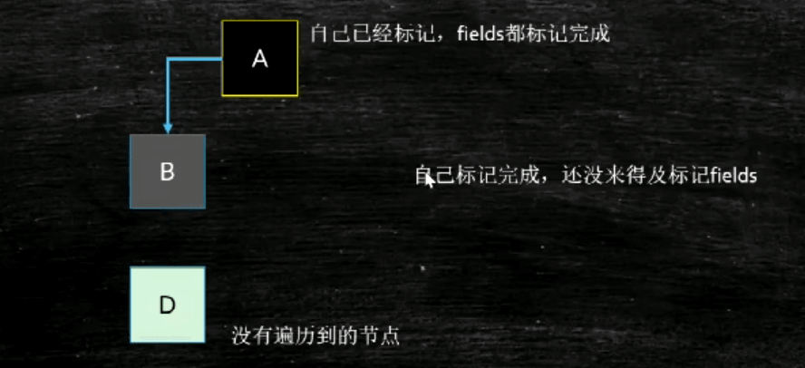
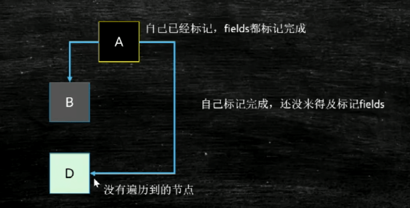
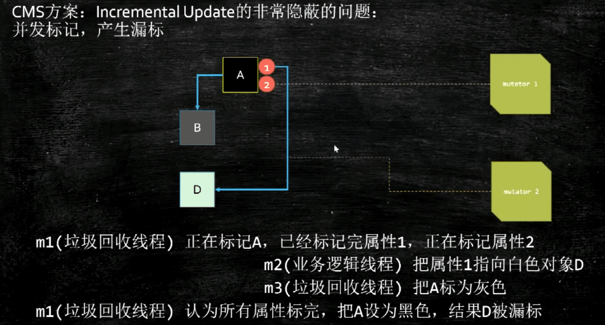

补：三色标记算法

在从GCroot往下找时

当节点被访问到，且访问到其成员变量，标记为黑色

当节点被访问到，但是没有访问其成员变量，标记为灰色

没有被访问到的节点，被标记为白色

第一种情况：灰色B指向白色D消失了

本来能找到D，可是顺着B找的时候找不到了，扫描不到了，这是叫做浮动垃圾，就直接被回收，无所谓。

第二种：B指向D消失了，但是增加了A指向D

顺着B找不到D了，此时D找不到了，因为此时A已经走过去了，没有办法再找A的相关节点了，此时D会被标记为垃圾进行清除。

CMS方案：增量更新。

当增加了A指向D时，现将A变成灰色，此时就会对A进行重新扫描，

这其中涉及为写屏障，

CMS有隐蔽问题：并发标记产生漏标

remark阶段必须重头到位扫描一遍。

CMS满了之后，直接变成Series单进程进行标记回收

G1方案：

当B指向D的引用消失的时候，要把这个引用推到GC的堆栈，保证D还能被GC扫描到，配合RSet，即记录到一个栈中，下次再取出来判断一遍。

