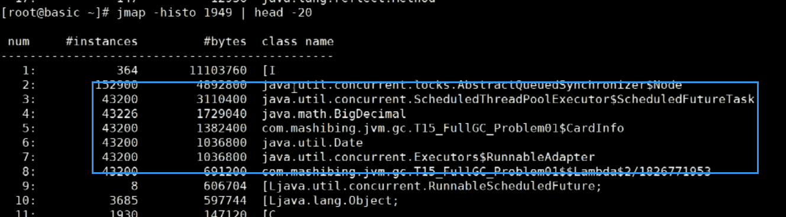

调优的方式：

1：JVM规划和预调优

2：优化运行卡段

3：解决JVM运行过程中出现的各种问题：OOM

能用代码解决或者架构解决的话，就尽量不进行调节参数；

目标：

解决问题，减少FULL GC


# 预调优


# 优化

## 查看问题

性能监控：

性能分析：

```shell
# 
jps
# 
jstat -gc 线程ID
#线程快照
jstack


```


JVM 配置方面，一般情况可以先用默认配置（基本的一些初始参数可以保证一般的应用跑的比较稳定了），在测试中根据系统运行状况（会话并发情况、会话时间等），结合 gc 日志、内存监控、使用的垃圾收集器等进行合理的调整，当老年代内存过小时可能引起频繁 Full GC，当内存过大时 Full GC 时间会特别长。

那么 JVM 的配置比如新生代、老年代应该配置多大最合适呢？答案是不一定，调优就是找答案的过程，物理内存一定的情况下，新生代设置越大，老年代就越小，Full GC 频率就越高，但 Full GC 时间越短；相反新生代设置越小，老年代就越大，Full GC 频率就越低，但每次 Full GC 消耗的时间越大。建议如下：

- -Xms 和-Xmx 的值设置成相等，堆大小默认为-Xms 指定的大小，默认空闲堆内存小于 40%时，JVM 会扩大堆到-Xmx 指定的大小；空闲堆内存大于 70%时，JVM 会减小堆到-Xms 指定的大小。如果在 Full GC 后满足不了内存需求会动态调整，这个阶段比较耗费资源。
- 新生代尽量设置大一些，让对象在新生代多存活一段时间，每次 Minor GC 都要尽可能多的收集垃圾对象，防止或延迟对象进入老年代的机会，以减少应用程序发生 Full GC 的频率。
- 老年代如果使用 CMS 收集器，新生代可以不用太大，因为 CMS 的并行收集速度也很快，收集过程比较耗时的并发标记和并发清除阶段都可以与用户线程并发执行。
- 方法区大小的设置，1.6 之前的需要考虑系统运行时动态增加的常量、静态变量等，1.7 只要差不多能装下启动时和后期动态加载的类信息就行。

代码实现方面，性能出现问题比如程序等待、内存泄漏除了 JVM 配置可能存在问题，代码实现上也有很大关系：

- 避免创建过大的对象及数组：过大的对象或数组在新生代没有足够空间容纳时会直接进入老年代，如果是短命的大对象，会提前出发 Full GC。
- 避免同时加载大量数据，如一次从数据库中取出大量数据，或者一次从 Excel 中读取大量记录，可以分批读取，用完尽快清空引用。
- 当集合中有对象的引用，这些对象使用完之后要尽快把集合中的引用清空，这些无用对象尽快回收避免进入老年代。
- 可以在合适的场景（如实现缓存）采用软引用、弱引用，比如用软引用来为 ObjectA 分配实例：SoftReference objectA=new SoftReference(); 在发生内存溢出前，会将 objectA 列入回收范围进行二次回收，如果这次回收还没有足够内存，才会抛出内存溢出的异常。
  避免产生死循环，产生死循环后，循环体内可能重复产生大量实例，导致内存空间被迅速占满。
- 尽量避免长时间等待外部资源（数据库、网络、设备资源等）的情况，缩小对象的生命周期，避免进入老年代，如果不能及时返回结果可以适当采用异步处理的方式等。

实例：

OKhttp 的看门狗线程


有 JVM 调优经验

根据需求进行 JVM 规划和预调优：

优化运行 JVM 运行环境（慢，卡顿）：

解决 JVM 运行过程中出现的各种问题（OOM）

命令：

java -X 非标参数

java -XX:+PrintFlagFinal -version

定位

我的 CPU 是 100%，怎么定位？频繁 FGC 三秒一次怎么定位？

问题一：频繁 FGC，但是没有 OOM

监控，报警——运维的人——

top 命令查看使用情况

模拟

```shell
# 将最大堆和最小堆设置一样，防止抖动，资源应该给客户服务，而不应该浪费在扩容上
# PrintGC ：打印GC信息
java -Xms20M -Xmx20M -XX:PrintGC com.xqc.demol
```


每次只回收了 1K，回收不掉，内存有泄漏，全占满了。

图像化检测软件：

上线了必须开放端口这些远程工具才能连上，增加了不安全性

arthas 安装：阿里开源的

命令：dashboard

面试题一：如果一个 Java 进程，平时也就 50%，但是突然暴涨 90%，如何定位？

阿里规约，线程的名称要有意义

命令：Thread pid

jmap -histo 1778 | head -20



这些对象在吃内存

当然生产上不能用 jmap，除非测试环境中，或则高可用隔离其中一台，用其中一台给他测试，或则配置参数

-XX:+HeapDumpOnOutOfMermoryError

发生了 OOM 产生了堆存储文件

使用 VisualVm 查看哪些类

实例一：

OOM 产生的原因多种多样，有些程序未必产生 OOM，不断 FGC(CPU 飙高，但内存回收特别少) （上面案例）

1. 硬件升级系统反而卡顿的问题（见上）

2. 线程池不当运用产生 OOM 问题（见上）
   不断的往 List 里加对象（实在太 LOW）

3. smile jira 问题
   实际系统不断重启
   解决问题 加内存 + 更换垃圾回收器 G1
   真正问题在哪儿？不知道

4. tomcat http-header-size 过大问题（Hector）

实例二：

finalize（）方法：

C++需要手动释放内存，Java 不需要，如果重写 finalize（）方法，进行释放，Java 操作会很耗时，导致内存溢出。

## 1：判断 GC 有没有问题

评价 GC 的两个核心指标：延迟和吞吐量；

**一次停顿的时间不超过应用服务的 TP9999，GC 的吞吐量不小于 99.99%**

判断是 GC 导致的故障，还是系统本身引发 GC 问题

## 2：MetaSpace 区 OOM

## 3：过早晋升

分带手机，一般只有在 Young 区经历几次 GC 才能晋升到 Old 区，过早晋升不会直接影响 GC；但可能会导致 FullGC 频繁，

## 4：指针压缩

最初的时候，JVM 是 32 位的，但是随着 64 位系统的兴起，JVM 也迎来了从 32 位到 64 位的转换，32 位的 JVM 对比 64 位的内存容量比较有限，但是我们使用 64 位虚拟机的同时，也带来了一个问题，64 位下的 JVM 中的对象会比 32 位中的对象多占用 1.5 倍的内存空间，这是我们不想看到的(又要马儿跑，又要马儿不吃草可还行？)，但是机智的程序员不会屈服，所以在 JDK 1.6 的版本后，我们在 64 位中的 JVM 中可以开启指针压缩(UseCompressedOops)来压缩我们对象指针的大小来帮助我们节约内存空间，拿 JDK 8 来说，这个指令是默认开启的。

当我们启用了-XX:+UseCompressedOops 之后，我们原本的 OOP(Ordinary Object Pointer，普通对象指针)就会被压缩，当然也不是所有的对象都会被压缩，只有 以下几种的对象才会被压缩对象的全局静态变量(类属性)

对象头信息；对象的引用类型；对象数组类型

而以下几种对象则不能被压缩：

指向 PermGen 的 Class 对象指针；局部变量；传参；返回值；NULL 指针

指针压缩的大概原理：通过对齐，还有偏移量将 64 位指针压缩成 32 位。

零基压缩是针对压缩解压动作的进一步优化。 它通过改变正常指针的随机地址分配特性，强制堆地址从零开始分配。

这里需要注意：32 位 HotSpot VM 是不支持 UseCompressedOops 参数的，只有 64 位 HotSpot VM 才支持。

