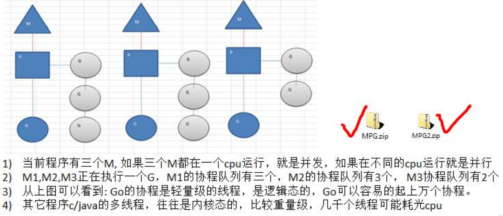

# 第一章：环境的搭建

1：下载

安装包下载地址为：https://golang.org/dl/。

如果打不开可以使用这个地址：https://golang.google.cn/dl/。

2：window下安装

注意如果更改安装路径一定要确保Path路径下有：D:\Golang\install\bin

目录结构


bin：go的指令

src：go的源代码

3：测试

创建工作区间，并创建文件test.go,文本方式打开，键入

```go
package main

import "fmt"

func main() {
  fmt.Println("Hello, World!")
}
```

使用cmd运行

```
D:\Golang\Workplace>go run test.go
```

4：开发工具


# 第二章：Golang开山

## 2.1：应用

区块链，服务器（美团），处理大并发很强，游戏软件开发，数据通道，分布式、云计算，盛大云cdn

## 2.2：特点

1）引入包的概念，用于组织程序结构，Go语言的一个文件否要归属于一个包。

2）垃圾回收机制，内存自动回收

3）天然并发（重要特点）

4）goroutine，轻量级线程，可实现大量并发

5）吸收管道通信，形成特有的管道channel，可以实现不同线程goroute之间的相互通信

6)函数可以返回多个值

7）切片slice，延时执行defer

C + Python

如果定义了变量，没有用到，代码编译不能通过


官方API文档

中文网在线文档：https://studygolang.com/pkgdoc


## 2.3：变量

标识符


### 2.3.1：类型

第一种：指定变量类型，**声明后若不赋值，使用默认值**

```go
func main(){
    //int 的默认值是0
    var i int
    var b float32 //0
    var c float64 //0
    var isMarried bool //false
    var name string //""
    fmt.Println("i=",i)
}
```

第二种：根据值自行判定变量类型（类型推导）

```go
var num = 10.11
```

第三种：省略var ，：=左侧的变量不应该是已经声明过的，否则会编译错误

```go
name :="tom"
```


基本数据类型

int

float

bool

string

数组

结构体struct

### 2.3.2：运算


### 2.3.3：指针

```go
var ptr *int = &num
```


## 2.4：运算符

同其他语言基本

## 2.5：函数

### 2.5.1：匿名函数

```go
func main(){
    //使用匿名函数，求两个数的值
    resl:= func(n1 int,n2 int) int{
        return n1 + n2
    }(10,20)
    fmt.Println("resl = ",resl)
```

也可以将匿名函数赋值给一个变量

```go
a:= func (n1 int,n2 int) int {
    return n1 + n2
}
res2 := a(10,20)

```

如果将匿名函数赋值给一个全局变量，则变成了全局匿名函数

```go
var(
    //Fun1就是一个全局匿名函数
    Fun1 = func(n1 int ,n2 int) int {
        return n1 * n2
    }
)
res3 := Fun1(4,9)

```

### 2.5.2：值传递与引用传递

1）值类型：int ，float ，bool，string

2）引用类型：指针，slice切片，map，管道chan，interface等


### 2.5.3init函数

每一个源文件都可以包含一个init函数，该函数会在main函数执行前，被Go运行框架调用

### 2.5.3：字符串函数

```go
//统计肌肤穿长度
len("str")

//字符串遍历
str = "hello 北京"
r := []rune(str)
for i:=0;i<len(r);i++ {
    fmt.Printf("字符串=%c\n",r[i])
}

```


### 2.5.4：时间与日期相关函数


## 2.6：闭包

闭包就是一个函数，但是他会使用函数外的变量，与函数外的变量共同组成一个整体，叫做闭包

```go
var n int = 10
return func(x int) int {
    n = n + x
    return n
}
```

## 2.7：函数的defer(延迟执行)

在函数中，**为了在函数执行完毕后，及时释放资源**，提供defer

当go执行到一个defer时，不会立即执行defer后的语句，而是将语句压入栈中，当函数执行完毕，再重栈中取出执行。

```go
func sun(n1 int,n2 int) int {
    //当执行到defer时，暂时不行行，会将defer后面的语句压入到独立的栈（defer栈）
    //当函数执行完毕后，再从defer栈，按照先入后出的方式出栈，执行
    //入栈时，也会将其值保存到栈中，故值还是以前的
    defer fmt.Println("ok1 n1=",n1)
    defer fmt.Println("ok2 n2=",n2)
    
    n1++  //n1 = 11
    n2++  //n2 = 21
    
    res := n1 + n2
    fmt.Println("ok3 res = ",res)
}
func main(){
    res := sum(10,20)
    fmt.Println("res = ",res)
}
```

执行结果

```cmd
ok3 res = 32
ok2 n2 = 20
ok1 n1 = 10
res = 32
```

实践

资源关闭：如

defer file.close()

defer connect.close()

## 2.8：错误处理

Go语言不支持try ……catch……finally，而是引入的处理方式为**defer ，panic，recover**：Go中可以抛出一个**panic的异常**，然后在**defer中通过recover捕获**这个异常，然后处理

```go
func test(){
    //使用defer + recover 来捕获和处理异常
    defer func(){
        //recover()内置函数，可以捕获到异常
        err := recover()
        if err !=nil{
            fmt.Println("err = ",err)
        }        
    }()
    num1 :=10
    num2 :=0
    res :=num1/num2
    fmt.Println("res = ",res)    
}
```

自定义异常


## 2.9：数组与切片

```go
var a[5] int 
```

遍历的for--range结构

```go
for index,value :=range a {
    fmt.Println(" index = %v value = %v",index,value)
}
```

**当个数不确定时，使用切片**，切片是数组的一个引用，切片是引用类型

```go
var a[] int
```

简单使用

```go
func main(){
    //定义并初始化一个数组
    var intArr [5]int = [...]int[1,22,33,66,99]
    //定义一个切片slice，引用数组从1到3的位置,不包含3
    slice := intArr[1:3]
}

```

切片在内存中的存储形式

slice[ 存放22的地址，长度len，容量cap]


## 2.10：Map

key-value结构，成为字段或者关联数组

key和value的值不能是slice，map还有function，其他都可以，key是不能重复的，重复的相当于更新

声明是不会分配内存的，初始化需要make，分配内存后才能赋值和使用

```go
func main(){
    //map的声明和注意事项
    var a map[string]string
    //在使用map前，需要先make，make的作用就是给分配数据空间
    a = make(map[string]string,10)
    a["no1"] = "no1"
    a["no2"] = "no2"
    a["no1"] = "no3"
    fmt.Println(a)
    //删除
    delete(a,"no1")
    //如果删除的不存在，不会操作，也不会报错
    delete(a,"no4")
    //遍历
    for k,v := range a {
        fmt.Print("k=%v v=%v",k,v)
    }
    
}
```

### map切片

切片的数据类型如果是map，称之为map切片，这样map的个数就可以动态变化了

```go
func main(){
    var m []map[string]string
    //???这个2
    m = make([]map[string]string,2)
}
```

# 第三章：面向对象

结构体

声明结构体

```go
type Student struct{
    Name string
    Age int
    Score float32
}
```

封装

继承

```go
type Pupil struct{
    //直接嵌入Student匿名结构体
    Student
}
```

多重继承

接口

```go
type AInterface interface{
    Say()
}
```

多态

# 第四章：文件

打开文件

```go
func main(){
    file ,err := os.open("d:/test.txt")
    if err !=nil {
        fmt.Println("open file err=",err)
    }
    //输出文件
    fmt.Println("file = %v",file)
    //关闭文件
    err = file.close()
    if err != nil {
        fmt.Println("close file err=",err)
    }
}
```


# 第五章：Goroutine 和channel

Golang的协程重要，它可以轻松开启上万个协程，其他编程语言的并发机制是一般基于线程，开启过多的线程，资源耗费大，这里就凸显Golang的并发的优势了。

## Goroutine的调度模型

MPG模式

M：操作系统的主线程（物理线程）

P：协程执行需要的上下文

G：协程




设置Golang运行的CPU数

go1.8后，默认让程序运行在多个核上。可以不用设置

```go
func main(){
    //获取当前系统CPU的数量
    num：= runtime.NumCPU()
    //我这里设置num-1的CPU运行go程序
    runtime.GOMAXPROCS(num)
    fmt.Println("num=",num)
}
```


## channel管道

不同的goroutine之间如何进行通信？

1）全局变量互斥锁

2）使用管道channel来解决


本质是一个队列，保持先进先出的原则，线程安全，都goroutine访问时，不需要加锁，channel是有类型的，string的channel只能存放string，

声明

```go
var 变量名 chan 数据类型
var intChan chan int(intChan用于存放int数据)
```

channel是引用类型，必须make之后才能使用

```go
func main() {
	//创建一个可以存放3个int类型的管道
	var intChan chan int
	intChan = make(chan int,3)

	//看看intChan是什么
	fmt.Printf("intChan的值 = %v intChan 本身的地址 = %p \n",intChan,&intChan)
	//像管道写入数据
	intChan<- 10
	num :=211
	intChan<- num
	intChan<- 50
	//查看管道的长度和容量
	fmt.Printf("channel len %v cap=%v \n",len(intChan),cap(intChan))//3,3

	//从管道中取出数据
	var num2 int
	num2 = <- intChan
	fmt.Printf("num2 = %v\n",num2)
	fmt.Printf("channel len %v cap=%v \n",len(intChan),cap(intChan))//2,3

}
```

channel有声明为只读或则只写性质

```go
var chan2 chan<- int//只写性质
var chan3 <-chan int//只读性质 
```

## 协程实现原理

G：goroutine可以解释为受管理的轻量线程，使用`go`关键词创建

M：在当前版本的golang中**等同于系统线程**，操作系统的主线程（物理线程）

P：所需的资源上下文

G的状态

- 空闲中(_Gidle): 表示G刚刚新建, 仍未初始化
- 待运行(_Grunnable): 表示G在运行队列中, 等待M取出并运行
- 运行中(_Grunning): 表示M正在运行这个G, 这时候M会拥有一个P
- 系统调用中(_Gsyscall): 表示M正在运行这个G发起的系统调用, 这时候M并不拥有P
- 等待中(_Gwaiting): 表示G在等待某些条件完成, 这时候G不在运行也不在运行队列中(可能在channel的等待队列中)
- 已中止(_Gdead): 表示G未被使用, 可能已执行完毕(并在freelist中等待下次复用)
- 栈复制中(_Gcopystack): 表示G正在获取一个新的栈空间并把原来的内容复制过去(用于防止GC扫描)

M的状态

M并没有像G和P一样的状态标记, 但可以认为一个M有以下的状态:

- 自旋中(spinning): M正在从运行队列获取G, 这时候M会拥有一个P
- 执行go代码中: M正在执行go代码, 这时候M会拥有一个P
- 执行原生代码中: M正在执行原生代码或者阻塞的syscall, 这时M并不拥有P
- 休眠中: M发现无待运行的G时会进入休眠, 并添加到空闲M链表中, 这时M并不拥有P

自旋中(spinning)这个状态非常重要, 是否需要唤醒或者创建新的M取决于当前自旋中的M的数量.

P的状态

- 空闲中(_Pidle): 当M发现无待运行的G时会进入休眠, 这时M拥有的P会变为空闲并加到空闲P链表中
- 运行中(_Prunning): 当M拥有了一个P后, 这个P的状态就会变为运行中, M运行G会使用这个P中的资源
- 系统调用中(_Psyscall): 当go调用原生代码, 原生代码又反过来调用go代码时, 使用的P会变为此状态
- GC停止中(_Pgcstop): 当gc停止了整个世界(STW)时, P会变为此状态
- 已中止(_Pdead): 当P的数量在运行时改变, 且数量减少时多余的P会变为此状态

本地运行队列

在go中有多个运行队列可以保存待运行(_Grunnable)的G, 它们分别是各个P中的本地运行队列和全局运行队列.
入队待运行的G时会优先加到当前P的本地运行队列, M获取待运行的G时也会优先从拥有的P的本地运行队列获取,
本地运行队列入队和出队不需要使用线程锁.

本地运行队列有数量限制, 当数量达到256个时会入队到全局运行队列.
本地运行队列的数据结构是[环形队列](https://en.wikipedia.org/wiki/Circular_buffer), 由一个256长度的数组和两个序号(head, tail)组成.

栈扩张

每一个goroutine都需要有自己的栈空间,
栈空间的内容在goroutine休眠时需要保留, 待休眠完成后恢复(这时整个调用树都是完整的).
这样就引出了一个问题, goroutine可能会同时存在很多个, 如果每一个goroutine都预先分配一个足够的栈空间那么go就会使用过多的内存.

为了避免这个问题, go在一开始只为goroutine分配一个很小的栈空间, 它的大小在当前版本是2K.
当函数发现栈空间不足时, 会申请一块新的栈空间并把原来的栈内容复制过去.

写屏障

因为go支持并行GC, GC的扫描和go代码可以同时运行, 这样带来的问题是GC扫描的过程中go代码有可能改变了对象的依赖树,
例如开始扫描时发现根对象A和B, B拥有C的指针, GC先扫描A, 然后B把C的指针交给A, GC再扫描B, 这时C就不会被扫描到.
为了避免这个问题, go在GC的标记阶段会启用写屏障(Write Barrier).

m0和g0

go中还有特殊的M和G, 它们是m0和g0.

m0是启动程序后的主线程, 这个m对应的实例会在全局变量m0中, 不需要在heap上分配,
m0负责执行初始化操作和启动第一个g, 在之后m0就和其他的m一样了.

g0是仅用于负责调度的G, g0不指向任何可执行的函数, 每个m都会有一个自己的g0,
在调度或系统调用时会使用g0的栈空间, 全局变量的g0是m0的g0.

协程是怎么实现的呢？

他和线程的原理是一样的，当 a线程 切换到 b线程 的时候，需要将 a线程 的相关执行进度压入栈，然后将 b线程 的执行进度出栈，进入 b线程 的执行序列。协程只不过是在 应用层 实现这一点。但是，协程并不是由操作系统调度的，而且应用程序也没有能力和权限执行 cpu 调度。怎么解决这个问题？

　　答案是，协程是基于线程的。内部实现上，维护了一组数据结构和 n 个线程，真正的执行还是线程，协程执行的代码被扔进一个待执行队列中，由这 n 个线程从队列中拉出来执行。这就解决了协程的执行问题。那么协程是怎么切换的呢？答案是：golang 对各种 io函数 进行了封装，这些封装的函数提供给应用程序使用，而其内部调用了操作系统的异步 io函数，当这些异步函数返回 busy 或 bloking 时，golang 利用这个时机将现有的执行序列压栈，让线程去拉另外一个协程的代码来执行，基本原理就是这样，利用并封装了操作系统的异步函数。包括 linux 的 epoll、select 和 windows 的 iocp、event 等。

runtime负责管理任务调度，垃圾收集与运行环境。

同时go提供了一些高级的功能，人哦goroutine，channel以及gc，这些高级功能需要runtime的支持。runtime和用户编译后的代码被linker静态链接起来，形成可执行文件。这个文件从操作系统角度来说是可执行文件。从运行角度说，这个文件由用户代码和runtime组成。runtime通过接口函数调用来管理goroutine,channel以及一些高级功能。从用户代码发起的调用操作系统API的调用都会被runtime拦截。

go runtime的一个重要组成部分是goroutine scheduler。负责追踪，调度每个goroutine运行，实际上是从应用程序的process所属的thread pool中分配一个Thread来执行这个goroutine。因此和jvm中的java thread和os thread映射概念类似，每个goroutine只有分配到一个os thread才能运行。时


# 第六章：反射

反射可以在运行时动态获取变量的各种信息，比如变量的类型，类别，如果是结构体变量，还可以回去到结构体本身信息

使用反射，需要引入 `import ("reflect")


当不知道接口调用那个函数，根据传入参数在运行时确定调用的具体接口，这种需要对函数或方法反射

```go
func reflectTest01(num interface{}) {
	//通过反射获取的传入的变量的type，kind值
	//先获取到reflect。Type
	rTyp:= reflect.TypeOf(num)
	fmt.Printf("rType = ",rTyp)

	//获取reflect.Value
	rVal:=reflect.ValueOf(num)
	n2:=2 + rVal.Int()
	fmt.Printf("n2 = %v\n",n2)
	fmt.Printf("rVal = %v rVal Type = %T\n",rVal,rVal)
}
```


# 第七章：网络编程


# 第八章：Redis的使用

1：安装Redis库

在GoPath路径下执行安装命令

```cmd
go get github.com/garyburd/redigo/redis
```

使用

```go
import(
	"fmt"
    "github.com/garyburd/redigo/redis"//引入redis包
)

func main(){
    //通过go向redis写入数据和读取数据
    //链接到redis
    conn,err := redis.Dial("tcp","127.0.0.1:6379")
    if err!=nil {
        fmt.Println("redis.Dial err = ",err)
        return
    }
    defer conn.Close()//关闭
    //痛过go向redis写入数据
    _,err = conn.Do("Set","name","maoma")
        if err!=nil {
        fmt.Println("Set err = ",err)
        return
    }
    
    //通过go向redis读取数据
    r,err := redis.String(conn.Do("Get","name"))
    if err!=nil{
                fmt.Println("Get err = ",err)
        return
    }
}

```


## Redisl连接池

事先初始化一定数量的链接，放入连接词中

```go
import(
	"fmt"
    "github.com/garyburd/redigo/redis"//引入redis包
)
//定义一个全局的pool
var pool *redis.Pool

//当启动程序是，就初始化连接词
func init(){
    pool = &redis.Pool{
        MaxIdle:8,//最大空闲连接数
        MaxActive:0,//表示和数据库的最大连接数，0表示没有限制
        IdleTimeout:100,//最大空闲时间
        Dial:func()(redis.Conn,error){
            //初始化链接的代码，链接那个IP的redis
            return redis.Dial("tcp","localhost:6379")
        },
    }
}
func main(){
    //先从pool取出一个链接
    conn:=pool.Get()
    defer conn.Close()
    
    
}
```

