# 系统重装

准备镜像光盘

 

插入电脑重启，不同的电脑型号按不同的按键进入bose安装

选择CD安装

自定义选择

等待

U盘拷贝驱动精灵，安装必要驱动

有的不带网卡，需安装网卡

 

连接别的电脑，获取激活工具，开发工具等

 

 

下载chrom浏览器

 

导入书签


安装解压工具


安装office

 

安装NotePad++

 

安装TortoiseSVN

 

 

 

 

# JDK安装

安装1.8：

下载：现在下载需要登陆了，自己的账号密码注册后最好记录下来

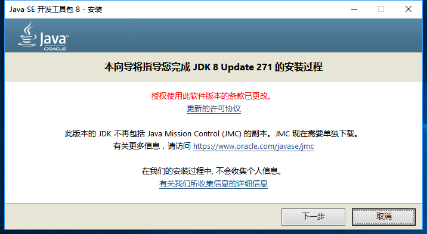

更改安装路径，本人洁癖故一定要更改的那种，如果没什么事的话可以不用更改。


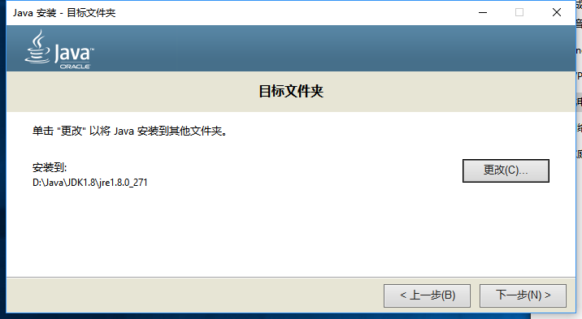

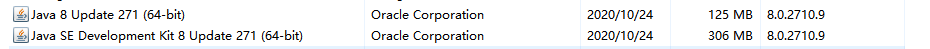

配置环境变量

我的电脑→属性→高级系统设置→高级选项→环境变量—>系统变量—>新建

输入变量名：JAVA_HOME，变量值为jdk的安装位置。

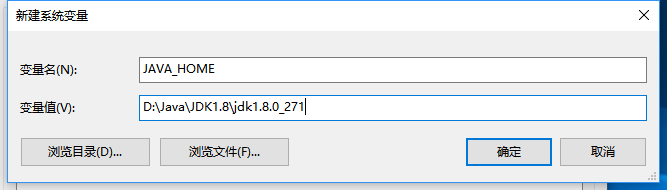

点击确定后，再次新建变量。

变量名为：CLASSPATH，变量值为：.;%JAVA_HOME%\lib\dt.jar;%JAVA_HOME%\lib\tools.jar;

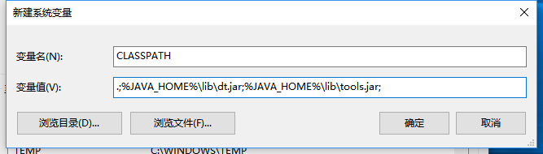

点击确定后，找到PATH变量，点击编辑。新增如下两个变量值。

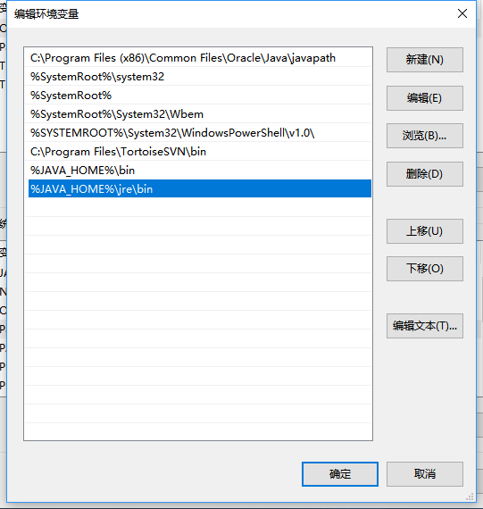

最后点击确定。全部确定后。

运行cmd，执行java -version。显示出如下信息。证明安装成功


# maven3.5安装

将Maven以及仓库从公司的资源机上拷贝下来

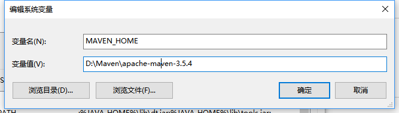

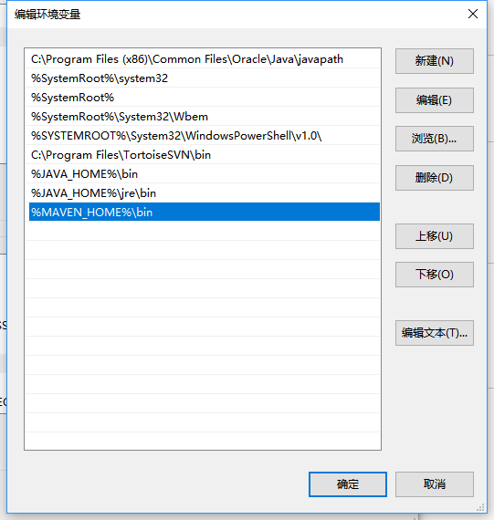

cmd 输入 mvn -v

查看maven版本验证是否成功

配置Maven，当然该文件最好事拷贝同公司的人的。

第一种：全局配置，默认

D:\Maven\apache-maven-3.5.4\conf\setting.xml文件事maven的全局配置文件

该文件配置了本地仓库位置，公司仓库位置，已经远程仓库位置等信息

```xml
<!--配置本地仓库地址-->  
<localRepository>D:\Maven\Repositories\Maven</localRepository> 
  <proxies>
    <proxy>
      <id>my_proxy</id>
      <active>false</active>
      <protocol>http</protocol>
      <!--公司内网-->
	  <host>xxx.xxx.xxx.xxx</host>
	  <port>8080</port> 
    </proxy>
  </proxies>
 <servers>
    <server>
        <id>XXX</id>
        <username>xxx</username>
        <password>xxxxxx</password>
    </server>
    <server>
        <id>XXX</id>
        <username>xxx</username>
        <password>xxxxxxx</password>
    </server>
</servers>

<!--配置镜像-->
  <mirrors>  
		  <mirror>
			<id>alimaven</id>
			<name>aliyun maven</name>
			<url>http://maven.aliyun.com/nexus/content/groups/public/</url>
			<mirrorOf>central</mirrorOf>
		</mirror>

		<mirror>
			<id>CN</id>
			<name>OSChina Central</name>
			<url>http://maven.oschina.net/content/groups/public/</url>
			<mirrorOf>central</mirrorOf>
		</mirror>
  
        <mirror>     
         <id>nexus</id>      
         <url>http://xxx.xxx.xxx.xxx:8081/nexus/content/groups/public/</url>     
         <mirrorOf>*</mirrorOf>     
       </mirror>  
     </mirrors> 
 <profiles>
    <profile>
        <id>nexus-profile</id>
        <repositories>
            <repository>
                <id>nexus</id>
                <name>204nexus</name>
                <url>http://xxx.xxx.xxx.xx:8081/nexus/content/groups/public/</url>
                <releases>
                    <enabled>true</enabled>
					<updatePolicy>always</updatePolicy>
                </releases>
                <snapshots>
                    <enabled>true</enabled>
					<updatePolicy>always</updatePolicy>
                </snapshots>
            </repository>
        </repositories>
		<pluginRepositories>     
            <pluginRepository>     
              <id>nexus</id>     
              <url>http://xxx.xxx.xxx.xxx:8081/nexus/content/groups/public/</url>     
              <releases>     
                <enabled>true</enabled>   
					<updatePolicy>always</updatePolicy>  
              </releases>     
              <snapshots>     
                <enabled>false</enabled>   
					<updatePolicy>always</updatePolicy>  
              </snapshots>     
            </pluginRepository>     
        </pluginRepositories>     
    </profile>
</profiles>
<activeProfiles>
    <activeProfile>nexus-profile</activeProfile>
</activeProfiles>

```

第二种：用户配置

当前用户根目录下(默认没有该文件，需要将全局配置文件拷贝过来进行修改)

新建k拷贝C:\Users\admin\\.m2\settings.xml

注意：用户级别仓库一旦设置，全局配置将不再生效


# svn


# Git

下载：https://git-scm.com/download/win

安装，选择安装路径

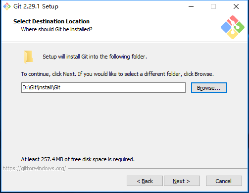

选择安装组件

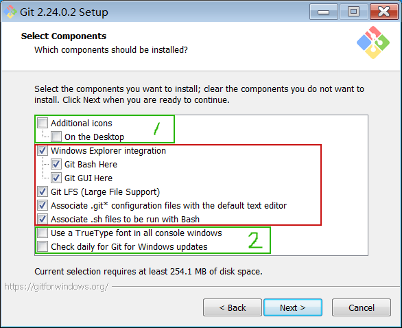


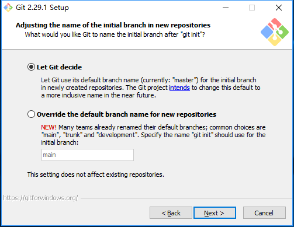

调整你的PATH环境

第一种配置是“仅从Git Bash使用Git”。这是最安全的选择，因为您的PATH根本不会被修改。您只能使用 Git Bash 的 Git 命令行工具。但是这将不能通过第三方软件使用。

第二种配置是“从命令行以及第三方软件进行Git”。该选项被认为是安全的，因为它仅向PATH添加了一些最小的Git包装器，以避免使用可选的Unix工具造成环境混乱。
您将能够从Git Bash，命令提示符和Windows PowerShell以及在PATH中寻找Git的任何第三方软件中使用Git。这也是推荐的选项。

第三种配置是“从命令提示符使用Git和可选的Unix工具”。警告：这将覆盖Windows工具，如 “ find 和 sort ”。只有在了解其含义后才使用此选项。

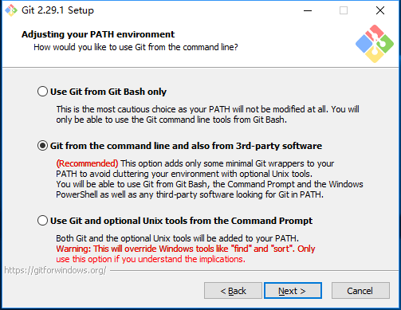

选择HTTPS后端传输

第一个选项是“使用 OpenSSL 库”。服务器证书将使用ca-bundle.crt文件进行验证。这也是我们常用的选项。

第二个选项是“使用本地 Windows 安全通道库”。服务器证书将使用Windows证书存储验证。此选项还允许您使用公司的内部根CA证书，例如通过Active Directory Domain Services 。

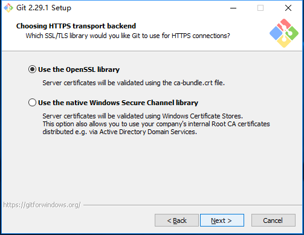

配置行尾符号转换

第一个选项是“签出Windows风格，提交Unix风格的行尾”。签出文本文件时，Git会将LF转换为CRLF。提交文本文件时，CRLF将转换为LF。对于跨平台项目，这是Windows上的推荐设置（“ core.autocrlf”设置为“ true”）

第二个选项是“按原样签出，提交Unix样式的行尾”。签出文本文件时，Git不会执行任何转换。 提交文本文件时，CRLF将转换为LF。对于跨平台项目，这是Unix上的建议设置（“ core.autocrlf”设置为“ input”）

第三种选项是“按原样签出，按原样提交”。当签出或提交文本文件时，Git不会执行任何转换。不建议跨平台项目选择此选项（“ core.autocrlf”设置为“ false”）

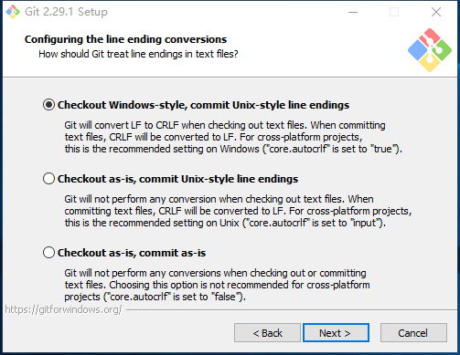


一路next

# TortoiseGit


一路next


中文包安装


修改中文

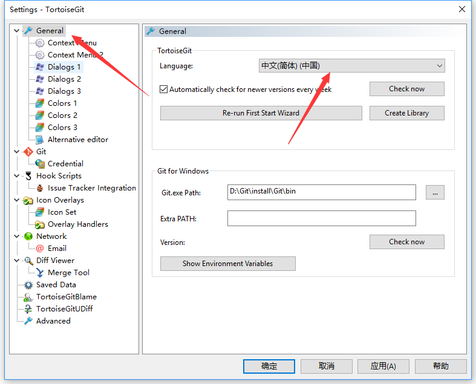


# Eclipse安装

下载：

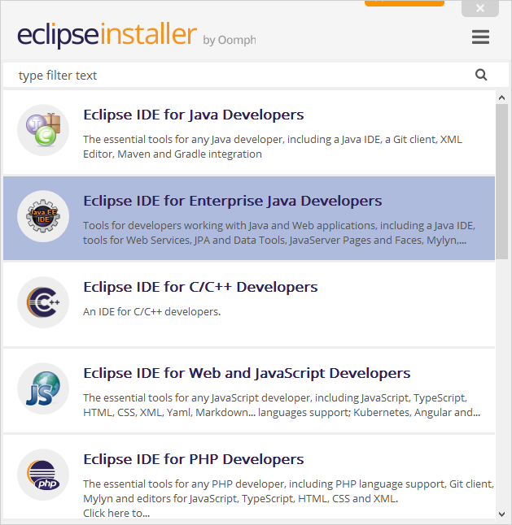

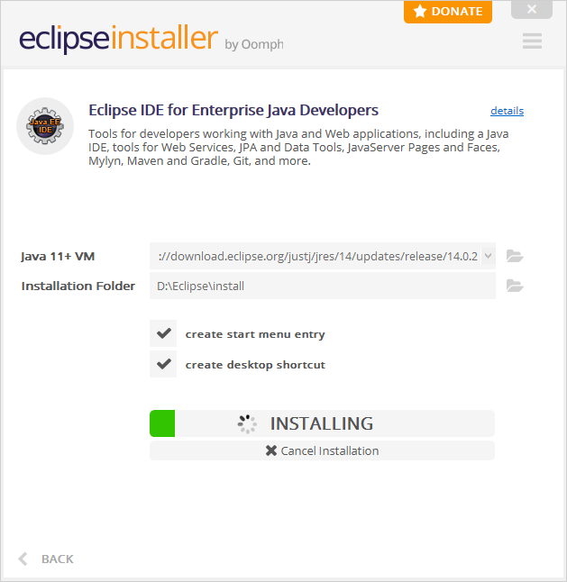


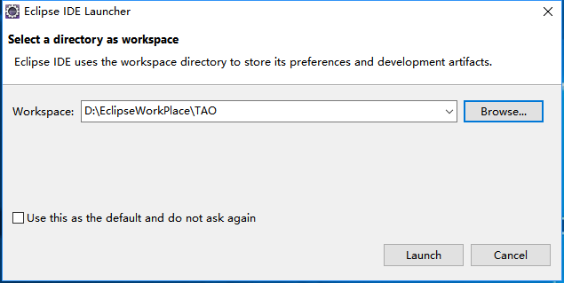

启动项目

重新switch一个workplace

修改新的工作区间的Maven和配置Maven仓库

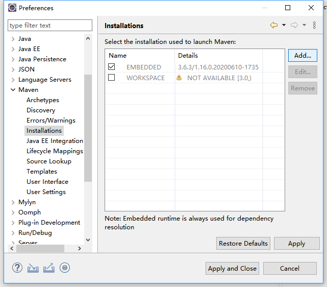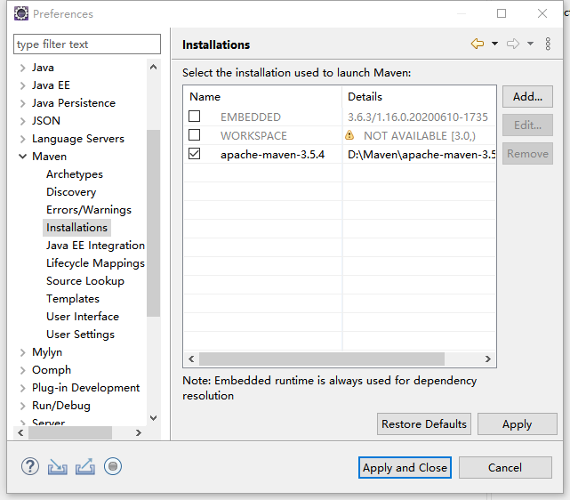

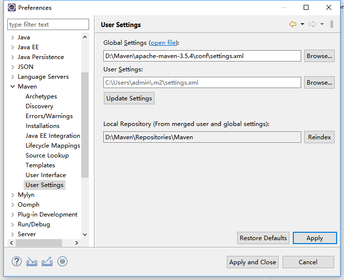

修改默认的jdk


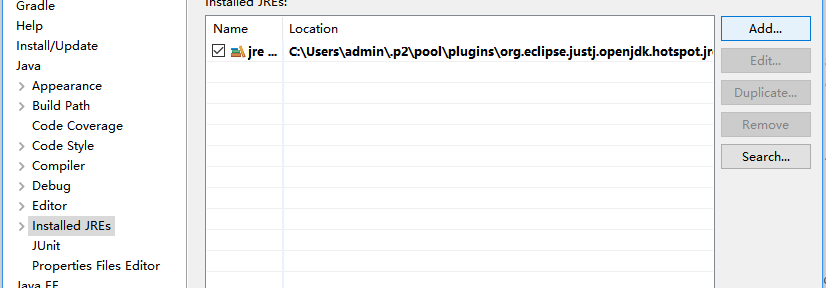


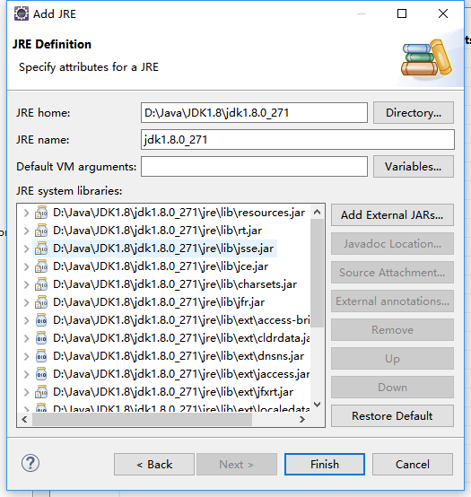

Eclipse安装SVN插件

Help——Eclipse  MarkPlace——搜索SVN

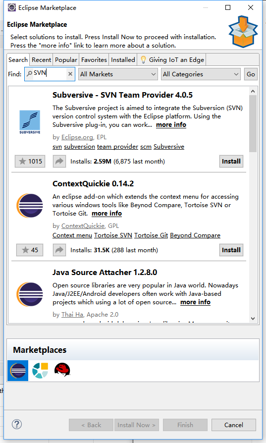

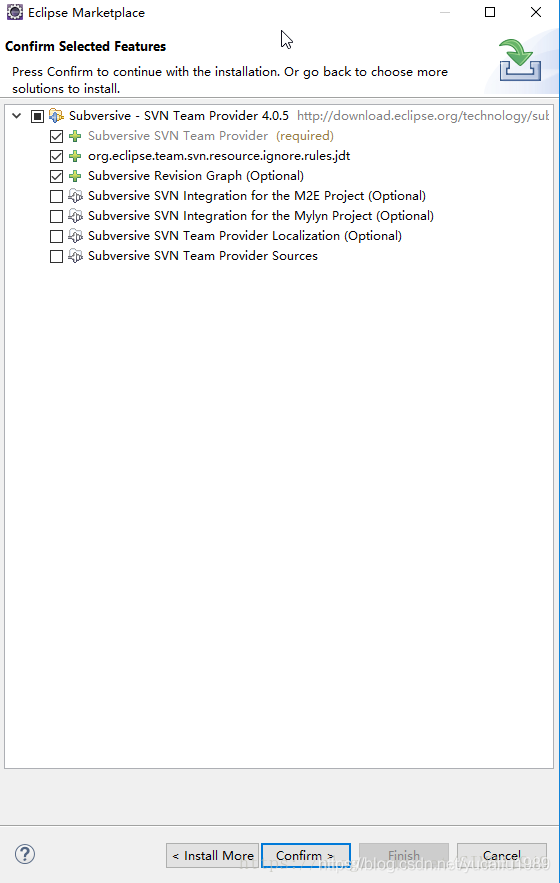

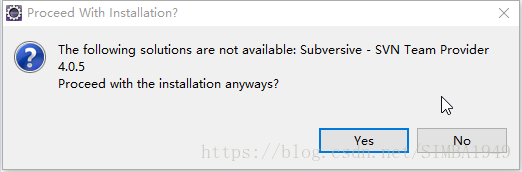

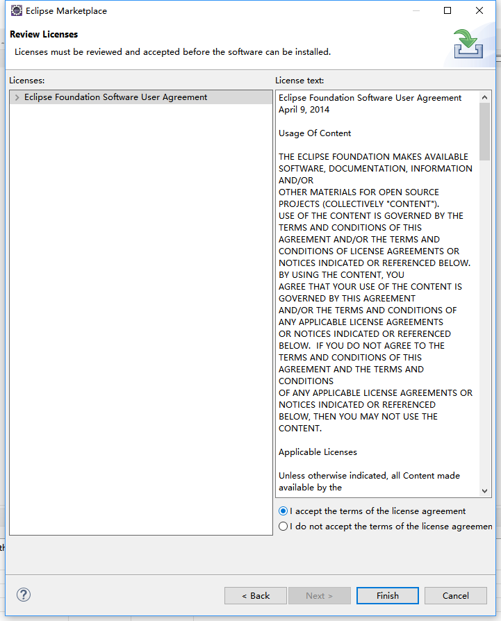

然后重启即可

再下载SVNConnection

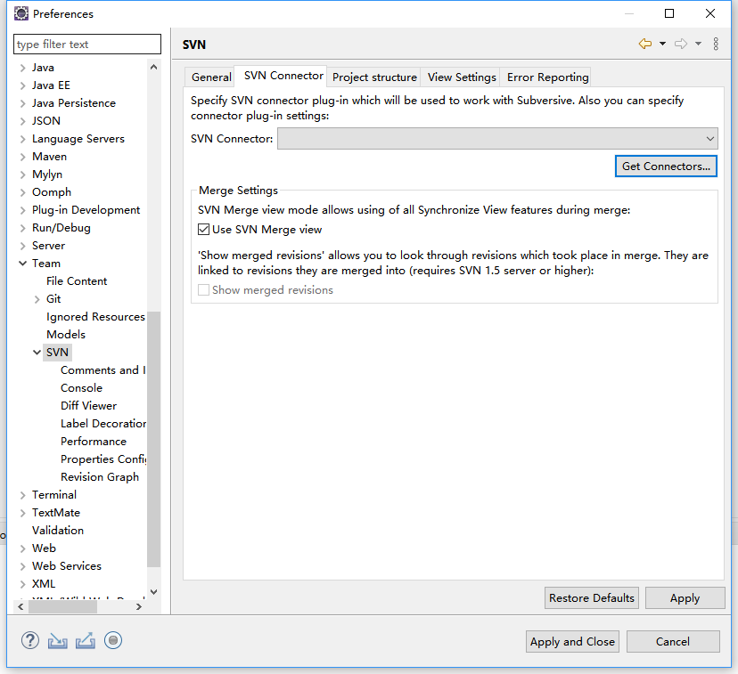

在重启

SVN检出源代码

Eclipse导入项目

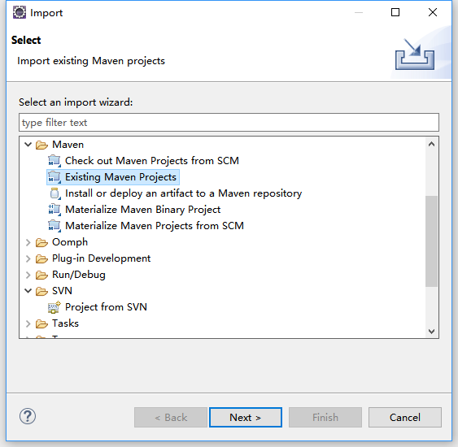


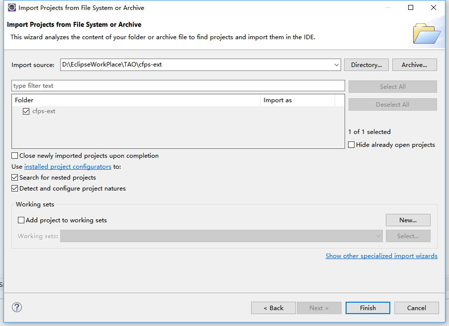


# IDEA下载安装与破解

关注更新：https://zhile.io/2018/08/17/jetbrains-license-server-crack.html

 下载选择合适的版本：https://www.jetbrains.com/idea/download/other.html

选择：D:\IDEA\install\IntelliJ IDEA 2020.1.1

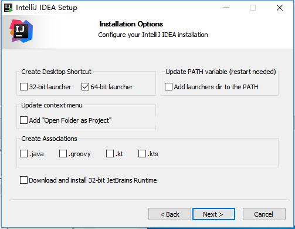


破解：

安装成功后，将破解文件复制到安装目录下

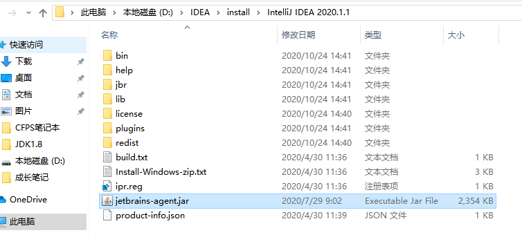

进入bin文件夹下，打开idea.exe.vmoptions及idea64.exe.vmoptions文件

将以下复制到文件最后一行，两个都要复制，其中路径改成自己的安装路径，文件名改成自己的破解文件名。

```xml
-javaagent:D:\IDEA\install\IntelliJ IDEA 2020.1.1\jetbrains-agent.jar
```

打开IDEA,选择激活方式为，activation code

填入以下code

```txt
 3AGXEJXFK9-eyJsaWNlbnNlSWQiOiIzQUdYRUpYRks5IiwibGljZW5zZWVOYW1lIjoiaHR0cHM6Ly96aGlsZS5pbyIsImFzc2lnbmVlTmFtZSI6IiIsImFzc2lnbmVlRW1haWwiOiIiLCJsaWNlbnNlUmVzdHJpY3Rpb24iOiIiLCJjaGVja0NvbmN1cnJlbnRVc2UiOmZhbHNlLCJwcm9kdWN0cyI6W3siY29kZSI6IklJIiwiZmFsbGJhY2tEYXRlIjoiMjA4OS0wNy0wNyIsInBhaWRVcFRvIjoiMjA4OS0wNy0wNyJ9LHsiY29kZSI6IkFDIiwiZmFsbGJhY2tEYXRlIjoiMjA4OS0wNy0wNyIsInBhaWRVcFRvIjoiMjA4OS0wNy0wNyJ9LHsiY29kZSI6IkRQTiIsImZhbGxiYWNrRGF0ZSI6IjIwODktMDctMDciLCJwYWlkVXBUbyI6IjIwODktMDctMDcifSx7ImNvZGUiOiJQUyIsImZhbGxiYWNrRGF0ZSI6IjIwODktMDctMDciLCJwYWlkVXBUbyI6IjIwODktMDctMDcifSx7ImNvZGUiOiJHTyIsImZhbGxiYWNrRGF0ZSI6IjIwODktMDctMDciLCJwYWlkVXBUbyI6IjIwODktMDctMDcifSx7ImNvZGUiOiJETSIsImZhbGxiYWNrRGF0ZSI6IjIwODktMDctMDciLCJwYWlkVXBUbyI6IjIwODktMDctMDcifSx7ImNvZGUiOiJDTCIsImZhbGxiYWNrRGF0ZSI6IjIwODktMDctMDciLCJwYWlkVXBUbyI6IjIwODktMDctMDcifSx7ImNvZGUiOiJSUzAiLCJmYWxsYmFja0RhdGUiOiIyMDg5LTA3LTA3IiwicGFpZFVwVG8iOiIyMDg5LTA3LTA3In0seyJjb2RlIjoiUkMiLCJmYWxsYmFja0RhdGUiOiIyMDg5LTA3LTA3IiwicGFpZFVwVG8iOiIyMDg5LTA3LTA3In0seyJjb2RlIjoiUkQiLCJmYWxsYmFja0RhdGUiOiIyMDg5LTA3LTA3IiwicGFpZFVwVG8iOiIyMDg5LTA3LTA3In0seyJjb2RlIjoiUEMiLCJmYWxsYmFja0RhdGUiOiIyMDg5LTA3LTA3IiwicGFpZFVwVG8iOiIyMDg5LTA3LTA3In0seyJjb2RlIjoiUk0iLCJmYWxsYmFja0RhdGUiOiIyMDg5LTA3LTA3IiwicGFpZFVwVG8iOiIyMDg5LTA3LTA3In0seyJjb2RlIjoiV1MiLCJmYWxsYmFja0RhdGUiOiIyMDg5LTA3LTA3IiwicGFpZFVwVG8iOiIyMDg5LTA3LTA3In0seyJjb2RlIjoiREIiLCJmYWxsYmFja0RhdGUiOiIyMDg5LTA3LTA3IiwicGFpZFVwVG8iOiIyMDg5LTA3LTA3In0seyJjb2RlIjoiREMiLCJmYWxsYmFja0RhdGUiOiIyMDg5LTA3LTA3IiwicGFpZFVwVG8iOiIyMDg5LTA3LTA3In0seyJjb2RlIjoiUlNVIiwiZmFsbGJhY2tEYXRlIjoiMjA4OS0wNy0wNyIsInBhaWRVcFRvIjoiMjA4OS0wNy0wNyJ9XSwiaGFzaCI6IjEyNzk2ODc3LzAiLCJncmFjZVBlcmlvZERheXMiOjcsImF1dG9Qcm9sb25nYXRlZCI6ZmFsc2UsImlzQXV0b1Byb2xvbmdhdGVkIjpmYWxzZX0=-WGTHs6XpDhr+uumvbwQPOdlxWnQwgnGaL4eRnlpGKApEEkJyYvNEuPWBSrQkPmVpim/8Sab6HV04Dw3IzkJT0yTc29sPEXBf69+7y6Jv718FaJu4MWfsAk/ZGtNIUOczUQ0iGKKnSSsfQ/3UoMv0q/yJcfvj+me5Zd/gfaisCCMUaGjB/lWIPpEPzblDtVJbRexB1MALrLCEoDv3ujcPAZ7xWb54DiZwjYhQvQ+CvpNNF2jeTku7lbm5v+BoDsdeRq7YBt9ANLUKPr2DahcaZ4gctpHZXhG96IyKx232jYq9jQrFDbQMtVr3E+GsCekMEWSD//dLT+HuZdc1sAIYrw==-MIIElTCCAn2gAwIBAgIBCTANBgkqhkiG9w0BAQsFADAYMRYwFAYDVQQDDA1KZXRQcm9maWxlIENBMB4XDTE4MTEwMTEyMjk0NloXDTIwMTEwMjEyMjk0NlowaDELMAkGA1UEBhMCQ1oxDjAMBgNVBAgMBU51c2xlMQ8wDQYDVQQHDAZQcmFndWUxGTAXBgNVBAoMEEpldEJyYWlucyBzLnIuby4xHTAbBgNVBAMMFHByb2QzeS1mcm9tLTIwMTgxMTAxMIIBIjANBgkqhkiG9w0BAQEFAAOCAQ8AMIIBCgKCAQEA5ndaik1GD0nyTdqkZgURQZGW+RGxCdBITPXIwpjhhaD0SXGa4XSZBEBoiPdY6XV6pOfUJeyfi9dXsY4MmT0D+sKoST3rSw96xaf9FXPvOjn4prMTdj3Ji3CyQrGWeQU2nzYqFrp1QYNLAbaViHRKuJrYHI6GCvqCbJe0LQ8qqUiVMA9wG/PQwScpNmTF9Kp2Iej+Z5OUxF33zzm+vg/nYV31HLF7fJUAplI/1nM+ZG8K+AXWgYKChtknl3sW9PCQa3a3imPL9GVToUNxc0wcuTil8mqveWcSQCHYxsIaUajWLpFzoO2AhK4mfYBSStAqEjoXRTuj17mo8Q6M2SHOcwIDAQABo4GZMIGWMAkGA1UdEwQCMAAwHQYDVR0OBBYEFGEpG9oZGcfLMGNBkY7SgHiMGgTcMEgGA1UdIwRBMD+AFKOetkhnQhI2Qb1t4Lm0oFKLl/GzoRykGjAYMRYwFAYDVQQDDA1KZXRQcm9maWxlIENBggkA0myxg7KDeeEwEwYDVR0lBAwwCgYIKwYBBQUHAwEwCwYDVR0PBAQDAgWgMA0GCSqGSIb3DQEBCwUAA4ICAQBonMu8oa3vmNAa4RQP8gPGlX3SQaA3WCRUAj6Zrlk8AesKV1YSkh5D2l+yUk6njysgzfr1bIR5xF8eup5xXc4/G7NtVYRSMvrd6rfQcHOyK5UFJLm+8utmyMIDrZOzLQuTsT8NxFpbCVCfV5wNRu4rChrCuArYVGaKbmp9ymkw1PU6+HoO5i2wU3ikTmRv8IRjrlSStyNzXpnPTwt7bja19ousk56r40SmlmC04GdDHErr0ei2UbjUua5kw71Qn9g02tL9fERI2sSRjQrvPbn9INwRWl5+k05mlKekbtbu2ev2woJFZK4WEXAd/GaAdeZZdumv8T2idDFL7cAirJwcrbfpawPeXr52oKTPnXfi0l5+g9Gnt/wfiXCrPElX6ycTR6iL3GC2VR4jTz6YatT4Ntz59/THOT7NJQhr6AyLkhhJCdkzE2cob/KouVp4ivV7Q3Fc6HX7eepHAAF/DpxwgOrg9smX6coXLgfp0b1RU2u/tUNID04rpNxTMueTtrT8WSskqvaJd3RH8r7cnRj6Y2hltkja82HlpDURDxDTRvv+krbwMr26SB/40BjpMUrDRCeKuiBahC0DCoU/4+ze1l94wVUhdkCfL0GpJrMSCDEK+XEurU18Hb7WT+ThXbkdl6VpFdHsRvqAnhR2g4b+Qzgidmuky5NUZVfEaZqV/g==
```

如果你是后来已经选择了试用后再来激活的话，一样修改那两个文件

然后选择help——Register

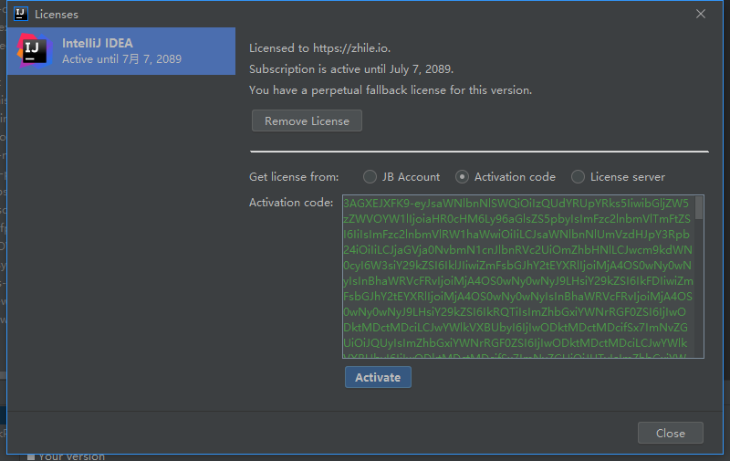

使用时会有弹窗，提示缺少importment.txt,这时再将破解文件拖拽到IDEA中，提示如下，选择激活代码，为IDEA安装即可。

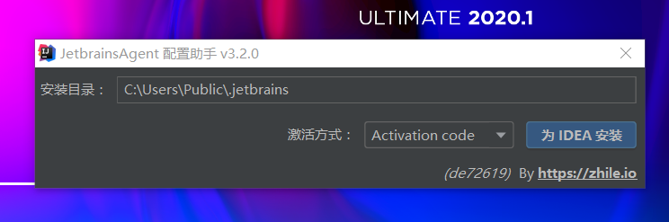

#  PLSQL

拷贝过来别人的用的暂时

序列号等：

product code: ke4tv8t5jtxz493kl8s2nn3t6xgngcmgf3
serial Number: 264452
password: xs374ca

然后

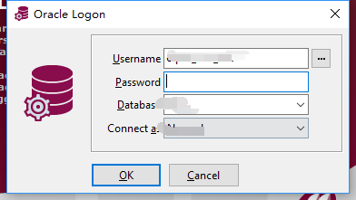

先点取消按钮，进入页面，否则直接等会报初始化错误

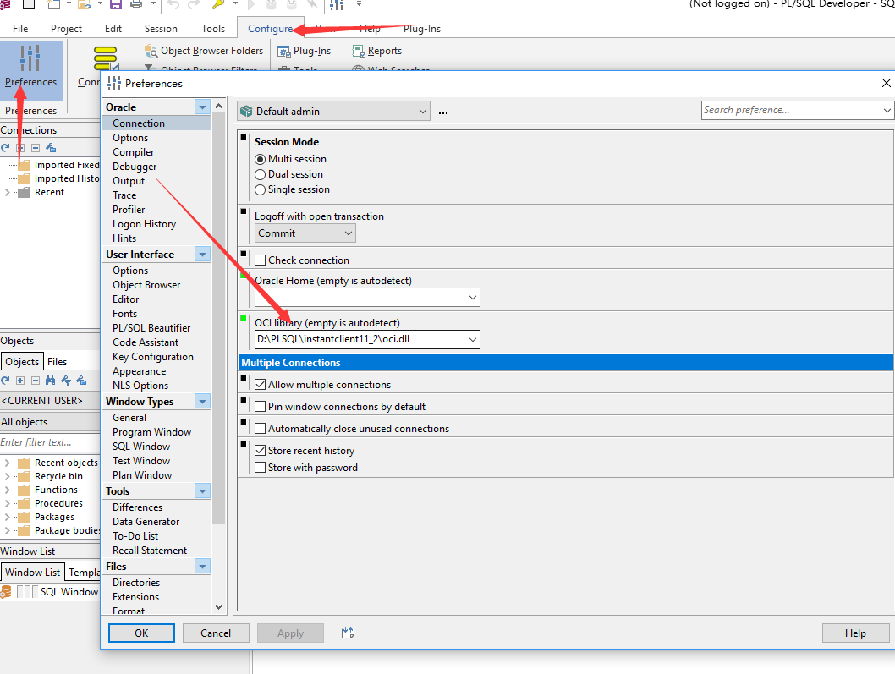

然后configure ——Preference——Connection ——找到你的oci.dll文件路径粘贴过去。

然后修改你的配置文件，配置你的数据库连接信息：D:\PLSQL\instantclient11_2\NETWORK\ADMIN\tnsnames.ora

```xml
# tnsnames.ora Network Configuration File:  tnsnames.ora
# Generated by Oracle configuration tools.

30 =
  (DESCRIPTION =
    (ADDRESS_LIST =
      (ADDRESS = (PROTOCOL = TCP)(HOST = XXX.XXX.XXX.30 )(PORT = 1528))
    )
    (CONNECT_DATA =
      (SERVICE_NAME = orcl )
    )
  )
……

```

然后再一次输入连接即可

解决PLSQL乱码问题

查看oracle服务端的字符编码

```sql
select * from v$nls_parameters
```

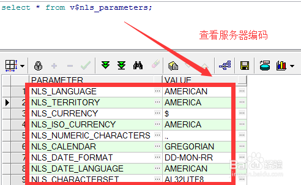

配置一个环境变量就可以解决问题

变量名称：NLS_LANG

变量值：SIMPLIFIED CHINESE_CHINA.ZHS16GBK

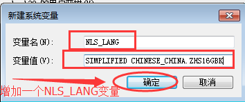

# sencha

保证安装jdk

下载Sencha：https://www.sencha.com/products/extjs/cmd-download/

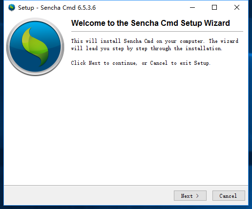

一路下去

用户变量Path添加路径

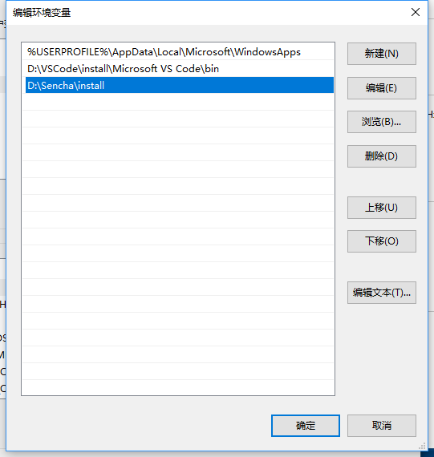


# 程序员必备


##  Typora

下载：

## Writage

一个能实现Word与markdown相互转换的工具

下载：https://www.writage.com/


 

 