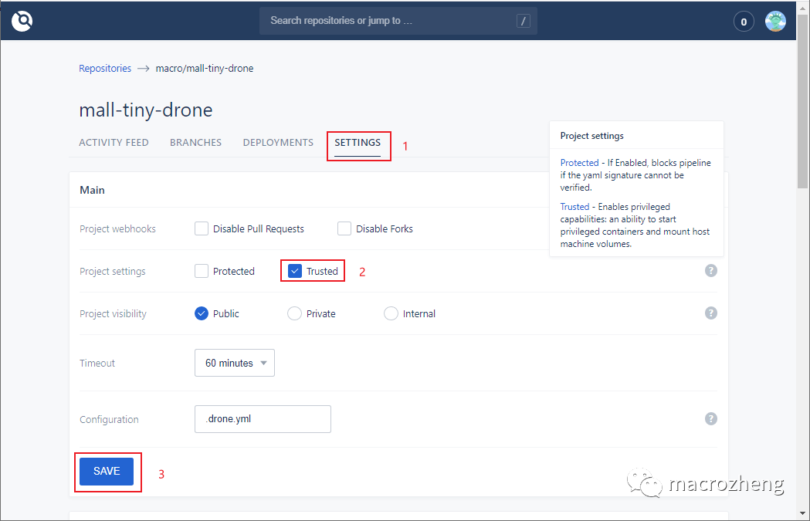
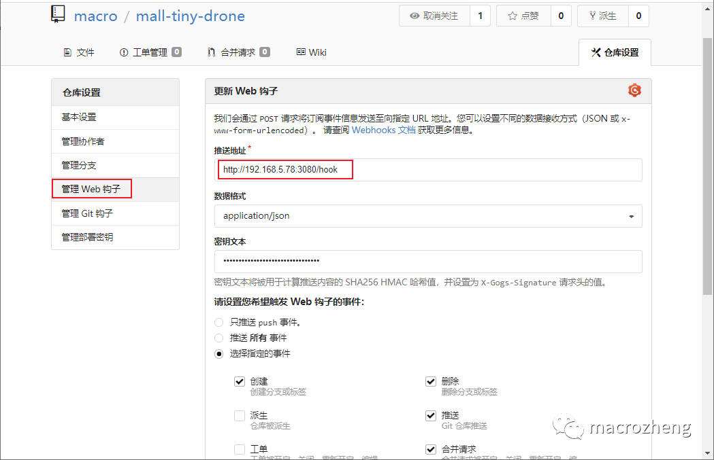
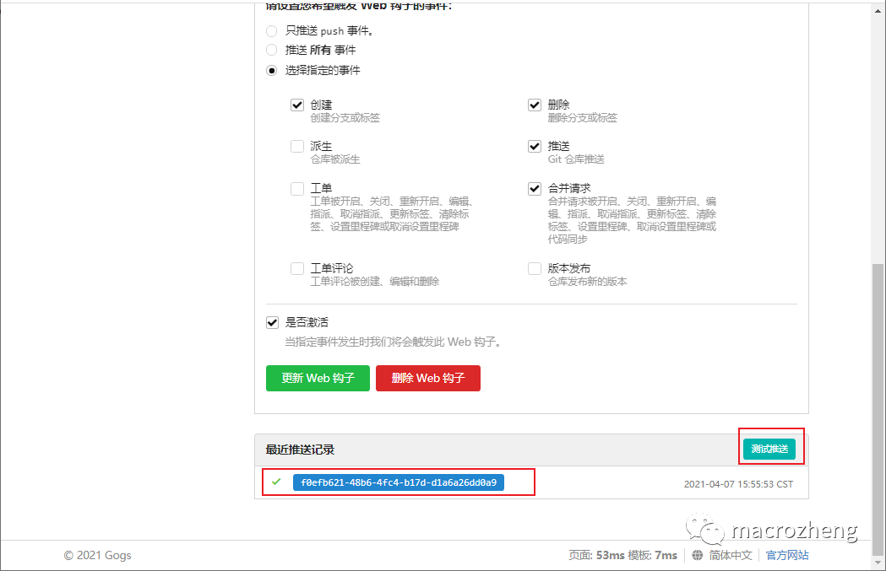
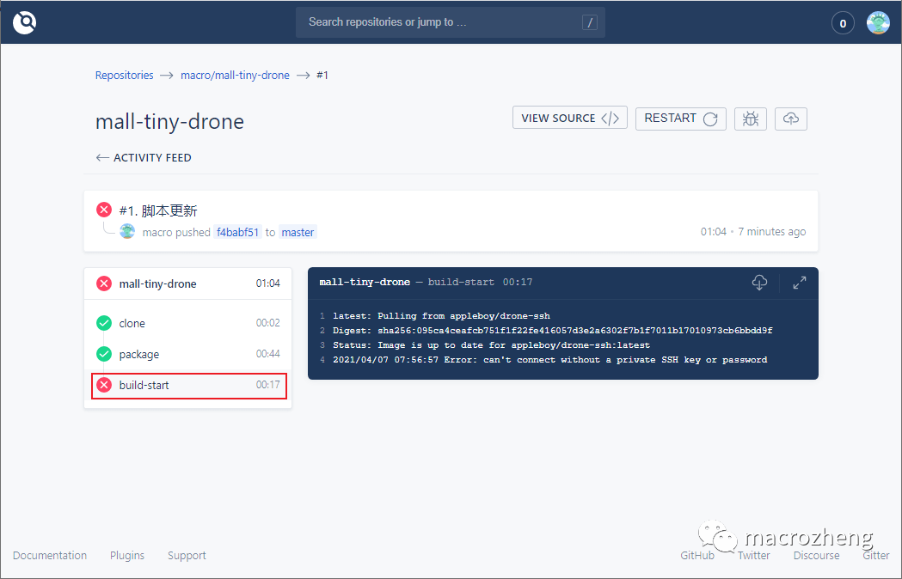
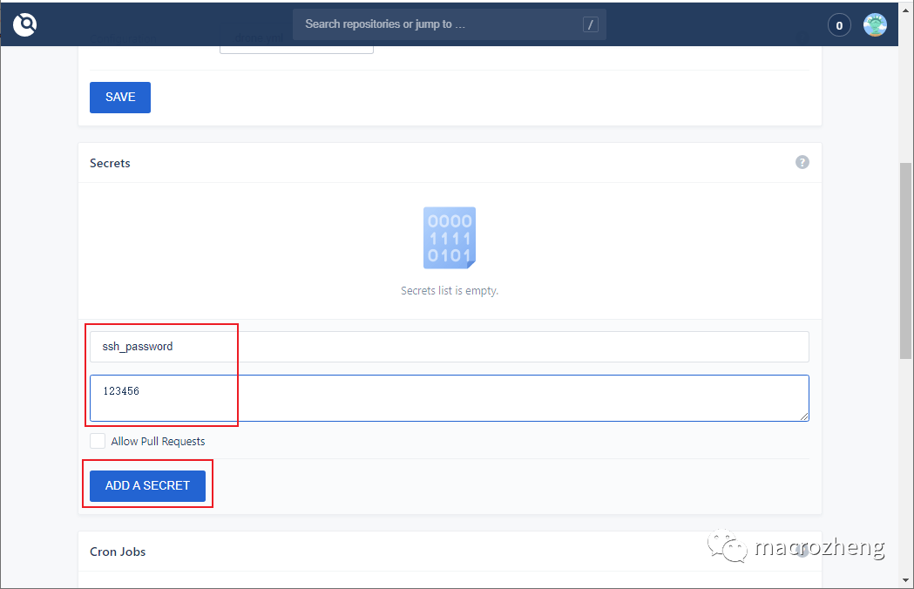
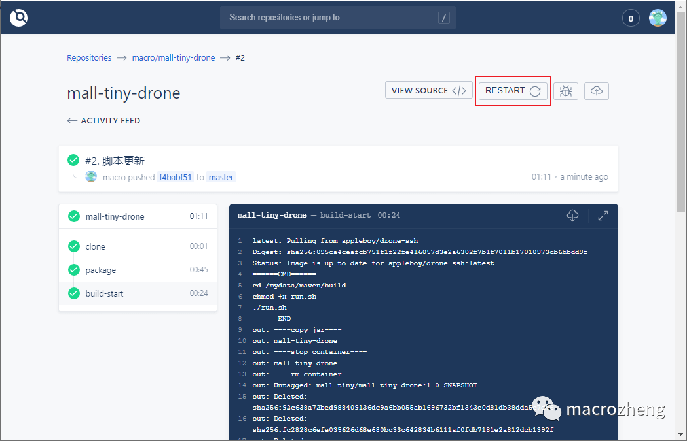
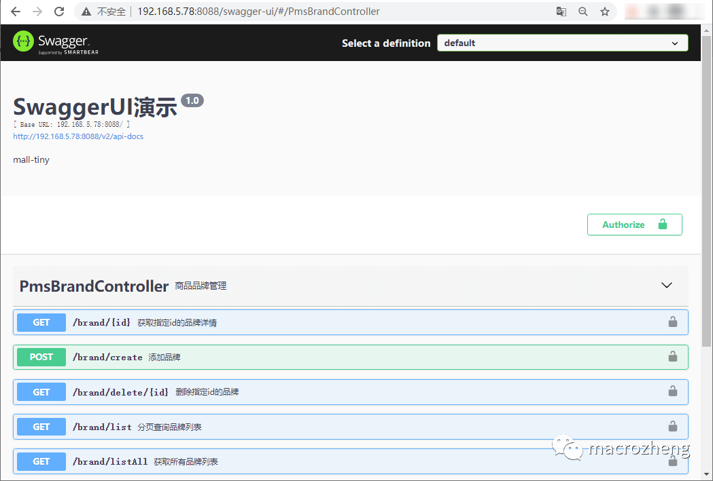

# 一：简介

Drone是一款基于容器技术的持续集成工具，使用简单的YAML配置文件即可完成复杂的自动化构建、测试、部署任务，

# 二：安装

1：安装Gogs

我们将使用轻量级的Gogs来搭建Git仓库，这里只是简单说下安装步骤，具体使用可以参考[《Gogs安装》](https://mp.weixin.qq.com/s?__biz=MzU1Nzg4NjgyMw==&mid=2247485177&idx=1&sn=4e8b4669e7164e2826232f74ea11938e&scene=21#wechat_redirect)。

Gogs运行成功后，访问Web页面地址并注册账号：http://192.168.5.78:10080


然后将项目源码上传上去即可；

2：安装Drone

- 下载Drone的Server和Runner的镜像；

```
# Drone的Server
docker pull drone/drone:1
# Drone的Runner
docker pull drone-runner-docker:1
```

- 这里有个Server和Runner的概念，我们先来理解下；

- - Server：为Drone的管理提供了Web页面，用于管理从Git上获取的仓库中的流水线任务。
  - Runner：一个单独的守护进程，会轮询Server，获取需要执行的流水线任务，之后执行。

- 接下来我们来安装`drone-server`，使用如下命令即可；

```
docker run \
  -v /mydata/drone:/data \
  -e DRONE_AGENTS_ENABLED=true \
  -e DRONE_GOGS_SERVER=http://192.168.5.78:10080 \
  -e DRONE_RPC_SECRET=dronerpc666 \
  -e DRONE_SERVER_HOST=192.168.5.78:3080 \
  -e DRONE_SERVER_PROTO=http \
  -e DRONE_USER_CREATE=username:macro,admin:true \
  -e TZ="Asia/Shanghai" \
  -p 3080:80 \
  --restart=always \
  --detach=true \
  --name=drone \
  drone/drone:1
```

- 这里的配置参数比较多，下面统一解释下；

- - DRONE_GOGS_SERVER：用于配置Gogs服务地址。
  - DRONE_RPC_SECRET：Drone的共享秘钥，用于验证连接到server的rpc连接，server和runner需要提供同样的秘钥。
  - DRONE_SERVER_HOST：用于配置Drone server外部可访问的地址。
  - DRONE_SERVER_PROTO：用于配置Drone server外部可访问的协议，必须是http或https。
  - DRONE_USER_CREATE：创建一个管理员账号，该账号需要在Gogs中注册好。

- 接下来安装`drone-runner-docker`，当有需要执行的任务时，会启动临时的容器来执行流水线任务；

```
docker run -d \
  -v /var/run/docker.sock:/var/run/docker.sock \
  -e DRONE_RPC_PROTO=http \
  -e DRONE_RPC_HOST=192.168.5.78:3080 \
  -e DRONE_RPC_SECRET=dronerpc666 \
  -e DRONE_RUNNER_CAPACITY=2 \
  -e DRONE_RUNNER_NAME=runner-docker \
  -e TZ="Asia/Shanghai" \
  -p 3000:3000 \
  --restart always \
  --name runner-docker \
  drone/drone-runner-docker:1
```

- 这里的配置参数比较多，下面统一解释下。

- - DRONE_RPC_PROTO：用于配置连接到Drone server的协议，必须是http或https。
  - DRONE_RPC_HOST：用于配置Drone server的访问地址，runner会连接到server获取流水线任务并执行。
  - DRONE_RPC_SECRET：用于配置连接到Drone server的共享秘钥。
  - DRONE_RUNNER_CAPACITY：限制runner并发执行的流水线任务数量。
  - DRONE_RUNNER_NAME：自定义runner的名称。

# 三：使用

第一次登录需要输入账号密码（在Gogs中注册的账号），访问地址：http://192.168.5.78:3080/

此时我们在Gogs中的项目会现在在列表中，如果没有的话可以点下`SYNC`按钮；


- 接下来我们需要对仓库进行设置，将仓库设置为`Trusted`（否则Drone创建的容器无法挂载目录到宿主机），最后点击`SAVE`按钮保存；



- 保存成功后会在Gogs中自动配置一个Web钩子，当我们推送代码到Gogs中去时，会触发这个钩子，然后执行在Drone中的流水线任务；



- 拉到最下面，我们可以发送一个测试推送，推送成功会显示绿色的√；



- 此时我们在Drone中发现其实流水线执行失败了，那是因为我们在脚本中引用了Secret中的`ssh_password`；



- 在仓库的设置中添加一个Secret即可，Secret是专门用来存储密码的，此密码只能被使用或删除，无法被查看；



- 在`ACTIVITY FEED`中使用`RESTART`可以重新执行该流水线，发现已经成功执行。



## 编写脚本

> 当我们向Git仓库Push代码时，会自动触发Web钩子，然后Drone就会从Git仓库Clone代码，再通过项目目录下的`.drone.yml`配置，执行相应的流水线，接下来我们来看看这个脚本是如何写的。

- 首先我们来了解下在`.drone.yml`中配置的工作流都有哪些操作，看下流程图就知道了；


- 再来一个完整的`.drone.yml`，配上详细的注解，看下就基本懂了！

```
kind: pipeline # 定义对象类型，还有secret和signature两种类型
type: docker # 定义流水线类型，还有kubernetes、exec、ssh等类型
name: mall-tiny-drone # 定义流水线名称

steps: # 定义流水线执行步骤，这些步骤将顺序执行
  - name: package # 流水线名称
    image: maven:3-jdk-8 # 定义创建容器的Docker镜像
    volumes: # 将容器内目录挂载到宿主机，仓库需要开启Trusted设置
      - name: maven-cache
        path: /root/.m2 # 将maven下载依赖的目录挂载出来，防止重复下载
      - name: maven-build
        path: /app/build # 将应用打包好的Jar和执行脚本挂载出来
    commands: # 定义在Docker容器中执行的shell命令
      - mvn clean package # 应用打包命令
      - cp target/mall-tiny-drone-1.0-SNAPSHOT.jar /app/build/mall-tiny-drone-1.0-SNAPSHOT.jar
      - cp Dockerfile /app/build/Dockerfile
      - cp run.sh /app/build/run.sh

  - name: build-start
    image: appleboy/drone-ssh # SSH工具镜像
    settings:
      host: 192.168.5.78 # 远程连接地址
      username: root # 远程连接账号
      password:
        from_secret: ssh_password # 从Secret中读取SSH密码
      port: 22 # 远程连接端口
      command_timeout: 5m # 远程执行命令超时时间
      script:
        - cd /mydata/maven/build # 进入宿主机构建目录
        - chmod +x run.sh # 更改为可执行脚本
        - ./run.sh # 运行脚本打包应用镜像并运行

volumes: # 定义流水线挂载目录，用于共享数据
  - name: maven-build
    host:
      path: /mydata/maven/build # 从宿主机中挂载的目录
  - name: maven-cache
    host:
      path: /mydata/maven/cache
```

- `run.sh`执行脚本可以实现打包应用和运行容器镜像，之前讲过这里就不再赘述了，具体可以参考[《我常用的自动化部署技巧，贼好用，推荐给大家！》](https://mp.weixin.qq.com/s?__biz=MzU1Nzg4NjgyMw==&mid=2247485031&idx=2&sn=38ee903435b46a9708ab24c9e0bc9b60&scene=21#wechat_redirect)，运行成功效果如下。

