# 一：简介

Jenkins是一个开源的、提供友好操作界面的持续集成(CI)工具

主要用于持续、自动的构建/测试软件项目、监控外部任务的运行

Jenkins用Java语言编写，可在Tomcat等流行的servlet容器中运行，也可独立运行。通常与版本管理工具(SCM)、构建工具结合使用。常用的版本控制工具有SVN、GIT，构建工具有Maven、Ant、Gradle。

## 1.1：CI/CD

CI(Continus integration 持续集成)。持续集成强调开发人员提交新代码后，立即进行构件，测试。

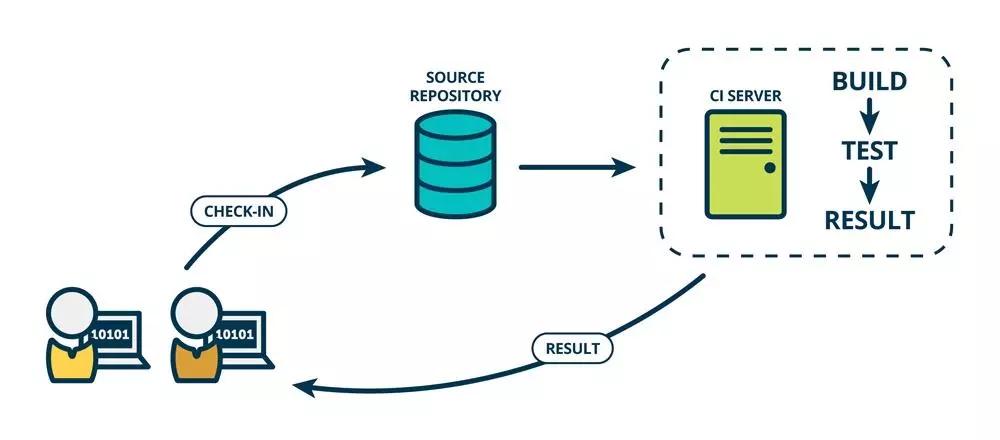


CD（Continuous Deliery 持续交付）在持续集成的基础上，将集成后的代码部署到更贴近真实运行环境中。

# 二：安装

Jenkins是基于JDK开发的，故要求JDK版本大于8

## 2.1：安装JDK

## 2.3：Tomcat修改

给Tomcat配置账户：

```xml
  <role rolename="tomcat"/>
  <role rolename="role1"/>
  <user username="tomcat" password="admin" roles="tomcat"/>
  <user username="admin" password="admin" roles="tomcat,role1"/>
```


## 2.2：安装Jenkins

Linux安装：

获取

```cmd
wget -O /etc/yum.repos.d.jenkins.repo https://pkg.jenkins.io/redhat/jenkins.repo
```

查看

```cmd
# cat /etc/yum.repos.d/jenkins.repo 
[jenkins]
name=Jenkins
baseurl=http://pkg.jenkins.io/redhat
gpgcheck=1				#为1时会检测key
```

安装jenkins

```cmd
rpm --import https://pkg.jenkins.io/redhat/jenkins.io.key

yum install -y jenkins
```

启动

```cmd
systemctl start jenkins
# 查看
ps aux |grep jenkins
jenkins    1157 84.7 10.0 2320896 100884 ?      Ssl  23:28   0:08 /etc/alternatives/java -Dcom.sun.akuma.Daemon=daemonized -Djava.awt.headless=true -DJENKINS_HOME=/var/lib/jenkins -jar /usr/lib/jenkins/jenkins.war --logfile=/var/log/jenkins/jenkins.log --webroot=/var/cache/jenkins/war --daemon --httpPort=8080 --debug=5 --handlerCountMax=100 --handlerCountMaxIdle=20
```


Window安装：


https://blog.csdn.net/weixin_43184774/article/details/104428244

更改端口：8800

管理员用户：全是admin

以管理员身份运行cmd窗口

停止jenkins

```cmd
net stop jenkins
```

重启

```shell
net start jenkins
```


访问设置

打开浏览器法，访问ip8080


提示需要输入管理员密码，输入77faa20f2ad544f7bcb6593b1cf1436b（上面查到的admin密码），点击`继续`，会初始化一小段时间


这里我选择`安装推荐的插件`

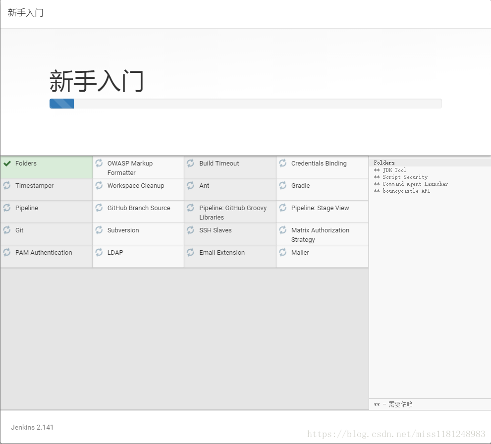

这里就已经开始在安装插件，我们等它安装完就好了。

上面等插件安装完后，就进入到下面界面，提示要创建第一个admin用户，并设置用户名密码

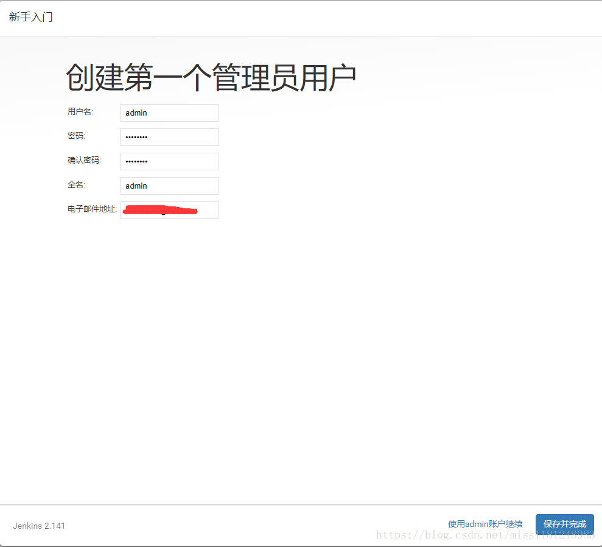

点击`保存并完成`

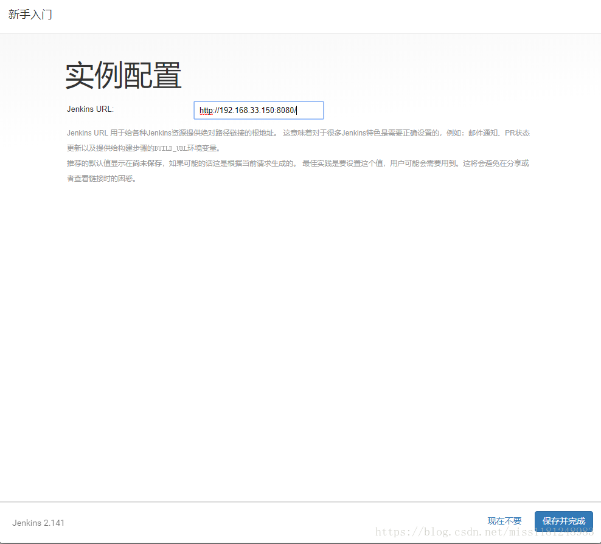

提示配置jenkins URL，这里保持默认即可，继续点击`保存并完成`

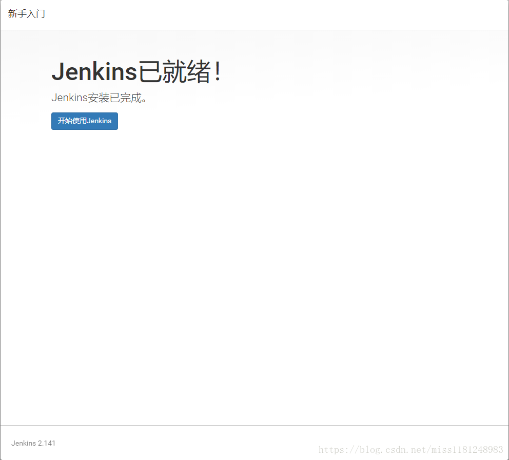

# 三：使用

## 3.1：基本配置

使用前，先了解一些jenkins的配置

配置文件

```cmd
# cat /etc/sysconfig/jenkins				#查看jenkins的配置文件，定义了home、JAVA_CMD、user、port等基础配置，保持默认即可

```

文件内容

```text
## Path:        Development/Jenkins
## Description: Jenkins Automation Server
## Type:        string
## Default:     "/var/lib/jenkins"
## ServiceRestart: jenkins
#
# Directory where Jenkins store its configuration and working
# files (checkouts, build reports, artifacts, ...).
#
JENKINS_HOME="/var/lib/jenkins"

## Type:        string
## Default:     ""
## ServiceRestart: jenkins
#
# Java executable to run Jenkins
# When left empty, we'll try to find the suitable Java.
#
JENKINS_JAVA_CMD=""

## Type:        string
## Default:     "jenkins"
## ServiceRestart: jenkins
#
# Unix user account that runs the Jenkins daemon
# Be careful when you change this, as you need to update
# permissions of $JENKINS_HOME and /var/log/jenkins.
#
JENKINS_USER="jenkins"

## Type:        string
## Default: "false"
## ServiceRestart: jenkins
#
# Whether to skip potentially long-running chown at the
# $JENKINS_HOME location. Do not enable this, "true", unless
# you know what you're doing. See JENKINS-23273.
#
#JENKINS_INSTALL_SKIP_CHOWN="false"

## Type: string
## Default:     "-Djava.awt.headless=true"
## ServiceRestart: jenkins
#
# Options to pass to java when running Jenkins.
#
JENKINS_JAVA_OPTIONS="-Djava.awt.headless=true"

## Type:        integer(0:65535)
## Default:     8080
## ServiceRestart: jenkins
#
# Port Jenkins is listening on.
# Set to -1 to disable
#
JENKINS_PORT="8080"

## Type:        string
## Default:     ""
## ServiceRestart: jenkins
#
# IP address Jenkins listens on for HTTP requests.
# Default is all interfaces (0.0.0.0).
#
JENKINS_LISTEN_ADDRESS=""

## Type:        integer(0:65535)
## Default:     ""
## ServiceRestart: jenkins
#
# HTTPS port Jenkins is listening on.
# Default is disabled.
#
JENKINS_HTTPS_PORT=""

## Type:        string
## Default:     ""
## ServiceRestart: jenkins
#
# Path to the keystore in JKS format (as created by the JDK 'keytool').
# Default is disabled.
#
JENKINS_HTTPS_KEYSTORE=""

## Type:        string
## Default:     ""
## ServiceRestart: jenkins
#
# Password to access the keystore defined in JENKINS_HTTPS_KEYSTORE.
# Default is disabled.
#
JENKINS_HTTPS_KEYSTORE_PASSWORD=""

## Type:        string
## Default:     ""
## ServiceRestart: jenkins
#
# IP address Jenkins listens on for HTTPS requests.
# Default is disabled.
#
JENKINS_HTTPS_LISTEN_ADDRESS=""


## Type:        integer(1:9)
## Default:     5
## ServiceRestart: jenkins
#
# Debug level for logs -- the higher the value, the more verbose.
# 5 is INFO.
#
JENKINS_DEBUG_LEVEL="5"

## Type:        yesno
## Default:     no
## ServiceRestart: jenkins
#
# Whether to enable access logging or not.
#
JENKINS_ENABLE_ACCESS_LOG="no"

## Type:        integer
## Default:     100
## ServiceRestart: jenkins
#
# Maximum number of HTTP worker threads.
#
JENKINS_HANDLER_MAX="100"

## Type:        integer
## Default:     20
## ServiceRestart: jenkins
#
# Maximum number of idle HTTP worker threads.
#
JENKINS_HANDLER_IDLE="20"

## Type:        string
## Default:     ""
## ServiceRestart: jenkins
#
# Pass arbitrary arguments to Jenkins.
# Full option list: java -jar jenkins.war --help
#
JENKINS_ARGS=""
```

目录；

jobs		浏览器上面创建的任务都会存放在这里

logs		存放jenkins相关的日志

nodes		多节点时用到

plugins		插件所在目录

secrets		密码秘钥所在目录				#jobs和plugins目录比较重要

### 全局工具配置

配置Maven


配置JDK


### 插件管理

在/home/jenkins目录找到文件 `hudson.model.UpdateCenter.xml 换成国内的服务器更加稳定`

 修改`https://updates.jenkins.io/update-center.json`为

​     `http://mirror.xmission.com/jenkins/updates/update-center.json`

deploy to container

subversion

### 全局安全设置

https://www.cnblogs.com/hukey/p/11207345.html

### 构建项目前配置


## 3.2：发布项目代码

登录Jenkins， 点击左侧的新建，创建新的构建任务。

新建项目——构建一个自有风格的项目

### 添加参数

可忽略

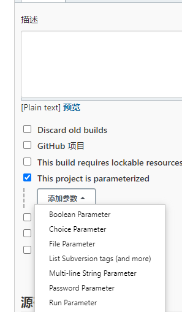

| 参数名称   | 参数值                                  | 参数描述                                                     |
| ---------- | --------------------------------------- | ------------------------------------------------------------ |
| appName    | springBoot                              | 项目名称                                                     |
| server     | 机器ip地址                              | 服务地址                                                     |
| version    | 0.0.1                                   | 版本号，可以根据情况定义                                     |
| serverPath | /home/jenkins/workplace/springboot_dev/ | 远程存放代码的路径或者说是远程的工作目录                     |
| port       | 7011                                    | 端口                                                         |
| env        | dev                                     | 发布的环境：dev；联调的环境test；预发布的环境pre；修复环境fix；生产环境prod； |
|            |                                         |                                                              |
|            |                                         |                                                              |
|            |                                         |                                                              |


### 源码管理：

选择来源，我的为SVN，选择Subversion

填写SVN路径，路径要对应到pom.xml文件的上一层；

添加认证身份

SVN：

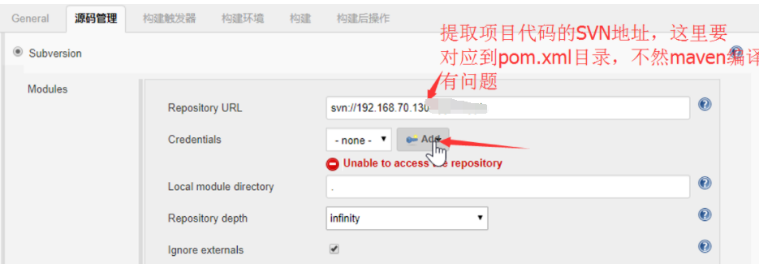

Git：


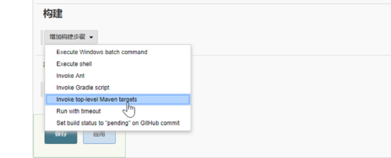


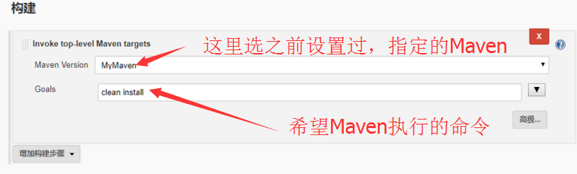

添加如下 ：标识可以忽略单元类进行编译

```properties
clean install -U -Dmaven.test.skip=true
```

然后点击立即构建，下载源码；

设置构建后的操作：

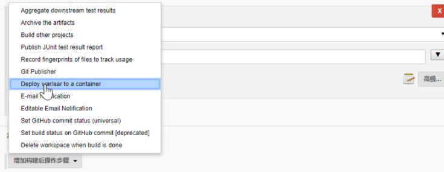

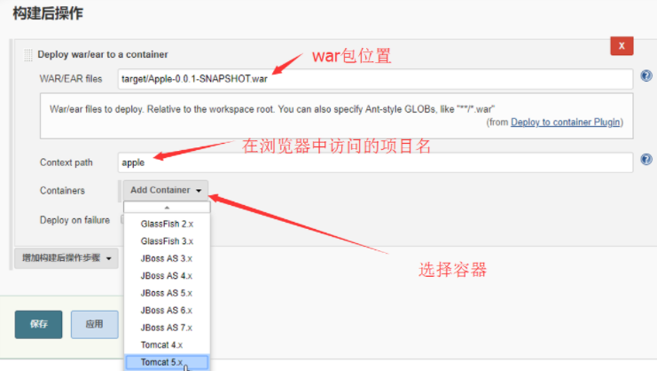

## 问题：

1：权限问题无法使用Maven install

更改工作目录：https://blog.csdn.net/liudinglong1989/article/details/78665998

我是配置了Jenkins_HOME后，将安装目录下的一些有关路径全部替换成了JENKINS_HOME

```xml
  <env name="JENKINS_HOME" value="%JENKINS_HOME%\Jenkins\.jenkins"/>
```


2：多个war包或则Jar包配置

修改为


3：访问被拒绝403，无法部署到tomcat中

修改`conf/context.xml ` 文件，修改如下内容

```xml
<Context antiResourceLocking="true" antiJARLocking="true">  
```

修改 `conf/tomcat-users.xml` 的文件，在其中加上

```xml
<role rolename="manager-gui"/>
<user username="tomcat" password="s3cret" roles="manager-gui"/>
<user username="admin" password="admin" roles="tomcat,role1,manager-gui"/>
```


# 四：集成

## 集成GitLab


## 集成Maven项目


## 集成钉钉通知


优点：简单，提醒，查看

邮件也行


下载钉钉，启动机器人，然后群主搞一个自定义机器人，拿到token


Jenkins安装插件

配置

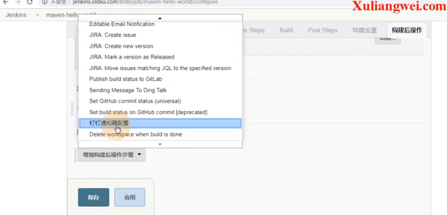


## 集成pipeline

基本语法

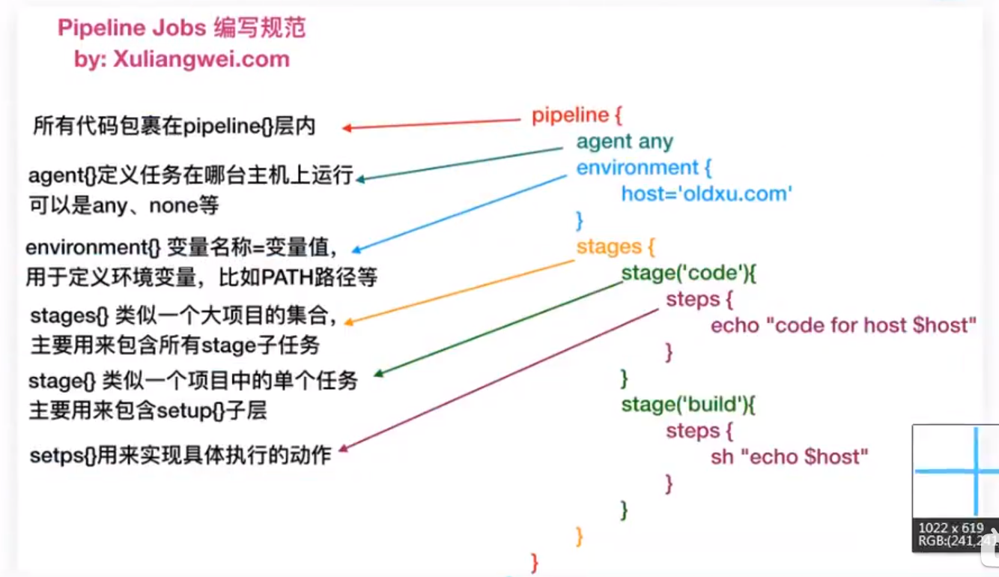


新建项目：

构建一个流水线的项目

写pipline脚本


参考链接：

https://mp.weixin.qq.com/s/AZqa0BytdnnfLOumtgk2UQ


