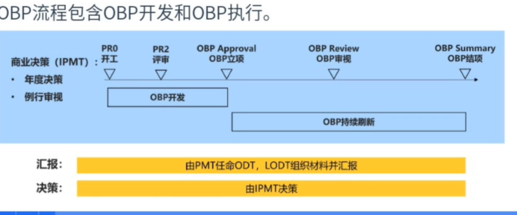

一：持续集成

持续集成指的是，频繁地（一天多次）将代码集成到主干。

好处：

**（1）快速发现错误。**每完成一点更新，就集成到主干，可以快速发现错误，定位错误也比较容易。

**（2）防止分支大幅偏离主干。**如果不是经常集成，主干又在不断更新，会导致以后集成的难度变大，甚至难以集成。

**持续集成的目的，就是让产品可以快速迭代，同时还能保持高质量。**它的核心措施是，代码集成到主干之前，必须通过自动化测试。只要有一个测试用例失败，就不能集成。

持续集成不能消除Bug，但他能非常容易发现和改正；

二：持续交付

三：持续部署

四：流程

1：提交

2：测试

3：构建

工具：Jenkins

4：测试

5：部署

6：回滚

IPD：集成产品开发

主要包括：

1：需求管理

2：投资组合管理

3：结构化流程

4：项目及管道管理

5：业务分层与异步开发

6：重量级跨部门团队

7：基于衡量标准的评估和改进

市场与技术双轮驱动产品开发

市场与技术双轮驱动，要求理解客户的真正需求，帮助客户获取成功，通过竞争驱动来构筑差异化竞争优势，通过技术驱动来构筑断裂与不可替代的竞争优势。

市场胜势反哺长期投资，积累技术优势，而技术优势转化为市场胜势，帮助企业取得长期的商业成功。

以重量级跨部门团队作为组织保障
通过构建IPMT业务域投资组合管理团队、PMT产品组合管理团队、PDT产品开发团队等端对端的重量级跨部门团队，来开展业务经营活动。

·以结构化的流程作为流程保障
通过结构化流程，将产品投资组合管理、客户需求驱动和产品开发整合为一体，保证“做正确的事”和“正确地做事”，结构化流程需要有清晰的角色定义、活动、交付件、出入标准，渐进明细，定期度量评估并持续改进。

·业务分层与异步开发
通过业务分层进行复杂业务层级间解耦，通过架构设计的进一步解耦形成可复用的公共平台以及组件，推广复用并以此成为基于结构化流程的异步开发的基础，提升研发效率。

重量级团队：

IPD组织设立了IPMT、PMT、PDT三大重量级团队，开展分层决策与业务经营。

公司向IPMT授予投资组合管理与决策职责，IPMT向PMT授予业务参谋职责，IPMT向PDT授予产品经营职责。

IPMT(Integrated Portfolio Management Team)是业务域投资组合管理重量级团队，负责通过构筑业务领先的产品竞争力来获得持续的商业成功。

IPMT团队由主任与委员组成，委员包括市场委员、销售委员、研发委员、交付与服务委员、质量运营委员、财务委员。

PMT(Portfolio Management Team)是产品组合管理重量级团队，支撑IPMT团队运作，是IPMT的业务参谋部,负责制定SP、BP、产品OBP立项和产品需求管理。

PMT由主任与各代表组成，代表包括产品管理代表、营销运作代表、研发代表、销售代表、交付与服务代表、质量运营代表。

PDT(Product Development Team)是产品开发重量级团队，对产品的持续经营和商业成功负责。

PDT是产品市场领域的经营组织，由PDT经理与功能领域代表组成，功能领域代表包括产品管理代表、研发代表、营销运作代表、销售代表、交付与服务代表、质量运营代表、财务代表。

会议机制：

IPD组织设立了ITMT、C-TMT、TDT技术管理重量级团队，打造一流的技术研发体系。

ITMT (Integrated Technology ManagementTeam)是公司任命的技术管理决策重量级团队，负责构筑行业领先的技术、平台及能力，支撑产品获得持续的商业价值并成功。

C-TMT(Corporation Technology Management Team)是公司任命的技术研发管理重量级团队，作为公司ITMT的参谋部，负责技术规划和架构看护，持续提升技术和平台综合竞争力。

TDT(Technology Development Team)是技术领域的技术开发重量级团队，负责技术和平台的设计、开发、验证并交付给各业务域，对技术和平台的成功负责，包括技术和平台开发（架构、功能、性能、质量、成本、开发周期)和按时保质的整体交付（技术和平台、相关资料)。

OBP流程：

OBP立项:聚焦商业目标，商业策略，整体规划方向及本年度的关键价值特性、节奏。

OBP审视:至少半年一次，对前期商业决策执行情况进行审视，对计划、策略等进行刷新。

OBP结项︰对立项内容进行回顾和验收，可与第二年度OBP立项汇报合并进行。

RP(Release Planning):为每个版本的启动点，明确该版本的计划、价值特性和功能领域活动。第一个版本的RP可与OBP立项汇报合并。

RR ( Release Review) :每个版本发布采用RR评估，包括受限商用版本和规模商业版本。

Release迭代项目相当于依据OBP中的规划依次进行研发项目立项，每个Release应当定义清晰的范围、目标、质量要求。

TR (Technical Review) : IPD流程中结合恒生实际情况，定义TR2.TR5、TR6，共3个技术评审点，PDT对产品研发项目要发现遗留的技术问题，评估存在的技术风险，给出技术上的操作建议。
