# Maven介绍

## 项目开发中遇到的问题

1、都是同样的代码，为什么在我的机器上可以编译执行，而在他的机器上就不行？

2、为什么在我的机器上可以正常打包，而配置管理员却打不出来?

3、项目组加入了新的人员，我要给他说明编译环境如何设置，但是让我挠头的是，有些细节我也记不清楚了。

4、我的项目依赖一些jar包，我应该把他们放哪里？放源码库里？

5、这是我开发的第二个项目，还是需要上面的那些jar包，再把它们复制到我当前项目的svn库里吧

6、现在是第三次，再复制一次吧 ----- 这样真的好吗？

7、我写了一个数据库相关的通用类，并且推荐给了其他项目组，现在已经有五个项目组在使用它了，今天我发现了一个bug，并修正了它，我会把jar包通过邮件发给其他项目组

\-----这不是一个好的分发机制，太多的环节可能导致出现bug

8、项目进入测试阶段，每天都要向测试服务器部署一版。每次都手动部署，太麻烦了。

## 什么是maven

Maven是基于项目对象模型(POM)，可以通过一小段描述信息来管理项目的构建，报告和文档的软件项目管理工具。

Maven是跨平台的项目管理工具。主要服务于基于Java平台的**项目构建**，**依赖管理**和**项目信息管理**。

Maven主要有两个功能：

1.  项目构建

2.  依赖管理

## 什么是构建

**构建过程：**

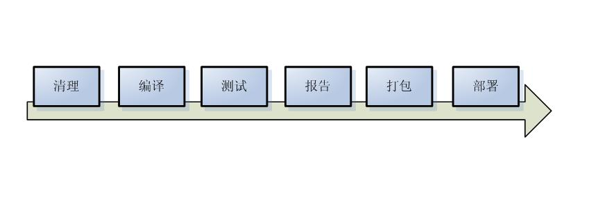

## 项目构建的方式

1、Eclipse

手工操作较多，项目的构建过程都是独立的，很难一步完成。比如：编译、测试、部署等。

开发时每个人的IDE配置都不同，很容易出现本地代码换个地方编译就出错

2、Ant

Ant只是一个项目构建工具，它没有集成依赖管理。

Ant在进行项目构建时，它没有对项目目录结构进行约定，需要手动指定源文件、类文件等目录地址。同时它执行task时，需要显示指定依赖的task，这样会造成大量的代码重复。

3、**Maven**

Maven不仅是一个项目构建工具，更是一个项目管理工具。它在项目构建工程中，比ant更全面，更灵活。

Maven在进行项目构建时，它对项目目录结构拥有约定，知道你的源代码在哪里，类文件应该放到哪里去。

它拥有生命周期的概念，maven的生命周期是有顺序的，在执行后面的生命周期的任务时，不需要显示的配置前面任务的生命周期。例如执行
mvn install 就可以自动执行编译，测试，打包等构建过程

## Maven模型

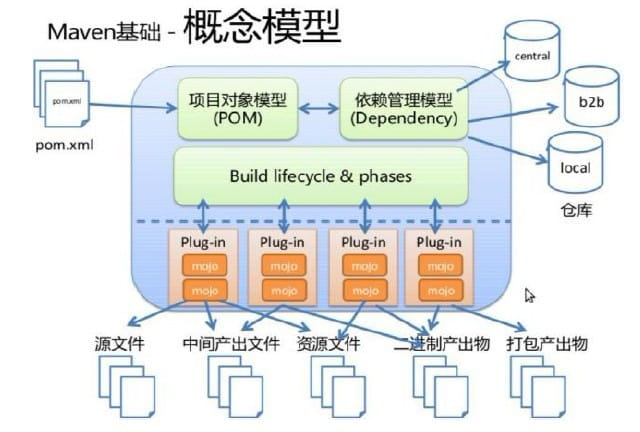

# Maven安装配置

## 下载maven

官方网站：<http://maven.apache.org>

本课程使用的maven的版本为3.0.5

Maven是使用java开发，需要安装jdk1.6以上，推荐使用1.7

## Maven的安装

第一步：安装jdk，要求1.6或以上版本。

第二步：把maven解压缩，解压目录最好不要有中文。

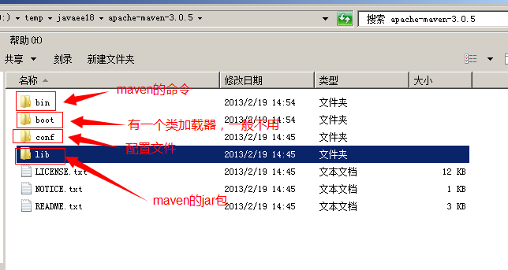

第三步：配置环境变量MAVEN_HOME

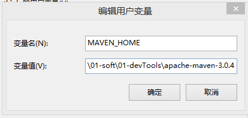

第四步：配置环境变量PATH，将%MAVEN_HOME%\\bin加入Path中，在Windows中一定要注意要用分号；与其他值隔开。

第五步：验证是否安装成功，打开cmd窗口，输入mvn –v

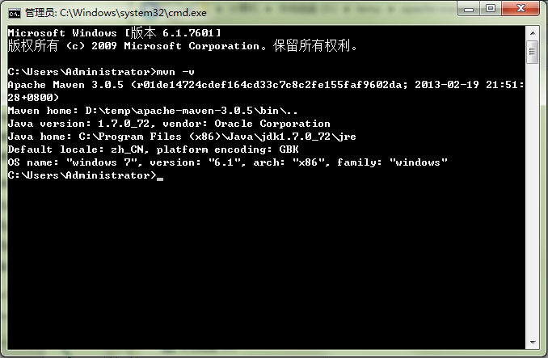

## Maven的配置

Maven有两个settings.xml配置文件，一个是全局配置文件，一个是用户配置文件。

### 全局配置（默认）

**%MAVEN_HOME%/conf/settings.xml** 是maven全局的配置文件。

该配置文件中配置了本地仓库的路径，默认就是：\~/.m2/repository。其中\~表示当前用户路径C:\\Users\\[UserName]。

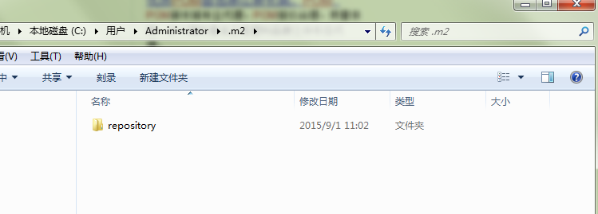

localRepository：用户仓库，用于检索依赖包路径

### 用户配置

**\~/.m2/settings.xml**是用户的配置文件（默认没有该文件，需要将全局配置文件拷贝过来在进行修改）

注意：一般本地仓库的地址不使用默认配置，通常情况下需要在用户配置中，配置新的仓库地址。

配置步骤如下：

第一步：创建一个本地仓库目录，比如E:\\08-repo\\0707\\repository。

第二步：复制maven的全局配置文件到\~/.m2目录下，即创建用户配置文件

第三步：修改maven的用户配置文件。

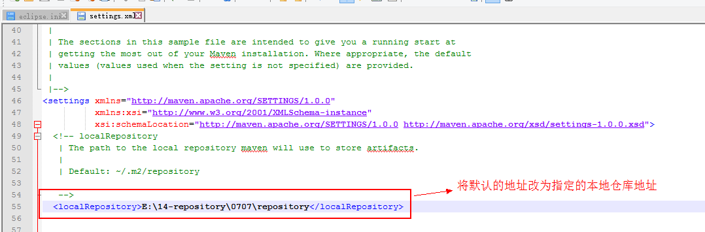

**注意：**

**用户级别的仓库在全局配置中一旦设置，全局配置将不再生效，转用用户所设置的仓库，否则使用全局配置文件中的默认路径仓库。**

# 创建Maven工程

## Maven的工程结构

Project

\|-src

\| \|-main

\| \| \|-java —— 存放项目的.java文件

\| \| \|-resources —— 存放项目资源文件，如spring, hibernate配置文件

\| \|-test

\| \|-java ——存放所有测试.java文件，如JUnit测试类

\| \|-resources —— 测试资源文件

\|-target —— 目标文件输出位置例如.class、.jar、.war文件

\|-pom.xml ——maven项目核心配置文件

## Maven的工程创建

### 第一步：根据maven的目录结构创建helloMaven工程

target目录会在编译之后自动创建。

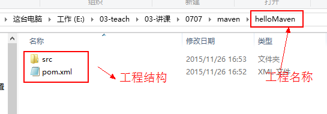

### 第二步：创建HelloWorld.java

在src/main/java/cn/itcast/maven目录下新建文件Hello.java

| package cn.itcast.maven; public class HelloWorld {  public String sayHello(String name){  return "Hello World :" + name + "!";  } } |
|-------------------------------------------------------------------------------------------------------------------------------------|


### 第三步：创建TestHelloWorld.java

| package cn.itcast.maven; import org.junit.Test; import static junit.framework.Assert.\*; public class TestHelloWorld{  \@Test  public void testSayHello(){  HelloWorld hw = new HelloWorld();  String result = hw.sayHello("zhangsan");  assertEquals("hello zhangsan",result);  }  } |
|---------------------------------------------------------------------------------------------------------------------------------------------------------------------------------------------------------------------------------------------------------------------------------------|


### 第四步：配置pom.xml

| \<project xmlns="http://maven.apache.org/POM/4.0.0" xmlns:xsi="http://www.w3.org/2001/XMLSchema-instance" xsi:schemaLocation="http://maven.apache.org/POM/4.0.0 http://maven.apache.org/xsd/maven-4.0.0.xsd"\>  \<!-- 版本：4.0.0 --\>  \<modelVersion\>4.0.0\</modelVersion\>  \<!-- 组织名称：暂时使用 组织名称+项目名称 作为组织名称 --\>  \<!-- 组织名称：实际名称 按照访问路径规范设置，通常以功能作为名称：eg: junit spring --\>  \<groupId\>cn.itcast.maven\</groupId\>  \<!-- 项目名称 --\>  \<artifactId\>HelloWorld\</artifactId\>  \<!-- 当前项目版本号：同一个项目开发过程中可以发布多个版本，此处标示0.0.1版 --\>  \<!-- 当前项目版本号：每个工程发布后可以发布多个版本，依赖时调取不同的版本，使用不同的版本号 --\>  \<version\>0.0.1\</version\>  \<!-- 名称：可省略 --\>  \<name\>Hello\</name\>  \<!-- 依赖关系 --\>  \<dependencies\>  \<!-- 依赖设置 --\>  \<dependency\>  \<!-- 依赖组织名称 --\>  \<groupId\>junit\</groupId\>  \<!-- 依赖项目名称 --\>  \<artifactId\>junit\</artifactId\>  \<!-- 依赖版本名称 --\>  \<version\>4.9\</version\>  \<!-- 依赖范围：test包下依赖该设置 --\>  \<scope\>test\</scope\>  \</dependency\>   \</dependencies\> \</project\> |
|-------------------------------------------------------------------------------------------------------------------------------------------------------------------------------------------------------------------------------------------------------------------------------------------------------------------------------------------------------------------------------------------------------------------------------------------------------------------------------------------------------------------------------------------------------------------------------------------------------------------------------------------------------------------------------------------------------------------------------------------------------------------------------------------------------------------------------------------------------------------------------------------------------------------------------------------------------------------------------------------------------------------------------------------------------------------------------------------------------------------------------------------------------------------------------------------|


到此maven工程即创建成功。

## Maven的命令

需要在pom.xml所在目录中执行以下命令。

### Mvn compile

执行 mvn compile命令，完成编译操作

执行完毕后，会生成target目录，该目录中存放了编译后的字节码文件。

### Mvn clean

执行 mvn clean命令

执行完毕后，会将target目录删除。

### Mvn test

执行 mvn test命令，完成单元测试操作

执行完毕后，会在target目录中生成三个文件夹：surefire、surefire-reports（测试报告）、test-classes（测试的字节码文件）

### Mvn package

执行 mvn package命令，完成打包操作

执行完毕后，会在target目录中生成一个文件，该文件可能是jar、war

### Mvn install 

执行 mvn install命令，完成将打好的jar包安装到本地仓库的操作

执行完毕后，会在本地仓库中出现安装后的jar包，方便其他工程引用

### mvn clean compile命令

cmd 中录入 mvn clean compile命令

组合指令，先执行clean，再执行compile，通常应用于上线前执行，清除测试类

### mvn clean test命令

cmd 中录入 mvn clean test命令

组合指令，先执行clean，再执行test，通常应用于测试环节

### mvn clean package命令

cmd 中录入 mvn clean package命令

组合指令，先执行clean，再执行package，将项目打包，通常应用于发布前

执行过程：

清理————清空环境

编译————编译源码

测试————测试源码

打包————将编译的非测试类打包

### mvn clean install命令

cmd 中录入 mvn clean install 查看仓库，当前项目被发布到仓库中

组合指令，先执行clean，再执行install，将项目打包，通常应用于发布前

执行过程：

清理————清空环境

编译————编译源码

测试————测试源码

打包————将编译的非测试类打包

部署————将打好的包发布到资源仓库中

# M2Eclipse

M2Eclipse是eclipse中的maven插件

## 安装配置M2Eclipse插件

### 第一步：将以下包中的插件进行复制。

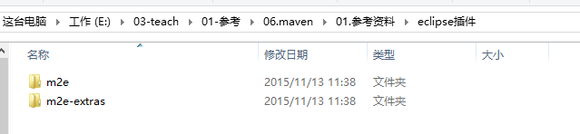

### 第二步：粘贴到eclipse中的dropins目录中

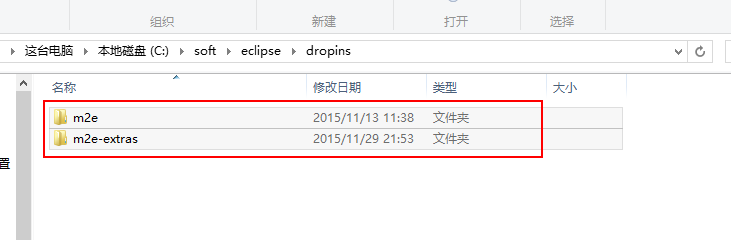

### 第三步：查看eclipse中是否有maven插件

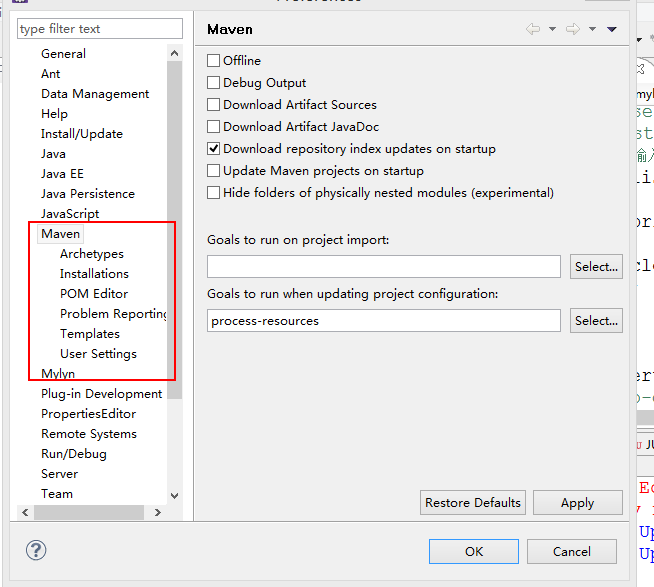

### 第四步：设置maven安装目录

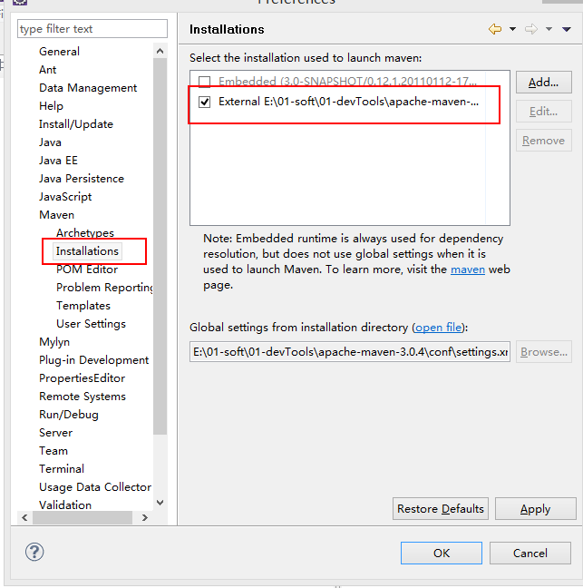

### 第五步：设置用户配置

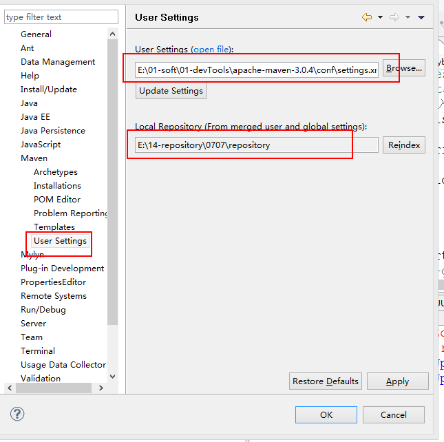

## 创建maven工程

### 通过骨架创建maven工程

#### 创建工程

第一步：选择new→maven→Maven Project

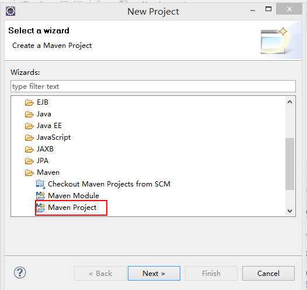

第二步：next

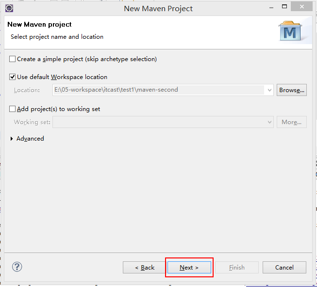

第三步：next

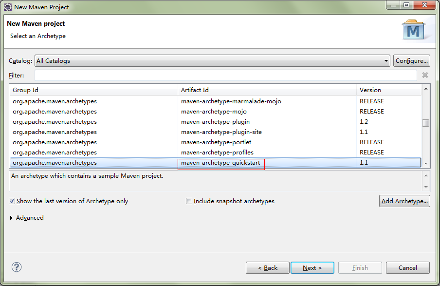

选择maven的工程骨架，这里我们选择quickstart。

第四步：next

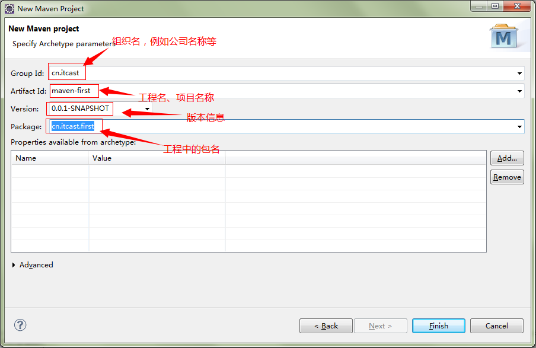

输入GroupId、ArtifactId、Version、Package信息点击finish完成。

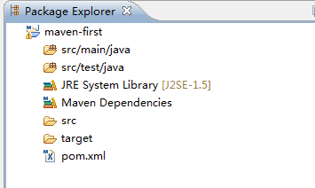

#### 创建MavenFirst.java

在src/main/java中创建cn.itcast.maven包，然后创建MavenFirst.java

| **package** cn.itcast.maven; **public class** MavenFirst {  **public** String sayHello(String name) {  **return** "hello " + name;  } } |
|-----------------------------------------------------------------------------------------------------------------------------------------|


#### 创建TestMavenFirst.java

在src/test/java中创建cn.itcast.maven包，然后创建TestMavenFirst.java

| **package** cn.itcast.maven; **import** org.junit.Assert; **import** org.junit.Test; **public class** TestMavenFirst {  \@Test  **public void** testSayHello() {  MavenFirst first = **new** MavenFirst();  String result = first.sayHello("zhangsan");  Assert.*assertEquals*("hello zhangsan", result);  } } |
|----------------------------------------------------------------------------------------------------------------------------------------------------------------------------------------------------------------------------------------------------------------------------------------------------------------|


#### 执行maven命令进行测试

在Eclipse的maven插件中执行maven命令，需要在maven工程或者pom.xml文件上点击右键，选择Run
as→maven build..

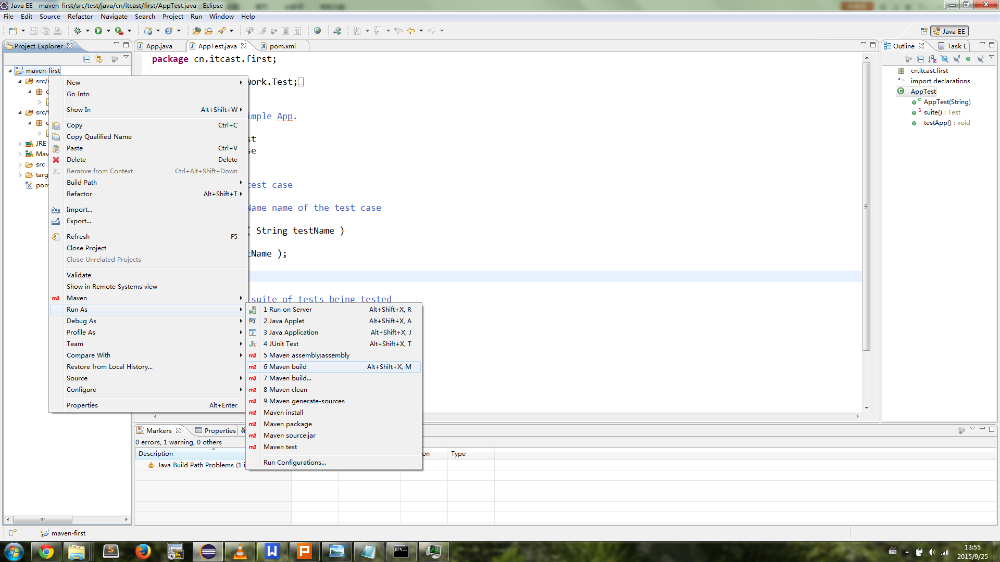

可以在菜单中看到maven常用的命令已经以菜单的形式出现。

例如：

Maven clean

Maven install

Maven package

Maven test

Maven build和maven build... 并不是maven的命令。

maven build...只是提供一个命令输入功能，可以在此功能中输入自定义的maven命令。

maven build的功能就是执行上次自定义命令。

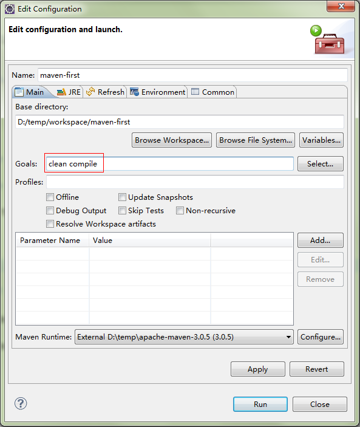

### 不通过骨架创建maven工程

通过选择骨架创建maven工程，每次选择骨架时都需要联网下载，如果网络不通或者较慢的情况下会有很长时间的等待。使用很是不方便，所以创建工程时可以不选择骨架直接创建工程。

#### 创建工程

第一步：选择new→maven→Maven Project


第二步：next

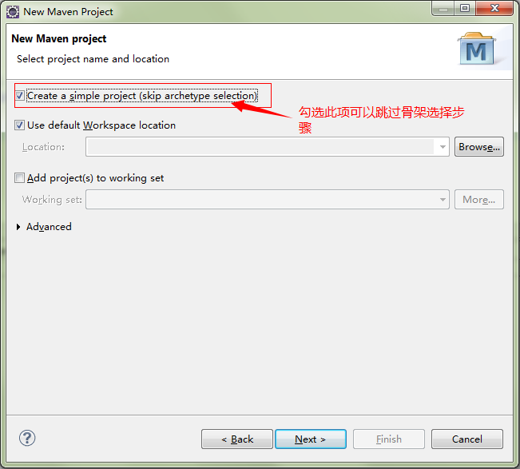

第三步：next

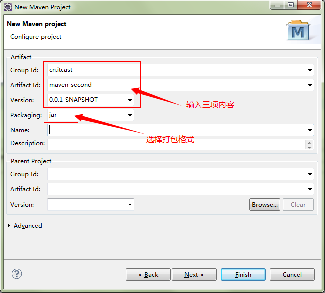

Packaging：指定打包方式，默认为jar。选项有：jar、war、pom。

第四步：点击finish，完成maven工程创建。

#### 修改pom文件

在Maven-second工程中依赖使用maven-first工程的代码

| \<project xmlns=*"http://maven.apache.org/POM/4.0.0"* xmlns:xsi=*"http://www.w3.org/2001/XMLSchema-instance"*  xsi:schemaLocation=*"http://maven.apache.org/POM/4.0.0 http://maven.apache.org/xsd/maven-4.0.0.xsd"*\>  \<modelVersion\>4.0.0\</modelVersion\>  \<groupId\>cn.itcast.maven\</groupId\>  \<artifactId\>maven-second\</artifactId\>  \<version\>0.0.1-SNAPSHOT\</version\>  \<dependencies\>  \<dependency\>  \<groupId\>junit\</groupId\>  \<artifactId\>junit\</artifactId\>  \<version\>4.12\</version\>  \</dependency\>  \<dependency\>  \<groupId\>cn.itcast.maven\</groupId\>  \<artifactId\>maven-first\</artifactId\>  \<version\>0.0.1-SNAPSHOT\</version\>  \</dependency\>  \</dependencies\> \</project\> |
|-------------------------------------------------------------------------------------------------------------------------------------------------------------------------------------------------------------------------------------------------------------------------------------------------------------------------------------------------------------------------------------------------------------------------------------------------------------------------------------------------------------------------------------------------------------------------------------------------------------------------------------------------------------------------------------------------------------------------------------|


#### 创建MavenSecond.java

| **package** cn.itcast.maven; **public class** MavenSecond {  **public** String sayHello(String name) {  MavenFirst first = **new** MavenFirst();  **return** first.sayHello(name) + ":second";  } } |
|-----------------------------------------------------------------------------------------------------------------------------------------------------------------------------------------------------|


#### 创建TestMavenSecond.java

| **package** cn.itcast.maven; **import** org.junit.Assert; **import** org.junit.Test; **public class** TestMavenSecond {  \@Test  **public void** testSayHello() {  MavenSecond second = **new** MavenSecond();  String result = second.sayHello("zhangsan");  Assert.*assertEquals*("hello zhangsan:second", result);  } } |
|----------------------------------------------------------------------------------------------------------------------------------------------------------------------------------------------------------------------------------------------------------------------------------------------------------------------------|


#### 测试工程

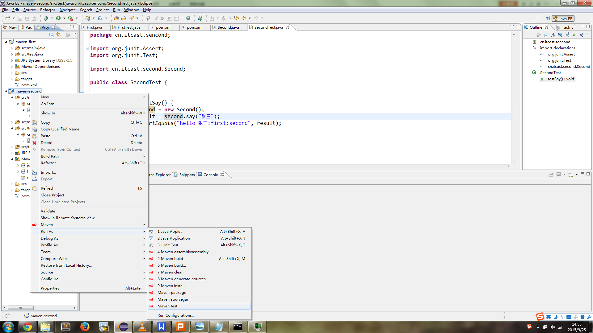

如果maven-first工程没有安装则会出现以下错误：

| [INFO] Scanning for projects... [INFO]  [INFO] ------------------------------------------------------------------------ [INFO] Building maven-second 0.0.1-SNAPSHOT [INFO] ------------------------------------------------------------------------ [WARNING] The POM for cn.itcast:maven-first:jar:0.0.1-SNAPSHOT is missing, no dependency information available [INFO] ------------------------------------------------------------------------ [INFO] BUILD FAILURE [INFO] ------------------------------------------------------------------------ [INFO] Total time: 0.218s [INFO] Finished at: Fri Sep 25 15:06:00 CST 2015 [INFO] Final Memory: 4M/15M [INFO] ------------------------------------------------------------------------ [ERROR] Failed to execute goal on project maven-second: Could not resolve dependencies for project cn.itcast:maven-second:jar:0.0.1-SNAPSHOT: **Could not find artifact cn.itcast:maven-first:jar:0.0.1-SNAPSHOT** -\> [Help 1] [ERROR]  [ERROR] To see the full stack trace of the errors, re-run Maven with the -e switch. [ERROR] Re-run Maven using the -X switch to enable full debug logging. [ERROR]  [ERROR] For more information about the errors and possible solutions, please read the following articles: [ERROR] [Help 1] http://cwiki.apache.org/confluence/display/MAVEN/DependencyResolutionException |
|-----------------------------------------------------------------------------------------------------------------------------------------------------------------------------------------------------------------------------------------------------------------------------------------------------------------------------------------------------------------------------------------------------------------------------------------------------------------------------------------------------------------------------------------------------------------------------------------------------------------------------------------------------------------------------------------------------------------------------------------------------------------------------------------------------------------------------------------------------------------------------------------------------------------------------------------------------------------------------------------------------------------------------------------------------------------------------------------------------------------------------------------------------------------------------------------------------------------------------------------------------------------------------------------------------------------------------------------------------------------------|


提示找不到maven-first的jar包。当系统运行时是从本地仓库中找依赖的jar包的，所以必须先将maven-first安装才能正常运行，需要在maven-first工程上运行
mvn install命令安装到本地仓库。

# Maven核心概念

## 坐标

### 什么是坐标？

在平面几何中坐标（x,y）可以标识平面中唯一的一点。在maven中坐标就是为了定位一个唯一确定的jar包。

Maven世界拥有大量构建，我们需要找一个用来唯一标识一个构建的统一规范

拥有了统一规范，就可以把查找工作交给机器

### Maven坐标主要组成

**groupId**：定义当前Maven组织名称

**artifactId**：定义实际项目名称

**version**：定义当前项目的当前版本

## 依赖管理

就是对项目中jar 包的管理。可以在pom文件中定义jar包的GAV坐标，管理依赖。

依赖声明主要包含如下元素：

```xml
<dependencies>
		<dependency>
			<groupId>junit</groupId>
			<artifactId>junit</artifactId>
			<version>4.10</version>
			<scope>test</scope>
		</dependency>		
	</dependencies>

```


### 依赖范围


其中依赖范围**scope** 用来控制依赖和编译，测试，运行的classpath的关系.
主要的是三种依赖关系如下：

1.compile： 默认编译依赖范围。对于编译，测试，运行三种classpath都有效

2.test：测试依赖范围。只对于测试classpath有效

3.provided：已提供依赖范围。对于编译，测试的classpath都有效，但对于运行无效。因为由容器已经提供，例如servlet-api

4.runtime:运行时提供。例如:jdbc驱动

### 依赖传递

#### 直接依赖和间接依赖

如果B中使用A，C中使用B，则称B是C的**直接依赖，**而称A是C的**间接依赖**。

C-\>B B-\>A

C直接依赖B

C间接依赖A

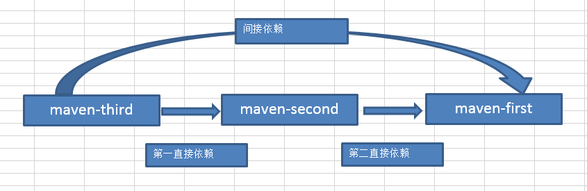

#### 依赖范围对传递依赖的影响

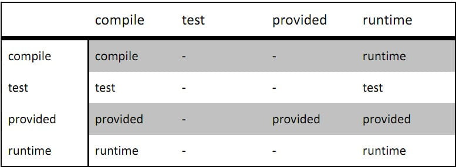

左边第一列表示第一直接依赖范围

上面第一行表示第二直接依赖范围

中间的交叉单元格表示传递性依赖范围。

总结：

-   当第二依赖的范围是compile的时候，传递性依赖的范围与第一直接依赖的范围一致。

-   当第二直接依赖的范围是test的时候，依赖不会得以传递。

-   当第二依赖的范围是provided的时候，只传递第一直接依赖范围也为provided的依赖，且传递性依赖的范围同样为
    provided；

-   当第二直接依赖的范围是runtime的时候，传递性依赖的范围与第一直接依赖的范围一致，但compile例外，此时传递的依赖范围为runtime；

### 依赖冲突

-   如果直接与间接依赖中包含有同一个坐标不同版本的资源依赖，以直接依赖的版本为准（就近原则）

1、Maven-first工程中依赖log4j-1.2.8版本

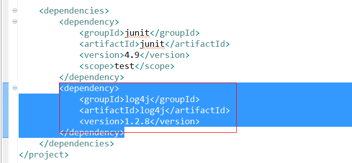

**那么maven-third中依赖的就是log4j-1.2.8**

2、maven-second工程中依赖log4j-1.2.9版本

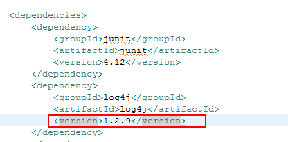

**那么maven-third中依赖的就是log4j-1.2.9，因为它直接依赖的maven-second项目中依赖的就是1.2.9版本**

-   如果直接依赖中包含有同一个坐标不同版本的资源依赖，以配置顺序下方的版本为准（就近原则）

Maven-second中依赖log4j-1.2.9和log4j-1.2.14

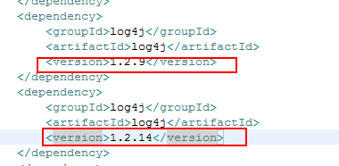

此时log4j-1.2.14版本生效。

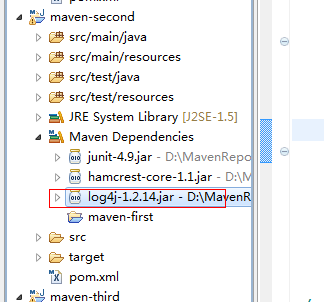

### 可选依赖

\<optional\> true/false 是否可选，也可以理解为是否向下传递。

在依赖中添加optional选项决定此依赖是否向下传递，如果是true则不传递，如果是false就传递，默认为false。


### 排除依赖

```xml
<exclusions>
	<exclusion>
		<groupId>cn.itcast.maven</groupId>
		<artifactId>maven-first</artifactId>
	</exclusion>
</exclusions>
```


排除依赖包中所包含的依赖关系，**不需要添加版本号**。

如果在本次依赖中有一些多余的jar包也被传递依赖过来，如果想把这些jar包排除的话可以配置exclusions进行排除。

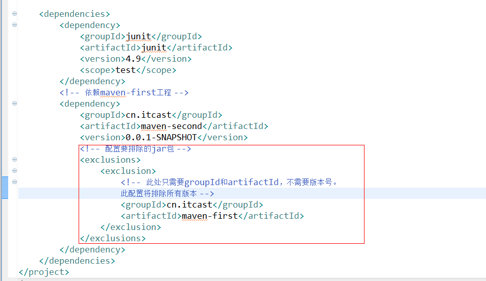

## 生命周期

### 什么是生命周期？

Maven生命周期就是为了**对所有的构建过程进行抽象和统一**。包括项目清理、初始化、编译、打包、测试、部署等几乎所有构建步骤。

**生命周期可以理解为构建工程的步骤。**

在Maven中有三套相互独立的生命周期，请注意这里说的是“三套”，而且“相互独立”，这三套生命周期分别是：

-   Clean Lifecycle： 在进行真正的构建之前进行一些清理工作。

-   Default Lifecycle： 构建的核心部分，编译，测试，打包，部署等等。

-   Site Lifecycle： 生成项目报告，站点，发布站点。

再次强调一下它们是相互独立的，你可以仅仅调用clean来清理工作目录，仅仅调用site来生成站点。当然你也可以直接运行
mvn clean install site 运行所有这三套生命周期。

### Maven三大生命周期

#### clean：清理项目

每套生命周期都由一组阶段(Phase)组成，我们平时在命令行输入的命令总会对应于一个特定的阶段。比如，运行mvn  clean，这个的clean是Clean生命周期的一个阶段。有Clean生命周期，也有clean阶段。Clean生命周期一共包含了三个阶段：

pre-clean 执行一些需要在clean之前完成的工作

clean 移除所有上一次构建生成的文件

post-clean 执行一些需要在clean之后立刻完成的工作

mvn clean中的clean就是上面的clean，在一个生命周期中，运行某个阶段的时候，它之前的所有阶段都会被运行，也就是说，mvn clean 等同于 mvn pre-clean clean ，如果我们运行 mvn post-clean ，那么pre-clean，clean都会被运行。这是Maven很重要的一个规则，可以大大简化命令行的输入。

#### default：构建项目

Default生命周期是Maven生命周期中最重要的一个，绝大部分工作都发生在这个生命周期中。这里，只解释一些比较重要和常用的阶段：

validate

generate-sources

process-sources

generate-resources

process-resources 复制并处理资源文件，至目标目录，准备打包。

**compile** 编译项目的源代码。

process-classes

generate-test-sources

process-test-sources

generate-test-resources

process-test-resources 复制并处理资源文件，至目标测试目录。

test-compile 编译测试源代码。

process-test-classes

**test** 使用合适的单元测试框架运行测试。这些测试代码不会被打包或部署。

prepare-package

**package** 接受编译好的代码，打包成可发布的格式，如 JAR 。

pre-integration-test

integration-test

post-integration-test

verify

**install** 将包安装至本地仓库，以让其它项目依赖。

deploy 将最终的包复制到远程的仓库，以让其它开发人员与项目共享。

**运行任何一个阶段的时候，它前面的所有阶段都会被运行**，这也就是为什么我们运行mvn
install
的时候，代码会被编译，测试，打包。此外，Maven的插件机制是完全依赖Maven的生命周期的，因此理解生命周期至关重要。

#### site：生成项目站点

Site生命周期

pre-site 执行一些需要在生成站点文档之前完成的工作

site 生成项目的站点文档

post-site 执行一些需要在生成站点文档之后完成的工作，并且为部署做准备

site-deploy 将生成的站点文档部署到特定的服务器上

这里经常用到的是site阶段和site-deploy阶段，用以生成和发布Maven站点，这可是Maven相当强大的功能，Manager比较喜欢，文档及统计数据自动生成，很好看。

## Maven插件

Maven的核心仅仅定义了抽象的生命周期，具体的任务都是交由插件完成的。每个插件都能实现一个功能，每个功能就是一个插件目标。Maven的生命周期与插件目标相互绑定，以完成某个具体的构建任务。

例如compile就是插件maven-compiler-plugin的一个插件目标

### Maven编译插件

```xml
<plugin>
	<groupId>org.apache.maven.plugins</groupId>
	<artifactId>maven-compiler-plugin</artifactId>
	<configuration>
		<source>1.7</source>
		<target>1.7</target>
		<encoding>UTF-8</encoding>
	</configuration>
</plugin>

```


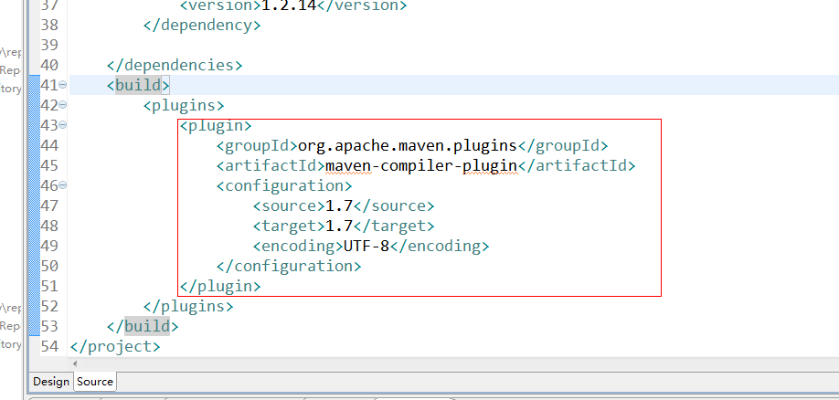

修改配置文件后，在工程上点击右键选择maven→update project configration

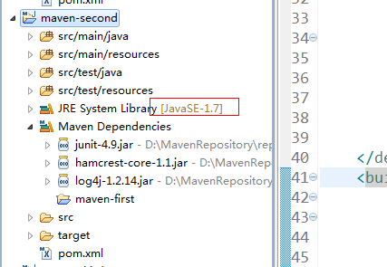

### Tomcat插件

#### 使用maven创建一个web工程

第一步：不选用骨架

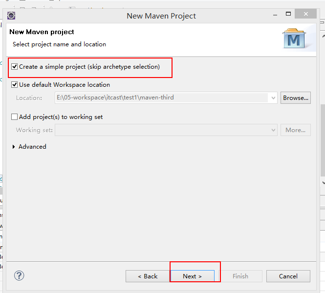

第二步：将打包方式选择为war

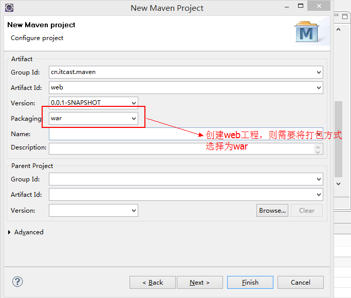

第三步：点击finish，工程创建成功。

第四步：在工程中添加web.xml

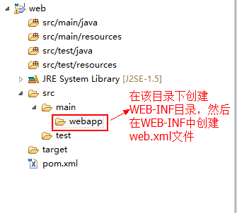

Web.xml内容如下：

```xml
<?xml version="1.0" encoding="UTF-8"?>
<web-app xmlns:xsi="http://www.w3.org/2001/XMLSchema-instance"
	xmlns="http://java.sun.com/xml/ns/javaee" xmlns:web="http://java.sun.com/xml/ns/javaee/web-app_2_5.xsd"
	xsi:schemaLocation="http://java.sun.com/xml/ns/javaee http://java.sun.com/xml/ns/javaee/web-app_2_5.xsd"
	id="WebApp_ID" version="2.5">
	<welcome-file-list>
		<welcome-file>index.html</welcome-file>
		<welcome-file>index.htm</welcome-file>
		<welcome-file>index.jsp</welcome-file>
		<welcome-file>default.html</welcome-file>
		<welcome-file>default.htm</welcome-file>
		<welcome-file>default.jsp</welcome-file>
	</welcome-file-list>
</web-app>

```


第五步：在webapp下创建index.jsp

#### 运行tomcat插件

tomcat:run 运行tomcat6（默认）

tomcat7:run 运行tomcat7（推荐，但是需要添加插件）

```xml
<plugin>
	<!-- 配置插件 -->
	<groupId>org.apache.tomcat.maven</groupId>
	<artifactId>tomcat7-maven-plugin</artifactId>
	<configuration>
		<port>8080</port>
		<path>/</path>
	</configuration>
</plugin>
```


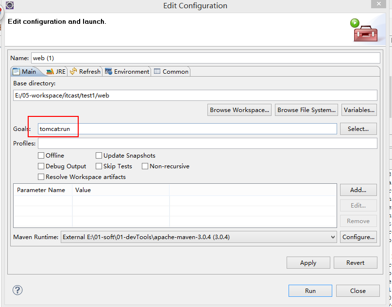

## 继承

继承是为了消除重复，可以把很多相同的配置提取出来。例如：grouptId，version等

### 创建父工程

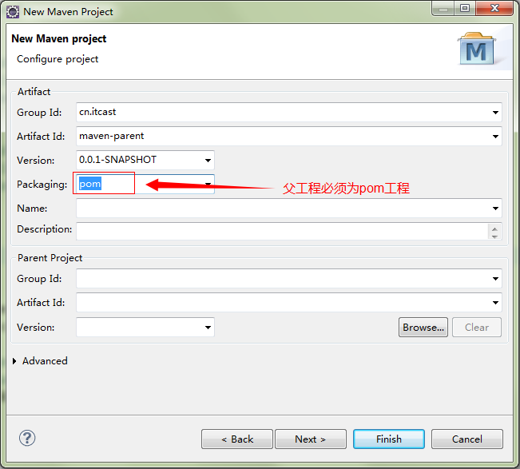

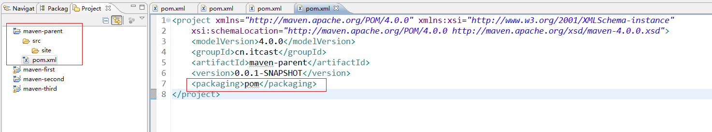

### 创建子工程

创建方式有两种：

一种是创建新工程为子工程，在创建时设置父工程的GAV。

一种是修改原有的工程为子工程，在子工程的pom.xml文件中手动添加父工程的GAV。

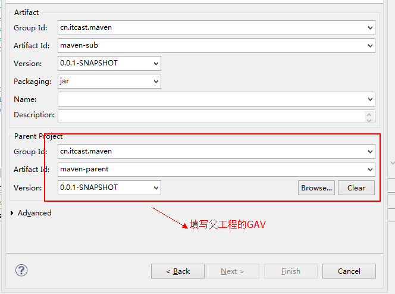

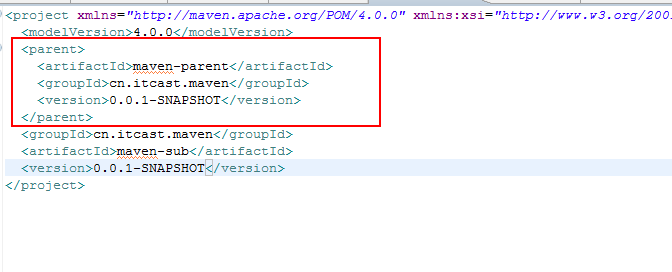

现有工程继承父工程只需要在pom文件中添加parent节点即可。

### 父工程统一依赖jar包

在父工程中对jar包进行依赖，在子工程中都会继承此依赖。

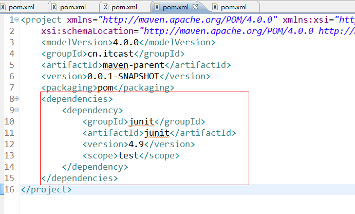

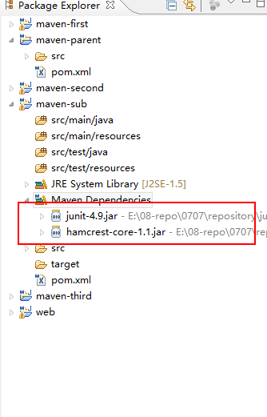

### 父工程统一管理版本号

Maven使用dependencyManagement管理依赖的版本号。

**注意：此处只是定义依赖jar包的版本号，并不实际依赖。如果子工程中需要依赖jar包还需要添加dependency节点。**

**父工程：**


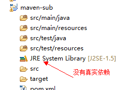

子工程：

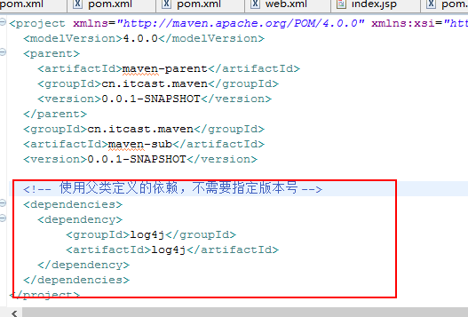

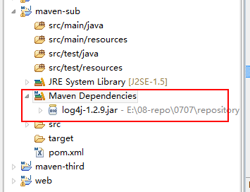

### 父工程中版本号提取

当父工程中定义的jar包越来越多，找起来越来越麻烦，所以可以把版本号提取成一个属性集中管理。

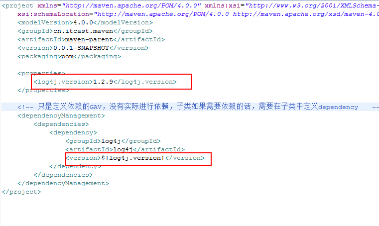

子工程的jar包版本不受影响：

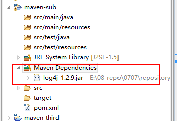

## 聚合

聚合一般是一个工程拆分成多个模块开发，每个模块是一个独立的工程，但是要是运行时必须把所有模块聚合到一起才是一个完整的工程，此时可以使用maven的聚合工程。

例如电商项目中，包括商品模块、订单模块、用户模块等。就可以对不同的模块单独创建工程，最终在打包时，将不同的模块聚合到一起。

例如同一个项目中的表现层、业务层、持久层，也可以分层创建不同的工程，最后打包运行时，再聚合到一起。

### 创建一个聚合工程

聚合工程的打包方式必须是pom，一般聚合工程和父工程合并为一个工程。

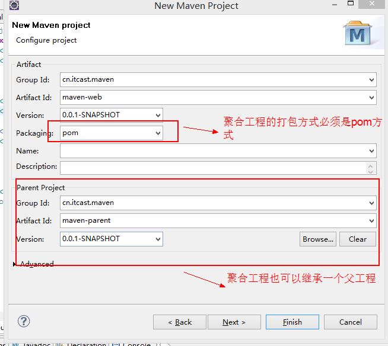

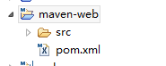

### 创建持久层工程

第一步：在maven-web工程上，点击new –\> project

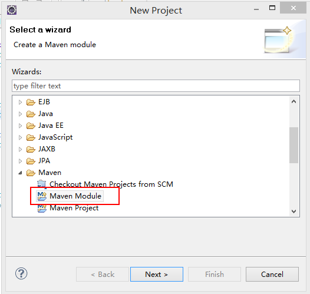

第二步：next

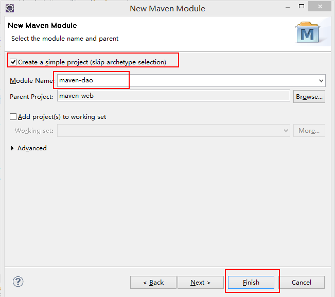

### 创建业务层工程

与持久层工程创建一样

### 创建表现层工程

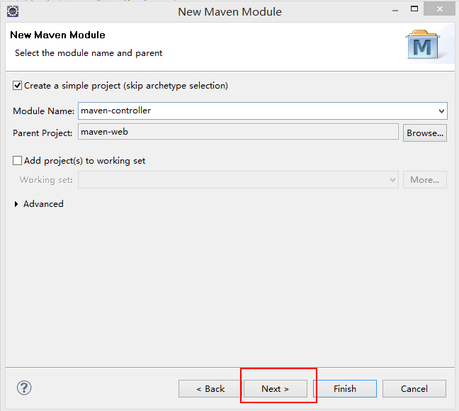

点击next，进行下面的页面

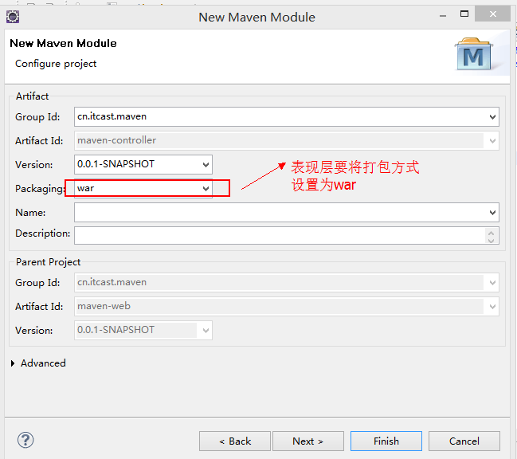

在maven-controller中添加web.xml和index.jsp

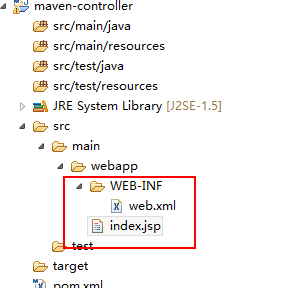

聚合之后的maven-web工程的pom文件内容如下：

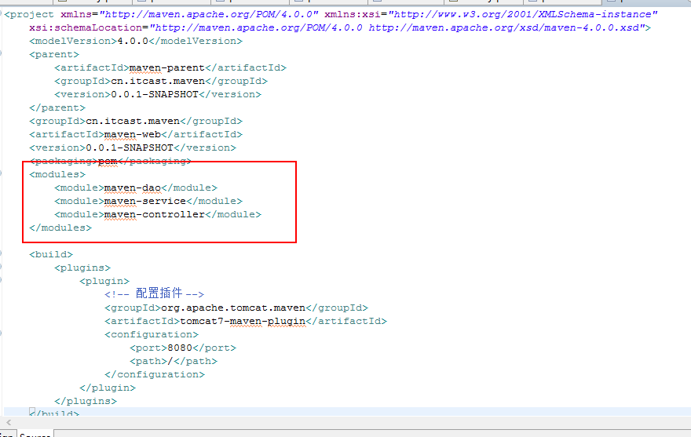

### 运行maven-web聚合工程

Tomcat7:run

注意：运行之前，需要将maven-parent工程安装到本地仓库中。

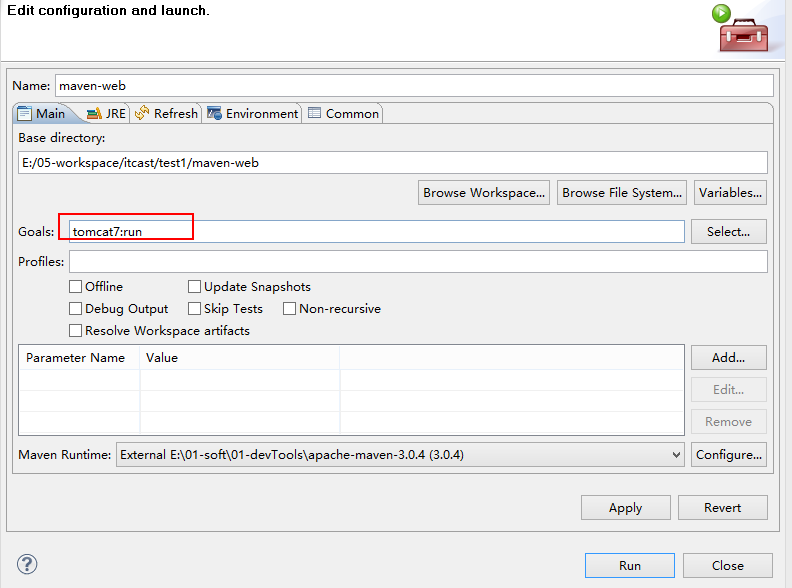

# Maven仓库管理

## 什么是Maven仓库？

用来统一存储所有Maven共享构建的位置就是仓库。根据Maven坐标定义每个构建在仓库中唯一存储路径大致为：groupId/artifactId/version/artifactId-version.packaging

## 仓库的分类

1、本地仓库

\~/.m2/repository

每个用户只有一个本地仓库

2、远程仓库

-   中央仓库：Maven默认的远程仓库，不包含版权资源

<http://repo1.maven.org/maven2>

-   私服：是一种特殊的远程仓库，它是架设在局域网内的仓库

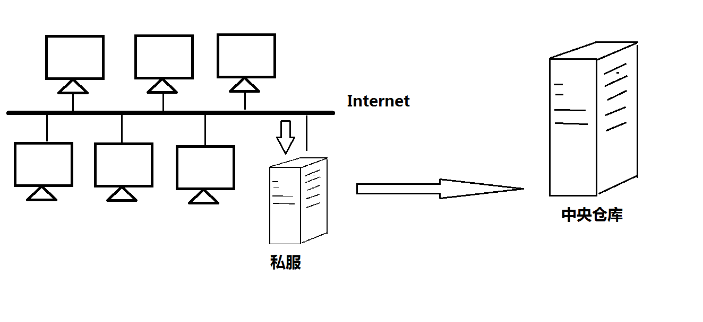

## Maven私服

### 安装Nexus

为所有来自中央仓库的构建安装提供本地缓存。

下载网站：<http://nexus.sonatype.org/>

安装版本：nexus-2.7.0-06.war

第一步：将下载的nexus的war包复制到tomcat下的webapps目录。

第二步：启动tomcat。nexus将在c盘创建sonatype-work目录【C:\\Users\\当前用户\\sonatype-work\\nexus】。

#### Nexus的目录结构

-   目录结构如下：

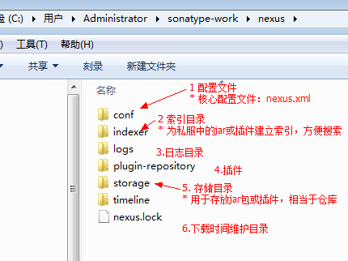

-   Indexer 索引目录结构：

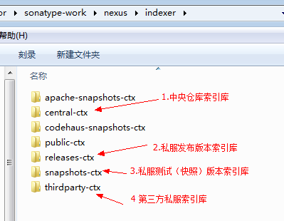

-   Storage存储目录结构：

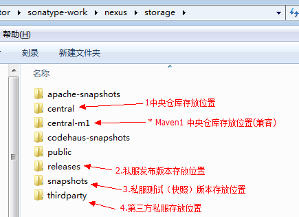

### 访问Nexus

访问URL: <http://localhost:8080/nexus-2.7.0-06/>

默认账号:

用户名： admin

密码： admin123

### Nexus的仓库和仓库组 

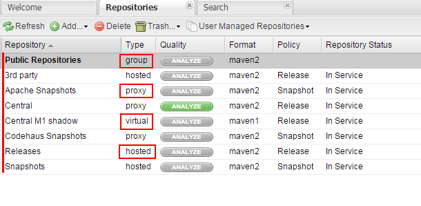

**仓库有4种类型 :**

-   group(仓库组)：一组仓库的集合

-   hosted(宿主)：配置第三方仓库 （包括公司内部私服 ）

-   proxy(代理)：私服会对中央仓库进行代理，用户连接私服，私服自动去中央仓库下载jar包或者插件

-   virtual(虚拟)：兼容Maven1 版本的jar或者插件

**Nexus的仓库和仓库组介绍:**

-   3rd party:
    一个策略为Release的宿主类型仓库，用来部署无法从公共仓库获得的第三方发布版本构建

-   Apache Snapshots: 一个策略为Snapshot的代理仓库，用来代理Apache
    Maven仓库的快照版本构建

-   Central: 代理Maven中央仓库

-   Central M1 shadow: 代理Maven1 版本 中央仓库

-   Codehaus Snapshots: 一个策略为Snapshot的代理仓库，用来代理Codehaus
    Maven仓库的快照版本构件

-   Releases: 一个策略为Release的宿主类型仓库，用来部署组织内部的发布版本构件

-   Snapshots: 一个策略为Snapshot的宿主类型仓库，用来部署组织内部的快照版本构件

-   **Public
    Repositories:该仓库组将上述所有策略为Release的仓库聚合并通过一致的地址提供服务**

### 配置所有构建均从私服下载

在本地仓库的setting.xml中配置如下：

| \<mirrors\>  \<mirror\>  \<!--此处配置所有的构建均从私有仓库中下载 \*代表所有，也可以写central --\>  \<id\>nexus\</id\>  \<mirrorOf\>\*\</mirrorOf\>  \<url\>http://localhost:8080/nexus-2.7.0-06/content/groups/public/\</url\>  \</mirror\>  \</mirrors\> |
|-------------------------------------------------------------------------------------------------------------------------------------------------------------------------------------------------------------------------------------------------------------|


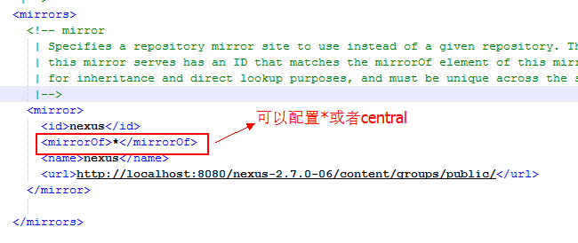

### 部署构建到Nexus

#### 第一步：Nexus的访问权限控制

在本地仓库的setting.xml中配置如下：

| \<server\>  \<id\>releases\</id\>  \<username\>admin\</username\>  \<password\>admin123\</password\>  \</server\>  \<server\>  \<id\>snapshots\</id\>  \<username\>admin\</username\>  \<password\>admin123\</password\>  \</server\>  |
|----------------------------------------------------------------------------------------------------------------------------------------------------------------------------------------------------------------------------------------|


#### 第二步：配置pom文件

在需要构建的项目中修改pom文件

| \<distributionManagement\>  \<repository\>  \<id\>releases\</id\>  \<name\>Internal Releases\</name\>  \<url\>http://localhost:8080/nexus-2.7.0-06/content/repositories/releases/\</url\>  \</repository\>  \<snapshotRepository\>  \<id\>snapshots\</id\>  \<name\>Internal Snapshots\</name\>  \<url\>http://localhost:8080/nexus-2.7.0-06/content/repositories/snapshots/\</url\>  \</snapshotRepository\>  \</distributionManagement\> |
|--------------------------------------------------------------------------------------------------------------------------------------------------------------------------------------------------------------------------------------------------------------------------------------------------------------------------------------------------------------------------------------------------------------------------------------------|


#### 第三步：执行maven的deploy命令

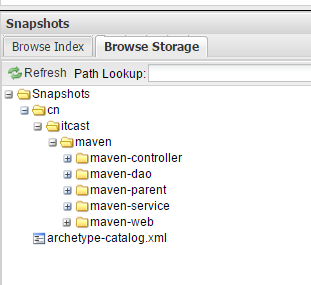

# 问题

问题1：有mvn包没有从编辑器下载下来，需要手动下载安装到本地

  mvn install:install-file         -DgroupId=com.alipay         -DartifactId=trade-sdk         -Dversion=1.0.0         -Dpackaging=jar         -Dfile=alipay-trade-sdk-1.0.0.jar

