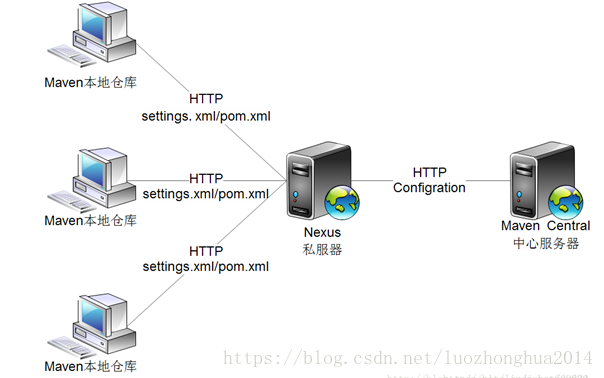
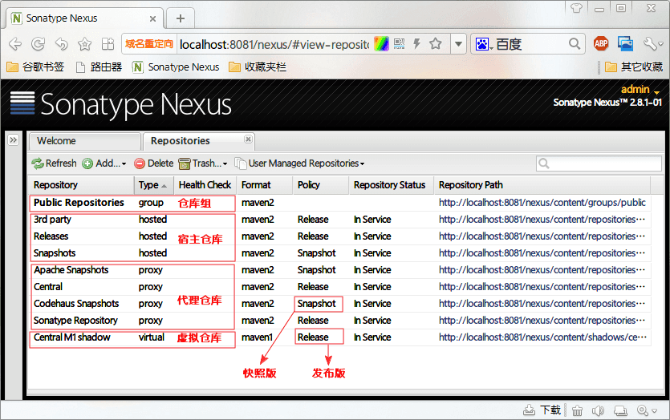
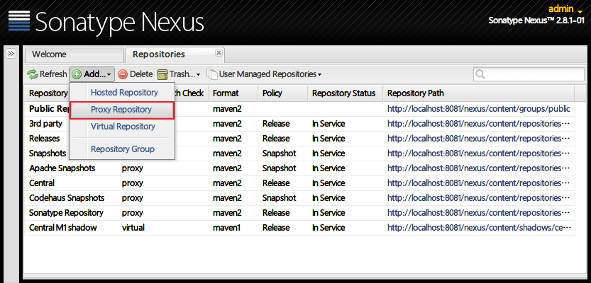
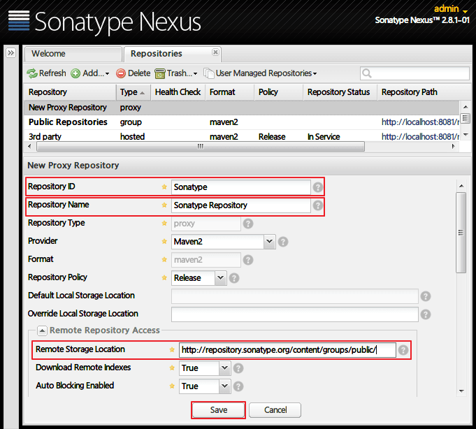
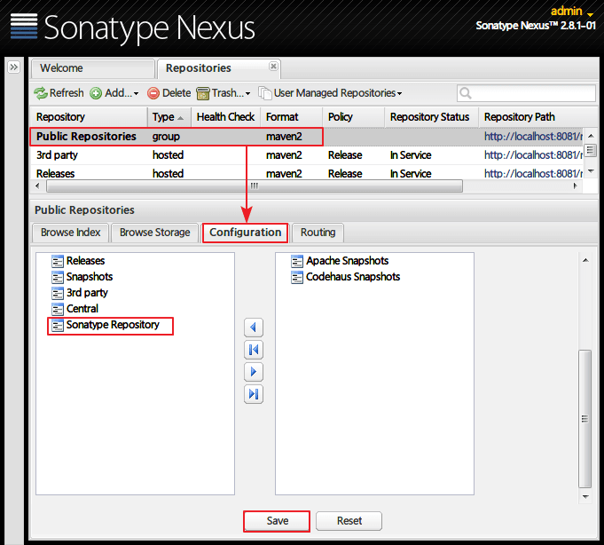
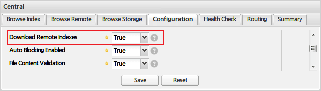
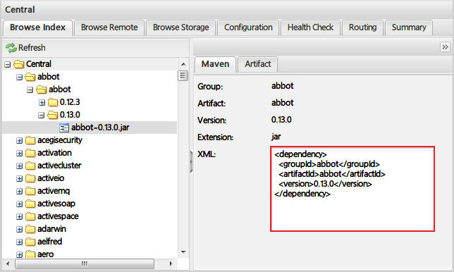
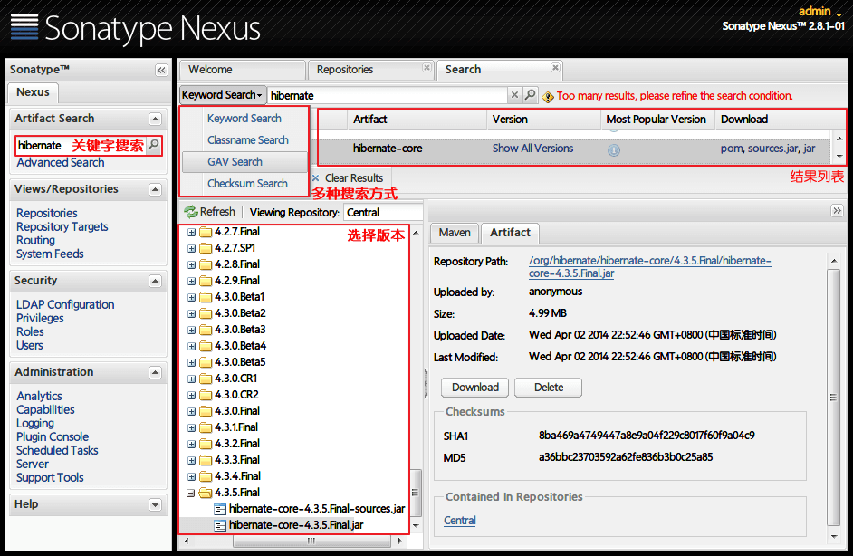

# 一：简介

Nexus是一个强大的Maven仓库管理器，它极大地简化了自己内部仓库的维护和外部仓库的访问。利用Nexus你可以只在一个地方就能够完全控制访问 和部署在你所维护仓库中的每个Artifact。Nexus是一套“开箱即用”的系统不需要数据库，它使用文件系统加Lucene来组织数据。Nexus 使用ExtJS来开发界面，利用Restlet来提供完整的REST APIs，通过m2eclipse与Eclipse集成使用。Nexus支持WebDAV与LDAP安全身份认证。

，可以通过SNAPSHOT版本控制，开进行模块间的高效依赖开发。

很多情况下项目的开发都是在内网进行的，连接不到maven仓库

# 二：使用Nexus搭建Maven本地仓库

https://www.cnblogs.com/lykbk/p/EFWERRER434343434343.html

 

- hosted 宿主仓库：主要用于部署无法从公共仓库获取的构件（如 oracle 的 JDBC 驱动）以及自己或第三方的项目构件；
- proxy 代理仓库：代理公共的远程仓库；
- virtual 虚拟仓库：用于适配 Maven 1；
- group 仓库组：Nexus 通过仓库组的概念统一管理多个仓库，这样我们在项目中直接请求仓库组即可请求到仓库组管理的多个仓库。

# 三：使用

添加代理仓库

点击菜单 Add - Proxy Repository ：

填写Repository ID - sonatype；Repository Name - Sonatype Repository；

Remote Storage Location - http://repository.sonatype.org/content/groups/public/ ，save 保存：

将添加的 Sonatype 代理仓库加入 Public Repositories 仓库组。选中 Public Repositories，在 Configuration 选项卡中，将 Sonatype Repository 从右侧 Available Repositories 移到左侧 Ordered Group Repositories，save 保存：

为了更好的使用 Nexus 的搜索，我们可以设置所有 proxy 仓库的 Download Remote Indexes 为 true，即允许下载远程仓库索引。

索引下载成功之后，在 Browse Index 选项卡下，可以浏览到所有已被索引的构件信息，包括坐标、格式、Maven 依赖的 xml 代码：

有了索引，我们就可以搜索了：

