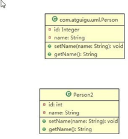
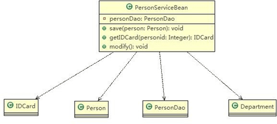
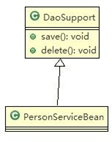
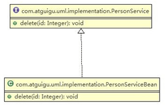
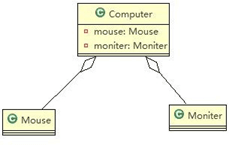
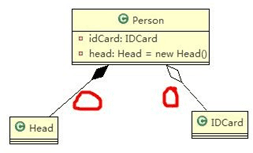

基本介绍：

1)    UML——Unified modeling language UML (统一建模语言)，是一种用于软件系统分析和设计的语言工具，它用于帮助软件开发人员进行思考和记录思路的结果

2)    UML 本身是一套符号的规定，就像数学符号和化学符号一样，这些符号用于描述软件模型中的各个元素和他们之间的关系，比如类、接口、实现、泛化、依赖、组合、聚合等，


分类：

1)   用例图(use case)

2)   静态结构图：类图、对象图、包图、组件图、部署图

3)   动态行为图：交互图（时序图与协作图）、状态图、活动图


类图是描述类与类之间的关系的，是 UML 图中最核心的

## 类图

用于描述系统中的类**(**对象**)**本身的组成和类**(**对象**)**之间的各种静态关系。

1)   类之间的关系：依赖、泛化（继承）、实现、关联、聚合与组合。

1)   类图简单举例

```java
public class Person{ //代码形式->类图
    private Integer id; private String name;
    public void setName(String name){ this.name=name;
    }
    public String getName(){ return name;
    }
}
```




### 依赖关系

 只要是在类中用到了对方，那么他们之间就存在依赖关系。如果没有对方，连编绎都通过不了。

```java
public class PersonServiceBean { 
    private PersonDao personDao;//类
    public void save(Person person){}
    public IDCard getIDCard(Integer personid){} 
    public void modify(){
        Department department = new Department();
    }
}
public class PersonDao{} 
public class IDCard{} 
public class Person{} 
public class Department{}
```

对应类图



1)   类中用到了对方

2)   如果是类的成员属性

3)   如果是方法的返回类型

4)   是方法接收的参数类型

5)   方法中使用到


### 泛化关系

泛化关系实际上就是继承关系，他是依赖关系的特例

```java
public abstract class DaoSupport{ 
    public void save(Object entity){}
    public void delete(Object id){}
}
public class PersonServiceBean extends Daosupport{
}
```



### 实现关系

```java
public interface PersonService { 
    public void delete(Interger id);
}
public class PersonServiceBean implements PersonService { 
    public void delete(Interger id){}
}
```



### 关联关系

类与类之间的联系

关联具有导航性，即双向关系或单项关系

关系具有多重性：1表示有且仅有一个，0……表示0个或者多个


### 聚合关系

聚合关系（Aggregation）表示的是整体和部分的关系，整体与部分可以分开。聚合关系是关联关系的特例，所以他具有关联的导航性与多重性。

如：一台电脑由键盘(keyboard)、显示器(monitor)，鼠标等组成；组成电脑的各个配件是可以从电脑上分离出来的，使用带空心菱形的实线来表示：



### 组合关系

组合关系：也是整体与部分的关系，但是整体与部分不可以分开。

再看一个案例：在程序中我们定义实体：Person 与 IDCard、Head, 那么 Head 和 Person 就是 组合，IDCard 和

Person 就是聚合。 

但是如果在程序中 Person 实体中定义了对 IDCard 进行级联删除，即删除 Person 时连同 IDCard 一起删除，那么 IDCard 和 Person 就是组合了.

```java
public class Person{ 
    private IDCard card;
    private Head head = new Head();
}
public class IDCard{}
public class Head{}
```




