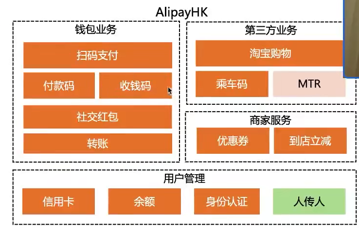
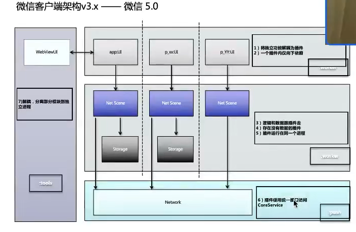
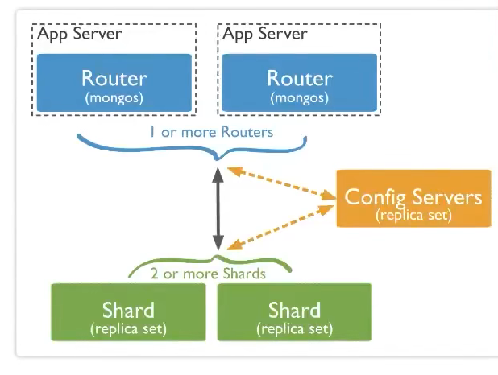
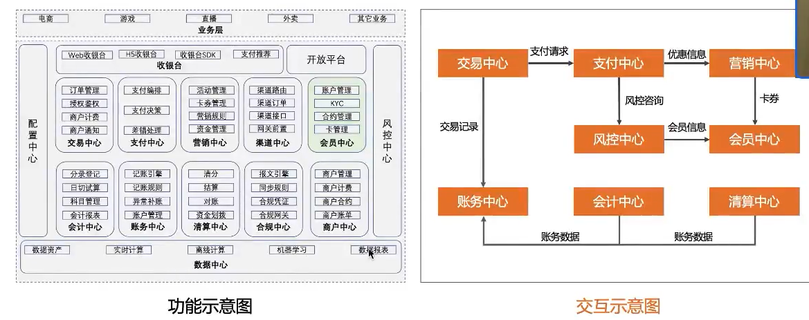
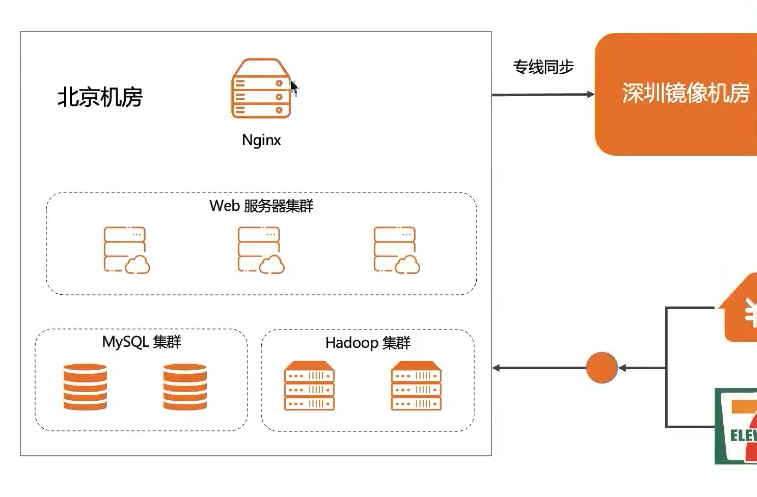
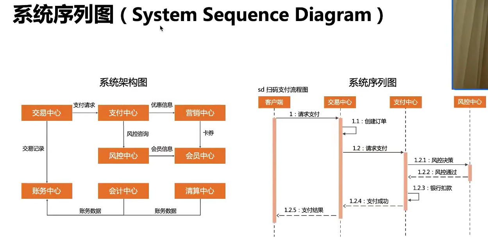

软件架构指软件系统的顶层结构，它定义了系统由哪些角色，角色之间的管理和运作规则；

顶层结构——系统角色——角色关系——角色之间运作规则

软件架构是动态的，

4+1 架构视图：

逻辑视图：系统提供给用户的功能，对应UML的class 和state diagrams；

处理视图：系统处理过程，对应UML的sequence和activity diagrams

开发视图；程序员角度看系统的逻辑，对应UML的package diagrams

物理视图：系统工程师的角度的物理组成

场景视图：用户角度看系统需求实现的需求

实际中很少用4+1视图描述的，

业务架构：

使用场景：

产品人员规划业务；给高P汇报业务；给新员工培训；

画图技巧：

通过不同颜色来标识业务状态；业务分组管理；

长短一般没有实际意义；

客户端架构，前端架构：

整体架构设计；

通过不同颜色标识不同角色；通过连线标识关系；自顶向下分层；

系统架构（后端逻辑架构）

支付中台总体架构：

部署架构：

网络加速点：

系统序列图：

