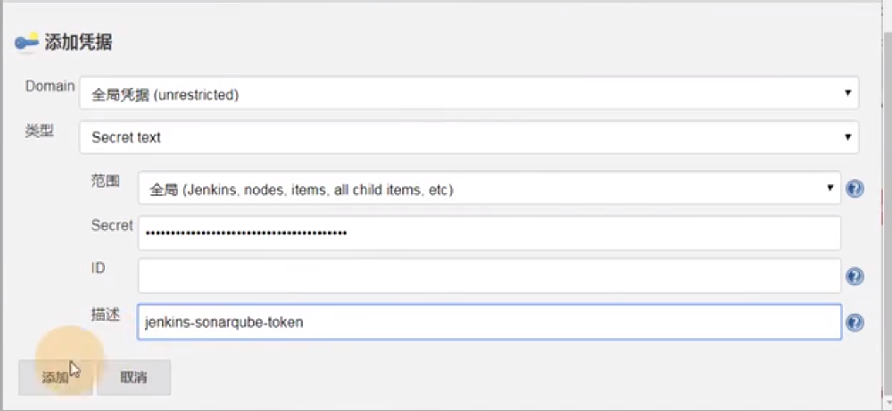
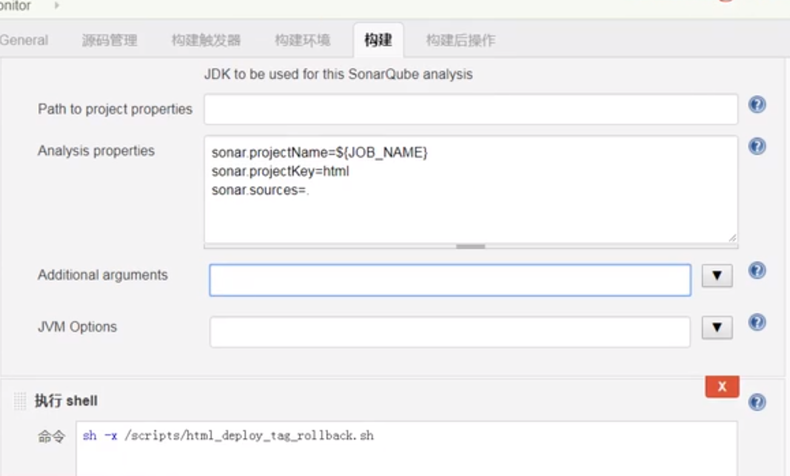

SonarQube是一个开源的代码质量管理系统，用于检测代码中的错误，漏洞和代码规范，它可以与现有的GitLab，Jenkins集成，以便在项目拉取后进行连续的代码检查

依赖于MYSQL5.6以上


# 一：安装：

1：环境准备

```shell
systemctl stop firewalld
systemctl disable firewalld
setenforce 0
```

安装JDK

安装mysql数据库

```shell
# 启动数据库
systemctl start mysqld
# 给数据库配置密码
mysql -uroot -pXXX -e "CREATE DATABASE sonar DEFAULT CHARACTER SET utf8;"
```

创建一个sonar的数据库

查看这个库

安装sonar

解压，配置用户，授权


配置sonar


登录：IP:9000

初始用户admin

密码admin


生成token令牌


下载Sonar-scanner客户端进行扫描


## 2：插件

汉化插件

1.页面上找到Administration > Marketplace -->搜索框chinese，出现一个Chinese Pack，然后点击install

⒉界面会提示reset重后SonarQube 重启再次打开则为汉化。

安装代码检查插件

默认已经安装C Java Python Php Js等代码的质量分析工具。可以根据项目自行安装html css go

Ps :一个项目如果使用了java css js html，那么默认情况下仅会检测，java.js等代码的漏洞和bug.

如果安装了htmi.I css等插件，那么则会检查该项目代码中java js html css等代码的漏洞和bug。

线上安装也可以，不过时间太长

下载安装包，解压，授权，然后重启sonarQube


# 二：项目分析

在Jenkins安装sonar-scanner客户端代码扫描工具

配置客户端与服务端的链接

```properties
#---- Default SonarQube server
sonar.host.url=http ://sonar.oldxu .com: 9000
sonar.login=f4f64f24363022d4840eefib41cb37d62f6fbfd6
#---- Default source code encoding
sonar.sourceEncoding=UTF-8
```

配置开启token


执行扫描命令；

Sonar中就可以出现


Java的项目直接通过Maven进行检测

执行命令

```shell
mvn sonar:sonar
```

如何通过JenKins将代码抓过来，扫描，扫描之后再编译，编译之后再推送，

Jenkins安装sonarQube插件

在Jenkins上配置SonarQube服务端

系统管理——系统设置-->sonarQube(告诉enkins SonarQubeServers服务端地址)

Name 可以随意填写

URL添加SonarQube的地址

token添加—个Secret text填写之前安装SonarQube的Token

PS:如果SonarQube没有在配置->权限-->启用Force user authentication则可忽略进行token验证操作。



在Jenkins上配置Sonar-Scanner工具路径

系统管理→全局工具配置（告诉enkins SonarScanner在本地哪个路径)1.Name可以随意填写，但最好有规范
2.SONAR_RUNNER_HOME填写sonar-scanner本地路径PS:如果不配置sonar-scanner路径，则无法进行代码扫描

配置发布项目前先扫描sonar项目




Jenkins集成Git或则SVN

## Maven项目集成Sonar

Maven项目可以使用Sonar-Scanner工具，也可以使用Maven的方式进行检测，两种方式任选其一即可。

方式1：通过Sonar-Scanner方式进行代码质检


方式二：Maven方式


# 三：常见审查提示

### 认知复杂度过高

认知复杂度是衡量一个方法的控制流程有多困难去理解。具有高认知复杂度的方法将难以维护。sonar要求复杂度要在15以下

Cognitve Complexity的计算：

  （1）&&、||  条件判断符号 +1

  （2）if、else if、else、switch  分支语句+1

  （3）for、while、do while  循环语句+1

  （4）catch  捕获异常语句+1

  （5）break、continue  中断语句+1

  （6）如果if、for、while、do while、catch存在嵌套时，里层的语句相对于外层+1。


修改思路：

  1.减少if、for、while、do while、catch关键字嵌套，可以把深层次的代码抽象成方法。

  2.如果大量相似的if-else语句可以考虑用switch代替

  3.没啥规律就看见if、for等关键字提成方法


