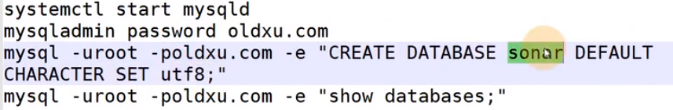
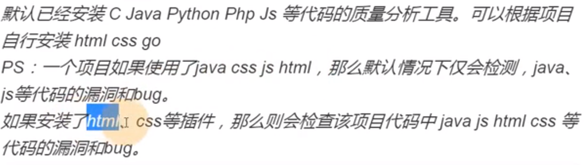
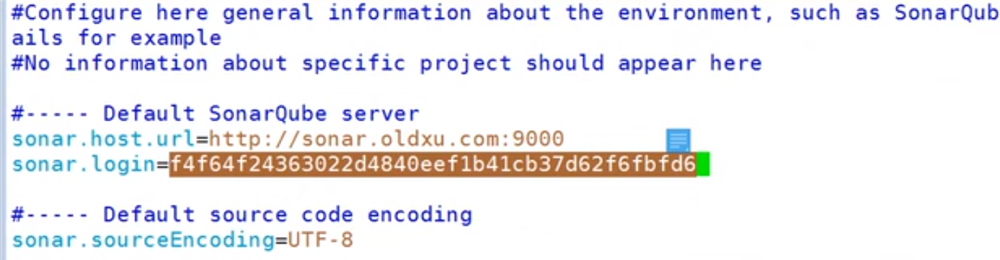
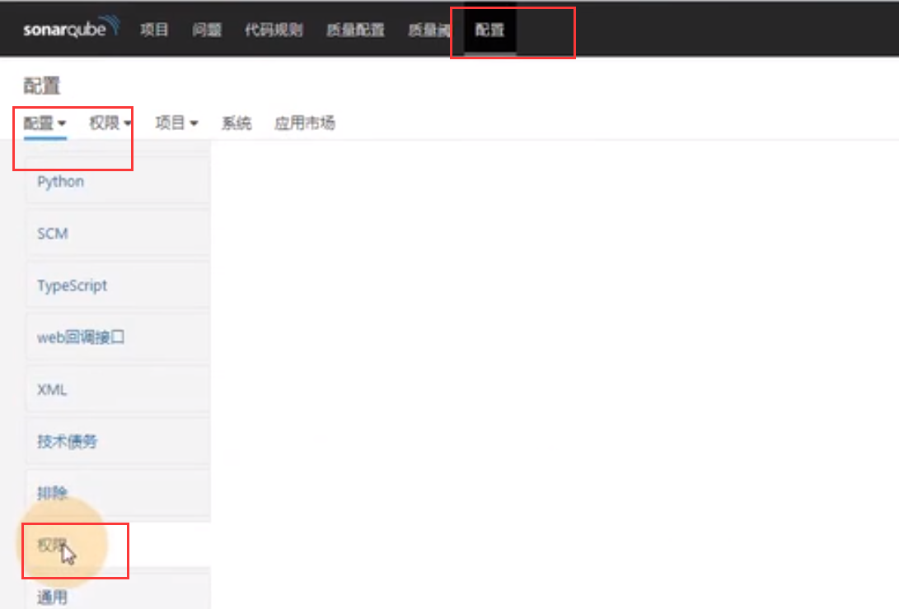
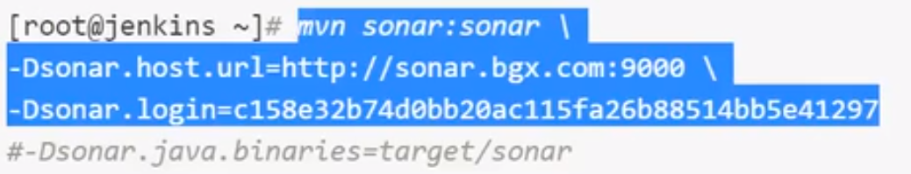
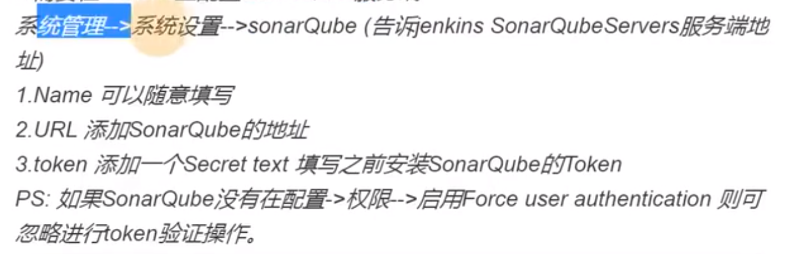
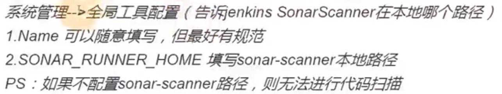
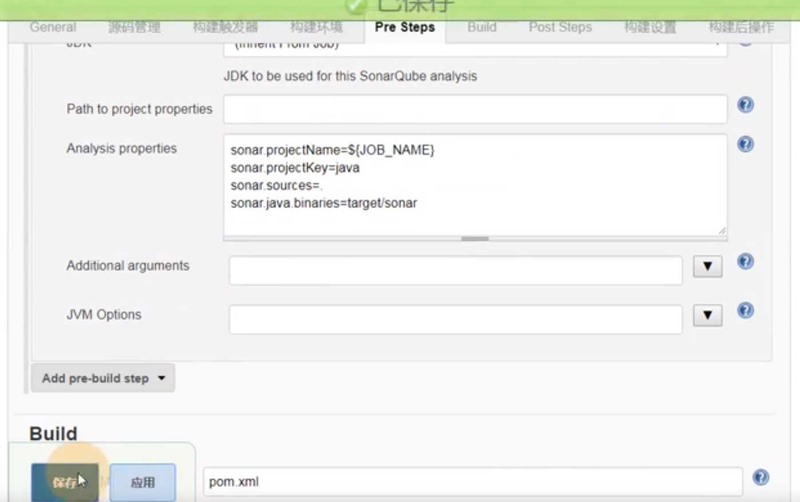
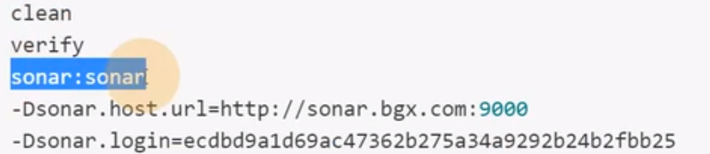

SonarQube是一个开源的代码质量管理系统，用于检测代码中的错误，漏洞和代码规范，它可以与现有的GitLab，Jenkins集成，以便在项目拉取后进行连续的代码检查

依赖于MYSQL5.6以上

安装：

1：环境准备

安装JDK

安装mysql数据库

启动数据库

给数据库配置密码

创建一个sonar的数据库

查看这个库

安装sonar

解压，配置用户，授权

配置sonar

登录：IP:9000

初始用户admin

密码admin

生成token令牌

下载Sonar-scanner客户端进行扫描

插件

汉化插件

安装代码检查插件

线上安装也可以，不过时间太长

下载安装包，解压，授权，然后重启sonarQube

项目分析

在Jenkins安装sonar-scanner客户端代码扫描工具

配置客户端与服务端的链接

配置开启token

执行扫描命令；

Sonar中就可以出现

Java的项目直接通过Maven进行检测

执行命令

如何通过JenKins将代码抓过来，扫描，扫描之后再编译，编译之后再推送，

Jenkins安装sonarQube插件

在Jenkins上配置SonarQube服务端

在Jenkins上配置Sonar-Scanner工具路径

配置发布项目前先扫描sonar项目

Jenkins集成Git或则SVN

## 配置Maven项目集成Sonar

Maven项目可以使用Sonar-Scanner工具，也可以使用Maven的方式进行检测，两种方式任选其一即可。

方式1：通过Sonar-Scanner方式进行代码质检

方式二：Maven方式

