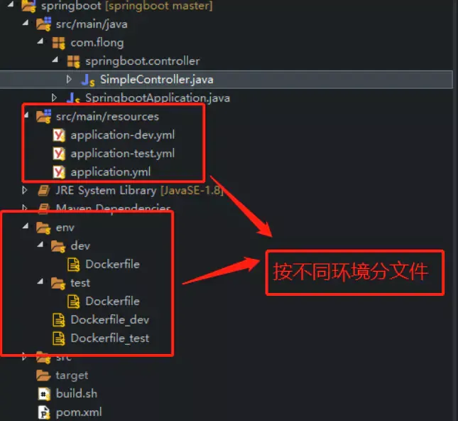

DevOps（Development和Operations的组合词）是一组过程、方法与系统的统称，用于促进开发（应用程序/软件工程）、技术运营和质量保障（QA）部门之间的沟通、协作与整合，它是一种重视“软件开发人员（Dev）”和“IT运维技术人员（Ops）”之间沟通合作的文化、运动或惯例。透过自动化“软件交付”和“架构变更”的流程，来使得构建、测试、发布软件能够更加地快捷、频繁和可靠。

https://library.prof.wang/handbook/h/hdbk-MWnS99ThmLVDi7U5mVFrB9

涉及的内容

Linux环境：JDK，Maven，Git，

Docker安装GitLab

Docker创建NetWork网络

Docker安装Registry私服

Docker安装Jenkins

