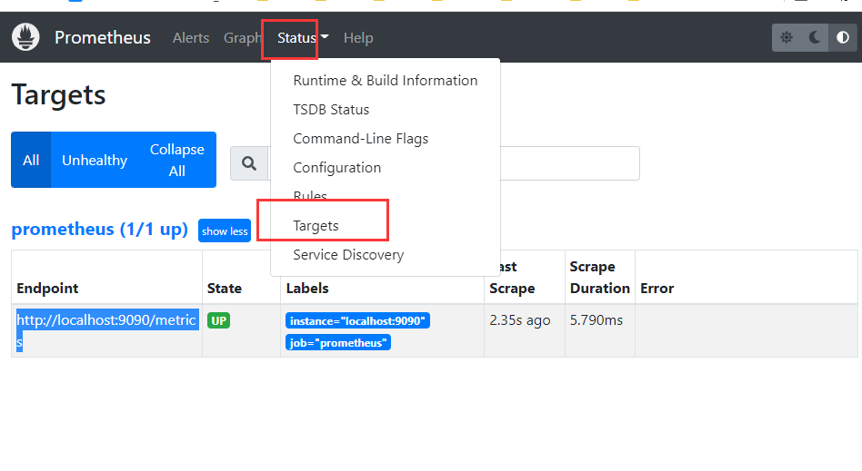

# 一：简介

`Prometheus`是一个开源的系统监控和报警系统，现在已经加入到CNCF基金会，成为继k8s之后第二个在CNCF托管的项目，在kubernetes容器管理系统中，通常会搭配prometheus进行监控，同时也支持多种`exporter`采集数据，还支持`pushgateway`进行数据上报，Prometheus性能足够支撑上万台规模的集群。监控时可以使用Grafana就行可视化；同样可以监控云上系统；=

样本：在时间序列中的每一个点称为一个样本（sample），样本由以下三部分组成：

- 指标（`metric`）：指标名称和描述当前样本特征的 labelsets；
- 时间戳（`timestamp`）：一个精确到毫秒的时间戳；
- 样本值（`value`）： 一个 folat64 的浮点型数据表示当前样本的值。

**表示方式**：通过如下表达方式表示指定指标名称和指定标签集合的时间序列：`<metric name>{<label name>=<label value>, ...}`

例如，指标名称为 `api_http_requests_total`，标签为 `method="POST"` 和 `handler="/messages"` 的时间序列可以表示为：`api_http_requests_total{method="POST", handler="/messages"}`

它是基于时间序列数据进行记录的：

特点：

多维度的数据模型；


原理架构图：


## 指标Metrics

1：CPU利用率：node_cpu_seconds_total

计算5min为取样每秒的瞬时利用率

```basic
100 - avg (irate(node_cpu_seconds_total{job="node",mode="idle"}[5m])) by (instance) * 100
```

5m是range vector,表示使用记录的上一个5分钟的数据.

irate是瞬时变化率,适合变化较频繁的metric.

avg是因为有多个metrics(分别是每核的)

2：CPU饱和度：node_load*

后面的*有1 5 15,表示多少分钟.

该metric和核数有关,查看核数可以使用:

```mipsasm
count by (instance)(node_cpu_seconds_total{mode="idle"})
```

3：内存使用：node_memory_*
列出空闲内存

```lisp
(node_memory_MemTotal_bytes - (node_memory_MemFree_bytes + node_memory_Cached_bytes + node_memory_Buffers_bytes)) / node_memory_MemTotal_bytes * 100
```

4：内存饱和度

/proc/vmstat

node_vmstat_pswpin

node_vmstat_pswpout

```lisp
1024 * sum by (instance) (
(rate(node_vmstat_pgpgin[1m])
       + rate(node_vmstat_pgpgout[1m]))
)
```

算出每分钟的变化量
rate是平均变化率,相比irate适合变化幅度不剧烈的数据.

5：磁盘使用率：node_filesystem_*

使用率:

```fsharp
(node_filesystem_size_bytes{mountpoint="/"} - node_filesystem_free_bytes{mountpoint="/"}) / node_filesystem_size_bytes{mountpoint="/"} * 100
```

可以用=~匹配正则 相对的有!~

```scss
predict_linear(node_filesystem_free_bytes{job="node"}[1h], 4*3600) < 0
```

通过1h的估计量 看看4h后是否会用完

6：exporter的可用性监控

可以使用up.

```x86asm
up{job="node"}
```

返回1表示node_exporter存活.


# 二：安装

直接下载：启动，访问http://localhost:9090/

查看监控目标：



采集数据可以通过：http://127.0.0.1:9090/metrics 

进行查看；


可视化：使用grafana

