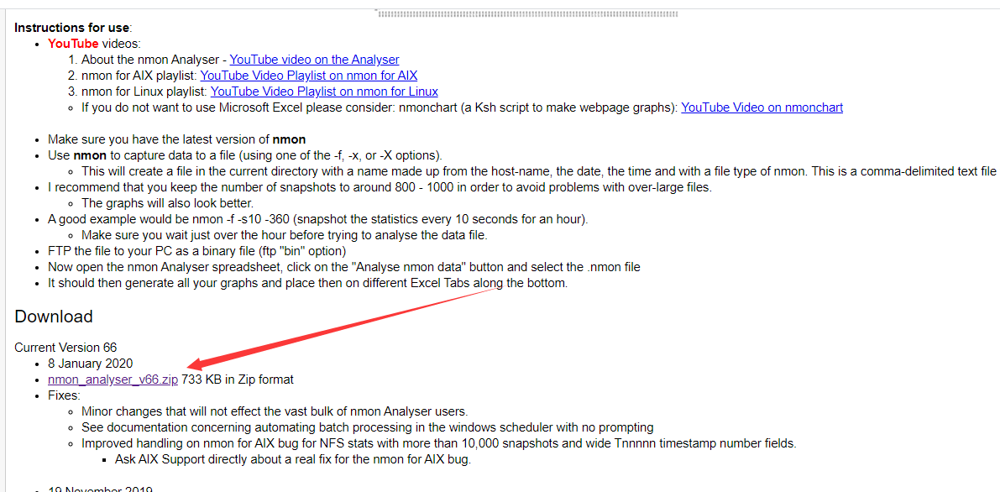
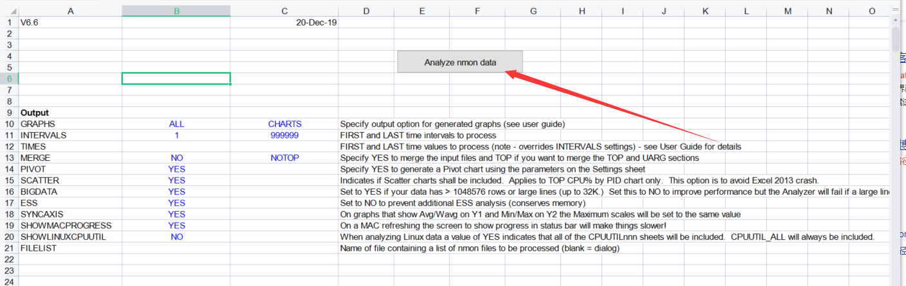
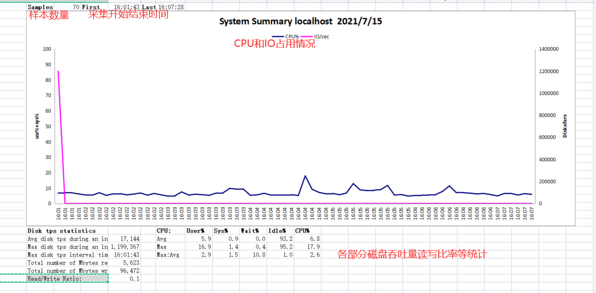
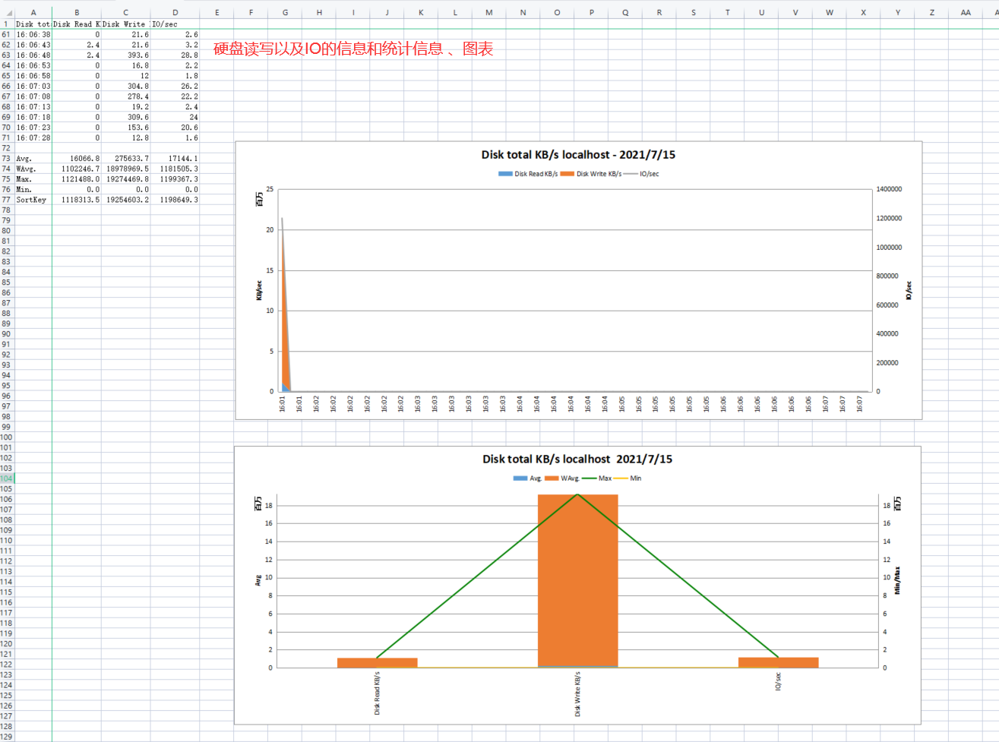
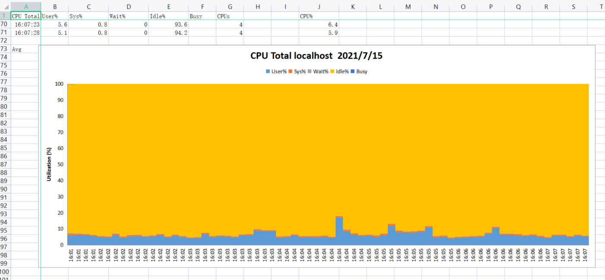
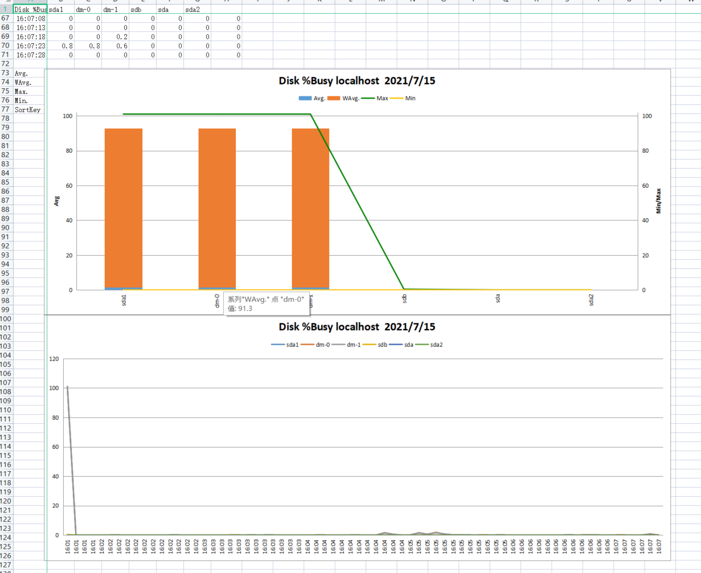
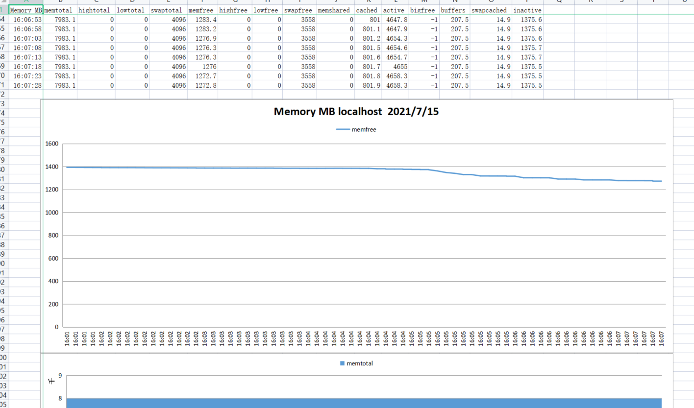
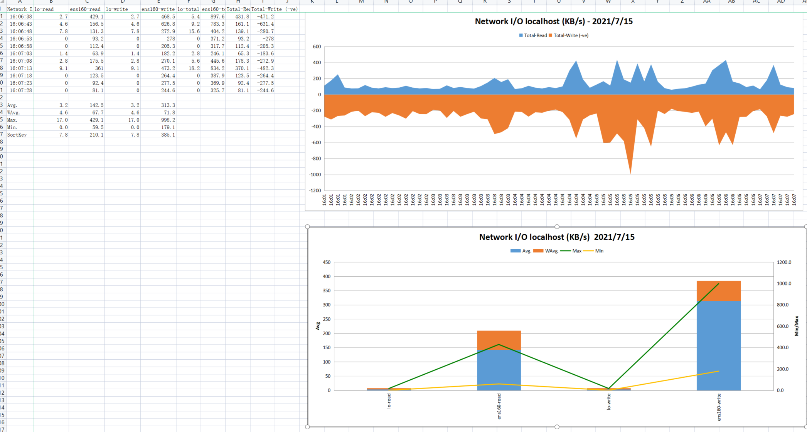
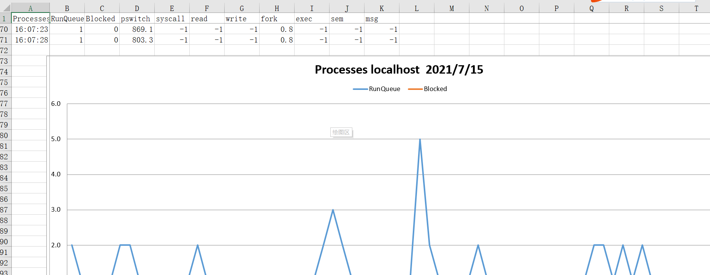

# 一：安装与下载

路径：/opt/nmon

将王亚运给的包上传上去；

没有包请找到对应版本下载解压安装；

1：查看linux内核版本

```shell
cat /proc/version
uname -a
```

2：下载

官网下载：[http://nmon.sourceforge.net/pmwiki.php?n=Site.Downlo](http://nmon.sourceforge.net/pmwiki.php?n=Site.Download) 

wget下载：

```shell
 wget https://nchc.dl.sourceforge.net/project/nmon/nmon16d_x86.tar.gz
```

然后编写脚本启动文件restart_nmon.sh

```shell
#!/bin/bash
#这个路径为包的路径
NMON_PATH="/opt/nmon"

echo "Monitor Current Nmon Running Process..."
ps x | grep "nmon" | grep -v "grep" | grep -v "restart_nmon"

echo "Kill Old Nmon Process..."
pids=`ps x | grep "nmon" | grep -v "grep" | grep -v "restart_nmon" | awk '{print $1}'`
echo "${pids}"

if [ -z "${pids}" ]; then
  echo 'pids Length is 0'
else
  kill -9 ${pids}
fi


echo "Remove Old Nmon Result File..."
rm -rf ${NMON_PATH}/*.nmon

echo "Start Nmon Monitor..."
#5秒监控一次 5*2400次时间的监控
${NMON_PATH}/nmon_linux_64 -F ${NMON_PATH}/env_monitor_data.nmon -s 5 -c 2400
```

给两个文件赋权，为了方便，我直接赋权了777，一会再改

```shell
chmod 751 restart_nmon.sh
chmod 751 nmon_linux_64
```

执行脚本文件：

```shell
./restart_nmon.sh
```

此时已经在收集信息了

如果想要停止

```shell
ps -ef | grep nmon
```


```shell
kill -9 11462
```

收集信息会在同目录下生成一个名为 ` env_monitor_data.nmon ` 的文件，即为收集的数据；

# 二：解析文件

方式一：数据信息

执行命令

```shell
sort env_monitor_data.nmon > nmon_env_monitor_data.csv
```

可以将文件转换成对应的csv文件，下载到本地打开即可；

方式二：生成图表信息

下载 解析工具 nmon -analyser ：http://nmon.sourceforge.net/pmwiki.php?n=Site.Nmon-Analyser 并解压



压缩包里有两个文件，pdf为说明书；.xlsm为解析工具；

我个人的电脑Office打不开该文件，故下载使用的WPS

1：WPS打开



如果提示没有启用宏；请下载安装宏插件(VBA for WPS)地址：https://pan.baidu.com/s/1QzW4ebQxYQtxgVfkTmxVJw

然后关闭重新打开并启用宏；

点击Analysis nmon data ——>选择下载的.nmon文件，即可自动转换；生成一个 ` env_monitor_data.nmon.xlsx ` 文件；

1：Office打开

同样需要启用宏；

文件——选项——信任中心——信任中心设置——宏设置——启用所有宏


# 三：文件解读

## 各Sheet表单的含义

| sheet名称          | sheet含义                                                    |
| ------------------ | ------------------------------------------------------------ |
| SYS_SUMM           | 系统汇总,蓝线为cpu占有率变化情况,粉线为磁盘IO的变化情况；    |
| AAA                | 关于操作系统以及nmon本身的一些信息；                         |
| BBBB               | 系统外挂存储容量以及存储类型；                               |
| BBBC               | 系统外挂存储位置、状态以及描述信息；                         |
| BBBD               | 磁盘适配器信息；（包含磁盘适配器名称以及描述）               |
| BBBE               | 包含通过lsdev命令获取的系统设备及其特征，显示vpaths和hdisks之间的映射关系； |
| BBBG               | 显示磁盘组详细的映射关系；                                   |
| BBBL               | 逻辑分区（LPAR）配置细节信息；                               |
| BBBN               | 网络适配器信息；                                             |
| BBBP               | vmtune, schedtune, emstat和lsattr命令的输出信息；            |
| CPUnn              | 显示执行之间内CPU占用情况，其中包含user%、sys%、wait%和idle%； |
| CPU_ALL            | 所有CPU概述，显示所有CPU平均占用情况，其中包含SMT状态；      |
| CPU_SUMM           | 每一个CPU在执行时间内的占用情况，其中包含user%、sys%、wait%和idle%； |
| DGBUSY             | 磁盘组每个hdisk设备平均占用情况；                            |
| DGREAD             | 每个磁盘组的平均读情况；                                     |
| DGSIZE             | 每个磁盘组的平均读写情况（块大小）；                         |
| DGWRITE            | 每个磁盘组的平均写情况；                                     |
| DGXFER             | 每个磁盘组的I/O每秒操作；                                    |
| DISKBSIZE          | 执行时间内每个hdisk的传输块大小；                            |
| DISKBUSY           | 每个hdisk设备平均占用情况；                                  |
| DISKREAD           | 每个hdisk的平均读情况；                                      |
| DISKWRITE          | 每个hdisk的平均写情况；                                      |
| DISKXFER           | 每个hdisk的I/O每秒操作；                                     |
| DISKSERV           | 本sheet显示在每个收集间隔中hdisk的评估服务时间（未响应时间） |
| DISK_SUMM          | 总体disk读、写以及I/O操作；                                  |
| EMCBSIZE/FAStBSIZE | 执行时间内EMC存储的传输块大小；                              |
| EMCBUSY/FAStBUSY   | EMC存储设备平均占用情况；                                    |
| EMCREAD/FAStREAD   | EMC存储的平均读情况；                                        |
| EMCWRITE/FAStWRITE | EMC存储的平均写情况；                                        |
| EMCXFER/FAStXFER   |                                                              |
| EMCSERV/FAStSERV   |                                                              |
| ESSBSIZE           | 本sheet记录在系统中每个vpaths下读写操作的平均数据传输大小 (blocksize) Kbytes |
| ESSBUSY            | 本sheet记录使用ESS系统的每个vpaths下的设备繁忙情况           |
| ESSREAD            | 本sheet记录在系统中每个vpaths下读取操作的 data rate (Kbytes/sec) |
| ESSWRITE           | 本sheet记录在系统中每个vpaths下写入操作的 data rate (Kbytes/sec) |
| ESSXFER            | 本sheet记录在系统中每个vpaths下每秒的IO操作                  |
| ESSSERV            | 本sheet显示在每个收集间隔中vpaths的评估服务时间（未响应时间） |
| FILE               | 本sheet包含nmon内核内部的统计信息的一个子集，跟sar报告的值相同 |
| FRCA               |                                                              |
| IOADAPT            | 对于BBBCsheet每个IO适配器列表，包含了数据传输速度为读取和写入操作（千字节/秒）和I / O操作执行的总数量 |
| JFSFILE            | 本sheet显示对于每一个文件系统中，在每个间隔区间正在被使用的空间百分比 |
| JFSINODE           | 本sheet显示对于每一个文件系统中，在每个间隔区间正在被使用的inode百分比 |
| LARGEPAGE          | 本图表显示Usedpages和Freepages随着时间的变化                 |
| LPAR               |                                                              |
| MEM                | 本sheet主图上显示空闲实存的数量                              |
| MEMUSE             | 除 %comp参数外,本sheet包含的所有项都和vmtune命令的报告中一样 |
| MEMNEW             | 本sheet显示分配的内存片信息，分三大类：用户进程使用页，文件系统缓存，系统内核使用页 |
| NET                | 本sheet显示系统中每个网络适配器的数据传输速率（千字节/秒）   |
| NETPACKET          | 本sheet统计每个适配器网络读写包的数量；这个类似于netpmon –O dd 命令 |
| NFS sheets         |                                                              |
| PAGE               | 本sheet统计相关页信息的记录                                  |
| PROC               | 本sheet包含nmon内核内部的统计信息。其中RunQueue和Swap-in域是使用的平均时间间隔，其他项的单位是比率/秒 |
| PROCAIO            | 本sheet包含关于可用的和active的异步IO进程数量信息.           |
| TOP                |                                                              |
| UARG               |                                                              |
| WLM sheets         |                                                              |
| ZZZZ               | 本sheet自动转换所有nmon的时间戳为现在真实的时间，方便更容易的分析 |

## 重要sheet页及其参数

1：SYS_SUMM



User% ：在用户模式下执行程序所使用的CPU百分比

Sys%：显示在内核模式下执行的程序所使用的 CPU 百分比；

Wait%：显示等待 IO 所花的时间百分比；

Idle%：显示 CPU 的空闲时间百分比；


2：DISK_SUM



Disk Read kb/s：每个磁盘执行采样数据；（磁盘设备的读速率）

Disk Write kb/s：每个磁盘执行采样数据；（磁盘设备的写速率）

IO/sec：每秒钟输出到物理磁盘的传输次数；


3：CPU_SUM：CPU个情况的使用




4：硬盘分区繁忙程度



5：内存使用情况




6：网络状况

NET页：

统计每个适配器网络读写包的情况



BBBN页：

MTU：网络上传输的最大数据包；

Mbit：带宽


7：进程使用情况



RunQueue：运行队列中的内核线程平均数

Blocked ：阻塞队列

pswitch：上下文开关个数 

syscall：系统调用总数.

read：系统调用中read的数量

write：系统调用中write的数量.

fork：系统调用中fork的数量

rcvint：tty接收中断的数量. 

xmtint：tty传输中断的数量. 


