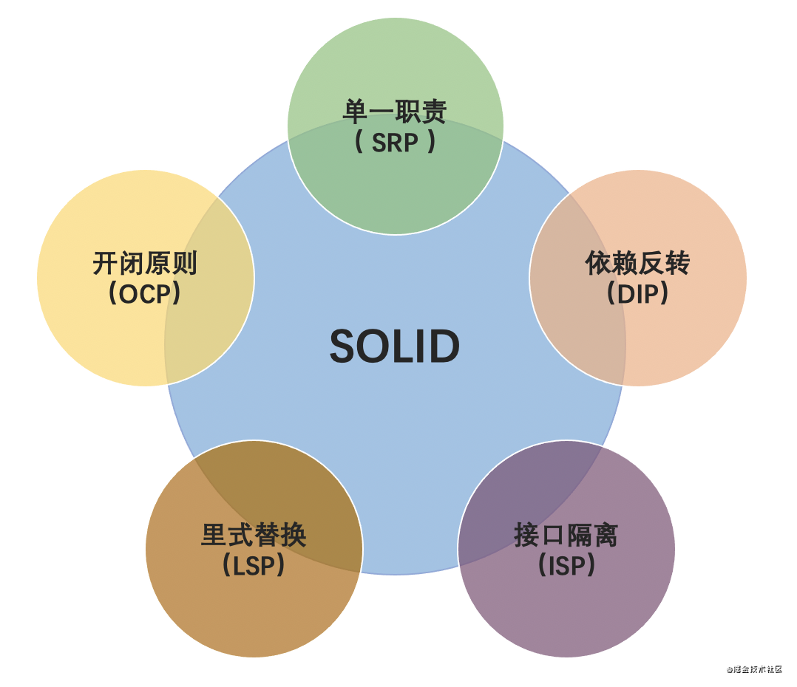

代码堆砌式编程

缺乏有效代码质量监督机制

必须通过不断的重构代码

大型重构：对顶层代码设计的重构，包括：系统，模块，代码结构，类与类之间的关系等。

重构的手段有：分层、模块化、解耦、抽象可复用组件等等。

这类重构涉及的代码改动会比较多，影响面会比较大，所以难度也较大，耗时会比较长，引入bug的风险也会相对比较大。

小型重构：对代码细节的重构，

# 如何重构

SOLID原则：



设计模式：

代码分层：


1：提炼方法

2：多台代替冗长的条件判断


# 代码优化

## 1：静态常量优化

2：魔法值优化：

所谓魔法值，是指在代码中直接出现的数值，但是这些数值可能没有明确是什么意思，或者距离对应的太远，可读性不好；

可以固定静态常量：

```java
static final int LENGTH_OF_ARRAY= 20;
```

3：太多，可以组合使用代码质量管理平台进行规范；

Sonar或阿里巴巴规范

## 格式化统一

https://www.cnblogs.com/lsysy/p/9954785.html

