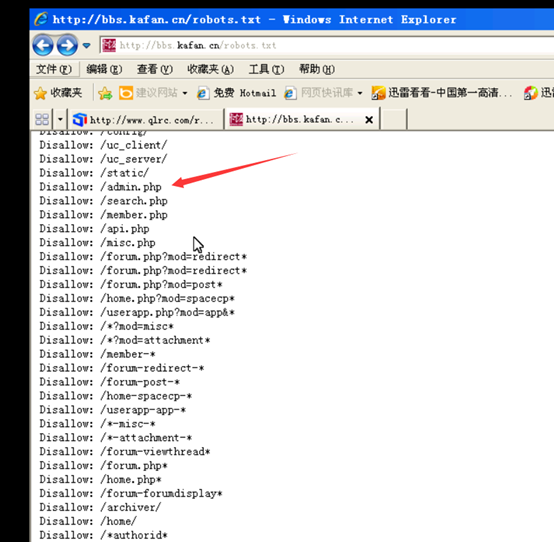
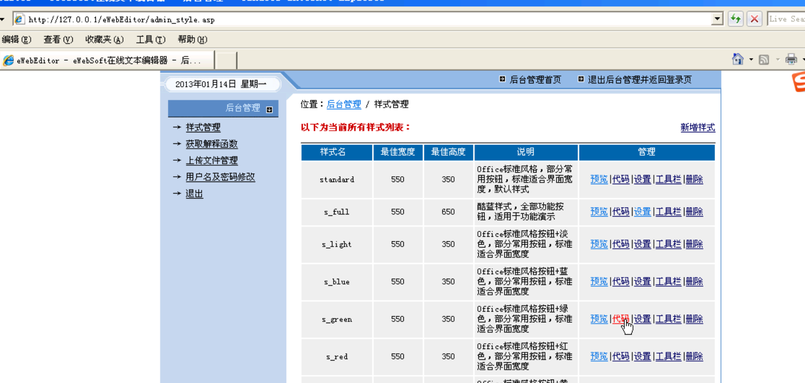
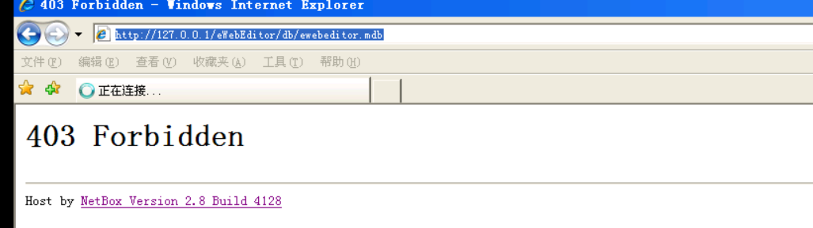
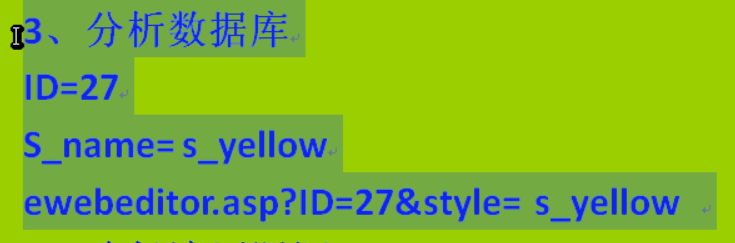

Intitle:搜索网页标题含有的关键字

Intext:搜索网页正文包含的关键字或者词

Site:对特定站点的搜索

Inurl:对url关键词的搜索

Cache:缓存

Filetype：:对特定的文件

2：Robots.txt

3：APPSCAN安装使用

4：AWVS安装与使用

5：Ewebitor利用：

常规渗透

默认后台地址：

ewebeditor/admin_login.asp

后缀可能有很多：asp,asa,cer,aspx.php,aaspsp

利用默认数据库下载

db/ewebeditor.mdb

3：分析数据库：

路径遍历

