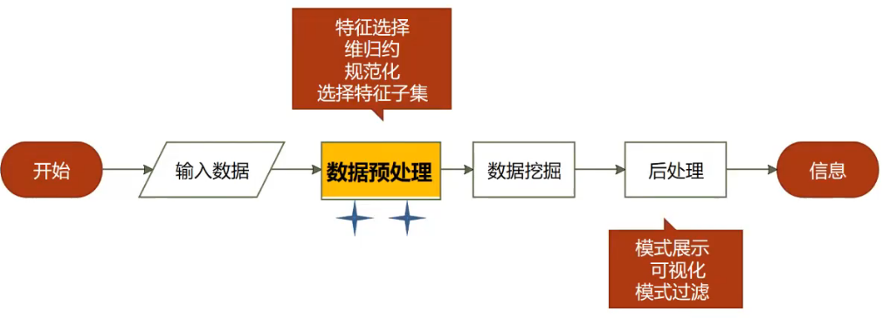
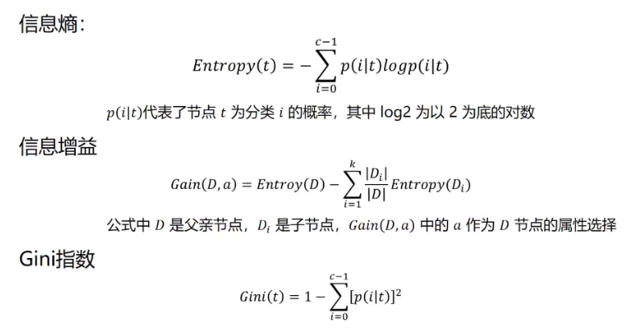
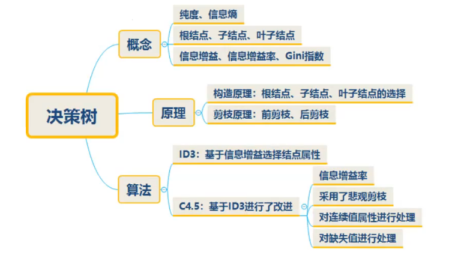
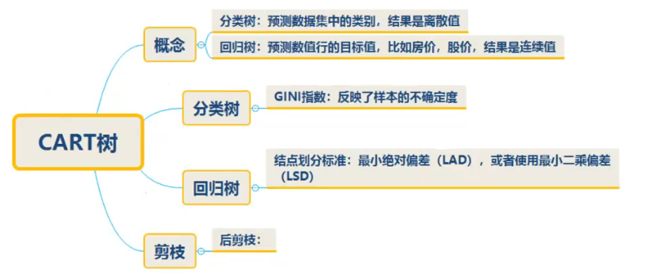
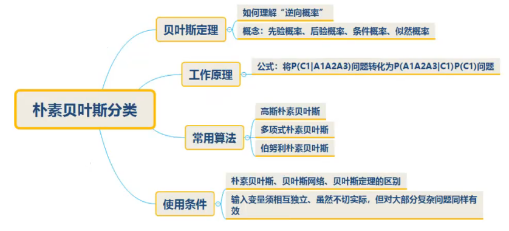
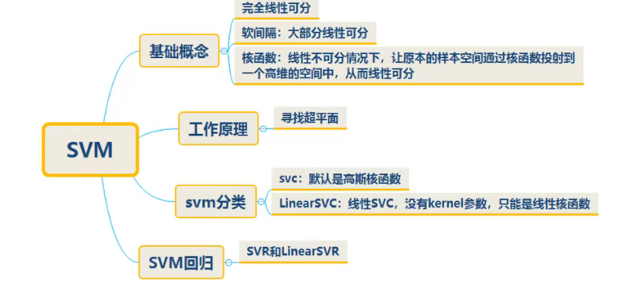
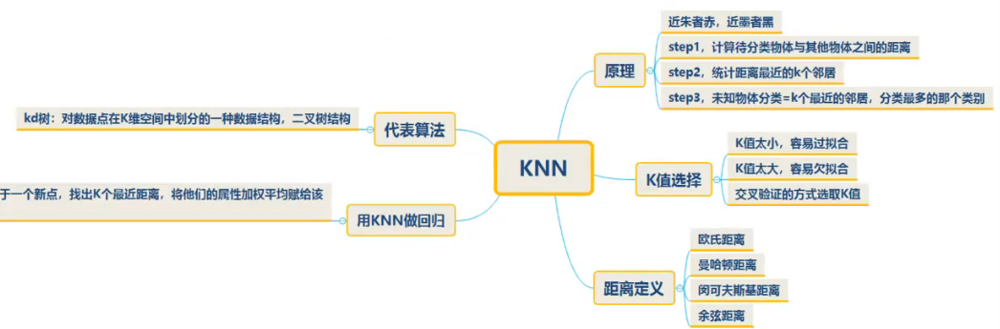
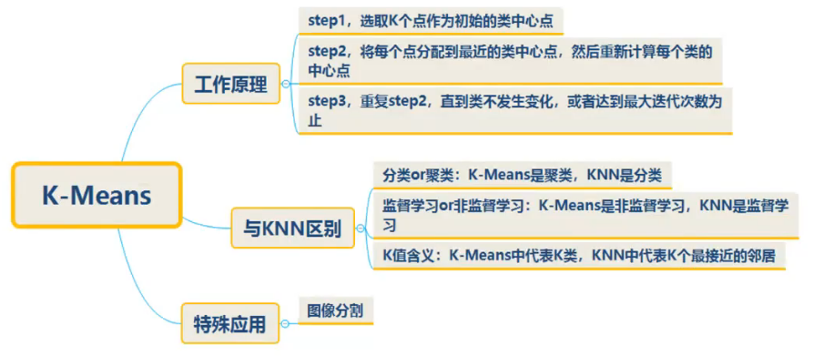
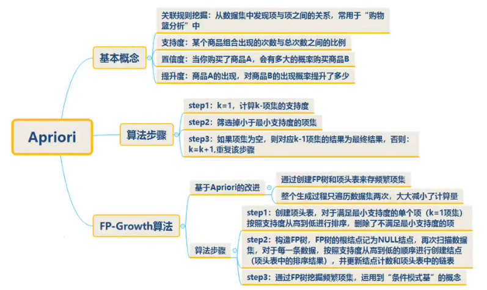
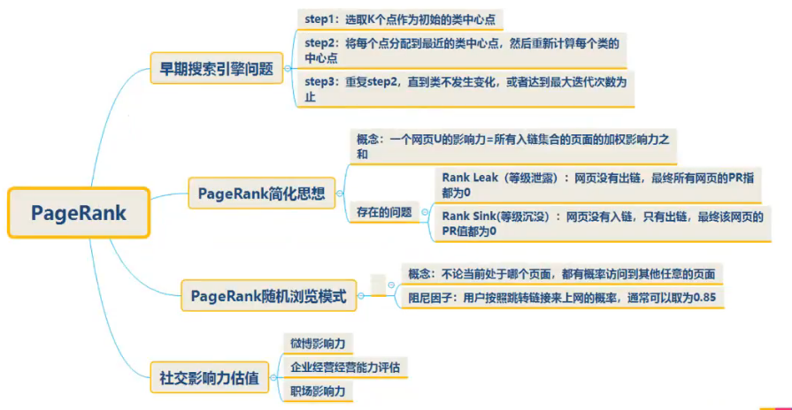

统计学

信息论信息检索

机器学习模式识别

## 基本流程

1：数据预处理：

数据有：冗余，海量，缺失，相关

具体方法：

聚集:两个或多个对象合并成单个对象

抽样:选择对象子集

维归约:通过创建新属性，将一些旧属性合并在一起来降低数据集的维度

特征子集选择

特征创建:由原来的属性创建新的属性集

离散化和二元化:

变量变换:

2：基本应用：

预测任务：

描述任务：

主要任务：

聚类分析：顾客分组；维度不同有多种不同的分类方法；

关联分析：用有效的方式提取

异常监测：网络工具和欺诈监测

### 经典算法

决策树一：

逆向概率：摸球预测桶里有多少

