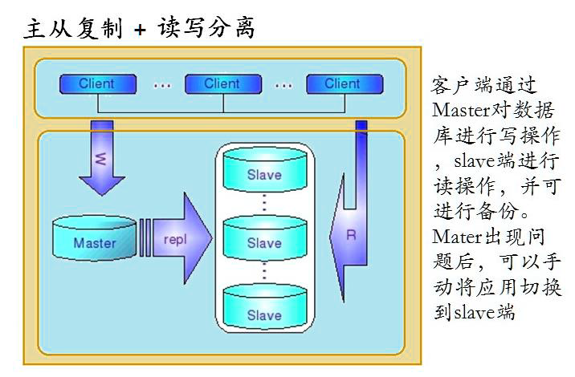
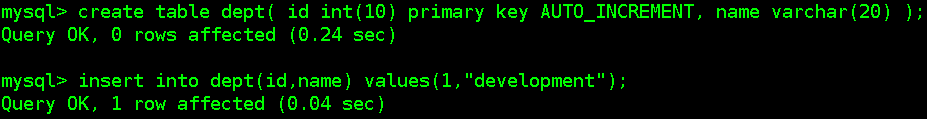
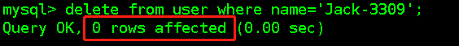
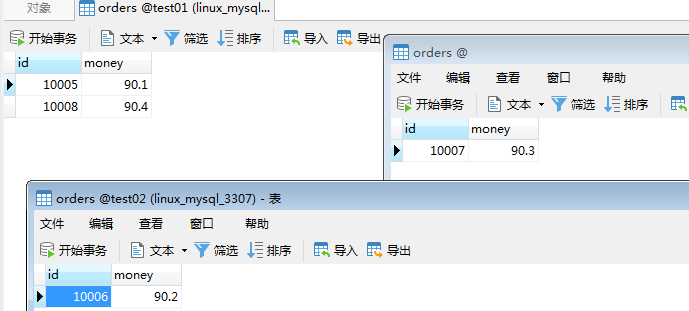
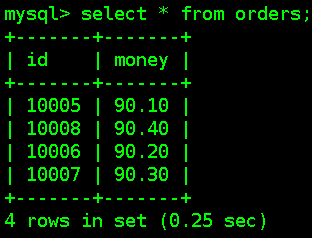

# Mycat

## Mycat背景

Mycat的前身是阿里巴巴大名鼎鼎的Cobar，Cobar在开源了一段时间后，就没有再维护了，阿里巴巴放弃了该项目，再加上Cobar在使用过程中也发现存在一些问题。

2013年国内一批开源软件爱好者对Cobar这个项目进行了改进，并命名为Mycat，这就是MyCat的诞生。

MyCat是完全免费开源的，不属于任何商业公司。

Mycat于2014年首次在上海的《中华架构师》大会上对外宣讲，随后越来越多的项目采用了Mycat。

截至2015年11月，超过300个项目采用Mycat，涵盖银行、电信、电子商务、物流、移动应用、O2O的众多领域和公司。

Mycat官网：<http://www.mycat.io/>

## Mycat是什么

Mycat是一个开源数据库中间件，是一个实现了MySQL协议的的数据库中间件服务器，我们可以把它看作是一个数据库代理，用MySQL客户端工具和命令行访问Mycat，而Mycat再使用用MySQL原生（Native）协议与多个MySQL服务器通信，也可以用JDBC协议与大多数主流数据库服务器通信，包括SQL Server、Oracle、DB2、PostgreSQL等主流数据库，也支持MongoDB这种新型NoSQL方式的存储，未来还会支持更多类型的存储；

一般地，Mycat主要用于代理MySQL数据库，虽然它也支持去访问其他类型的数据库；

Mycat的默认端口是8066，一般地，我们可以使用常见的对象映射框架比如MyBatis操作Mycat。

## Mycat主要能做什么

### 数据库的读写分离

通过Mycat可以自动实现写数据时操作主数据库，读数据时操作从数据库，这样能有效地减轻数据库压力，也能减轻IO压力。

实现读写分离，当主出现故障后，Mycat自动切换到另一个主上，进而提供高可用的数据库服务，当然我需要部署多主多从的模式



**如果有了Mycat，客户端直接连接Mycat，可以实现读写分离，如果主出现问题，会自动切换到从服务器上**

### 数据库分库分表

分库分表指的是对数据库数据的拆分，分为两种：水平拆分和垂直拆分

#### 水平切分（横向切分）

根据表中数据的逻辑关系，将同一个表中的数据按照某种条件拆分到多台数据库服务器上面

#### 垂直切分（纵向切分）

按照不同的表来切分到不同的数据库服务器之上

### 结论

-   性能有瓶颈了，可以读写分离

-   数据库容量有瓶颈了，可以分库分表

## Mycat环境搭建

### 下载

https://github.com/MyCATApache/Mycat-download 具体下载哪个版本以发布为准，推荐1.4,1.5.

我们将下载好的Mycat直接上传到Linux上

### 解压

tar –zxvf Mycat-server-1.6-RELEASE-20161028204710-linux.tar.gz –C /usr/local


### Java语言开发的，直接解压即可使用

Tomcat

ZooKeeper

ActiveMQ

Mycat

## Mycat日常管理

### Mycat启动

切换到mycat的bin路径下，执行

./mycat start

### Mycat关闭

切换到mycat的bin路径下，执行

./mycat stop

### Mycat命令行（先了解，后面会用到）

登录mycat命令行，使用mysql的命令行工具来操作的：

./mysql -umycat -p -P8066 -h127.0.0.1

mycat默认数据访问端口是8066

### MyCat配置文件

#### server.xml

主要用于配置mycat需要的服务器信息

**常用配置：**

-   配置序列生成方式
-   配置mycat逻辑数据库
-   配置mycat的访问账户和密码

#### schema.xml

用于配置的逻辑数据库的映射、表、分片规则、数据结点及真实的数据库信息；

**常用配置：**

-   配置逻辑库映射
-   配置垂直切分的表
-   配置真实的数据库
-   配置读写结点

# Mycat读写分离

## 配置server.xml文件

>   为了看的更清晰，可以将配置文件先下载到本地，使用文本编辑工具进行编辑

>   注意编码方式设置为UTF-8

### 修改之前备份server.xml


### 配置sequnceHandlerType属性

```xml
<property name="sequnceHandlerType">1</property>
```

指定使用Mycat全局序列的类型：

0为本地文件方式，1为数据库方式，2为时间戳序列方式

对于读写分离而言，是不需要考虑主键生成方式的，也就是不需要配置全局序列号的

### 设置连接mycat时的用户名和密码, 逻辑库

```xml
<user name="mycat">
        <property name="password">123456</property>
        <property name="schemas">mycatdb</property>
</user>

```

### 完整配置信息

```xml
<?xml version="1.0" encoding="UTF-8"?>
<!DOCTYPE mycat:server SYSTEM "server.dtd">
<mycat:server xmlns:mycat="http://io.mycat/">
    <system>
        <!-- 1为开启实时统计、0为关闭 -->
        <property name="useSqlStat">0</property>  
        <!-- 1为开启全加班一致性检测、0为关闭 -->
        <property name="useGlobleTableCheck">0</property>  
    
        <property name="sequnceHandlerType">2</property>
        <!--默认为type 0: DirectByteBufferPool | type 1 ByteBufferArena-->
        <property name="processorBufferPoolType">0</property>
    
        <!--分布式事务开关，0为不过滤分布式事务，1为过滤分布式事务（
        如果分布式事务内只涉及全局表，则不过滤），2为不过滤分布式事务,但是记录分布式事务日志-->
        <property name="handleDistributedTransactions">0</property>
        <!--off heap for merge/order/group/limit      1开启   0关闭-->
        <property name="useOffHeapForMerge">1</property>
        <!--单位为m-->
        <property name="memoryPageSize">1m</property>
        <!--单位为k-->
        <property name="spillsFileBufferSize">1k</property>
        <property name="useStreamOutput">0</property>
        <!--单位为m-->
        <property name="systemReserveMemorySize">384m</property>
        <!--是否采用zookeeper协调切换  -->
        <property name="useZKSwitch">true</property>
    </system>
    
    <user name="mycat">
        <property name="password">123456</property>
        <property name="schemas">mycatdb</property>
    </user>
    
    <user name="user">
        <property name="password">user</property>
        <property name="schemas">mycatdb</property>
        <property name="readOnly">true</property>
    </user>
</mycat:server>

```

## 配置schema.xml文件

### 修改之前备份schema.xml


### 配置schema

#### 作用

schema用于配置逻辑库

#### 配置说明

只做读写分离，不做分库分表，Mycat只是帮我们转发一下请求，读转发到从库，写转发到主库，则schema标签里面不用配置table

给schema标签加上属性dataNode，配置dataNode的名字(name)

#### 最终配置如下

**\<schema name="mycatdb" checkSQLschema="false" sqlMaxLimit="100"
dataNode="dn1"/\>**

### 配置dataNode

#### 作用

dataNode定义了Mycat中的数据节点，也就是我们通常说所的数据分片，一个dataNode标签就是一个独立的数据分片，通俗理解，一个分片就是一个物理数据库

#### 配置说明

-   name

    定义数据节点的名字，这个名字需要是唯一的，这个名字在schema里面会使用到；

-   dataHost

    用于定义该分片属于哪个数据库实例的，属性值是引用dataHost标签上定义的name属性

-   database

    用于对应真实的数据库名，必须是真实存在的；

#### 最终配置如下

**\<dataNode name="dn1" dataHost="localhost1" database="test" /\>**

### 配置dataHost

#### 作用

定义具体的数据库实例、读写分离配置和心跳语句；

#### 配置说明

-   **balance属性**

负载均衡类型，目前的取值有4种：

-   balance="0", 不开启读写分离机制，所有读操作都发送到当前可用的writeHost上;

-   balance="1"，全部的readHost与stand by
    writeHost参与select语句的负载均衡，简单的说，当双主双从模式(M1-\>S1，M2-\>S2，并且M1与
    M2互为主备)，正常情况下，M2,S1,S2都参与select语句的负载均衡。

-   balance="2"，所有读操作都随机的在writeHost、readhost上分发

-   balance="3"，所有读请求随机的分发到wiriterHost对应的readhost执行，writerHost不负担读压力

**推荐balance设置为1**

-   **writeType**

    已过时，1.6版本就不用了

-   **switchType属性**

用于指定主服务器发生故障后的切换类型

-1 表示不自动切换

1 默认值，自动切换**（推荐）**

2 基于MySQL主从同步的状态决定是否切换

3 基于MySQL galary cluster的切换机制（适合集群）（1.4.1）

通常情况下，我们MySQL采用双主双从的模式下，switchType为1即可。因为双主从模式下，主从同步关系很复杂，不能根据MySQL的状态来切换。只需要在一个主出问题后，切换到另外的主。

-   **heartbeat标签**

用于和后端数据库进行心跳检查的语句，检测MySQL数据库是否正常运行

当switchType为1时，mysql心跳检查语句是select user()

当switchType为2时，mysql心跳检查语句是show slave status

当switchType为3时，mysql心跳检查语句是show status like 'wsrep%'

-   **writeHost与readHost标签**

这两个标签都指定后端数据库的相关配置给mycat，用于实例化后端连接池。唯一不同的是，writeHost指定写实例、readHost指定读实例，组合这些读写实例来满足系统的要求。

在一个dataHost内可以定义多个writeHost和readHost。但是，如果writeHost指定的后端数据库宕机，那么这个writeHost绑定的所有readHost都将不可用。另一方面，由于这个writeHost宕机系统会自动的检测到，并切换到备用的writeHost上去。

#### 推荐配置

switchType设置为1，表示自动切换主从

heartbeat语句为 select user()

balance一般设置为1即可

**一主两从配置示例：**


**双主双从配置示例：**


### 完整配置信息（双主双从）

```xml
<?xml version="1.0"?>
<!DOCTYPE mycat:schema SYSTEM "schema.dtd">
<mycat:schema xmlns:mycat="http://io.mycat/">
<!--只做读写分离，不做分库分表，Mycat只是帮我们转发一下请求，读转发到从库，写转发到主库，则schema标签里面不用配置table-->
<schema name="mycatdb" checkSQLschema="false" sqlMaxLimit="100" dataNode="dn1"/>
<!--配置真实存在的物理数据库-->
<dataNode name="dn1" dataHost="localhost1" database="test" />

<dataHost name="localhost1"
          maxCon="1000"
          minCon="10"
          balance="1"
          writeType="0"
          dbType="mysql"
          dbDriver="native"
          switchType="1"
          slaveThreshold="100">
    <heartbeat>select user()</heartbeat>
    <writeHost host="hostM3307" url="localhost:3307" user="root" password="123456">
        <readHost host="hostS3308" url="localhost:3308" user="root" password="123456" />
        <readHost host="hostS3309" url="localhost:3309" user="root" password="123456" />
    </writeHost>
    <writeHost host="hostM3308" url="localhost:3308" user="root" password="123456">
        <readHost host="hostS3307" url="localhost:3307" user="root" password="123456" />
        <readHost host="hostS3310" url="localhost:3310" user="root" password="123456" />
    </writeHost>
</dataHost>
</mycat:schema>

```


## 测试读写分离

-   将修改好的配置文件上传到Mycat的conf目录下

-   配置好MySQL主从复制并启动主从MySQL（4个）

    ./mysqld_safe --defaults-file=/usr/local/mysql-5.7.24/data/**3307**/my.cnf &

-   启动Mycat

    /usr/local/mycat/bin/mycat start

    

-   登录Mycat 在MySQL的bin目录下

    ./mysql -umycat -p -P8066 -h 192.168.235.128

    

    mycat默认数据访问端口是8066

-   use mycatdb;

    

-   创建dept表，插入数据，各个数据库都会存在 **说明实现了主从复制**

    create table dept(

    id int(10) primary key AUTO_INCREMENT,

    name varchar(20)

    );

    insert into dept(id,name) values(1,"development");

    

-   通过Navicat修改从库中User表数据，从库数据不会同步到主库，在命令行中对查询几次，分别来自不同数数据库，**说明实现了负载均衡**

    

-   然后执行delete from user where name=’Jack-3309’;
    不能成功，**说明已经实现了读写分离**

    

# Mycat分库分表

## Mycat分库分表（水平）

### 配置server.xml

指定主键生成策略

```xml
<!--配置数据库的主键怎么生成，0为本地文件方式，1为数据库方式，2为时间戳序列方式-->

<property name="sequnceHandlerType">0</property>
```


### 配置schema.xml

指定逻辑库，分片结点，结点主机等

```xml
<?xml version="1.0"?>
<!DOCTYPE mycat:schema SYSTEM "schema.dtd">
<mycat:schema xmlns:mycat="http://io.mycat/">
<schema name="mycatdb" checkSQLschema="false" sqlMaxLimit="100">
    <!-- 要实现分库分表，那么就需要在<schema>标签下配置表了，现在是水平切分，表示要对哪张表进行切分 -->
    <table name="orders" primaryKey="id" autoIncrement="true"                                   dataNode="dn1,dn2,dn3" rule="mod-long" />
</schema>

<!--配置真实的数据库名称 test -->
<dataNode name="dn1" dataHost="localhost1" database="test01" />
<dataNode name="dn2" dataHost="localhost1" database="test02" />
<dataNode name="dn3" dataHost="localhost1" database="test03" />

<dataHost name="localhost1"
          maxCon="1000"
          minCon="10"
          balance="1"
          writeType="0"
          dbType="mysql"
          dbDriver="native"
          switchType="1"
          slaveThreshold="100">
    <heartbeat>select user()</heartbeat>
    <writeHost host="hostM3307" url="localhost:3307" user="root" password="123456">
        <readHost host="hostS3308" url="localhost:3308" user="root" password="123456" />
        <readHost host="hostS3309" url="localhost:3309" user="root" password="123456" />
    </writeHost>
    <writeHost host="hostM3308" url="localhost:3308" user="root" password="123456">
        <readHost host="hostS3307" url="localhost:3307" user="root" password="123456" />
        <readHost host="hostS3310" url="localhost:3310" user="root" password="123456" />
    </writeHost>
</dataHost>
</mycat:schema>
```

### 配置rule.xml

指定分片结点数

```xml
<function name="mod-long" class="io.mycat.route.function.PartitionByMod">
    <!-- how many data nodes -->
    <property name="count">3</property>
</function>
```

### 水平切分测试

通过Navicat在3307上创建三个库test01,test02和test03,并在每个库中创建orders表


不管是何种方式的切分，主键生成必须交给MyCat实现

#### 插入数据验证

**next value for MYCATSEQ_GLOBAL：Mycat主键生成的方式**

insert into orders (id,money) values (next value for MYCATSEQ_GLOBAL,90.1);

insert into orders (id,money) values (next value for MYCATSEQ_GLOBAL,90.2);

insert into orders (id,money) values (next value for MYCATSEQ_GLOBAL,90.3);

insert into orders (id,money) values (next value for MYCATSEQ_GLOBAL,90.4);



分别插入到不同的数据库的orders表中

#### 查询测试

>   查询操作，会将所有库中的orders数据查询出来



## Mycat分库分表（垂直）

### 配置server.xml

指定主键生成策略

```xml
<!--配置数据库的主键怎么生成，0为本地文件方式，1为数据库方式，2为时间戳序列方式-->

<property name="sequnceHandlerType">0</property>
```


### 配置schema.xml

**也同样需要配置table标签，水平切分是要对哪张表进行切分就配置那张表；垂直切分需要将数据库中的所有表都配置上，指定不同的datanode**

需求：整个P2P平台的数据库（p2p）进行垂直切分，分为前台数据库（p2p-web）、后台数据库（p2p-admin）

```xml
<?xml version="1.0"?>
<!DOCTYPE mycat:schema SYSTEM "schema.dtd">
<mycat:schema xmlns:mycat="http://io.mycat/">
<schema name="mycatdb" checkSQLschema="false" sqlMaxLimit="100">

    <!-- 要实现分库分表，那么就需要在<schema>标签下配置表了，现在是垂直切分 -->

    <!--需求：整个P2P平台的数据库（p2p）进行垂直切分，分为前台数据库（p2p-web）、后台数据库（p2p-admin）-->

    <!--P2P前台数据库-->
    <table name="orders" primaryKey="id" autoIncrement="true" dataNode="dn1"/>
    <table name="users" primaryKey="id" autoIncrement="true" dataNode="dn1"/>

    <!--P2P后台数据库-->
    <table name="products" primaryKey="id" autoIncrement="true" dataNode="dn2"/>
    <table name="creditor" primaryKey="id" autoIncrement="true" dataNode="dn2"/>
</schema>

<!--配置真实的数据库名称 testdb01 -->
<dataNode name="dn1" dataHost="localhost1" database="p2p-web" />
<dataNode name="dn2" dataHost="localhost1" database="p2p-admin" />

<dataHost name="localhost1"
          maxCon="1000"
          minCon="10"
          balance="1"
          writeType="0"
          dbType="mysql"
          dbDriver="native"
          switchType="1"
          slaveThreshold="100">
    <heartbeat>select user()</heartbeat>
    <writeHost host="hostM3307" url="localhost:3307" user="root" password="123456">
        <readHost host="hostS3308" url="localhost:3308" user="root" password="123456" />
        <readHost host="hostS3309" url="localhost:3309" user="root" password="123456" />
    </writeHost>
    <writeHost host="hostM3308" url="localhost:3308" user="root" password="123456">
        <readHost host="hostS3307" url="localhost:3307" user="root" password="123456" />
        <readHost host="hostS3310" url="localhost:3310" user="root" password="123456" />
    </writeHost>
</dataHost>

</mycat:schema>
```

### 垂直切分测试

在3307上创建两个数据库p2p-web,p2p-admin


在p2p-web库中创建users和orders表

在p2p-admin库中创建products和news表

#### 插入、查询测试

next value for MYCATSEQ_GLOBAL

### 注意

**垂直切分带来的价值：可以屏蔽掉多数据源的问题，只需要一个统一入口mycat就可以操作下面的多个数据库**

**不管是何种方式的切分，主键生成必须交给MyCat实现**

# Mycat全局序列号

## 本地文件方式

-   在servler.xml文件中配置sequnceHandlerType=0

-   在conf/sequence_conf.properties中维护主键信息

-   如果想要每个表生成的主键连续，可以在sequence_conf.properties配置当前表的生成值，一般将Global替换为自己对应的前缀即可（三个地方）。

    取值的时候通过next value for MYCATSEQ_XXXX获取

## 时间戳方式

sequnceHandlerType=2

这种方式，需要将主键设置为varchar类型，长度一般20

## 数据库方式

这里是数据库方式生成主键ID，不是采用数据库的主键自增，而是mycat利用mysql数据库生成一个主键

### 在数据库中创建一张表，三个函数

```sql
DROP TABLE IF EXISTS MYCAT_SEQUENCE;

CREATE TABLE MYCAT_SEQUENCE (name VARCHAR(50) NOT NULL,current_value INT NOT NULL,increment INT NOT NULL DEFAULT 1,
PRIMARY KEY(name)) ENGINE=InnoDB default charset=utf8;

INSERT INTO MYCAT_SEQUENCE(name,current_value,increment) VALUES ("GLOBAL", 0, 100);

DROP FUNCTION IF EXISTS mycat_seq_currval;
DELIMITER //
CREATE FUNCTION mycat_seq_currval(seq_name VARCHAR(50)) RETURNS varchar(64) CHARSET utf8
DETERMINISTIC
BEGIN
DECLARE retval VARCHAR(64);
SET retval="-999999999,null";
SELECT concat(CAST(current_value AS CHAR),",",CAST(increment AS CHAR)) INTO retval FROM MYCAT_SEQUENCE WHERE name = seq_name;
RETURN retval;
END //
DELIMITER  ;


DROP FUNCTION IF EXISTS mycat_seq_setval;
DELIMITER //
CREATE FUNCTION mycat_seq_setval(seq_name VARCHAR(50),value INTEGER) RETURNS varchar(64) CHARSET utf8
DETERMINISTIC
BEGIN
UPDATE MYCAT_SEQUENCE
SET current_value = value
WHERE name = seq_name;
RETURN mycat_seq_currval(seq_name);
END //
DELIMITER ;

DROP FUNCTION IF EXISTS mycat_seq_nextval;
DELIMITER //
CREATE FUNCTION mycat_seq_nextval(seq_name VARCHAR(50)) RETURNS varchar(64) CHARSET utf8
DETERMINISTIC
BEGIN
UPDATE MYCAT_SEQUENCE
SET current_value = current_value + increment WHERE name = seq_name;
RETURN mycat_seq_currval(seq_name);
END //
DELIMITER ;

```

### server.xml配置

\<property name="sequnceHandlerType"\>1\</property\>

注：sequnceHandlerType 需要配置为1，表示使用数据库方式生成sequence

### sequence_db_conf.properties配置

指定sequence相关配置在哪个节点上，例如我们如果在p2p-admin上创建的生成主键的表，那么根据我们在schema.xml文件中的配置，对应的节点应该是dn2,所以在sequence_db_conf.properties中配置的GLOBAL应该就是dn2


GLOBAL=dn2

### 插入时怎么用

insert into tb1(id,name) values(**next value for MYCATSEQ_GLOBA**L,"test");

# 总结

一般中小公司不会采用到该技术，因为中小公司的数据量没有达到一定的级别，在数据量比较大的时候才会采用该技术
