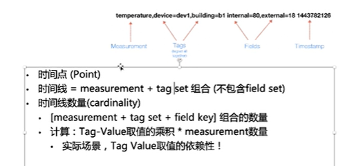
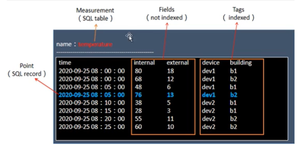

# 一：简介

时序数据库，其他有opentsdb，基于HBase

influxDB排名第一

TimeScaleDb基于PostgresSQL

KairosDB基于Cassandra

通用数据库

kudu


它是基于Go语言，着力于高性能的查询与存储时序型数据；

物联网设备实时监控：

三大特性：

基于时间序列

可度量性


# 二：时序数据模型



IMeasurement：相当于表；

Tages：维度列

device 和build组成一个主键，但是不唯一，随着时间变化；

Field：数值列

point：SQL的一条记录；



（二）时间线

一个数据源菜鸡的一个指标，随着时间的流逝而源源不断吐出数据，这样形成的一条曲线；

Series = Measurement +Tags

（三）系统架构


（2）RP数据保留策略：

存储成本，花钱

有副本；是数据库级别的，而不是表级别的；每个数据库有多个保留策略，但是只能有一个默认策略；

（3）ShardGroup

每个SharedGroup只存储指定时间段的数据，不同的对应的时间段不会重合；

删除的执行粒度就是ShardGroup；


过期数据处理：丢弃，降采样

分片时长选择：

1：长分片：短时段查询处理的数据量会方法；整体性能可能较好，数据冗余少，压缩率更高等

2：短分片：灵活，易管理，删除分片，增量备份；更多的分片，索引和元数据的存储和管理


Schema设计

tagk/tagv简短；

tag是字符串，field支持int ，float等数据类型；


InfluxQL查询语言：

仅部分函数支持嵌套；

# 三：安装部署

```shell
```

目录：

influx:

influx_

# 四：操作

(一)数据库操作

进入操作：

bin/influx

1：创建数据库

```sql
create databse influxdb
```

2：显示

```sql
show databse;
```

3：使用

```sql
use influxdb
```

4：查看表

```sql
```

（二）保留策略

```sql
```

(三)：表操作

插入数据自动创建表

```sql
insert weather,altitude=1000,area=北   temperature=11，humidity=4
```

(四)：用户操作

普通用户：

```sql
CREATE USER influx WITH PASSWORD 'influxbd';
```

管理员用户

```sql
create user 'admin' with password 'admin' with all privileges;
```

修改密码

```sql
set PASSWORD FOR influx='influx'
```

删除用户

```sql
drop user admin
```

(五)：数据库访问权限

授权用户数据库操作权限

```sql
GRANT ALL PRIVILEGES ON influxdb TO influx
```

撤销权限

```sql
revoke ALL PRIVILEGES
```

(六)：开启权限认证

