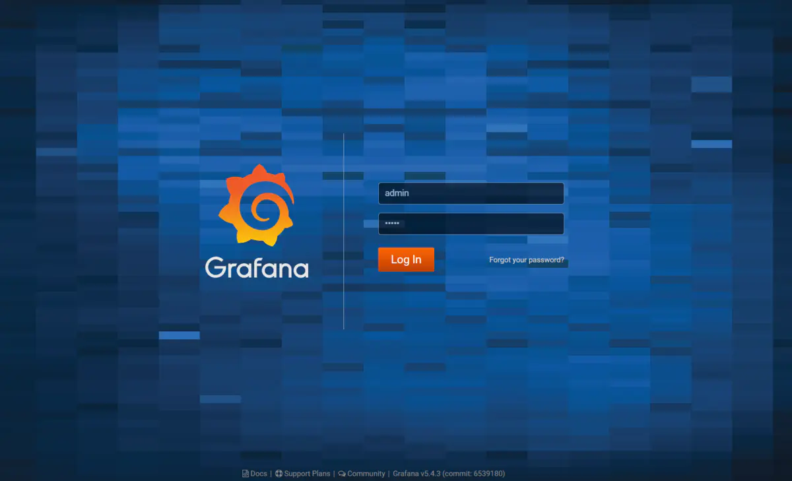
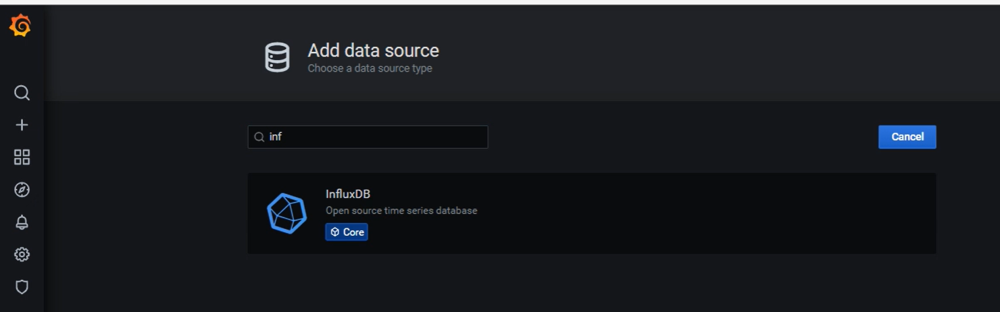
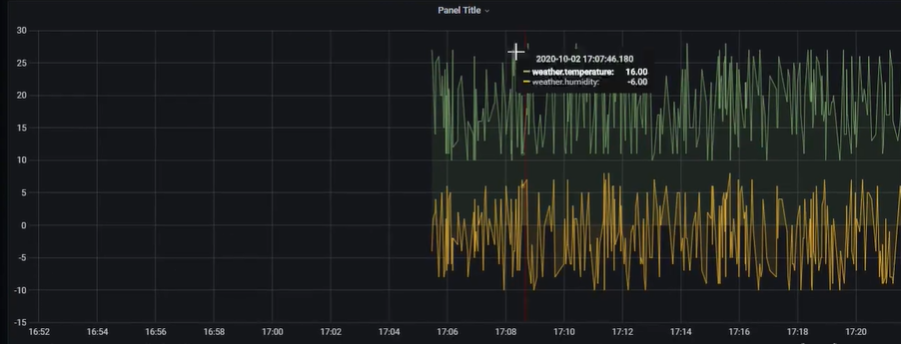

# 一：简介

grafana 是一款采用 go 语言编写的开源应用，主要用于大规模指标数据的可视化展现。网络架构和应用分析中最流行的**时序数据展示**工具，目前已经支持绝大部分常用的时序数据库。最好的参考资料就是官网（[http://docs.grafana.org/](https://links.jianshu.com/go?to=http%3A%2F%2Fdocs.grafana.org%2F)）

支持多种展示方式：热图，折线，图表等等

支持多种数据源：influxDB，Prometheus（普罗米修斯）

支持多种通知提醒：Email，SMS，钉钉

混合展示：同一个图表，多个数据源；


开源，二次开发；

# 二：安装部署

部署：

登录：

http://localhost:3000/

默认用户名为admin，默认密码为admin



配置数据源：

# 三：Grafans集成

1：模拟程序不断产生数据

```java
public static void main(String[] args){
    //构造InfluxDBUtil对象
    InfluxBDUtil influxDBUtil = new InfluxDBUtil("username","password","http://127.0.0.1");
    influxDBUtil.getInfluxDB();
    Faker faker = new Faker(new Locale(,"zh-CN"));
    
    while(true){
        HashMap<String,String> tags = new HashMap<>();
        tags.put("altitude","1000");
        tags.put("area","南");
        
        HashMap<String,Object> fields = new HashMap<>();
        fields.put("temperature",10);
        fields.put("humidity",-10);
        
        influxDBUtil.insert("measurement",tags,fields,System.currentTimeMillis(),TimeUtil.MiLLISECONDS);
        
    }
}
```

2：添加数据源



3：创建仪表盘

写查询SQL



# 四：基本功能

