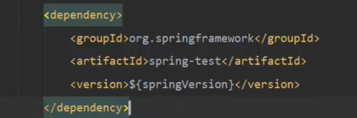
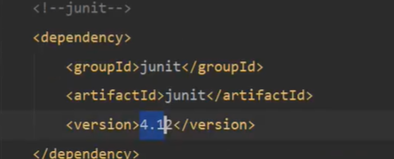
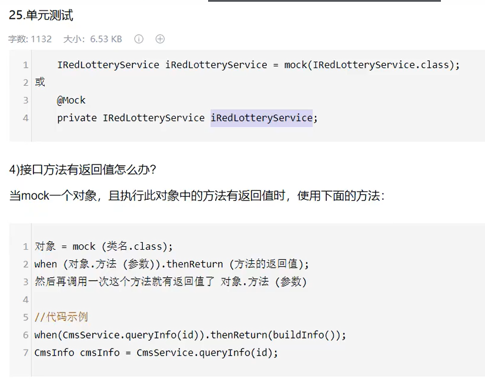
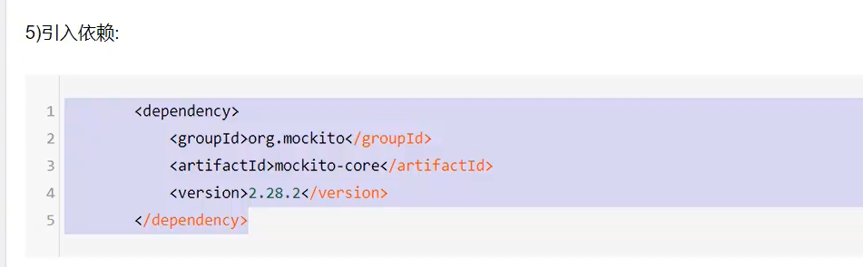
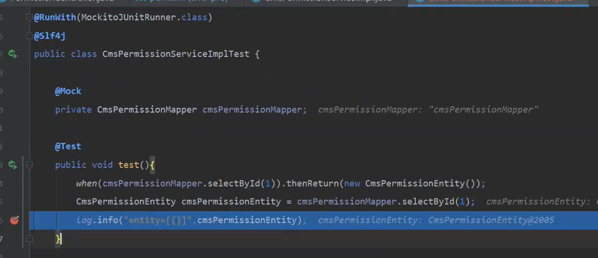
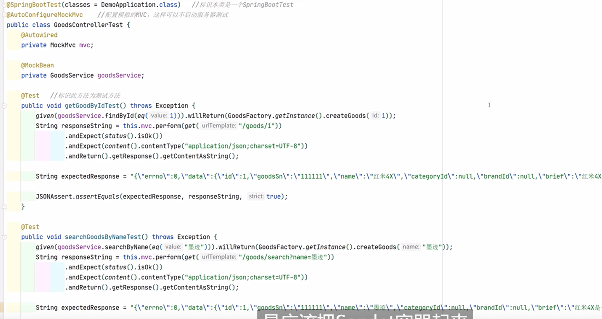

# 概念

TDD：测试驱动开发

DDD：

测试覆盖：

语句覆盖是指选择足够的测试用例，使得运行这些测试用例时，被测程序的每一个语句至少执行一次，其覆盖标准无法发现判定中逻辑运算的错误；

判定覆盖是指选择足够的测试用例，使得运行这些测试用例时，每个判定的所有可能结果至少出现一次，但若程序中的判定是有几个条件联合构成时，它未必能发现每个条件的错误；

 条件覆盖是指选择足够的测试用例，使得运行这些测试用例时，判定中每个条件的所有可能结果至少出现一次，但未必能覆盖全部分支；

判定/条件覆盖是使判定中每个条件的所有可能结果至少出现一次，并且每个判定本身的所有可能结果也至少出现一次；

条件组合覆盖是使每个判定中条件结果的所有可能组合至少出现一次，因此判定本身的所有可能解说也至少出现一次，同时也是每个条件的所有可能结果至少出现一次；

路径覆盖是每条可能执行到的路径至少执行一次；

其中语句覆盖是一种最弱的覆盖，判定覆盖和条件覆盖比语句覆盖强，满足判定/条件覆盖标准的测试用例一定也满足判定覆盖、条件覆盖和语句覆盖，**条件组合覆盖是除路径覆盖外最强的**，**路径覆盖也是一种比较强的覆盖，但未必考虑判定条件结果的组合，并不能代替条件覆盖和条件组合覆盖。**

单元测试的特性：

全自动，非交互，可重复，独立性，

白盒测试侧重于程序结构,黑盒测试侧重于功能。

Juint的注解的执行顺序：

```txt
@BeforeClass：针对所有测试，只执行一次，且必须为static void
@Before：初始化方法
@Test：
@After：释放资源
@AfterClass：针对所有测试，只执行一次，且必须为static void
```

@Ignore：忽略的测试方法


Mock就是创建一个类的虚假的对象，在测试环境中，用来替换真实的对象。

以达到两大目的：

1. 验证这个对象的某些方法的调用情况，调用了多少次，参数是什么等等
2. 指定这个对象的某些方法的行为，返回特定的值，或者是执行特定的动作

使用情景：

1. 无法控制第三方系统某接口的返回，返回的数据不满足要求
2. 某依赖系统还未开发完成，就需要对被测系统进行测试
3. 有些系统不支持重复请求，或有访问访问频次限制。如不可重复支付，获取敏感信息的接口访问频次不可高于xx等


# Mockito

使用：

```java
@RunWith(MockitoJUnitRunner.class)

```

单元测试：

Junit：

TestNG：

Mock：jMock,easyMock,Mockito,PowerMock

功能测试：

调用别人的数据，使用Mock进行模拟











https://zhuanlan.zhihu.com/p/45175174

https://zhuanlan.zhihu.com/p/98074553



