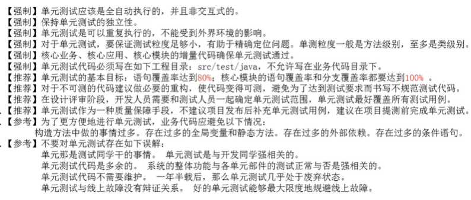

自顶向下的接口调用：

自底向上

优点：

测试更加充分；

Bug修复代价最小；

代码自Review，发现错误；

代码功能更具有易用性，使我们从调用者角度；

回归测试；

快速定位Bug；

白盒测试：

语句覆盖：每条语句至少被执行一次；

判定覆盖：每个判断至少有一次真值，有一次假值；

条件覆盖：

判定条件覆盖

组合覆盖

路径覆盖；

要求：

全自动，独立性，可重复；语句覆盖率达到80%；

