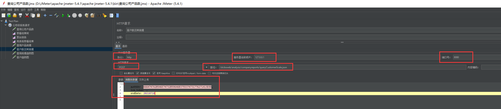
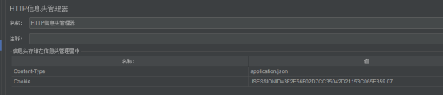

# JMeter

一位测试方面的大佬博客

https://www.cnblogs.com/liulinghua90/category/714144.html

基于Java的压力测试工具

## 一：下载安装

官网：http://jmeter.apache.org/download_jmeter.cgi

下载zip包，

解压，点击进入bin文件夹，双击jmeter.bat文件，会启动JMeter GUI工具

选择Options --> Choose Language --> Chinese(Simplified)，设置语言为中文简体

## 二：接口使用

1.选择TestPlan，右键-->添加-->线程-->线程组

2..线程组内容

a.线程组名称，可修改

b.取样器错误后执行的操作，可修改

c.线程数，即为并发请求数量，可修改

d.ramp-UI时间，即为几秒内开启全部线程，可修改

3.选择线程组，右键-->添加-->取样器-->HTTP请求

参数和消息体数据只能选一个

Web服务器信息，网络协议、域名或IP、端口号，可自行修改

接口请求：请求方式、请求路径、编码格式，可自行修改

参数传递：消息体数据存储JSON信息

4.选择线程组，右键-->添加-->配置元件-->HTTP信息头管理器

## 三：结果查看

选择线程组，右键-->添加-->监听器-->查看结果树

1.开始测试

自定义变量模拟多用户

JMeter命令行使用

redis压测工具：redis-benchmark

## 脚本工具

chrome插件录制脚本工具BlazeMeter
