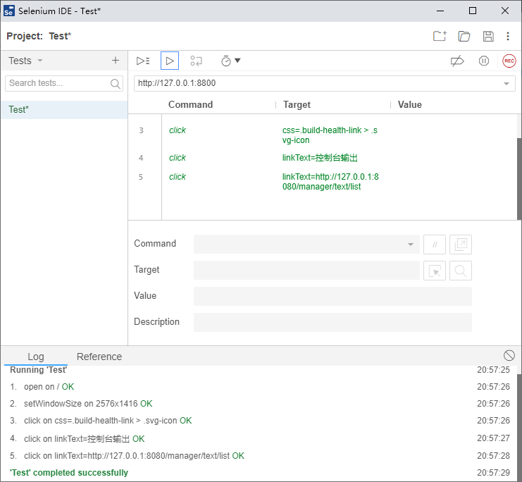

# Selenium

插件安装：Selenium IDE；火狐和Chrome都可；

## 一：录制和回放

运行所有录制脚本

运行当前录制脚本

跳过

更改速度

禁止断点调试

暂停

停止录制

Command：open 打开，click 点击；type输入；select window 选择窗口

## 二：WebDriver

## 三：自动化测试脚本

同爬虫等

# Airtest

网易出品的自动化软件测试工具

