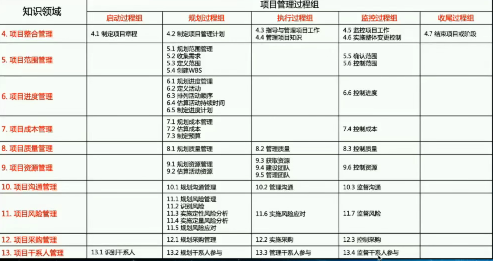
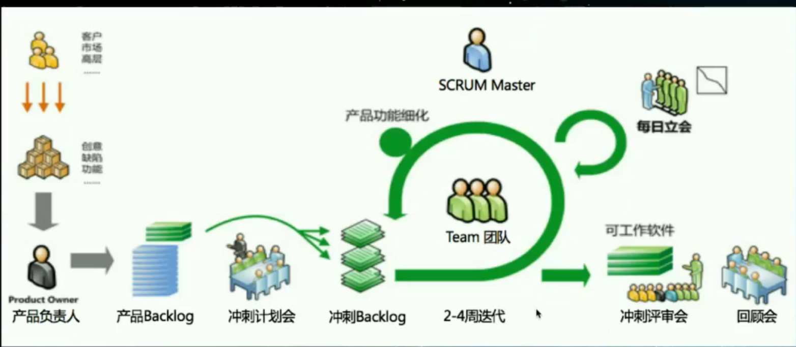

项目开发管理基础：[项目开发管理](../0.4：软件工程/项目开发管理/项目开发管理.md)

# 一：概述

项目：为了创造独特的产品，服务的成果而进行的临时性的工作；

项目的特征：临时性，独特性，渐进明细；

一：企业项目中的典型问题

1：项目经理如何确保项目按时交付

2：如何协调干系人之间的需求与冲突

3：如何让干系人对项目目标达成一致和共识？

4：如何获得项目干系人对项目目标的承诺？

5：如何应对上级任意设定的项目工期？

6：如何应对人手不够与项目资源匮乏的问题？

7：如何推动问题的整改（寻找创新的，建设性的解决方案？）

8：如何鼓励项目相关人员参与项目的计划与决策？

9：如何提升项目团队的沟通协作和配合？

10：如何建立互信的团队文化？

二：项目管理生命周期

[系统开发方法](../0.4：软件工程/系统开发方法/系统开发方法.md)

瀑布型的：

敏捷：技术的不确定性，需求很明确；

三：项目管理标准

进度，范围，成本，质量；

范围，质量，进度，客户满意度，

四：敏捷

scrum框架：

按照紧急度进行先后开发；

五：未来项目环境正在发生怎么样的变化

职能部门加大；分层严重；部门直接沟通难，相互推锅；

阿米巴模式：权利下放；

项目交付方式体现持续性，后续和附带的其他全都一系列的开发；

资源组织形式在改变：外包；

全生命周期：

为客户提供真正的价值：有时候客户并不清楚自己的需求；

六：项目经理做什么？

1：想打仗：

2：会打仗：

3：能打仗：

七：项目管理四步法

1：

SWOT：

相关方分析：

决策树分析：

2：规划阶段

工作分解：

类比估算：

概率影响矩阵：

3：执行和监控阶段

冲突管理；

挣值分析：

燃尽图：

4：收尾阶段

最终报告

经验教训总结

文件归档

# 三：时间管理

## 1：工时评估

功能方面1：

技术方面：

人员选择：

