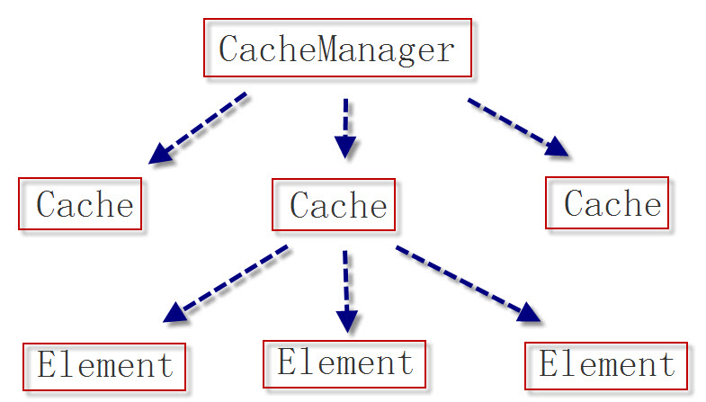
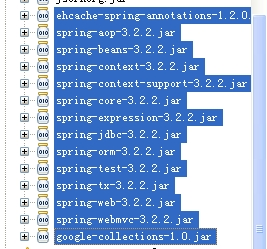

Ehcache技术详解

# 一：基本概念

EHCache是一个快速的、轻量级的、易于使用的、**进程内的缓存**。它支持read-only和read/write缓存，内存和磁盘缓存。是一个非常轻量级的缓存实现，而且从1.2
之后就支持了集群，目前的最新版本是2.8。

## 1：主要特性

1.  快速、简单

2.  提供LRU、LFU和FIFO 缓存策略

3.  缓存数据有两级：内存和磁盘，因此无需担心容量问题

4.  缓存数据会在虚拟机重启的过程中写入磁盘

5.  支持分布式缓存

6.  支持多缓存管理器实例，以及一个实例的多个缓存区域

# 二：部署

## 引入

官网地址：<http://www.ehcache.org/>

添加maven依赖

\<dependency\>

\<groupId\>net.sf.ehcache\</groupId\>

\<artifactId\>ehcache\</artifactId\>

\<version\>2.10.3\</version\>

\</dependency\>

## 配置

ehcache.xml中的内容如下：

\<?xml version=*"1.0"* encoding=*"UTF-8"*?\>

\<ehcache xmlns:xsi=*"http://www.w3.org/2001/XMLSchema-instance"*
xsi:noNamespaceSchemaLocation=*"http://ehcache.org/ehcache.xsd"*\>

\<!--

磁盘存储:将缓存中暂时不使用的对象,转移到硬盘,类似于Windows系统的虚拟内存

path:指定在硬盘上存储对象的路径

--\>

\<diskStore path=*"java.io.tmpdir"*/\>

\<!--

defaultCache:默认的缓存配置信息,如果不加特殊说明,则所有对象按照此配置项处理

maxElementsInMemory:设置了缓存的上限,最多存储多少个记录对象

eternal:代表对象是否永不过期

overflowToDisk:当内存中Element数量达到maxElementsInMemory时，Ehcache将会Element写到磁盘中

--\>

\<defaultCache

maxElementsInMemory="100"

eternal="true"

overflowToDisk="true"/\>

\<cache name=*"sampleCache1"*

maxEntriesLocalHeap=*"10000"*

maxEntriesLocalDisk=*"1000"*

eternal=*"false"*

overflowToDisk=*"true"*

diskPersistent=*"true"*

diskSpoolBufferSizeMB=*"20"*

timeToIdleSeconds=*"300"*

timeToLiveSeconds=*"600"*

memoryStoreEvictionPolicy=*"LFU"*

diskExpiryThreadIntervalSeconds =*"120"*

transactionalMode=*"off"*\>

\<cacheEventListenerFactory

class=*"com.ehcache.EhcacheListenerTest"*

properties=*"wxwtestkey=200,wxtestkey2=300"*/\>

\<persistence strategy=*"localTempSwap"*/\>

\</cache\>

\</ehcache\>

配置项详解：

\<diskStore path=*"java.io.tmpdir"*/\>

此配置项配置的是，磁盘缓存的位置。其中java.io.tmpdir的具体位置可以由java代码，System.getProperty("java.io.tmpdir")
来查看。此处的path也可以配置成
user.home，user.dir或用户设定的系统变量指定的路径。

Cache
元素表示一个一个缓存区域，在ehcache.xml中可以有多个cache,他们之间由name属性来区分。

maxEntriesLocalHeap=*"10000"：*表示内存中最大可以存在10000个元素。

maxEntriesLocalDisk=*"1000"：*表示磁盘中最大可以存在1000个元素

eternal=*"false"：*表示缓存是否持久，false表示不持久可被销毁，true表示一直存在。

overflowToDisk="true"：是否保存到磁盘，当内存中的元素溢出时。

diskPersistent="true"：是否保存到磁盘，当进程重启时。

diskSpoolBufferSizeMB=*"20"：*保存到磁盘的后台线程的缓存为20M，当数据从内存中转到磁盘时，会先将数据转入此缓存，然后由后台线程将数据从缓存中持久化到磁盘。

timeToIdleSeconds="300"：表示缓存空闲300s后被销毁。

timeToLiveSeconds=*"600"：*表示缓存最长可以存在300s，然后被销毁。

memoryStoreEvictionPolicy=*"LFU"：*Ehcache的三种清空策略，FIFO：先进先出。LFU：一直以来最少被使用的，即缓存的元素有一个hit属性，hit值最小的将会被清出缓存。LRU：最近最少使用的，缓存的元素有一个时间戳，当缓存容量满了，而又需要腾出地方来缓存新的元素的时候，那么现有缓存元素中时间戳离当前时间最远的元素将被清出缓存。

diskExpiryThreadIntervalSeconds
=*"120"：*检查磁盘上的缓存超期的线程的运行周期为120s。

transactionalMode=*"off"：事务关闭（ehcache中的事务是怎么使用的？）*

# 三：使用

## 1：类层次结构

## 2：基本用法

使用如下：

1.  获取manager,
    如果ehcache.xml不是在src下，可以由create(“config/ehcache.xml”)来指定路径。

CacheManager manager = CacheManager.create();

2、获取缓存区，根据ehcache.xml中配置的cache节点，指定name来获取cache.

Cache cache = manager.getCache("sampleCache1");

3、创建key-value形式的元素，存入缓存区，或从缓存区取出。

Element element = new Element("key1", "wxwtest");

cache.put(element);

Element find = cache.get("key1");

4、关闭mananger.

manager.shutdown();

另外，Ehcache还提供了监听的机制，在如上的配置文件中：

\<cacheEventListenerFactory

class=*"com.ehcache.EhcacheListenerTest"*

properties=*"wxwtestkey=200,wxtestkey2=300"*/\>

其中class是自定义的实现类，继承CacheEventListenerFactory，覆盖createCacheEventListener(Properties
props)方法。*EhcacheListenerTest代码*如下所示：

**package** com.ehcache;

**import** java.util.Properties;

**import** net.sf.ehcache.CacheException;

**import** net.sf.ehcache.Ehcache;

**import** net.sf.ehcache.Element;

**import** net.sf.ehcache.event.CacheEventListener;

**import** net.sf.ehcache.event.CacheEventListenerFactory;

**public class** EhcacheListenerTest **extends** CacheEventListenerFactory

{

\@Override

**public** CacheEventListener createCacheEventListener(Properties props)

{

System.*out*.println("==create listener==");

**for**(Object key : props.keySet())

{

System.*out*.println(key+"="+props.get(key));

}

**return new** TestCacheEventListener();

}

**class** TestCacheEventListener **implements** CacheEventListener

{

**public** Object clone()

{

**return new** TestCacheEventListener();

}

**public void** dispose()

{

System.*out*.println("==dispose");

}

**public void** notifyElementEvicted(Ehcache ehcache, Element element)

{

System.*out*.println("==notifyElementEvicted");

}

**public void** notifyElementExpired(Ehcache ehcache, Element element)

{

System.*out*.println("==notifyElementExpired");

}

**public void** notifyElementPut(Ehcache ehcache, Element element)

**throws** CacheException

{

System.*out*.println("==notifyElementPut");

}

**public void** notifyElementRemoved(Ehcache ehcache, Element element)

**throws** CacheException

{

System.*out*.println("==notifyElementRemoved");

}

**public void** notifyElementUpdated(Ehcache ehcache, Element element)

**throws** CacheException

{

System.*out*.println("==notifyElementUpdated");

}

**public void** notifyRemoveAll(Ehcache ehcache)

{

System.*out*.println("==notifyRemoveAll");

}

}

}

通过监听，在对cache做操作时，调用相应的监听类方法。

ehcache的基本用法就是这样。根据以上的基本用法，我们就更容易理解以下ehcache的一些复杂应用。

例二：

import net.sf.ehcache.Cache;

import net.sf.ehcache.CacheManager;

import net.sf.ehcache.Element;

public class EhcacheTest {

public static void main(String[] args) {

// 根据ehcache.xml配置文件创建Cache管理器

CacheManager manager=CacheManager.create("./src/main/resources/ehcache.xml");

Cache c=manager.getCache("a"); // 获取指定Cache

Element e=new Element("java1234","屌"); // 实例化一个元素

c.put(e); // 把一个元素添加到Cache中

Element e2=c.get("java1234"); // 根据Key获取缓存元素

System.out.println(e2);

System.out.println(e2.getObjectValue());

c.flush(); // 刷新缓存

manager.shutdown(); // 关闭缓存管理器

}

}

## Ehcache+Mybatis做DAO缓存

1.  在搭建好ehcache和Mybatis的基础上，引入mybatis-ehcache-xxx.jar。

2.  在ehcache.xml中将默认的缓存区配置上，如下：

\<defaultCache

maxEntriesLocalHeap=*"10000"*

eternal=*"false"*

timeToIdleSeconds=*"60"*

timeToLiveSeconds=*"300"*

diskSpoolBufferSizeMB=*"30"*

maxEntriesLocalDisk=*"10000000"*

diskExpiryThreadIntervalSeconds=*"120"*

memoryStoreEvictionPolicy=*"LRU"*\>

\<persistence strategy=*"localTempSwap"*/\>

\</defaultCache\>

1.  修改Mapper.xml，加上\<cache 节点，例如：

    \<?xml version=*"1.0"* encoding=*"UTF-8"* ?\>

    \<!DOCTYPE mapper PUBLIC "-//mybatis.org//DTD Mapper 3.0//EN"
    "http://mybatis.org/dtd/mybatis-3-mapper.dtd" \>

    \<mapper namespace=*"com.mybatis.dao.TestDAO"*\>

    \<cache type=*"org.mybatis.caches.ehcache.EhcacheCache"*/\>

    \<!—也可以是 \<cache type="org.mybatis.caches.ehcache.LoggingEhcache"/\>--\>

    \<resultMap id=*"BaseResultMap"*

    ……

    \</resultMap\>

    \<select id=*"getTestBean"* resultMap=*"xxx"*
    parameterType=*"java.util.Map"*\>

    ……

    \</select\>

    \</mapper\>

2.  mybatis默认是启用cache的，所以对于某一条不想被cache的sql需要把useCache="false"加上。例如：

|   | \<select id="getCategory" parameterType="string" resultType="xxx" useCache="false"\> |
|---|--------------------------------------------------------------------------------------|

>   ……

\</select\>

注：貌似单独的Mybatis用不了缓存。测试了没有成功。

## Ehcache+Spring做业务层缓存

1.  引入相应jar包，spring3.2.xxx所需要的jar,
    cglib-xxx.jar，ehcache-spring-annotations-xxxx.jar，google-collections-xx.jar

    

2.  配置spring

    \<?xml version="1.0" encoding="UTF-8"?\>

    \<beans xmlns="http://www.springframework.org/schema/beans"

    xmlns:xsi="http://www.w3.org/2001/XMLSchema-instance"

    xmlns:ehcache="http://ehcache-spring-annotations.googlecode.com/svn/schema/ehcache-spring"

    xsi:schemaLocation="

    http://www.springframework.org/schema/beans

    http://www.springframework.org/schema/beans/spring-beans-3.0.xsd

    http://ehcache-spring-annotations.googlecode.com/svn/schema/ehcache-spring

    http://ehcache-spring-annotations.googlecode.com/svn/schema/ehcache-spring/ehcache-spring-1.1.xsd"\>

    \<ehcache:annotation-driven cache-manager="ehCacheManager" /\>

\<bean id="ehCacheManager"

class="org.springframework.cache.ehcache.EhCacheManagerFactoryBean" \>

\<property name="configLocation" value="classpath: ehcache.xml"\>\</property\>

>   \</bean\>

>   \</beans\>

1.  配置ehcache.xml

     \<cache name="metaColumnCache" eternal="false"

     maxElementsInMemory="100"

     overflowToDisk="false"

     diskPersistent="false"

     timeToIdleSeconds="0"

     timeToLiveSeconds="300"

     memoryStoreEvictionPolicy="LRU" /\>

2.  使用，在业务方法上加相应注释

    \@Cacheable(cacheName="metaColumnCache")  
    public List getColumnModel(String tableId) {

    ……

}

## Ehcache做页面缓存

假如有这样一个需求：给一个网站的首页做一个页面缓存，2分钟更新一次。

以应用结构page-filter-action-service-dao-db
为例，页面缓存做到尽量靠近客户的地方，就是在page和filter之间
，这样的优点就是第一个用户请求之后，页面被缓存，第二个用户再来请求的时候，走到filter这个请求就结束了，无需再走后面的action-
service-dao-db。带来的好处是服务器压力的减低和客户段页面响应速度的加快。

1.  在搭建好ehcache的基础上引入ehcache-web-xxx.jar。

2.  在ehcache.xml中配置一个用于缓存网站首页的缓存区，如下：

\<cache name=*"indexCache"*

maxEntriesLocalHeap=*"100"*

maxEntriesLocalDisk=*"100"*

eternal=*"false"*

diskSpoolBufferSizeMB=*"2"*

timeToIdleSeconds=*"60"*

timeToLiveSeconds=*"120"*

memoryStoreEvictionPolicy=*"LFU"*

transactionalMode=*"off"*\>

\<persistence strategy=*"localTempSwap"*/\>

\</cache\>

1.  在web.xml中为添加首页的filter

\<filter\>

\<filter-name\>indexCacheFilter\</filter-name\>
\<filter-class\>net.sf.ehcache.constructs.web.filter.SimplePageCachingFilter\</filter-class\>

\<init-param\>

\<param-name\>cacheName\</param-name\>

\<param-value\>indexCache\</param-value\>

\</init-param\>

\</filter\>

\<filter-mapping\>

\<filter-name\>indexCacheFilter\</filter-name\>

\<url-pattern\>/index.jsp\</url-pattern\>

\</filter-mapping\>

Ok，页面缓存就是这么简单。通过分析SimplePageCachingFilter的源码，我们可以看到，过滤器通过获取HttpServletRequest的
httpRequest.getMethod()+httpRequest.getRequestURI()+httpRequest.getQueryString();

作为key，从入缓存中查询页面，若没有则读取页面放入缓存中，若有则直接从缓存中返回。

# 卸载

1.  去掉jar包： ehcache-xxx.jar或ehcache-core-xxx.jar，
    ehcache-web-xxx.jar，mybatis-ehcache-xxx.jar。

2.  去掉ehcache.xml配置文件。

3.  页面缓存，去掉web.xml中的filter配置。

4.  Mybatis缓存，去掉xxxMapper.xml中的

    \<cache type="org.mybatis.caches.ehcache.EhcacheCache"/\> 配置。
