# 第一章：Redis 介绍

## 1.1：什么是 NoSql

为了解决高并发、高可用、高可扩展，大数据存储等一系列问题而产生的数据库解决方案，就是 NoSql。NoSql，叫非关系型数据库，它的全名 Not only sql。它不能替代关系型数据库，只能作为关系型数据库的一个良好补充。

## 1.2：NoSql 的分类

- 键值(Key-Value)存储数据库

相关产品： Tokyo Cabinet/Tyrant、**Redis**、Voldemort、Berkeley DB

典型应用： 内容缓存，主要用于处理大量数据的高访问负载。

数据模型： 一系列键值对

优势： 快速查询

劣势： 存储的数据缺少结构化

- 列存储数据库

相关产品：Cassandra, **HBase**, Riak

典型应用：分布式的文件系统

数据模型：以列簇式存储，将同一列数据存在一起

优势：查找速度快，可扩展性强，更容易进行分布式扩展

劣势：功能相对局限

- 文档型数据库

相关产品：CouchDB、**MongoDB**

典型应用：Web 应用（与 Key-Value 类似，Value 是结构化的）

数据模型： 一系列键值对

优势：数据结构要求不严格

劣势： 查询性能不高，而且缺乏统一的查询语法

- 图形(Graph)数据库

相关数据库：Neo4J、InfoGrid、Infinite Graph

典型应用：社交网络

数据模型：图结构

优势：利用图结构相关算法。

劣势：需要对整个图做计算才能得出结果，不容易做分布式的集群方案。

## 1.3：什么是 redis

Redis 是使用 c 语言开发的一个高性能键值数据库。Redis 可以通过一些键值类型来存储数据。

键值类型：String 字符类型 map 散列类型 list 列表类型 set 集合类型 sortedset 有序集合类型

## 1.4：redis 历史发展

2008 年，意大利的一家创业公司 Merzia 推出了一款基于 MySQL 的网站实时统计系统 LLOOGG，然而没过多久该公司的创始人
Salvatore Sanfilippo 便对 MySQL 的性能感到失望，于是他决定亲自为 LLOOGG 量身定做一个数据库，并于 2009 年开发完成，这个数据库就是 Redis。不过 SalvatoreSanfilippo 并不满足只将 Redis 用于 LLOOGG 这一款产品，而是希望更多的人使用它，于是在同一年 Salvatore Sanfilippo 将 Redis 开源发布，并开始和 Redis 的另一名主要的代码贡献者 PieterNoordhuis 一起继续着 Redis 的开发，直到今天。

## 优点

响应速度快，能有效提高系统的性能。

支持 6 种数据类型。

操作都是原子的。

还支持各种实现，过期特性等等

与本地缓存的优势：

读写速度：并发下本地缓存需要加锁，读写慢一点

redis 可以用分布式锁防止重复点击

本地缓存的数据结果少，redis 可以储存多种，还可以持久化

本地缓存容易导致线程安全问题。

## 1.5：redis 的应用场景

缓存（数据查询、短连接、新闻内容、商品内容等等）。（**最多使用**）

分布式集群架构中的 session 分离。

聊天室的在线好友列表。

任务队列。（秒杀、抢购、12306 等等）

应用排行榜。

网站访问统计。

数据过期处理（可以精确到毫秒）

# 第二章：redis 安装

## 1：Window 安装

安装包地址：[https://github.com/microsoftarchive/redis](https://links.jianshu.com/go?to=https%3A%2F%2Fgithub.com%2Fmicrosoftarchive%2Fredis)

（1）进入安装包地址，选择 releases

（2）在 releases 页面下载最新版

msi 是可执行文件，按安装步骤安装即可。zip 直接解压就可以了。

端口号可保持默认的 6379，并选择防火墙例外，从而保证外部可以正常访问 Redis 服务。

以服务方式启动

以非服务方式启动

进入 CMD，进入 redis 的目录，执行如下命令

redis-server redis.windows.conf

设置密码

在 redis 目录中找到 redis.windows-service.conf 和 redis.windows.conf 两个文件

都打开找到 requirepass，加一行：requirepass 123456，123456 是密码，保存重新运行 redis，访问 redis 就需要密码了。

CMD 并进入 redis 目录，执行如下命令，执行前请保证 redis 服务已启动

redis-cli -h localhost -p 6379 -a 123456

## 2：Linux 安装

## 2.1：redis 下载

官网地址：<http://redis.io/>

下载地址：<http://download.redis.io/releases/redis-3.0.0.tar.gz>

## 2.2：redis 的安装

redis 的安装环境会安装到 linux 系统中。

第一步：安装 VMware，并且在 VMware 中安装 centos 系统（参考 linux 教程）。

第二步：将 redis 的压缩包，上传到 linux 系统

第三步：对 redis 的压缩包进行解压缩

```shell
tar -zxf redis-3.0.0.tar.gz
```

第四步：安装 c 语言环境（安装 centos 之后，自带 c 语言环境）

```shell
yum install gcc-c++
```

第五步：编译 redis 源码

```shell
cd redis-3.0.0
make
```

第六步：安装 redis

```shell
make isntall  PREFIX=/usr/local/redis
```

第七步：查看是否安装成功

## 2.3：redis 启动

### 前端启动

前端启动的命令：

```shell
./redis-server
```

前端启动的关闭：

强制关闭：Ctrl+c

正常关闭：

```shell
./redis-cli shutdown
```

启动界面：

前端启动的问题：

一旦客户端关闭，则 redis 服务也停掉。

### 后端启动

第一步：需要将 redis 解压之后的源码包中的 redis.conf 文件拷贝到 bin 目录下

```shell
cp /root/redis-3.0.0/redis.conf ./
```

第二步：修改 redis.conf 文件，将 daemonize 改为 yes

先要使用 vim redis.conf

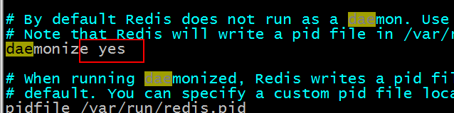

第三步：使用命令后端启动 redis

```shell
./redis-server redis.conf
```

第四步：查看是否启动成功

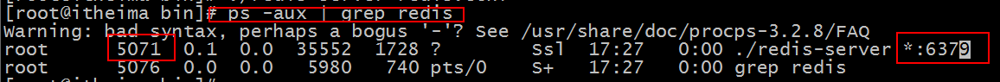

关闭后端启动的方式：

强制关闭：

```shell
 kill -9 5071
```

正常关闭：

```shell
./redis-cli shutdown
```

在项目中，建议使用正常关闭。

因为 redis 作为缓存来使用的话，将数据存储到内存中，如果使用正常关闭，则会将内存数据持久化到本地之后，再关闭。

如果是强制关闭，则不会进行持久化操作，可能会造成部分数据的丢失。

# 第三章：Redis 客户端

## 3.1：Redis 自带的客户端

- 启动

启动客户端命令

```shell
./redis-cli -h 127.0.0.1 -p 6379
```

\-h：指定访问的 redis 服务器的 ip 地址

\-p：指定访问的 redis 服务器的 port 端口

还可以写成：

```shell
./redis-cli
```

使用默认配置：默认的 ip【127.0.0.1】，默认的 port【6379】

- 关闭

  Ctrl + c 或则输入Quit

## 3.2：图形界面客户端

安装文件位置：

安装之后，打开如下：

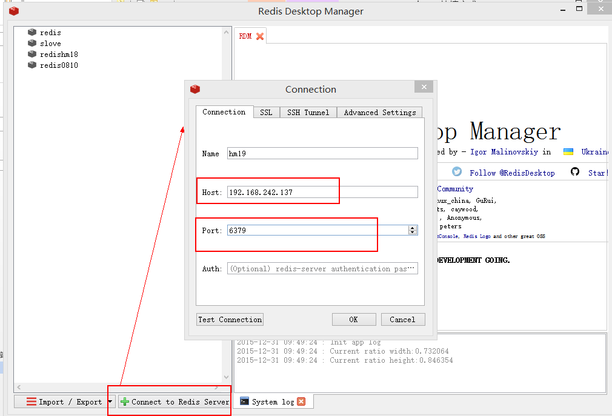

防火墙设置：


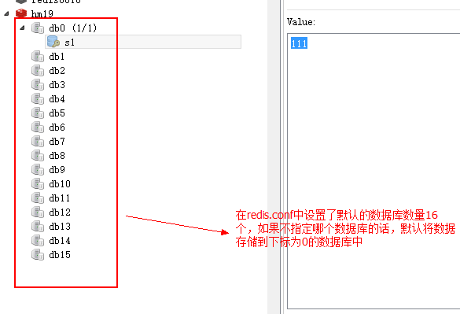

Redis.conf 中的数据库数量的设置：

选择数据库的方式：

使用 select 加上数据库的下标 就可以选择指定的数据库来使用，下标从 0 开始

```sql
select 15
OK
```

## 3.3：Jedis 客户端

### jedis 介绍

Redis 不仅是使用命令来操作，现在基本上主流的语言都有客户端支持，比如 java、C、C\#、C++、php、Node.js、Go 等。

在官方网站里列一些 Java 的客户端，有**Jedis**、Redisson、Jredis、JDBC-Redis、等其中官方推荐使用 Jedis 和 Redisson。在企业中用的最多的就是 Jedis，下面我们就重点学习下 Jedis。

Jedis 同样也是托管在 github 上，地址：https://github.com/xetorthio/jedis

### 工程搭建

添加 jar 包

### 单实例连接 redis

```java
@Test
public void jedisclient (){
    // Jedis
    Jedis jedis = new Jedis ( "192.168.242.137"，6379);//通过redis赋值
    jedis.set ("s2", "222");//通过redis取值
    string result = jedis.get ( "s2");
    system. out.println (result);
    //关闭jedis
    jedis.close ();
}

```

### 使用 jedis 连接池连接 redis 服务器

```java
@Test
public void jedisPool() {
    // JedisPool
    JedisPool pool = new JedisPool ("192.168.242.137",6379);/通过连接池获取jedis对象
    Jedis jedis = pool.getResource () ;
    jedis.set ( "s4","444");
    string result = jedis.get ("s3");
    system.out.println (result);
    //关闭jedis客户端
    jedis.close ( );
    //关闭连接池
    pool.close () ;
}

```

### Spring 整合 jedisPool（自学）

- 添加 spring 的 jar 包
- 配置 spring 配置文件 applicationContext.xml

```xml
<?xml version="1.0" encoding="UTF-8"?>
<beans xmlns="http://www.springframework.org/schema/beans"
	xmlns:xsi="http://www.w3.org/2001/XMLSchema-instance" xmlns:mvc="http://www.springframework.org/schema/mvc"
	xmlns:context="http://www.springframework.org/schema/context"
	xmlns:aop="http://www.springframework.org/schema/aop" xmlns:tx="http://www.springframework.org/schema/tx"
	xsi:schemaLocation="http://www.springframework.org/schema/beans
		http://www.springframework.org/schema/beans/spring-beans-3.2.xsd
		http://www.springframework.org/schema/mvc
		http://www.springframework.org/schema/mvc/spring-mvc-3.2.xsd
		http://www.springframework.org/schema/context
		http://www.springframework.org/schema/context/spring-context-3.2.xsd
		http://www.springframework.org/schema/aop
		http://www.springframework.org/schema/aop/spring-aop-3.2.xsd
		http://www.springframework.org/schema/tx
		http://www.springframework.org/schema/tx/spring-tx-3.2.xsd ">

	<!-- 连接池配置 -->
	<bean id="jedisPoolConfig" class="redis.clients.jedis.JedisPoolConfig">
		<!-- 最大连接数 -->
		<property name="maxTotal" value="30" />
		<!-- 最大空闲连接数 -->
		<property name="maxIdle" value="10" />
		<!-- 每次释放连接的最大数目 -->
		<property name="numTestsPerEvictionRun" value="1024" />
		<!-- 释放连接的扫描间隔（毫秒） -->
		<property name="timeBetweenEvictionRunsMillis" value="30000" />
		<!-- 连接最小空闲时间 -->
		<property name="minEvictableIdleTimeMillis" value="1800000" />
		<!-- 连接空闲多久后释放, 当空闲时间>该值 且 空闲连接>最大空闲连接数 时直接释放 -->
		<property name="softMinEvictableIdleTimeMillis" value="10000" />
		<!-- 获取连接时的最大等待毫秒数,小于零:阻塞不确定的时间,默认-1 -->
		<property name="maxWaitMillis" value="1500" />
		<!-- 在获取连接的时候检查有效性, 默认false -->
		<property name="testOnBorrow" value="false" />
		<!-- 在空闲时检查有效性, 默认false -->
		<property name="testWhileIdle" value="true" />
		<!-- 连接耗尽时是否阻塞, false报异常,ture阻塞直到超时, 默认true -->
		<property name="blockWhenExhausted" value="false" />
	</bean>

	<!-- redis单机 通过连接池 -->
	<bean id="jedisPool" class="redis.clients.jedis.JedisPool"
		destroy-method="close">
		<constructor-arg name="poolConfig" ref="jedisPoolConfig" />
		<constructor-arg name="host" value="192.168.242.130" />
		<constructor-arg name="port" value="6379" />
	</bean>
</beans>

```

- 测试代码

```java
	@Test
	public void testJedisPool() {
		JedisPool pool = (JedisPool) applicationContext.getBean("jedisPool");
		Jedis jedis = null;
		try {
			jedis = pool.getResource();
			jedis.set("name", "lisi");
			String name = jedis.get("name");
			System.out.println(name);
		} catch (Exception ex) {
			ex.printStackTrace();
		} finally {
			if (jedis != null) {
				// 关闭连接
				jedis.close();
			}
		}
	}

```

# 第四章：Redis 数据类型

## 4.1：String

value 可以是 String 也可以是数字。一般做一些复杂的计数功能的缓存

### 应用

#### 自增主键

商品编号、订单号采用 string 的递增数字特性生成。

### 命令

```cmd

# 赋值
语法：SET key value
set s1 111

# 取值
语法：GET key

# 取值并赋值
# 语法：GETSET key value
getset s2 222
"111"
get s2
"222"

# 设置/获取多个键值
语法：
MSET key value [key value …]
MGET key [key …]

127.0.0.1:6379> mset s1 111 s2 222
OK
127.0.0.1:6379> mget s1 s2
1) "111"
2) "222"

# 删除
语法：DEL key
del s1

# 递增
INCR item:Id

# 递减
DECR key
# 减少指定的整数
DECRBY key decrement
```

## 4.2：Hash

单点登录的时候，就是用这种数据结构存储用户信息，以 cookieId 作为 key，设置 30 分钟为缓存过期时间，能很好的模拟出类似 session 的效果。

散列类型

### 使用 string 的问题

假设有 User 对象以 JSON 序列化的形式存储到 Redis 中，User 对象有 id，username、password、age、name 等属性，存储的过程如下：

保存、更新：

User 对象 json(string) redis

如果在业务上只是更新 age 属性，其他的属性并不做更新我应该怎么做呢？如果仍然采用上边的方法在传输、处理时会造成资源浪费，下边讲的 hash 可以很好的解决这个问题。

### redis hash 介绍

hash 叫散列类型，它提供了字段和字段值的映射。字段值只能是字符串类型，不支持散列类型、集合类型等其它类型。如下：

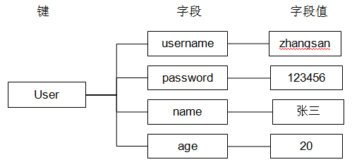

### 命令

赋值

HSET 命令不区分插入和更新操作，当执行插入操作时 HSET 命令返回 1，当执行更新操作时返回 0。

- 一次只能设置一个字段值

语法：HSET key field value

```cmd
hset user username zhangsan
```

- 一次可以设置多个字段值

语法：HMSET key field value [field value ...]

```cmd
hmset user username zhangsan age 20
```

- 当字段不存在时赋值，类似 HSET，区别在于如果字段存在，该命令不执行任何操作

语法：HSETNX key field value

```cmd
hsetnx user age 30
hget user age
```

取值

- 一次只能获取一个字段值

语法：HGET key field

```cmd
hget user username
```

- 一次可以获取多个字段值

语法：HMGET key field [field ...]

```cmd
hmget user age username
```

- _获取所有字段值_

_语法：HGETALL key_

```cmd
hgetall user
```

删除字段

可以删除一个或多个字段，返回值是被删除的字段个数

语法：HDEL key field [field ...]

```cmd
hdel user age
```

增加数字

语法：HINCRBY key field increment

```cmd
hincrby user age 2
```

判断字段是否存在

语法：HEXISTS key field

```cmd
hexists user age
```

只获取字段名或字段值

语法：

HKEYS key

HVALS key

```cmd
hkeys user
hvals user
```

获取字段数量

语法：HLEN key

```cmd
hlen user
```

### 应用

可以快速定位，需要存储信息，且这个信息需要频繁修改时，就可以使用这个结构，购物车

#### 存储商品信息

- 商品字段

【商品 id、商品名称、商品描述、商品库存、商品好评】

- 定义商品信息的 key

商品 1001 的信息在 Redis 中的 key 为：[items:1001]

- 存储商品信息

| 192.168.101.3:7003\> HMSET items:1001 id 3 name apple price 999.9 OK 

- 获取商品信息

| 192.168.101.3:7003\> HGET items:1001 id "3" 192.168.101.3:7003\> HGETALL items:1001 1) "id" 2) "3" 3) "name" 4) "apple" 5) "price" 6) "999.9" 

## 4.3：List

### Arraylist 和 linkedlist 的区别

Arraylist 是使用数组来存储数据，特点：查询快、增删慢

Linkedlist 是使用双向链表存储数据，特点：增删快、查询慢，但是查询链表两端的数据也很快。

Redis 的 list 是采用来双向链表来存储的，所以对于 redis 的 list 数据类型的操作，是操作 list 的两端数据来操作的。

### 命令

向列表两端增加元素

- 向列表左边增加元素

语法：LPUSH key value [value ...]

```cmd
lpush list 1 2 3 4
```

- 向列表右边增加元素

语法：RPUSH key value [value ...]

```cmd
rpush list 5 6 7 8
```

查看列表

LRANGE 命令是列表类型最常用的命令之一，获取列表中的某一片段，将返回 start、stop 之间的所有元素（包含两端的元素），索引从 0 开始。索引可以是负数，如：**“-1”代表最后边的一个元素**。

语法：LRANGE key start stop

```cmd
 lrange list 0 -1
```

从列表两端弹出元素

LPOP 命令从列表左边弹出一个元素，会分两步完成：

第一步是将列表左边的元素从列表中移除

第二步是返回被移除的元素值。

_语法：_

LPOP key

RPOP key

```cmd
lpop list
```

获取列表中元素的个数

语法：LLEN key

```
llen list
```

删除列表中指定的值

LREM 命令会**删除列表中前 count 个值为 value 的元素**，返回实际删除的元素个数。根据 count 值的不同，该命令的执行方式会有所不同：

- 当 count\>0 时， LREM 会从列表左边开始删除。

- 当 count\<0 时， LREM 会从列表后边开始删除。

- 当 count=0 时， LREM 删除所有值为 value 的元素。

_语法：LREM key count value_

获得/设置指定索引的元素值

- 获得指定索引的元素值

语法：LINDEX key index

```cmd
lindex list 2
```

- 设置指定索引的元素值

语法：LSET key index value

```cmd
lset list 2 9
```

只保留列表指定片段

指定范围和 LRANGE 一致

语法：LTRIM key start stop

向列表中插入元素

该命令首先会在列表中从左到右查找值为 pivot 的元素，然后根据第二个参数是 BEFORE 还是 AFTER 来决定将 value 插入到该元素的前面还是后面。

_语法：LINSERT key BEFORE\|AFTER pivot value_

将元素从一个列表转移到另一个列表中

_语法：RPOPLPUSH source destination_

```cmd
rpoplpush list newlist
```

### 应用

#### 商品评论列表

思路：

在 Redis 中创建商品评论列表

用户发布商品评论，将评论信息转成 json 存储到 list 中。

用户在页面查询评论列表，从 redis 中取出 json 数据展示到页面。

定义商品评论列表 key：

商品编号为 1001 的商品评论 key【items: comment:1001】

| 192.168.101.3:7001\> LPUSH items:comment:1001 '{"id":1,"name":"商品不错，很好！！","date":1430295077289}' |

## 4.4：Set

集合类型

集合类型：无序、不可重复

列表类型：有序、可重复

### 命令

增加/删除元素

语法：SADD key member [member ...]

```cmd
sadd set a b c
```

语法：SREM key member [member ...]

```cmd
srem set c d
```

获得集合中的所有元素

语法：SMEMBERS key

```cmd
smembers set
```

判断元素是否在集合中

语法：SISMEMBER key member

```cmd
sismember set a
```

### 运算命令

集合的差集运算 A-B

属于 A 并且不属于 B 的元素构成的集合。


语法：SDIFF key [key ...]

```cmd
sadd setA 1 2 3
sadd setB 2 3 4
sdiff setA setB
>> 1
```

集合的交集运算 A ∩ B

属于 A 且属于 B 的元素构成的集合。


语法：SINTER key [key ...]

```cmd
sinter setA setB
```

集合的并集运算 A ∪ B

属于 A 或者属于 B 的元素构成的集合


语法：SUNION key [key ...]

```cmd
sunion setA setB
```

获得集合中元素的个数

\*语法：SCARD key

```cmd
scard setA
```

从集合中弹出一个元素

注意：由于集合是无序的，所有 SPOP 命令会从集合中随机选择一个元素弹出

语法：SPOP key

```cmd
spop setA
```

## 4.5：Sortedset

Sortedset 又叫 zset

Sortedset 是有序集合，可排序的，但是唯一。

Sortedset 和 set 的不同之处，是会给 set 中的元素添加一个分数，然后通过这个分数进行排序。

底层使用跳跃表来实现。跳跃表相比于红黑树的优点：

- 存取速度快，节点不需要进行旋转
- 易于实现
- 支持无锁操作

### 命令

增加元素

向有序集合中加入一个元素和该元素的分数，如果该元素已经存在则会用新的分数替换原有的分数。返回值是新加入到集合中的元素个数，不包含之前已经存在的元素。

语法：ZADD key score member [score member ...]

```shell
# 将笔试成绩（tom-100,jack-60,tony-80）放入名为 writtenTestScore 的有序集合里,返回元素个数3
127.0.0.1:6379> zadd scoreboard  100 tom 60 jack 80 tony
```

列出所有元素

```cmd
# zrange列出所有元素
127.0.0.1:6379> zrange scoreboard  0 -1

/*zrange列出所有元素（笔试成绩），带分值*/
127.0.0.1:6379> zrange scoreboard  0 -1 withscores

```

获取元素的分数

语法：ZSCORE key member

```cmd
zscore scoreboard tom
```

删除元素

移除有序集 key 中的一个或多个成员，不存在的成员将被忽略。当 key 存在但不是有序集类型时，返回一个错误。

语法：ZREM key member [member ...]

```cmd
zrem scoreboard tom
```

获得排名在某个范围的元素列表

- 按照元素分数**从大到小**的顺序返回索引从 start 到 stop 之间的所有元素（包含两端的元素）

语法：ZREVRANGE key start stop [WITHSCORES]

```cmd
zrevrange scoreboard 0 -1
```

获取元素的排名

- 从小到大

语法：ZRANK key member

```cmd

```

- 从大到小

_语法：ZREVRANK key member_

获得指定分数范围的元素

语法：ZRANGEBYSCORE key min max [WITHSCORES] [LIMIT offset count]

增加某个元素的分数,返回值是更改后的分数

_语法：ZINCRBY key increment member_

获得集合中元素的数量

_语法：ZCARD key_

获得指定分数范围内的元素个数

_语法：ZCOUNT key min max_

按照排名范围删除元素

语法：ZREMRANGEBYRANK key start stop

按照分数范围删除元素

语法：ZREMRANGEBYSCORE key min max

### 应用

#### 商品销售排行榜

需求：根据商品销售量对商品进行排行显示

思路：定义商品销售排行榜（sortedset 集合），Key 为 items:sellsort，分数为商品销售量。

**写入商品销售量**：

- 商品编号 1001 的销量是 9，商品编号 1002 的销量是 10

| 192.168.101.3:7007\> ZADD items:sellsort 9 1001 10 1002 |

- 商品编号 1001 的销量加 1

| 192.168.101.3:7001\> ZINCRBY items:sellsort 1 1001 |

- 商品销量前 10 名：

| 192.168.101.3:7001\> ZRANGE items:sellsort 0 9 withscores

#### 实现延时队列

方式一：使用 redis zset 数据结构 ，使用 score 排序 score 为过期时间点 ，启动线程不断取出排序第一个 比较 score 和当前时间点 如果 score 小于或等于当前时间 说明此数据过期 需要处理 ，处理完毕在 zset 中移除

方式二：修改 redis 配置 redis.conf 添加 notify-keyspace-events Ex

编写测试 demo

新建 boot 工程 加入 redis 依赖

新建 redisconfig 注入 RedisMessageListenerContainer Bean

```java
@Configuration
public class RedisListenerConfig {
    @Bean
    RedisMessageListenerContainer container(RedisConnectionFactory connectionFactory) {

        RedisMessageListenerContainer container = new RedisMessageListenerContainer();
        container.setConnectionFactory(connectionFactory);
        return container;
    }
}
```

编写 redis 监听类 继承 KeyExpirationEventMessageListener

```java
@Component
public class RedisKeyExpirationListener extends KeyExpirationEventMessageListener {

    public RedisKeyExpirationListener(RedisMessageListenerContainer listenerContainer) {
        super(listenerContainer);
    }
    @Override
    public void onMessage(Message message, byte[] pattern) {
        String expiredKey = message.toString();
        System.out.println("监听到过期的key为："+expiredKey);
    }
}
```

运行 boot 工程 使用 redis 客户端 redis desktop manager 添加一个 key 设置过期时间


延时两秒 在工程控制太看到输出

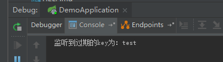

### 底层实现

有序集合的编码可以是 ziplist 或者 skiplist。

当有序集合对象同时满足以下两个条件时，对象使用 ziplist 编码：

1、保存的元素数量小于 128；

2、保存的所有元素长度都小于 64 字节。

以上两个条件也可以通过 Redis 配置文件 zset-max-ziplist-entries 选项和 zset-max-ziplist-value 进行修改。

ziplist 编码的有序集合对象使用压缩列表作为底层实现，每个集合元素使用两个紧挨在一起的压缩列表节点来保存，第一个节点保存元素的成员，第二个节点保存元素的分值。并且压缩列表内的集合元素按分值从小到大的顺序进行排列，小的放置在靠近表头的位置，大的放置在靠近表尾的位置。

```cpp
//操作
ZADD price 8.5 apple 5.0 banana 6.0 cherry

//存储顺序
```

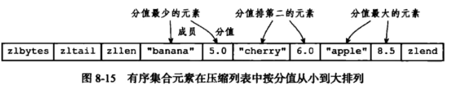

skiplist 编码的有序集合对象使用 zet 结构作为底层实现，一个 zset 结构同时包含一个字典和一个跳跃表：

```cpp
typedef struct zset{
     //跳跃表
     zskiplist *zsl;
     //字典
     dict *dice;
} zset;
```

字典的键保存元素的值，字典的值则保存元素的分值；跳跃表节点的 object 属性保存元素的成员，跳跃表节点的 score 属性保存元素的分值。

## 4.5：跳跃表

跳跃表是一种有序的数据结构，它通过在每个节点维持多个指向其他节点的指针，从而达到快速访问节点的目的。

### 什么是跳跃表

对于单个链表来讲，即便链表中存储的数据是有序的，如果我们要向在其中查找某个数据，它只能从头到尾遍历链表。这样查找效率就会很低，时间复杂度会很高，达到了 O(n)。


如果我们想要提高其查询效率，可以考虑在链表上构建索引的 方式，每两个节点提取一个节点到上级，我们把抽出来的那一级就叫做索引。

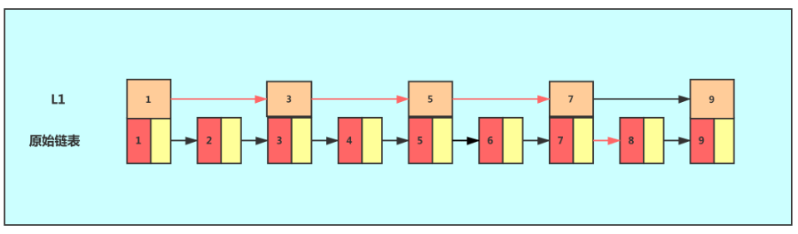

这个时候，我们假设要查找节点 8，我们可以心在索引层遍历，当遍历到索引层中值为 7 的节点时，发现下一个节点是 9，那么要查找的节点肯定在这两个节点之间，我们下降到链表层继续遍历就找到了 8 这个节点。。原来我们在单链表中找到 8 这个节点要遍历 8 个节点，而现在有了一级索引后，只需要遍历 5 个节点。

从上个例子中，我们可以看出，加来一层索引后，查找一个节点需要遍历的节点个数减少了，也就是说查询效率得到了提升，同理我们在一级索引的基础上，在加二级索引。

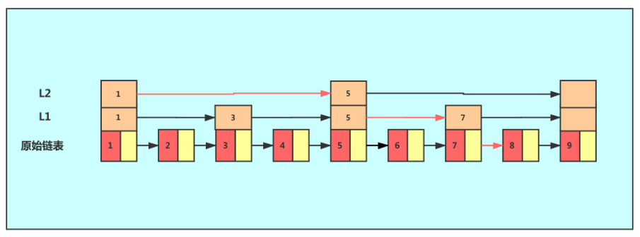

从图中我们可以看出，查找效率又有了提升，因为在这里例子中我们的数据量很少，当有大量的数据时，我们可以增加多级索引，在查询时，效率可以得到明显的提升。

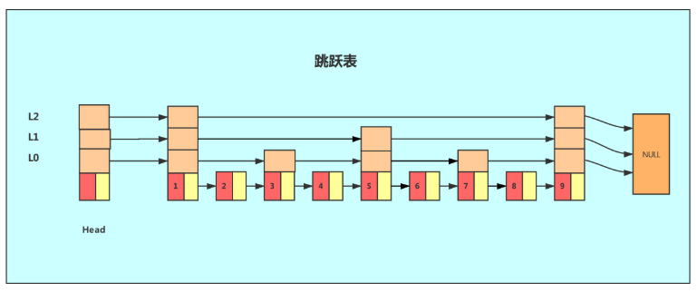

像这种链表增加多种索引的结构，就是跳跃表。

### Redis 中的跳跃表

从上面跳跃表的定义我们可以知道，如果使用跳跃表作为底层的数据结构，那么需要保证 元素之间的**有序性**，而且 sortSet 我们知道，他就是一个元素和元素之间排序好。

Redis 中使用跳跃表作为有序集合键的底层实现之一，以下几种情况将会让 Redis 使用跳跃表作为有序集合键的底层实现

- 一个有序集合包含的元素数量比较多
- 有序集合中元素的成员键比较长

跳跃表支持平均 O(logN)、最坏 O(N) 复杂度的节点查找，还可以通过顺序性操作来批量处理节点。在大部分情况下，跳跃表的效率可以和平衡树相媲美，并且因为跳跃表的实现比平衡树要来得更为简单，所以有不少程序都使用跳跃表来代替平衡树。

**那么为什么元素数量比较多或者比较长的字符串的时候，Redis 要使用跳跃表来实现呢？**

从上面我们知道，跳跃表就是在链表的基础上，增加了多级索引以提升查找的效率，其实就是一个空间换时间的方法，必然会带来一个问题 -- 索引是占内存的。

原始链表中存储的有可能是很大的对象，而索引节点只需要存储键值和几个指针，并不需要存储对象，因此当节点本身比较大或者元素数量比较多的时候，其优势必然会被放大，而缺点几乎可以忽略。

### Redis 中跳跃表的实现

Redis 的跳跃表由 zSkipListNode 和 skipList 两个结构定义，其中 zSkipListNode 结构用于表示跳跃表节点，而 zSkipList 结构则用于保存跳跃表节点的相关信息，比如节点的数量，以及指向表头节点和表尾节点的指针等等。


上图展示了一个跳跃表的实例，其中最左边的是 skipList 结构，该结构包含以下属性

- header：指向跳跃表的表头节点，通过这个指针程序定位表头节点的时间复杂度就为 O(1)
- tail：指向跳跃表的表尾节点,通过这个指针程序定位表尾节点的时间复杂度就为 O(1)
- level：记录目前跳跃表内,层数最大的那个节点的层数(表头节点的层数不计算在内)，通过这个属性可以再 O(1)的时间复杂度内获取层高最好的节点的层数。
- length：记录跳跃表的长度,也即是,跳跃表目前包含节点的数量(表头节点不计算在内)，通过这个属性，程序可以再 O(1)的时间复杂度内返回跳跃表的长度。

结构右方的是四个 zskiplistNode 结构,该结构包含以下属性

- 层

节点中用 L1、L2、L3 等字样标记节点的各个层,L1 代表第一层,L 代表第二层,以此类推。

每个层都带有两个属性:前进指针和跨度。前进指针用于访问位于表尾方向的其他节点,而跨度则记录了前进指针所指向节点和当前节点的距离(跨度越大、距离越远)。在上图中,连线上带有数字的箭头就代表前进指针,而那个数字就是跨度。当程序从表头向表尾进行遍历时,访问会沿着层的前进指针进行。

每次创建一个新跳跃表节点的时候,程序都根据幂次定律(powerlaw）,越大的数出现的概率越小)随机生成一个介于 1 和 32 之间的值作为 level 数组的大小,这个大小就是层的“高度”。

- 后退(backward)指针

节点中用 BW 字样标记节点的后退指针,它指向位于当前节点的前一个节点。后退指针在程序从表尾向表头遍历时使用。与前进指针所不同的是每个节点只有一个后退指针，因此每次只能后退一个节点。

- 分值(score)

各个节点中的 1.0、2.0 和 3.0 是节点所保存的分值。在跳跃表中,节点按各自所保存的分值从小到大排列。

- 成员对象(oj)

各个节点中的 o1、o2 和 o3 是节点所保存的成员对象。在同一个跳跃表中,各个节点保存的成员对象必须是唯一的,但是多个节点保存的分值却可以是相同的:分值相同的节点将按照成员对象在字典序中的大小来进行排序,成员对象较小的节点会排在前面(靠近表头的方向),而成员对象较大的节点则会排在后面(靠近表尾的方向)。

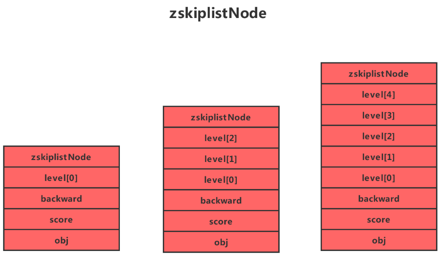

Redis 为什么使用跳表而不是红黑树？

增删查输出跳表和红黑树的实现复杂度都是相同的 O(logN)，但是按照范围区间查找时红黑树就没有调表的效率高了。

## 4.6：Keys 命令

### 常用命令

keys

返回满足给定 pattern 的所有 key

```cmd
keys mylist*
```

exists

确认一个 key 是否存在

示例：从结果来看，数据库中不存在 HongWan 这个 key，但是 age 这个 key 是存在的

```cmd
exists setA
```

del

删除一个 key

```cmd
del setA
```

rename

重命名 key

示例：age 成功的被我们改名为 age_new 了

```cmd
keys set*
rename set setC
keys set*
```

type

返回值的类型

示例：这个方法可以非常简单的判断出值的类型

```cmd
 type scoreboard
```

设置 key 的生存时间

Redis 在实际使用过程中更多的用作缓存，然而缓存的数据一般都是需要设置生存时间的，即：到期后数据销毁。

EXPIRE key seconds 设置 key 的生存时间（单位：秒）key 在多少秒后会自动删除

TTL key 查看 key 生于的生存时间 PERSIST key 清除生存时间

PEXPIRE key milliseconds 生存时间设置单位为：毫秒


# 第五章：Redis 持久化方案

Redis 持久化的意义，在于故障恢复，也属于高可用的一个环节。

## 5.1：RDB 方式

Redis 默认的方式，redis 通过快照来将数据持久化到磁盘中。设置持久化快照的条件在 redis.conf 中修改持久化快照的条件，如下：


持久化文件存储的目录

在 redis.conf 中可以指定持久化文件存储的目录

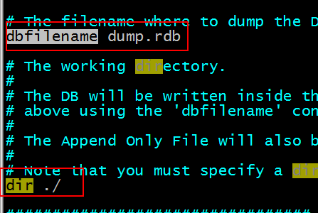

为了保证数据的可靠性，Redis 执行的**「全量快照」**，也就是把内存中的所有数据都写到磁盘中。

随着数据量的增大，一次性把全部数据都写到磁盘中势必会造成线程阻塞，这就关系到 Redis 的性能了。

针对线程阻塞的问题 Redis 提供了两个命令，如下：

1. `save`：在主线程中执行，会导致主线程阻塞。
2. `bgsave`：`fork`一个子进程，专门用于写入`RDB`文件，避免了主线程的阻塞，这是 Redis 的默认配置。

这样就可以使用`bgsave`命令执行全量快照，既可以保证数据的可靠性也避免了主线程的阻塞。

### Rdb 问题

一旦 redis 非法关闭，那么会丢失最后一次持久化之后的数据。

如果数据不重要，则不必要关心。

如果数据不能允许丢失，那么要使用 aof 方式。

## 5.2：AOF 方式

Redis 默认是不使用该方式持久化的。AOF(Append Only File)方式的持久化，是操作一次 redis 数据库，`AOF`日志（文本形式）会将收到每一条的命令且执行成功的命令以一定的格式写入到文本中（追加的方式）。

第一步：开启 aof 方式的持久化方案

将 redis.conf 中的 appendonly 改为 yes，即开启 aof 方式的持久化方案。

```properties
appendonly yes
```

Aof 文件存储的目录和 rdb 方式的一样。Aof 文件存储的名称

```properties
appendfilename "appendonly.aof"
```

风险：

由于是写后日志，如果在命令执行成功之后，在日志未写入磁盘之前服务器突然宕机，那重启恢复数据的时候，这部分的数据肯定在日志文件中不存在了，那么将会丢失。

虽然不会阻塞当前命令的执行，由于记录日志也是在主线程中（`Redis`是单线程），如果日志写入磁盘的时候突然阻塞了，肯定会影响下一个命令的执行。

`AOF`日志提供了三种回写策略

这些都在`appendfsync`配置，如下：

1. `Always`（同步写回）：命令执行完成，立马同步的将日志写入磁盘
2. `Everysec`（每秒写回）：命令执行完成后，先将日志写入 AOF 文件的内存缓冲区，每隔一秒把缓冲区中内容写入磁盘。
3. `No`(操作系统控制的写回)：每个写命令执行完，只是先把日志写到`AOF`文件的内存缓冲区，由操作系统决定何时将缓冲区内容写回磁盘。

日志文件过大怎么办？

随着数据量的增大，AOF 日志文件难免会很大，这样将会导致写入和恢复数据都将变得非常慢。此时 AOF 提供了一种**「重写机制」**解决这一问题。

重写机制：即 Redis 会创建一个新的`AOF`文件，将每个键值对的最终值写成 set 命令写入文件中，减少中间修改的 update 命令

AOF 重写过程是由后台子进程`bgrewriteaof`来完成的，这也是为了避免阻塞主线程，导致数据库性能下降。

过程：

指每次执行重写时，主线程都`fork`一个子线程`bgrewriteaof`，主线程会把内存数据拷贝一份到子线程，此时子线程中包含了数据库的最新数据。然后子线程就能在不影响主线程的情况下进行 AOF 重写了。

### 结论

在使用 aof 和 rdb 方式时，如果 redis 重启，则数据从 aof 文件加载。

# 第六章：事务

Redis 事务功能是通过 MULTI、EXEC、DISCARD 和 WATCH 四个原语实现的

Redis 会将一个事务中的所有命令序列化，然后按顺序执行。

1. redis 不支持回滚“Redis 在事务失败时不进行回滚，而是继续执行余下的命令”， 所以 Redis 的内部可以保持简单且快速。
2. 如果在一个事务中的命令出现错误，那么所有的命令都不会执行；
3. 如果在一个事务中出现运行错误，那么正确的命令会被执行。

注：redis 的 discard 只是结束本次事务,正确命令造成的影响仍然存在.

1）MULTI 命令用于开启一个事务，它总是返回 OK。MULTI 执行之后，客户端可以继续向服务器发送任意多条命令，这些命令不会立即被执行，而是被放到一个队列中，当 EXEC 命令被调用时，所有队列中的命令才会被执行。

2）EXEC：执行所有事务块内的命令。返回事务块内所有命令的返回值，按命令执行的先后顺序排列。当操作被打断时，返回空值 nil 。

3）通过调用 DISCARD，客户端可以清空事务队列，并放弃执行事务， 并且客户端会从事务状态中退出。

4）WATCH 命令可以为 Redis 事务提供 check-and-set （CAS）行为。可以监控一个或多个键，一旦其中有一个键被修改（或删除），之后的事务就不会执行，监控一直持续到 EXEC 命令。watch 指令在一次事务执行完毕后，即结束其生命周期。

### 乐观锁实现

Redis 的事务机制以及 watch 指令（CAS）实现乐观锁。

```java
		while (true) {
            try {
                jedis.watch(key);
                System.out.println("顾客:" + clientName + "开始抢商品");
                System.out.println("当前商品的个数：" + jedis.get(key));
                //当前商品个数
                int prdNum = Integer.parseInt(jedis.get(key));
                if (prdNum > 0) {

                    //开启事务，返回一个事务控制对象
                    Transaction transaction = jedis.multi();
                    //预先在事务对象中装入要执行的操作
                    transaction.set(key, String.valueOf(prdNum - 1));
                    List<Object> exec = transaction.exec();
                    if (exec == null || exec.isEmpty()) {
                        //可能是watch-key被外部修改，或者是数据操作被驳回
                        System.out.println("悲剧了，顾客:" + clientName + "没有抢到商品");
                    } else {
                        //这个命令是做啥的。//抢到商品记录一下
                        jedis.sadd(clientList, clientName+"");
                        System.out.println("好高兴，顾客:" + clientName + "抢到商品");
                        break;
                    }
                }
            } catch (NumberFormatException e) {
                e.printStackTrace();
            }finally {
                jedis.unwatch();
            }
        }
```

# 第六章：Redis 的主从复制

## 6.1：什么是主从复制

持久化保证了即使 redis 服务重启也不会丢失数据，因为 redis 服务重启后会将硬盘上持久化的数据恢复到内存中，但是当 redis 服务器的硬盘损坏了可能会导致数据丢失，如果**通过 redis 的主从复制机制就可以避免这种单点故障**，如下图：

说明：

主 redis 中的数据有两个副本（replication）即从 redis1 和从 redis2，即使一台 redis 服务器宕机其它两台 redis 服务也可以继续提供服务。

主 redis 中的数据和从 redis 上的数据保持实时同步，当主 redis 写入数据时通过主从复制机制会复制到两个从 redis 服务上。

只有一个主 redis，可以有多个从 redis。

主从复制不会阻塞 master，在同步数据时，master 可以继续处理 client 请求

一个 redis 可以即是主又是从，如下图：

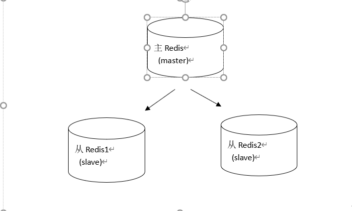

## 6.2：主从复制设置

### 主机配置

无需配置

### 从机配置

第一步：复制出一个从机

[root\@xqc redis19]\# cp bin/ bin2 –r

第二步：修改从机的 redis.conf

语法：Slaveof masterip masterport

slaveof 192.168.242.137 6379


第三步：修改从机的 port 地址为 6380

在 redis.conf 中修改

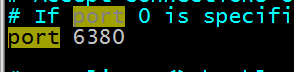

第四步：清除从机中的持久化文件

[root\@xqc bin2]\# rm -rf appendonly.aof dump.rdb

第五步：启动从机

[root\@xqc bin2]\# ./redis-server redis.conf

第六步：启动 6380 的客户端

[root\@xqc bin2]\# ./redis-cli -p 6380

注意：

主机一旦发生增删改操作，那么从机会将数据同步到从机中

从机不能执行写操作

| 127.0.0.1:6380\> set s2 222 (error) **READONLY You can't write against a read only slave.**

### 原理

**全量同步**

一般发生在从机初始化阶段，步骤：

```
-  从服务器连接主服务器，发送SYNC命令；
-  主服务器接收到SYNC命名后，开始执行BGSAVE命令生成RDB文件并使用缓冲区记录此后执行的所有写命令；
-  主服务器BGSAVE执行完后，向所有从服务器发送快照文件，并在发送期间继续记录被执行的写命令；
-  从服务器收到快照文件后丢弃所有旧数据，载入收到的快照；
-  主服务器快照发送完毕后开始向从服务器发送缓冲区中的写命令；
-  从服务器完成对快照的载入，开始接收命令请求，并执行来自主服务器缓冲区的写命令；
```

**增量同步**

Redis 增量复制是指 Slave 初始化后开始正常工作时主服务器发生的写操作同步到从服务器的过程

增量复制的过程主要是主服务器每执行一个写命令就会向从服务器发送相同的写命令，从服务器接收并执行收到的写命令。

### 主机挂了

1：选择一台从机作为新的主机，参考的依据是偏移量

2：将选中的从机变成新主机，命令slaveof  no one 

3：客户点连接新主机

其他从机跟随主机建立主从关系，哨兵监控

## 哨兵模式 RedisSentinel

master 宕机了，选择其他的从节点称为 master：步骤：

（1）将宕机的 master 下线——谁来确定 master 宕机了？

（2）找一个 slave 作为 master——怎么找？

（3）通知所有的 slave 连接新的 master——配置后，主恢复了怎么办？

（4）启动新的 master 与 slave

（5）全量复制 _ N + 部分复制 _ N

哨兵：一个分布式系统，用于对主从结构中的每台服务器进行监控，当出现故障时通过投票机制选择新的 master 并将所有 slave 连接到新的 master。监控，通知，自动故障转移。

注意哨兵也是一台 redis 服务器，只是不提供数据服务，通常哨兵配置数量为单数，为防止竞选投票的问题

### 原理

**监控**

用于同步各个节点的状态信息：

- 获取各个哨兵的状态
- 获取主节点状态：master 属性，各个 slave 的详细信息
- 获取所有 slave 的状态：根据 master 中 slave 的信息

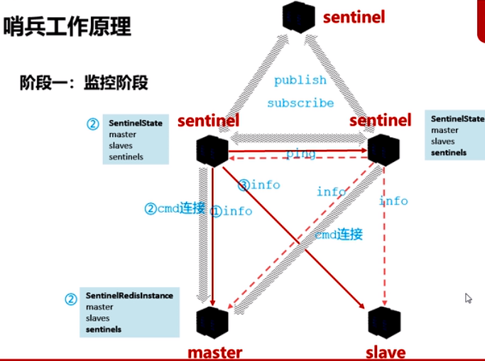

sentinel 会向 master，slave 以及其他 sentinel 获取状态，Sentinel 之间会组件“对应频道”，大家一起发布信息，订阅信息，收信息，同步信息等。

**通知**

哨兵 1 向主发 hello，然后获取后发送到哨兵集群

**故障转移阶段**

一开始哨兵 1 给主节点发 Hello，但是主节点没回，标记为 SRI_S_DOWN（主观下线），然后发送给所有哨兵，然后其他哨兵也去发 hello 验证，只要半数以上的哨兵认为 master 挂了，就将状态改为 SRI_O_DOWN（客观下线）

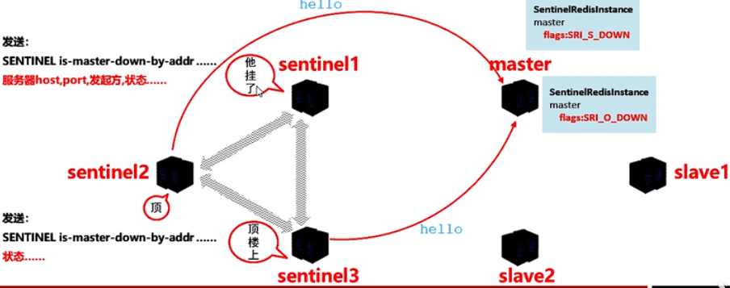

清理队伍：

选出领头的哨兵：每个哨兵有一票，按照每个哨兵接受到其他哨兵的先后顺序，决定将自己的票投给哪一个哨兵，如果有哨兵得到了半数以上的票，就成为领头，如果没有，就再选一轮，竞选次数加一。

处置选举 master：

- 服务器列表挑选 master：在线的，响应快的，与原 master 断开时间近的，优先级，偏移量，runid 比较小
- 发送指令：向新的 master 发送 slave of no one ，让其成为主节点；向其他 slave 发送 slaveof 新 masterIP 端口。

Redis-Sentinel(哨兵模式)是 Redis 官方推荐的高可用性(HA)解决方案，当用 Redis 做 Master-slave 的高可用方案时，假如 master 宕机了，Redis 本身(包括它的很多客户端)都没有实现自动进行主备切换，而 Redis-sentinel 本身也是一个独立运行的进程，它能监控多个 master-slave 集群，发现 master 宕机后能进行自懂切换。它的主要功能有以下几点：

不时地监控 redis 是否按照预期良好地运行;

如果发现某个 redis 节点运行出现状况，能够通知另外一个进程(例如它的客户端);

能够进行自动切换。当一个 master 节点不可用时，能够选举出 master 的多个 slave(如果有超过一个 slave 的话)中的一个来作为新的 master,其它的 slave 节点会将它所追随的 master 的地址改为被提升为 master 的 slave 的新地址。

Sentinel 也支持集群分布

# 第七章：Redis 集群

## Redis Cluster

是 Redis 的集群模式

- 自动将数据进行分片，每个 master 上放一部分数据
- 提供内置的高可用支持，部分 master 不可用时，还是可以继续工作的

在 redis cluster 架构下，每个 redis 要放开两个端口号，比如一个是 6379，另外一个就是加 10000 的端口号，比如 16379 端口号是用来进行节点间通信的，也就是 cluster bus 的东西，集群总线。cluster bus 的通信，用来进行故障检测，配置更新，故障转移授权

每个主节点都致辞读写操作，分担了写的压力，后期继续增加新的主机，然后做Hash迁移，新制剂就可以分单压力。

因为每个节点负责的区域不同，所以，往里面保存数据的时候，比如set key value，这个时候，要根据key来做crc16算法，从而得到一个数值，数值 % 16384 = （0-18383）从而确定存储到哪个节点。

支持做数据迁移。

Redis replicSpring Cloud Alibaba Nacos Config目前提供了三种配置能力从Nacos拉取相关的配

A:通过spring.cloud.nacos.config.shared-dataids支持多个共享Data ld 的配

B:通过spring.cloud.nacos.config .ext-config[n].data-id 的方式支持多个扩展Data ld的配置，多个Data ld同时配置时，他的优先级关系是 spring.cloud.nacos.config.ext-config[n].data-id其中 n的值越大，优先级越高。

C:通过内部相关规则(应用名、扩展名)自动生成相关的Data ld配置当三种方式共同使用时，他们的一个优先级关系是:C>B>A

ation + sentinel：高可用模式

如果你的数据量很少，主要是承载高并发高性能的场景，比如你的缓存一般就几个 G，单机足够了，replication，一个 mater，多个 slave，要几个 slave 跟你的要求的读吞吐量有关系，然后自己搭建一个 sentinal 集群，去保证 redis 主从架构的高可用性，就可以了

redis cluster，主要是针对海量数据+高并发+高可用的场景，海量数据，如果你的数据量很大，那么建议就用 redis cluster

## 7.1：redis-cluster 架构图


架构细节:

(1)所有的 redis 节点彼此互联(PING-PONG 机制),内部使用二进制协议优化传输速度和带宽.

(2)节点的 fail 是通过集群中**超过半数的节点检测**失效时才生效.

(3)客户端与 redis 节点直连,不需要中间 proxy 层.客户端不需要连接集群所有节点,连接集群中任何一个可用节点即可

(4)redis-cluster 把所有的物理节点映射到[0-16383]slot 上,cluster 负责维护 node\<-\>slot\<-\>value

Redis 集群中内置了 16384 个哈希槽，当需要在 Redis 集群中放置一个 key-value 时，redis 先对 key 使用 crc16 算法算出一个结果，然后把结果对 16384 求余数，这样每个 key 都会对应一个编号在 0-16383 之间的哈希槽，redis 会根据节点数量大致均等的将哈希槽映射到不同的节点

示例如下：

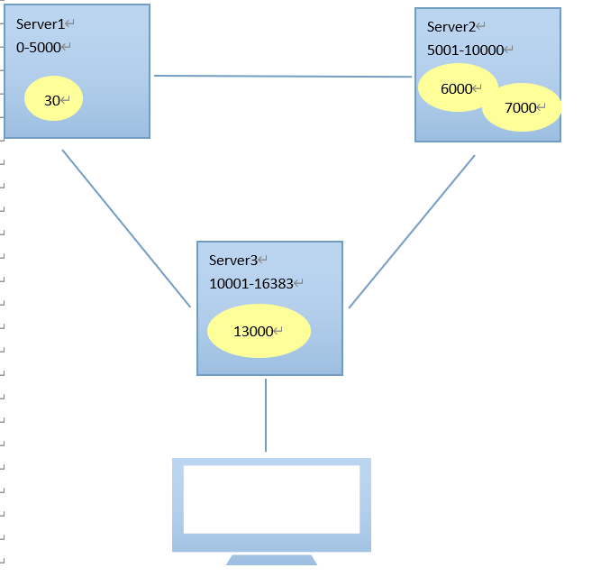

## 7.2：redis-cluster 投票:容错

(1)集群中所有 master 参与投票,如果半数以上 master 节点与其中一个 master 节点通信超过(cluster-node-timeout),认为该 master 节点挂掉.

(2):什么时候整个集群不可用(cluster_state:fail)?

- 如果集群任意 master 挂掉,且当前 master 没有 slave，则集群进入 fail 状态。也可以理解成集群的[0-16383]slot 映射不完全时进入 fail 状态。

- 如果集群超过半数以上 master 挂掉，无论是否有 slave，集群进入 fail 状态。

## 7.3：安装 ruby

## 7.4：搭建集群


# 第八章：jedis 连接集群

## 设置防火墙

```shell
vim /etc/sysconfig/iptables

Firewall configuration written by system-config-firewall

Manual customization of this file is not recommended.

*filter
:INPUT ACCEPT [0:0]
:FORWARD ACCEPT [0:0]
:OUTPUT ACCEPT [0:0]
-A INPUT -m state --state ESTABLISHED,RELATED -j ACCEPT
-A INPUT -p icmp -j ACCEPT
-A INPUT -i lo -j ACCEPT
-A INPUT -m state --state NEW -m tcp -p tcp --dport 22 -j ACCEPT
-A INPUT -m state --state NEW -m tcp -p tcp --dport 3306 -j ACCEPT
-A INPUT -m state --state NEW -m tcp -p tcp --dport 8080 -j ACCEPT
-A INPUT -m state --state NEW -m tcp -p tcp --dport 6379 -j ACCEPT
-A INPUT -j REJECT --reject-with icmp-host-prohibited
-A FORWARD -j REJECT --reject-with icmp-host-prohibited
COMMIT


> service iptables restart
iptables：清除防火墙规则：                                 [确定]
iptables：将链设置为政策 ACCEPT：filter                    [确定]
iptables：正在卸载模块：                                   [确定]
iptables：应用防火墙规则：                                 [确定]
```

## 代码

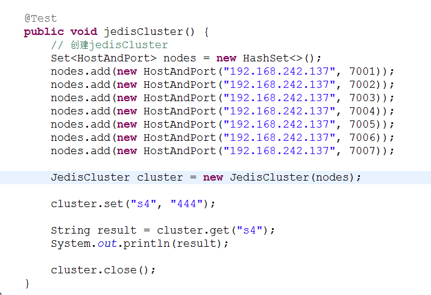

## 使用 spring

- 配置 applicationContext.xml

```xml
  <!-- 连接池配置 -->
  <bean id="jedisPoolConfig" class="redis.clients.jedis.JedisPoolConfig">
  	<!-- 最大连接数 -->
  	<property name="maxTotal" value="30" />
  	<!-- 最大空闲连接数 -->
  	<property name="maxIdle" value="10" />
  	<!-- 每次释放连接的最大数目 -->
  	<property name="numTestsPerEvictionRun" value="1024" />
  	<!-- 释放连接的扫描间隔（毫秒） -->
  	<property name="timeBetweenEvictionRunsMillis" value="30000" />
  	<!-- 连接最小空闲时间 -->
  	<property name="minEvictableIdleTimeMillis" value="1800000" />
  	<!-- 连接空闲多久后释放, 当空闲时间>该值 且 空闲连接>最大空闲连接数 时直接释放 -->
  	<property name="softMinEvictableIdleTimeMillis" value="10000" />
  	<!-- 获取连接时的最大等待毫秒数,小于零:阻塞不确定的时间,默认-1 -->
  	<property name="maxWaitMillis" value="1500" />
  	<!-- 在获取连接的时候检查有效性, 默认false -->
  	<property name="testOnBorrow" value="true" />
  	<!-- 在空闲时检查有效性, 默认false -->
  	<property name="testWhileIdle" value="true" />
  	<!-- 连接耗尽时是否阻塞, false报异常,ture阻塞直到超时, 默认true -->
  	<property name="blockWhenExhausted" value="false" />
  </bean>
  <!-- redis集群 -->
  <bean id="jedisCluster" class="redis.clients.jedis.JedisCluster">
  	<constructor-arg index="0">
  		<set>
  			<bean class="redis.clients.jedis.HostAndPort">
  				<constructor-arg index="0" value="192.168.101.3"></constructor-arg>
  				<constructor-arg index="1" value="7001"></constructor-arg>
  			</bean>
  			<bean class="redis.clients.jedis.HostAndPort">
  				<constructor-arg index="0" value="192.168.101.3"></constructor-arg>
  				<constructor-arg index="1" value="7002"></constructor-arg>
  			</bean>
  			<bean class="redis.clients.jedis.HostAndPort">
  				<constructor-arg index="0" value="192.168.101.3"></constructor-arg>
  				<constructor-arg index="1" value="7003"></constructor-arg>
  			</bean>
  			<bean class="redis.clients.jedis.HostAndPort">
  				<constructor-arg index="0" value="192.168.101.3"></constructor-arg>
  				<constructor-arg index="1" value="7004"></constructor-arg>
  			</bean>
  			<bean class="redis.clients.jedis.HostAndPort">
  				<constructor-arg index="0" value="192.168.101.3"></constructor-arg>
  				<constructor-arg index="1" value="7005"></constructor-arg>
  			</bean>
  			<bean class="redis.clients.jedis.HostAndPort">
  				<constructor-arg index="0" value="192.168.101.3"></constructor-arg>
  				<constructor-arg index="1" value="7006"></constructor-arg>
  			</bean>
  		</set>
  	</constructor-arg>
  	<constructor-arg index="1" ref="jedisPoolConfig"></constructor-arg>
  </bean>
```

- 测试代码

```java
private ApplicationContext applicationContext;
	@Before
	public void init() {
		applicationContext = new ClassPathXmlApplicationContext(
				"classpath:applicationContext.xml");
	}

	// redis集群
	@Test
	public void testJedisCluster() {
		JedisCluster jedisCluster = (JedisCluster) applicationContext
				.getBean("jedisCluster");

		jedisCluster.set("name", "zhangsan");
		String value = jedisCluster.get("name");
		System.out.println(value);
	}
```

## SpringBoot 集成 Redis

详细参考：SpringBoot 整合篇

引入依赖

配置 redis

使用操作不同类型，通过 StringRedisTemplate,RedisTemplate

```java
redisTemplate.opsForValue().set("1",user);
stringTemplate.opsForValue().set("2","string");
```

String：StringRedisTemplate.opsForValue()方法

List：StringRedisTemplate.opsForList()方法

Set：StringRedisTemplate.opsForSet()方法

Hash：StringRedisTemplate.opsForHash()方法

ZSet：StringRedisTemplate.opsForZSet()方法

# 第九章：常见问题

## 内存管理策略

设置有效期的，到期了不是立即回收，占用内存，内存资源没有被合理的利用。

如何回收：

1）惰性回收，

2）定时回收。默认10次/S

3)具体回收算法：TTL（ALL，random），根据过期时间；LRU（最近最少使用），根据是缓存的命中率，不回收（默认行为），满了就只能读，不能写。推荐使用LRU

## 缓存和数据库双写一致性

如果对数据有强一致性要求，不能放缓存。我们所做的一切，只能保证最终一致性。另外，我们所做的方案其实从根本上来说，只能说降低不一致发生的概率，无法完全避免。因此，有强一致性要求的数据，不能放缓存。

采取正确更新策略，先更新数据库，再删缓存。其次，因为可能存在删除缓存失败的问题，提供一个补偿措施即可，例如利用消息队列。

加入到缓存时一般都会设置过期时间。

（1）读的时候，先读缓存，缓存没有的话，那么就读数据库，然后取出数据后放入缓存，同时返回响应

（2）更新的时候，先删除缓存，然后再更新数据库

## 数据一致性问题

以下方式都会出现问题，要会分析怎么出现错误：

策略 1：先更新缓存，再更新数据库

策略 2：先更新数据库，再更新缓存

策略 3：**先删除缓存，再更新数据库**

问题：A 先删缓存，B 读取缓存没有，就读数据库，然后将旧值写入缓存，然后 A 再更新数据库，则出现不一致现象。

解决办法：**延时双删，在 A 更新数据库后再删一次缓存**

A 先删缓存，B 读取缓存没有，就读数据库，然后将旧值写入缓存，然后 A 再更新数据库，延迟一段时间删除缓存。延迟时间大于一次读操作时间，

策略 4：**先更新数据库，再删除缓存**

问题：A 读数据库 x=3，B 更新数据库 x=4，然后 B 删除缓存，A 将读取旧值 x=3 写入缓存，但是出现概率比较低，写操作时间是大于读操作时间的。

解决方法：**延时双删**

问题：延时双删的时候失败了怎么办？

不断循环删除

实现延时双删：整合quartz定时任务框架，去实现延时3-5s再去执行删除操作。

写DB前后都执行`redis.del(key)`，并设定合理超时时间。

注解实现双删：https://my.oschina.net/penghaozhong/blog/4527348，只是双删，没有延时

**经典方式：**

读的时候先读缓存，缓存没有，再去数据，读到后更新至缓存;

更新的时候，先删除缓存，再更新数据库，然后再删一遍

定时任务从数据库增量的抽取数据更新至缓存，

定时任务更新缓存，

延时双删的实现——延时队列

延时到了就删除，如果没有删除成功，再多试几次，还失败就进入死信队列

方法，串行化

### 懒加载

更新数据时，数据库和缓存更新，就容易出现缓存和数据库间的数据一致性问题。不管是先写数据库，再删除缓存；还是先删除缓存，再写库，都有可能出现数据不一致的情况。举个例子：

1. 如果删除了缓存 Redis，还没有来得及写库 MySQL，另一个线程就来读取，发现缓存为空，则去数据库中读取数据写入缓存，此时缓存中为脏数据。
2. 如果先写了库，在删除缓存前，写库的线程宕机了，没有删除掉缓存，则也会出现数据不一致情况。

综合考虑后使用：前后双删加懒加载模式。

就是当业务读取数据的时候再从存储层加载的模式，而不是更新后主动刷新

试想一下，同时有多个服务器的多个线程进行’步骤 1.2 更新 DB’，更新 DB 完成之后，它们就要进行异步刷缓存，我们都知道多服务器的异步操作，是无法保证顺序的，所以后面的刷新操作存在相互覆盖的并发问题，也就是说，存在先更新的 DB 操作，反而很晚才去刷新缓存，那这个时候，数据也是错的。

### 主动加载

写流程：

第一步先删除缓存，删除之后再更新 DB，之后再异步将数据刷回缓存。

读流程：

第一步先读缓存，如果缓存没读到，则去读 DB，之后再异步将数据刷回缓存。

这种模式简单易用，但是它有一个致命的缺点就是并发会出现脏数据。

试想一下，同时有多个服务器的多个线程进行’步骤 1.2 更新 DB’，更新 DB 完成之后，它们就要进行异步刷缓存，我们都知道多服务器的异步操作，是无法保证顺序的，所以后面的刷新操作存在相互覆盖的并发问题，也就是说，存在先更新的 DB 操作，反而很晚才去刷新缓存，那这个时候，数据也是错的。

1. 懒加载模式缓存可采取双删+TTL 失效来实现；
2. 双删失败情况下可采取重试措施，重试有业务通过 mq 重试以及组件消费 mysql 的 binlog 再写入 mq 重试两种方式；
3. 主动加载由于操作本身不具有幂等性，所以需要考虑加载的有序性问题，采取 mq 的分区机制实现串行化处理，实现缓存和 mysql 数据的最终一致，此时读和写操作的缓存加载事件是走的同一个 mq。


## 缓存穿透与雪崩

**缓存穿透**：即黑客故意去请求缓存中不存在的数据，导致所有的请求都怼到数据库上，从而数据库连接异常。

解决方案:

1：缓存空对象：如果查不到，将自定义一个空对象加入到缓存中，效果不好，如果是那种连着 1 到 100 万那种访问，还是要去查数据库。

2：布隆过滤器

谷歌的 guava 的布隆过滤器实现很不好，需要自己写，只有两个方法。put 方法和 mightContain(i) 方法，谷歌的保存在 JVM 内存中，自己写一个保存在 redis 中。

维护很麻烦：

往订单表中添加数据，同时也要往布隆过滤器中添加，

布隆过滤器没办法删除，定时任务重建布隆过滤器

(一)利用互斥锁，缓存失效的时候，先去获得锁，得到锁了，再去请求数据库。没得到锁，则休眠一段时间重试

(二)采用异步更新策略，无论 key 是否取到值，都直接返回。value 值中维护一个缓存失效时间，缓存如果过期，异步起一个线程去读数据库，更新缓存。需要做缓存预热(项目启动前，先加载缓存)操作。

(三)提供一个能迅速判断请求是否有效的拦截机制，比如，利用布隆过滤器，内部维护一系列合法有效的 key。迅速判断出，请求所携带的 Key 是否合法有效。如果不合法，则直接返回。

**缓存雪崩**：即缓存同一时间大面积的失效，这个时候又来了一波请求，结果请求都怼到数据库上，从而导致数据库连接异常。

解决方案:

事前：

(一)给缓存的失效时间，加上一个随机值，避免集体失效。

(三)双缓存。我们有两个缓存，缓存 A 和缓存 B。缓存 A 的失效时间为 20 分钟，缓存 B 不设失效时间。自己做缓存预热操作。然后细分以下几个小点

- I 从缓存 A 读数据库，有则直接返回
- II A 没有数据，直接从 B 读数据，直接返回，并且异步启动一个更新线程。
- III 更新线程同时更新缓存 A 和缓存 B。

(二)使用互斥锁，但是该方案吞吐量明显下降了。

事中：

出现雪崩，降级，熔断

事后：redis 持久化，快速恢复缓存数据，一般重启，自动从磁盘上加载数据恢复内存中的数据。

## 缓存击穿问题

缓存击穿是指缓存中没有但数据库中有的数据（一般是缓存时间到期），这时由于并发用户特别多，同时读缓存没读到数据，又同时去数据库去取数据，引起数据库压力瞬间增大，造成过大压力。

解决：

使用分布式锁，查询数据库前加个锁，锁的 id 就用访问的 id，

查缓存没有，加锁，查缓存，查数据库，更新缓存，解锁

如果大量过来之后，先放一个线程进来，去 redis 中查，没有这个线程再去数据库查，查完同步到 redis，然后再把其他线程放进来。

（1）设置热点数据永远不过期。

（2）加互斥锁。

区别：

缓存穿透：访问不存在的 key

缓存雪崩：访问的缓存中无，数据库中有，

缓存雪崩：大量失效的缓存，直接怼到数据库中

代码太多太混乱，可以封装成模板

## 缓存的并发竞争

单线程的 redis 为什么这么快？

(一)纯内存操作
(二)单线程操作，避免了频繁的上下文切换
(三)采用了非阻塞 I/O 多路复用机制

## 过期策略以及内存淘汰机制

redis 只能存 5G 数据，可是你写了 10G，那会删 5G 的数据。怎么删的，这个问题思考过么？还有，你的数据已经设置了过期时间，但是时间到了，内存占用率还是比较高，有思考过原因么?

答：redis 采用的是定期删除+惰性删除策略。

定期删除，redis 默认每个 100ms 检查，是否有过期的 key,有过期 key 则删除。需要说明的是，redis 不是每个 100ms 将所有的 key 检查一次，而是随机抽取进行检查(如果每隔 100ms,全部 key 进行检查，redis 岂不是卡死)。因此，如果只采用定期删除策略，会导致很多 key 到时间没有删除。

于是，惰性删除派上用场。也就是说在你获取某个 key 的时候，redis 会检查一下，这个 key 如果设置了过期时间那么是否过期了？如果过期了此时就会删除。

如果定期删除没删除 key。然后你也没即时去请求 key，也就是说惰性删除也没生效。这样，redis 的内存会越来越高。那么就应该采用内存淘汰机制。

在 redis.conf 中有一行配置

```xml
maxmemory-policy volatile-lru
```

1）noeviction：当内存不足以容纳新写入数据时，新写入操作会报错。应该没人用吧。

2）allkeys-lru：当内存不足以容纳新写入数据时，在键空间中，移除最近最少使用的 key。推荐使用，目前项目在用这种。

3）allkeys-random：当内存不足以容纳新写入数据时，在键空间中，随机移除某个 key。应该也没人用吧，你不删最少使用 Key,去随机删。

4）volatile-lru：当内存不足以容纳新写入数据时，在设置了过期时间的键空间中，移除最近最少使用的 key。这种情况一般是把 redis 既当缓存，又做持久化存储的时候才用。不推荐

5）volatile-random：当内存不足以容纳新写入数据时，在设置了过期时间的键空间中，随机移除某个 key。依然不推荐

6）volatile-ttl：当内存不足以容纳新写入数据时，在设置了过期时间的键空间中，有更早过期时间的 key 优先移除。不推荐

## 缓存更新

除了缓存服务器自带的缓存失效策略之外（Redis 默认的有 6 中策略可供选择），我们还可以根据具体的业务需求进行自定义的缓存淘汰，常见的策略有两种：

- 定时去清理过期的缓存；
- 当有用户请求过来时，再判断这个请求所用到的缓存是否过期，过期的话就去底层系统得到新数据并更新缓存。

两者各有优劣，第一种的缺点是维护大量缓存的 key 是比较麻烦的，第二种的缺点就是每次用户请求过来都要判断缓存失效，逻辑相对比较复杂！具体用哪种方案，大家可以根据自己的应用场景来权衡。

## 缓存降级

当访问量剧增、服务出现问题（如响应时间慢或不响应）或非核心服务影响到核心流程的性能时，仍然需要保证服务还是可用的，即使是有损服务。系统可以根据一些关键数据进行自动降级，也可以配置开关实现人工降级。

降级的最终目的是保证核心服务可用，即使是有损的。而且有些服务是无法降级的（如加入购物车、结算）。

以参考日志级别设置预案：

- 一般：比如有些服务偶尔因为网络抖动或者服务正在上线而超时，可以自动降级；
- 警告：有些服务在一段时间内成功率有波动（如在 95~100%之间），可以自动降级或人工降级，并发送告警；
- 错误：比如可用率低于 90%，或者数据库连接池被打爆了，或者访问量突然猛增到系统能承受的最大阀值，此时可以根据情况自动降级或者人工降级；
- 严重错误：比如因为特殊原因数据错误了，此时需要紧急人工降级。

服务降级的目的，是为了防止 Redis 服务故障，导致数据库跟着一起发生雪崩问题。因此，对于不重要的缓存数据，可以采取服务降级策略，例如一个比较常见的做法就是，Redis 出现问题，不去数据库查询，而是直接返回默认值给用户。

## Big key 问题

redis 的 key 与 Value 的大小限制？

String 类型：一个 String 类型的 value 最大可以存储 512M

List 类型：list 的元素个数最多为 2^32-1 个，也就是 4294967295 个。

Set 类型：元素个数最多为 2^32-1 个，也就是 4294967295 个。

Hash 类型：键值对个数最多为 2^32-1 个，也就是 4294967295 个。

Sorted set 类型：跟 Set 类型相似。

数据量大的 Key ，导致经过分片之后，某个具体存储这个 big key 的实例内存使用量远大于其他实例，造成内存不足，拖累整个集群的使用。big key 在不同业务上，通常体现为不同的数据

1. 论坛中的大型持久盖楼活动；
2. 聊天室系统中热门聊天室的消息列表；

字符串类型：一般认为超过 10k 的就是 bigkey，

定义：

所谓的 bigkey 就是存储本身的 key 值空间太大，或者 hash，list，set 等存储中 value 值过多。主要包括：单个简单的 key 存储的 value 很大，hash，set，zset，list 中存储过多的元素，一个集群存储了上亿的 key

问题：

读写的时候可能导致超时甚至阻塞服务。

删除或则自动过期时，会出现 QPS 突降或则突生，甚至导致主从复制异常，

解决办法：

1：单个简单的过大问题

将对象拆分成多个 key-value，然后使用 multiGet 获取值

2：hash，set，zset，list 中存储过多的元素

可以对存储元素按一定规则进行分类，分散存储到多个 redis 实例中。 对于一些榜单类的场景，用户一般只会访问前几百及后几百条数据，可以只缓存前几百条以及后几百条，即对用户经常访问的数据做缓存（正序倒序的前几页），而不是全部都做，对于获取中间的数据则可以直接从数据库获取

3：一个集群上存储了上亿的 key

减少 key，可以试试转 Hash

## 分片

Redis 的分片是指将数据分散到多个 Redis 实例中的方法，分片之后，每个 redis 拥有一部分原数据集的子集。在数据量非常大时，分片能将数据量分散到若干主机的 redis 实例上，进而减轻单台 redis 实例的压力。

- 范围分片
- 哈希分片

分片的位置：

- 客户端分片
- 代理分片
- 服务器分片

# 第十章：原理

redis 是单线程的，但是为什么还是这么快呢，

原因 1： 单线程，避免线程之间的竞争和不必要的上下文切换

原因 2 ：是内存中的，使用内存的，可以减少磁盘的 io

原因 3：多路复用模型，用了缓冲区的概念，selector 模型来进行的

使用 NIO 都在内存中，

# 6.0 新特性

2020 年 5 月，6.0 发布支持多线程，但是默认不开启，配置线程数应该小于 CPU 数，虽然开了多线程，但其实还是单线程处理逻辑，不用担心线程安全问题；多线程主要解决 IO 读写瓶颈问题，针对业务量达到亿级的应用，常规项目没有必要使用。

使用 Redis 时，几乎不存在 CPU 成为瓶颈的情况， Redis 主要受限于内存和网络。在一个普通的 Linux 系统上，Redis 通过使用 Pipelining 每秒可以处理 100 万个请求，所以如果应用程序主要使用 O(N) 或 O(log(N)) 的命令，它几乎不会占用太多 CPU。

为什么要引入多线程？

还是 QPS 太高的，采用分布式或集群有缺点，维护代价大
