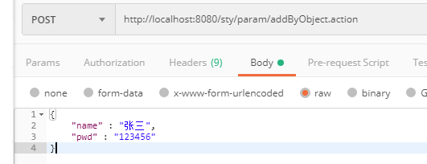
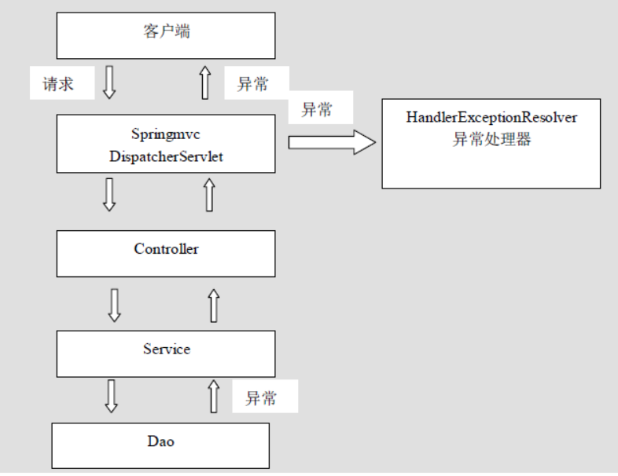
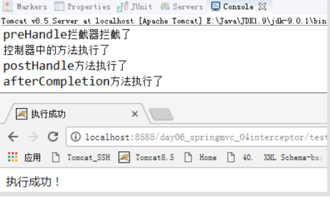

# 第 1 章 ：基本概念

## 1.1 关于三层架构和 MVC

**1.1.1** 三层架构

我们的开发架构一般都是基于两种形式，一种是 C/S 架构，也就是客户端/服务器，另一种是 B/S 架构，也就是浏览器服务器。在 JavaEE 开发中，几乎全都是基于 B/S 架构的开发。那么在 B/S 架构中，系统标准的三层架构包括：表现层、业务层、持久层。三层架构在我们的实际开发中使用的非常多，所以我们课程中的案例也都是基于三层架构设计的。

三层架构中，每一层各司其职，接下来我们就说说每层都负责哪些方面：

表现层：

也就是我们常说的 web 层。它负责接收客户端请求，向客户端响应结果，通常客户端使用 http 协议请求 web 层，web 需要接收 http 请求，完成 http 响应。

表现层包括展示层和控制层：控制层负责接收请求，展示层负责结果的展示。

表现层依赖业务层，接收到客户端请求一般会调用业务层进行业务处理，并将处理结果响应给客户端。

表现层的设计一般都使用 MVC 模型。（MVC 是表现层的设计模型，和其他层没有关系）

业务层：

也就是我们常说的 service 层。它负责业务逻辑处理，和我们开发项目的需求息息相关。web 层依赖业务层，但是业务层不依赖 web 层。

业务层在业务处理时可能会依赖持久层，如果要对数据持久化需要保证事务一致性。（也就是我们说的，事务应该放到业务层来控制）

持久层：

也就是我们是常说的 dao 层。负责数据持久化，包括数据层即数据库和数据访问层，数据库是对数据进行持久化的载体，数据访问层是业务层和持久层交互的接口，业务层需要通过数据访问层将数据持久化到数据库中。通俗的讲，持久层就是和数据库交互，对数据库表进行曾删改查的。

**1.1.2 MVC**模型

MVC 全名是 Model View Controller，是模型(model)－视图(view)－控制器(controller)的缩写，是一种用于设计创建 Web 应用程序表现层的模式。MVC 中每个部分各司其职：

**Model**（模型）：

通常指的就是我们的数据模型。作用一般情况下用于封装数据。

**View**（视图）：

通常指的就是我们的 jsp 或者 html。作用一般就是展示数据的。

通常视图是依据模型数据创建的。

**Controller（控制器）：**

是应用程序中处理用户交互的部分。作用一般就是处理程序逻辑的。

它相对于前两个不是很好理解，这里举个例子：

例如：

我们要保存一个用户的信息，该用户信息中包含了姓名，性别，年龄等等。

这时候表单输入要求年龄必须是 1\~100 之间的整数。姓名和性别不能为空。并且把数据填充到模型之中。

此时除了 js 的校验之外，服务器端也应该有数据准确性的校验，那么校验就是控制器的该做的。

当校验失败后，由控制器负责把错误页面展示给使用者。

如果校验成功，也是控制器负责把数据填充到模型，并且调用业务层实现完整的业务需求。

## 1.2 SpringMVC 概述

**1.2.1 SpringMVC**是什么

SpringMVC 是一种基于 Java 的实现 MVC 设计模型的请求驱动类型的轻量级 Web 框架，属于 Spring FrameWork 的后续产品，已经融合在 Spring Web Flow 里面。Spring 框架提供了构建 Web 应用程序的全功能 MVC 模块。使用 Spring 可插入的 MVC 架构，从而在使用 Spring 进行 WEB 开发时，可以选择使用 Spring 的 Spring MVC 框架或集成其他 MVC 开发框架，如 Struts1(现在一般不用)，Struts2 等。

SpringMVC 已经成为目前最主流的 MVC 框架之一，并且随着 Spring3.0 的发布，全面超越 Struts2，成为最优秀的 MVC 框架。

它通过一套注解，让一个简单的 Java 类成为处理请求的控制器，而无须实现任何接口。同时它还支持 RESTful 编程风格的请求。

**1.2.2 SpringMVC 在三层架构的位置**

**1.2.3 SpringMVC 的优势**

1、清晰的角色划分：

前端控制器（DispatcherServlet）

请求到处理器映射（HandlerMapping）

处理器适配器（HandlerAdapter）

视图解析器（ViewResolver）

处理器或页面控制器（Controller）

验证器（ Validator）

命令对象（Command 请求参数绑定到的对象就叫命令对象）

表单对象（Form Object 提供给表单展示和提交到的对象就叫表单对象）。

2、分工明确，而且扩展点相当灵活，可以很容易扩展，虽然几乎不需要。

3、由于命令对象就是一个 POJO，无需继承框架特定 API，可以使用命令对象直接作为业务对象。

4、和 Spring 其他框架无缝集成，是其它 Web 框架所不具备的。

5、可适配，通过 HandlerAdapter 可以支持任意的类作为处理器。

6、可定制性，HandlerMapping、ViewResolver 等能够非常简单的定制。

7、功能强大的数据验证、格式化、绑定机制。

8、利用 Spring 提供的 Mock 对象能够非常简单的进行 Web 层单元测试。

9、本地化、主题的解析的支持，使我们更容易进行国际化和主题的切换。

10、强大的 JSP 标签库，使 JSP 编写更容易。

………………还有比如 RESTful 风格的支持、简单的文件上传、约定大于配置的契约式编程支持、基于注解的零配置支持等等。

**1.2.4 SpringMVC**和**Struts2**的优略分析

共同点：

它们都是表现层框架，都是基于 MVC 模型编写的。它们的底层都离不开原始 ServletAPI。它们处理请求的机制都是一个核心控制器。

区别：

Spring MVC 的入口是 Servlet, 而 Struts2 是 Filter

Spring MVC 是基于方法设计的，而 Struts2 是基于类，Struts2 每次执行都会创建一个动作类。所以 SpringMVC 会稍微比 Struts2 快些。

Spring MVC 使用更加简洁,同时还支持 JSR303, 处理 ajax 的请求更方便(JSR30 是一套 JavaBean 参数校验的标准，它定义了很多常用的校验注解，我们可以直接将这些注解加在我们 JavaBean 的属性上面，就可以在要校验的时候进行校验了。)

Struts2 的 OGNL 表达式使页面的开发效率相比 Spring MVC 更高些，但执行效率并没有比 JSTL 提升，尤其是 struts2 的表单标签，远没有 html 执行效率高。

# 第 2 章 ：入门

## 2.1 入门案例

2.1.1 前期准备

下载开发包： https://spring.io/projects

其实 spring mvc 的 jar 包就在之前我们的 spring 框架开发包中。

创建一个**javaweb**工程

创建一个**jsp**用于发送请求

jsp 中的内容：

```jsp
<a href=_"_\${pageContext.request.contextPath}_/hello">SpringMVC 入门案例</a>
<a href=_"hello">SpringMVC 入门案例</a>
```

2.1.2 拷贝 jar 包

spring mvc 的 jar 包就在 除了上面两个 jar 包之外，还需要拷贝 spring 的注解 ioc 所需 jar 包（包括一个 aop 的 jar 包

2.1.3 配置核心控制器-一个 Servlet

```xml
<?xml version="1.0" encoding="UTF-8"?>
<web-app xmlns:xsi="http://www.w3.org/2001/XMLSchema-instance"
        xmlns="http://java.sun.com/xml/ns/javaee"
        xsi:schemaLocation="http://java.sun.com/xml/ns/javaee http://java.sun.com/xml/ns/javaee/web-app_2_5.xsd"
         id="WebApp_ID" version="2.5">
        <!-- 配置spring mvc的核心控制器 -->
        <servlet>
        <servlet-name>SpringMVCDispatcherServlet</servlet-name>
        <servlet-class>
        org.springframework.web.servlet.DispatcherServlet
        </servlet-class>
        <!-- 配置初始化参数，用于读取SpringMVC的配置文件 -->
        <init-param>
        <param-name>contextConfigLocation</param-name>
        <param-value>classpath:SpringMVC.xml</param-value>
        </init-param>
        <!-- 配置servlet的对象的创建时间点：应用加载时创建。
        取值只能是非0正整数，表示启动顺序 -->
        <load-on-startup>1</load-on-startup>
        </servlet>
        <servlet-mapping>
        <servlet-name>SpringMVCDispatcherServlet</servlet-name>
        <url-pattern>/</url-pattern>
        </servlet-mapping>
</web-app>
```

2.1.4 创建 spring mvc 的配置文件

```xml
<?xml version="1.0" encoding="UTF-8"?>
<beans xmlns="http://www.springframework.org/schema/beans"
        xmlns:mvc="http://www.springframework.org/schema/mvc"
        xmlns:context="http://www.springframework.org/schema/context"
        xmlns:xsi="http://www.w3.org/2001/XMLSchema-instance"
        xsi:schemaLocation="http://www.springframework.org/schema/beans
        http://www.springframework.org/schema/beans/spring-beans.xsd
        http://www.springframework.org/schema/mvc
        http://www.springframework.org/schema/mvc/spring-mvc.xsd
        http://www.springframework.org/schema/context http://www.springframework.org/schema/context/spring-context.xsd">
        <!-- 配置创建spring容器要扫描的包 -->
        <context:component-scan base-package="com.xqc"></context:component-scan>
        <!-- 配置视图解析器 -->
        <bean class="org.springframework.web.servlet.view.InternalResourceViewResolver">
        <property name="prefix" value="/WEB-INF/pages/"></property>
        <property name="suffix" value=".jsp"></property>
        </bean>
</beans>

```

2.1.5 编写控制器并使用注解配置

```java
@Controller("helloController")
public class HelloController {
    @RequestMapping("/hello")
    public String sayHello() {
        System.out.println("HelloController的sayHello 方法执行了。。。。");
        return "success";
    }
}

```

2.1.6 测试

## 2.2：执行过程及原理分析

理论处理流程：


（1）用户发送请求至前端控制器 DispatcherServlet；

（2） DispatcherServlet 收到请求后，调用 HandlerMapping 处理器映射器，请求获取 Handle；

（3）处理器映射器根据请求 url 找到具体的处理器，生成处理器对象及处理器拦截器(如果有则生成)一并返回给 DispatcherServlet；

（4）DispatcherServlet 调用 HandlerAdapter 处理器适配器；

（5）HandlerAdapter 经过适配调用 具体处理器(Handler，也叫后端控制器)；

（6）Handler 执行完成返回 ModelAndView；

（7）HandlerAdapter 将 Handler 执行结果 ModelAndView 返回给 DispatcherServlet；

（8）DispatcherServlet 将 ModelAndView 传给 ViewResolver 视图解析器进行解析；

（9）ViewResolver 解析后返回具体 View；

（10）DispatcherServlet 对 View 进行渲染视图（即将模型数据填充至视图中）

（11）DispatcherServlet 响应用户。

实现处理流程：


1）在 Web.xml 中配置前端控制器

2）在 SpringMVC 的配置文件（springMVC.xml）中配置处理器映射器

3）在 SpringMVC 的配置文件（Springmvc.xml）中配置处理器适配器（处理器映射器有三种，无论采取哪种都可以）

4）创建自定义 Controller

5）配置自定义 Controller 的 bean 在 Springmvc 中

6）配置视图解析器

## 2.3 组件

DispatcherServlet：前端控制器

用户请求到达前端控制器，它就相当于 mvc 模式中的 c，dispatcherServlet 是整个流程控制的中心，由它调用其它组件处理用户的请求，dispatcherServlet 的存在降低了组件之间的耦合性。

2.3.2 HandlerMapping：处理器映射器

HandlerMapping 负责根据用户请求找到 Handler 即处理器，SpringMVC 提供了不同的映射器实现不同的映射方式，例如：配置文件方式，实现接口方式，注解方式等。

2.3.3 Handler：处理器

它就是我们开发中要编写的具体业务控制器。由 DispatcherServlet 把用户请求转发到 Handler。由 Handler 对具体的用户请求进行处理。

2.3.4 HandlAdapter：处理器适配器

通过 HandlerAdapter 对处理器进行执行，这是适配器模式的应用，通过扩展适配器可以对更多类型的处理器进行执行。

2.3.5 View Resolver：视图解析器

View Resolver 负责将处理结果生成 View 视图，View Resolver 首先根据逻辑视图名解析成物理视图名即具体的页面地址，再生成 View 视图对象，最后对 View 进行渲染将处理结果通过页面展示给用户。

2.3.6 View：视图

SpringMVC 框架提供了很多的 View 视图类型的支持，包括：jstlView、freemarkerView、pdfView 等。我们最常用的视图就是 jsp。一般情况下需要通过页面标签或页面模版技术将模型数据通过页面展示给用户，需要由程序员根据业务需求开发具体的页面。

2.3.7 \<mvc:annotation-driven\>说明

在 SpringMVC 的各个组件中，处理器映射器、处理器适配器、视图解析器称为 SpringMVC 的三大组件。使用\<mvc:annotation-driven\>自动加载 RequestMappingHandlerMapping（处理映射器）和 RequestMappingHandlerAdapter（处理适配器），可用在 SpringMVC.xml 配置文件中使用\<mvc:annotation-driven\>替代注解处理器和适配器的配置。

它就相当于在 xml 中配置了：

```java
<!-- 上面的标签相当于 如下配置-->
<!-- Begin -->
<!-- HandlerMapping -->
<bean class="org.springframework.web.servlet.mvc.method.annotation.RequestMappingHandlerMapping"></bean>
<bean class="org.springframework.web.servlet.handler.BeanNameUrlHandlerMapping"></bean>
<!-- HandlerAdapter -->
<bean class="org.springframework.web.servlet.mvc.method.annotation.RequestMappingHandlerAdapter"></bean>
<bean class="org.springframework.web.servlet.mvc.HttpRequestHandlerAdapter"></bean>
<bean class="org.springframework.web.servlet.mvc.SimpleControllerHandlerAdapter"></bean>
<!-- HadnlerExceptionResolvers -->
<bean class="org.springframework.web.servlet.mvc.method.annotation.ExceptionHandlerExceptionResolver"></bean>
<bean class="org.springframework.web.servlet.mvc.annotation.ResponseStatusExceptionResolver"></bean>
<bean class="org.springframework.web.servlet.mvc.support.DefaultHandlerExceptionResolver"></bean>
<!-- End -->
```

注意：

一般开发中，我们都需要写上此标签（虽然从入门案例中看，我们不写也行，随着课程的深入，该标签还有具体的使用场景）。

明确：

我们只需要编写处理具体业务的控制器以及视图。

# 第 3 章 请求参数的绑定

## 3.1 绑定说明

### 绑定的机制

我们都知道，表单中请求参数都是基于 key=value 的。

SpringMVC 绑定请求参数的过程是通过把表单提交请求参数，作为控制器中方法参数进行绑定的。

例如：

```html
<a href=*"account/findAccount?accountId=10"*\>查询账户\</a\>
```

中请求参数是：

**accountId=10**

```java
@RequestMapping("/findAccount")
public String findAccount(Integer accountId) {
	System.**out**.println("查询了账户。。。。"+accountId);
	return "success";

}
```

### 接受前端参数的几种方式：

1：普通方式-请求参数名与 Controller 方法名参数一致。

2：对象方式：请求参数名和 Controller 方法中的对象的参数一致

3：自定义方法参数名：当请求参数名与方法参数名不一致时

可以在参数中增加@RequestParam 注解。如果在方法中的参数增加了该注解，说明请求的 url 必须带该带有该参数，否则不能执行该方法。如果在方法中的参数没有增加该注解，说明请求的 url 无需带有该参数，也能继续执行该方法。

@RequestParam(defaultValue="0")可设置默认值(仅当传入参数为空时)。

@RequestParam(value="id")可接受传入参数为 id 的值，覆盖该注解注释的字段。

@RequestParam(name="name",defaultValue = "李四") String u_name 如果传入字段”name”为空，默认 u_name 的值为”李四”。若传入”name”不为空，默认 u_name 值为传入值。

```java
@RequestMapping(value = "/addByDifName", method = RequestMethod.GET, produces = {"application/json;charset=UTF-8"})
@ResponseBody
public String addUserByDifName(@RequestParam("name") String u_name, @RequestParam("pwd")String u_pwd){
```

4：HttpServletRequest 方式

```java
@RequestMapping(value = "/addByHttpServletRequest", method = RequestMethod.GET, produces = {"application/json;charset=UTF-8"})
@ResponseBody
public String addUserByHttpServletRequest(HttpServletRequest request){
    String name = request.getParameter("name");
    String pwd = request.getParameter("pwd");
}
```

5：@PathVariable 获取路径中的参数接收

```java
@RequestMapping(value = "/add/{name}/{pwd}", method = RequestMethod.GET, produces = {"application/json;charset=UTF-8"})
@ResponseBody
public String addUserByPathVariable(@PathVariable String name, @PathVariable String pwd){
```

6：@RequestBody

JSON 方式提交



```java
@RequestMapping(value = "/addByObjectJSON", produces = {"application/json;charset=UTF-8"})
@ResponseBody
public String addUserByObjectJSON(@RequestBody User user){
```

对比 Servlet 获取前端参数的方法：

```java
@WebServlet("/RequestDemo6")
 public class RequestDemo6 extends HttpServlet {
      protected void doPost(HttpServletRequest request, HttpServletResponse response) throws ServletException, IOException {
          //post 获取请求参数

     //根据参数名称获取参数值
         String username = request.getParameter("username");
```

获取请求参数通用方式

1.　 String getParameter(String name)：根据参数名称获取参数值　例：username=flypig&password=2343

2.　 String[] getParameterValues(String name)：根据参数名称获取参数值的数组　　例：hooby=xx&hobby=name

3.　 Enumeration<String> getParameterNames()：获取所有请求的参数名称

4.　 Map<String, String[]> getParameterMap()：获取所有参数的 map 集合

# 第 4 章 注解

## 配置

添加扫描注解

SpringMVC.xml添加扫描注解

```xml
<context:component-scan base-package="com.xqc"></context:component-scan>
```

配置注解的处理器映射器

```xml
 <!-- 配置注解处理器映射器
           功能：寻找执行类Controller
  -->
 <bean class="org.springframework.web.servlet.mvc.method.annotation.RequestMappingHandlerMapping">
 </bean>
```

配置注解的处理器适配器

```xml
 <!-- 配置注解处理器适配器 
     功能：调用controller方法，执行controller
-->
 <bean class="org.springframework.web.servlet.mvc.method.annotation.RequestMappingHandlerAdapter">
</bean>
```

视图解析器

```xml
<!-- 配置sprigmvc视图解析器：解析逻辑试图 
    后台返回逻辑试图：index
    视图解析器解析出真正物理视图：前缀+逻辑试图+后缀====/WEB-INF/jsps/index.jsp
-->
<bean class="org.springframework.web.servlet.view.InternalResourceViewResolver">
    <property name="prefix" value="/WEB-INF/jsps/"></property>
    <property name="suffix" value=".jsp"></property>        
</bean>
```

## 常用注解：

## @RequestMapping

用于建立请求 URL 和处理请求方法之间的对应关系。

### 说明

源码：

```java
@Target({ElementType.METHOD, ElementType.TYPE})
@Retention(RetentionPolicy.RUNTIME)
@Documented
@Mapping
public @interface RequestMapping {
}

```

出现位置：

类上：

请求 URL 的第一级访问目录。此处不写的话，就相当于应用的根目录。写的话需要以/开头。

它出现的目的是为了使我们的 URL 可以按照模块化管理:

例如：

账户模块：

/account/add

/account/update

/account/delete

...

订单模块：

/order/add

/order/update

/order/delete

红色的部分就是把 RequsetMappding 写在类上，使我们的 URL 更加精细。

方法上：

请求 URL 的第二级访问目录。

属性：

value：用于指定请求的 URL。它和 path 属性的作用是一样的。

method：用于指定请求的方式。

params：用于指定限制请求参数的条件。它支持简单的表达式。要求请求参数的 key 和 value 必须和配置的一模一样。

例如：

params = {"accountName"}，表示请求参数必须有 accountName

params = {"moeny!100"}，表示请求参数中 money 不能是 100。

headers：用于指定限制请求消息头的条件。

注意：

以上四个属性只要出现 2 个或以上时，他们的关系是与的关系。

### 示例

**2.4.2.1** 出现位置的示例：

控制器代码**:**

```java
@Controller("accountController")
@RequestMapping("/account")
public class AccountController {
@RequestMapping("/findAccount")
public String findAccount() {
System.out.println("查询了账户。。。。");
return "success";
}
}
```

**jsp**中的代码：

```jsp
<%@ page language="java" contentType="text/html; charset=UTF-8"
pageEncoding="UTF-8"%>
<!DOCTYPE html PUBLIC "-//W3C//DTD HTML 4.01 Transitional//EN"
"http://www.w3.org/TR/html4/loose.dtd">
<html>
<head>
<meta http-equiv="Content-Type" content="text/html; charset=UTF-8">
<title>requestmapping的使用</title>
</head>
<body>
<!-- 第一种访问方式 -->
<a href="${pageContext.request.contextPath}/account/findAccount">
查询账户
</a>
<br/>
<!-- 第二种访问方式 -->
<a href="account/findAccount">查询账户</a>
</body>
</html>

```

注意：

当我们使用此种方式配置时，在**jsp**中第二种写法时，不要在访问**URL**前面加**/**，否则无法找到资源。

## @RequestBody

接受客户端传入的 JSON 数据

### 4.2.1 说明

用于获取请求体内容。直接使用得到是 key=value&key=value...结构的数据。

get 请求方式不适用。

属性：

required：是否必须有请求体。默认值是:true。当取值为 true 时,get 请求方式会报错。如果取值为 false，get 请求得到是 null。

### 4.2.2 示例

**post**请求**jsp**代码：

```jsp
<!-- request body注解 -->
<form action="springmvc/useRequestBody" method="post">
用户名称：<input type="text" name="username" ><br/>
用户密码：<input type="password" name="password" ><br/>
用户年龄：<input type="text" name="age" ><br/>
<input type="submit" value="保存">
</form>
```

**get**请求**jsp**代码：

```jsp
<a href="springmvc/useRequestBody?body=test">requestBody注解get请求</a>
```

Controller 代码：

```java
/**
* RequestBody注解
* @param user
* @return
*/
@RequestMapping("/useRequestBody")
public String useRequestBody(@RequestBody(required=false) String body){
	System.out.println(body);
	return "success";
}

```

## @ResponseBody

返回客户端 JSON 数据

## @Param

表单参数和方法形参不一样时使用

## 4.1 RequestParam

### 4.1.1 说明

作用：

把请求中指定名称的参数给控制器中的形参赋值。

属性：

value：请求参数中的名称。

required：请求参数中是否必须提供此参数。默认值：true。表示必须提供，如果不提供将报错。

## @PathVaribale

RESTful 风格时使用

### 4.3.1 说明

作用：

用于绑定 url 中的占位符。例如：请求 url 中/delete/**{id}**，这个**{id}**就是 url 占位符。

url 支持占位符是 spring3.0 之后加入的。是 springmvc 支持 rest 风格 URL 的一个重要标志。

属性：

value：用于指定 url 中占位符名称。

required：是否必须提供占位符。

### 4.3.2 示例

**jsp**代码：

```jsp
<!-- PathVariable注解 -->
<a href="springmvc/usePathVariable/100">pathVariable注解</a>
```

控制器代码：

```java
/**
* PathVariable注解
* @param user
* @return
*/
@RequestMapping("/usePathVariable/{id}")
public String usePathVariable(@PathVariable("id") Integer id){
	System.out.println(id);
	return "success";
}

```

### 4.3.4 基于 HiddentHttpMethodFilter 的示例

作用：

由于浏览器 form 表单只支持 GET 与 POST 请求，而 DELETE、PUT 等 method
并不支持，Spring3.0 添加了一个过滤器，可以将浏览器请求改为指定的请求方式，发送给我们的控制器方法，使得支持
GET、POST、PUT 与 DELETE 请求。

使用方法：

第一步：在 web.xml 中配置该过滤器。

第二步：请求方式必须使用 post 请求。

第三步：按照要求提供\_method 请求参数，该参数的取值就是我们需要的请求方式。

源码分析：

jsp 中示例代码：

```jsp
<!-- 保存 -->
<form action="springmvc/testRestPOST" method="post">
用户名称：<input type="text" name="username"><br/>
<!-- <input type="hidden" name="_method" value="POST"> -->
<input type="submit" value="保存">
</form>
<hr/>
<!-- 更新 -->
<form action="springmvc/testRestPUT/1" method="post">
用户名称：<input type="text" name="username"><br/>
<input type="hidden" name="_method" value="PUT">
<input type="submit" value="更新">
</form>
<hr/>
<!-- 删除 -->
<form action="springmvc/testRestDELETE/1" method="post">
<input type="hidden" name="_method" value="DELETE">
<input type="submit" value="删除">
</form>
<hr/>
<!-- 查询一个 -->
<form action="springmvc/testRestGET/1" method="post">
<input type="hidden" name="_method" value="GET">
<input type="submit" value="查询">
</form>
```

控制器中示例代码：

```java
/**
* post请求：保存
* @param username
* @return
*/
@RequestMapping(value="/testRestPOST",method=RequestMethod.POST)
public String testRestfulURLPOST(User user){
System.out.println("rest post"+user);
return "success";
}
/**
* put请求：更新
* @param username
* @return
*/
@RequestMapping(value="/testRestPUT/{id}",method=RequestMethod.PUT)
public String testRestfulURLPUT(@PathVariable("id")Integer id,User user){
System.out.println("rest put "+id+","+user);
return "success";
}
/**
* post请求：删除
* @param username
* @return
*/
@RequestMapping(value="/testRestDELETE/{id}",method=RequestMethod.DELETE)
public String testRestfulURLDELETE(@PathVariable("id")Integer id){
System.out.println("rest delete "+id);
return "success";
}
/**
* post请求：查询
* @param username
* @return
*/
@RequestMapping(value="/testRestGET/{id}",method=RequestMethod.GET)
public String testRestfulURLGET(@PathVariable("id")Integer id){
System.out.println("rest get "+id);
return "success";
}

```

## 4.4 RequestHeader

### 4.4.1 说明

作用：

用于获取请求消息头。

属性：

value：提供消息头名称

required：是否必须有此消息头

注：

在实际开发中一般不怎么用。

## 4.5 CookieValue

### 4.5.1 说明

作用：

用于把指定 cookie 名称的值传入控制器方法参数。

属性：

value：指定 cookie 的名称。

required：是否必须有此 cookie。

## 4.6 ModelAttribute

### 4.6.1 说明

作用：

该注解是 SpringMVC4.3 版本以后新加入的。它可以用于修饰方法和参数。

出现在方法上，表示当前方法会在控制器的方法执行之前，先执行。它可以修饰没有返回值的方法，也可以修饰有具体返回值的方法。

出现在参数上，获取指定的数据给参数赋值。

属性：

value：用于获取数据的 key。key 可以是 POJO 的属性名称，也可以是 map 结构的 key。

应用场景：

当表单提交数据不是完整的实体类数据时，保证没有提交数据的字段使用数据库对象原来的数据。

例如：

我们在编辑一个用户时，用户有一个创建信息字段，该字段的值是不允许被修改的。在提交表单数据是肯定没有此字段的内容，一旦更新会把该字段内容置为 null，此时就可以使用此注解解决问题。

## 4.7 SessionAttribute

### 4.7.1 说明

作用：

用于多次执行控制器方法间的参数共享。

属性：

value：用于指定存入的属性名称

type：用于指定存入的数据类型。

# 第 5 章 响应数据和结果视图

## 1.1 返回值分类

### 1.1.1 字符串

controller 方法返回字符串可以指定逻辑视图名，通过视图解析器解析为物理视图地址。

//指定逻辑视图名，经过视图解析器解析为 jsp 物理路径：/WEB-INF/pages/success.jsp

```java
@RequestMapping("/testReturnString")

public String testReturnString() {
    System.**out**.println("AccountController 的 testReturnString
    方法执行了。。。。");
    **return** "success";
}
```

### 1.1.2 void

在 controller 方法形参上可以定义 request 和 response，使用 request 或 response 指定响应结果：

**1**、使用**request**转向页面，如下：

request.getRequestDispatcher("/WEB-INF/pages/success.jsp").forward(request,
response);

**2**、也可以通过**response**页面重定向：

response.sendRedirect("testRetrunString")

**3**、也可以通过**response**指定响应结果，例如响应 json 数据：

response.setCharacterEncoding("utf-8");

response.setContentType("application/json;charset=utf-8");

response.getWriter().write("json 串");

### 1.1.3 ModelAndView

ModelAndView 是 SpringMVC 为我们提供的一个对象，该对象也可以用作控制器方法的返回值。

该对象中有两个方法：

示例代码：

```java
@RequestMapping("/testReturnModelAndView")
**public** ModelAndView testReturnModelAndView() {

    ModelAndView mv = **new** ModelAndView();

    mv.addObject("username", "张三");

    mv.setViewName("success");

    return mv;

}
```

注意：

我们在页面上上获取使用的是 requestScope.username 取的，所以返回 ModelAndView 类型时，浏览器跳转只能是请求转发。

## 1.2 转发和重定向

### 1.2.1 forward 转发

controller 方法在提供了 String 类型的返回值之后，默认就是请求转发。我们也可以写成：

```java
@RequestMapping("/testForward")

**public** String testForward() {

System.**out**.println("AccountController 的 testForward 方法执行了。。。。");

**return** "forward:/WEB-INF/pages/success.jsp";

}
```

需要注意的是，如果用了**formward**：则路径必须写成实际视图 url，不能写逻辑视图。

它相当于“request.getRequestDispatcher("**url**").forward(request,response)”。使用请求转发，既可以转发到 jsp，也可以转发到其他的控制器方法。

### 1.2.2 Redirect 重定向

contrller 方法提供了一个 String 类型返回值之后，它需要在返回值里使用:**redirect:**

```java
@RequestMapping("/testRedirect")

**public** String testRedirect() {

System.**out**.println("AccountController 的 testRedirect 方法执行了。。。。");

**return** "redirect:testReturnModelAndView";

}
```


它相当于“response.sendRedirect(url)”。需要注意的是，如果是重定向到 jsp 页面，则 jsp 页面不能写在 WEB-INF 目录中，否则无法找到。

## 1.3 ResponseBody 响应 json 数据

### 1.3.1 说明

作用：

该注解用于将 Controller 的方法返回的对象，通过 HttpMessageConverter 接口转换为指定格式的数据如：json,xml 等，通过 Response 响应给客户端

```java
@Controller("jsonController")
public class** JsonController {
    @RequestMapping("/testResponseJson")
    public** @ResponseBody Account testResponseJson(\@RequestBody Account
    account) {
        System.**out**.println("异步请求："+account);

        **return** account;
    }
}
```


# 第 6 章文件上传

## 跨服务器文件上传

 分服务器的目的：

在实际开发中，我们会有很多处理不同功能的服务器。例如：

应用服务器：负责部署我们的应用

数据库服务器：运行我们的数据库

缓存和消息服务器：负责处理大并发访问的缓存和消息

文件服务器：负责存储用户上传文件的服务器。

**(**注意：此处说的不是服务器集群）

分服务器处理的目的是让服务器各司其职，从而提高我们项目的运行效率。

2： 编写控制器实现上传图片

```java
@Controller("fileUploadController2")
public class FileUploadController2 {
public static final String FILESERVERURL = "http://localhost:9090/day06_spring_image/uploads/";
/**
* 文件上传，保存文件到不同服务器
*/
@RequestMapping("/fileUpload2")
public String testResponseJson(String picname,MultipartFile uploadFile) throws
Exception{
//定义文件名
String fileName = "";
//1.获取原始文件名
String uploadFileName = uploadFile.getOriginalFilename();
//2.截取文件扩展名
String extendName = uploadFileName.substring(uploadFileName.lastIndexOf(".")+1, uploadFileName.length());
//3.把文件加上随机数，防止文件重复
String uuid = UUID.randomUUID().toString().replace("-", "").toUpperCase();
//4.判断是否输入了文件名
if(!StringUtils.isEmpty(picname)) {
fileName = uuid+"_"+picname+"."+extendName;
}else {
fileName = uuid+"_"+uploadFileName;
}
System.out.println(fileName);
//5.创建sun公司提供的jersey包中的Client对象
Client client = Client.create();
//6.指定上传文件的地址，该地址是web路径
WebResource resource = client.resource(FILESERVERURL+fileName);
//7.实现上传
String result = resource.put(String.class,uploadFile.getBytes());
System.out.println(result);
return "success";
}
}

```

3: 编写 jsp 页面

```jsp
<form action="fileUpload2" method="post" enctype="multipart/form-data"\>
    名称：<input type="text" name="picname"><br>
    图片：<input type="file" name="uploadFile"><br>
    <input type="submit" value="上传">
</form>
```

4：配置解析器

```xml
<!-- 配置文件上传解析器 -->
<bean id=_"multipartResolver" 
class=_"org.springframework.web.multipart.commons.CommonsMultipartResolver">
    <!-- 设置上传文件的最大尺寸为 5MB -->
    <property name=_"maxUploadSize">
    	<value>5242880</value>
    </property>
</bean>
```


# 第 7 章 异常处理

## 异常处理的思路

系统中异常包括两类：预期异常和运行时异常 RuntimeException，前者通过捕获异常从而获取异常信息，后者主要通过规范代码开发、测试通过手段减少运行时异常的发生。

系统的 dao、service、controller 出现都通过 throwsException 向上抛出，最后由 springmvc 前端控制器交由异常处理器进行异常处理，如下图：



##  实现

1：编写异常类和错误页面

```java
//自定义异常
public class CustomException extends Exception {
    private String message;
    public CustomException(String message) {
    	this.message = message;
    }
    public String getMessage() {
    	return message;
    }
}

```

**jsp**页面：

```html
<%@ page language="java" contentType="text/html; charset=UTF-8"
pageEncoding="UTF-8"%>
<!DOCTYPE html PUBLIC "-//W3C//DTD HTML 4.01 Transitional//EN" "http://www.w3.org/TR/html4/loose.dtd">
<html>
  <head>
    <meta http-equiv="Content-Type" content="text/html; charset=UTF-8" />
    <title>执行失败</title>
  </head>
  <body>
    执行失败！ ${message }
  </body>
</html>
```

2 自定义异常处理器

```java
public class CustomExceptionResolver implements HandlerExceptionResolver {
    @Override
    public ModelAndView resolveException(HttpServletRequest request,
    HttpServletResponse response, Object handler, Exception ex) {

        ex.printStackTrace();
        CustomException customException = null;
        //如果抛出的是系统自定义异常则直接转换
        if(ex instanceof CustomException){
        	customException = (CustomException)ex;
        }else{
        	//如果抛出的不是系统自定义异常则重新构造一个系统错误异常。
        	customException = new CustomException("系统错误，请与系统管理 员联系！");
        }
        ModelAndView modelAndView = new ModelAndView();
        modelAndView.addObject("message", customException.getMessage());
        modelAndView.setViewName("error");
        return modelAndView;
    }
}
```

3： 配置异常处理器

```xml
<!-- 配置自定义异常处理器 -->
<bean id=_"handlerExceptionResolver"
class=_"com.xqc.exception.CustomExceptionResolver">
```

# 第 8 章 拦截器

## 1：作用

Spring MVC 的处理器拦截器类似于 Servlet 开发中的过滤器 Filter，用于对处理器进行预处理和后处理。用户可以自己定义一些拦截器来实现特定的功能。

拦截器链（InterceptorChain）。拦截器链就是将拦截器按一定的顺序联结成一条链。在访问被拦截的方法或字段时，拦截器链中的拦截器就会按其之前定义的顺序被调用。

**拦截器与过滤器的区别：**

- 过滤器是 servlet 规范中的一部分，任何 java web 工程都可以使用。拦截器是 SpringMVC 框架自己的，只有使用了 SpringMVC 框架的工程才能用。
- 过滤器在 url-pattern 中配置了 `/*` 之后，可以对所有要访问的资源拦截。拦截器它是只会拦截访问的控制器方法，如果访问的是 jsp，html,css,image 或者 js 是不会进行拦截的。
- 自定义拦截器， 要求必须实现：**HandlerInterceptor**接口。

应用场景：日志记录，监控，权限检查，

## 2 ：自定义拦截器

第一步：编写一个普通类实现**HandlerInterceptor**接口

```java
public class HandlerInterceptorDemo1 implements HandlerInterceptor {
	@Override
    public boolean preHandle(HttpServletRequest request, HttpServletResponse response, Object handler)
    throws Exception {
        System.out.println("preHandle拦截器拦截了");
        return true;
    }
    @Override
    public void postHandle(HttpServletRequest request, HttpServletResponse response, Object handler,
    ModelAndView modelAndView) throws Exception {
    	System.out.println("postHandle方法执行了");
    }
    @Override
    public void afterCompletion(HttpServletRequest request, HttpServletResponse response, Object handler, Exception ex) throws Exception {
    	System.out.println("afterCompletion方法执行了");
    }
}
```

第二步：配置拦截器

```xml
<!-- 配置拦截器 -->
<mvc:interceptors>
    <mvc:interceptor>
    <mvc:mapping path="/**"/>
        <bean id="handlerInterceptorDemo1"
        	class="com.xqc.web.interceptor.HandlerInterceptorDemo1"></bean>
    </mvc:interceptor>
</mvc:interceptors>
```

测试运行结果：



## 3 ：细节

### 放行

放行的含义是指，如果有下一个拦截器就执行下一个，如果该拦截器处于拦截器链的最后一个，则执行控制器中的方法。

### 方法的说明

```java
public interface HandlerInterceptor {
/**
* 如何调用：按拦截器定义顺序调用
* 何时调用：只要配置了都会调用
* 有什么用：如果程序员决定该拦截器对请求进行拦截处理后还要调用其他的拦截器，或者是业务处理器去
* 进行处理，则返回true。
* 如果程序员决定不需要再调用其他的组件去处理请求，则返回false。
* 返回值：true表示继续流程（如调用下一个拦截器或处理器）；
*       false表示流程中断（如登录检查失败），不会继续调用其他的拦截器或处理器，

*/
default boolean preHandle(HttpServletRequest request, HttpServletResponse response, Object handler)
throws Exception {
return true;
}
/**
* 如何调用：按拦截器定义逆序调用
* 何时调用：在拦截器链内所有拦截器返成功调用
* 有什么用： 在业务处理器处理完请求后，但是DispatcherServlet向客户端返回响应前被调用，在该方法中对用户请求request进行处理。
*/
default void postHandle(HttpServletRequest request, HttpServletResponse response, Object handler,
@Nullable ModelAndView modelAndView) throws Exception {
}
/**
* 如何调用：按拦截器定义逆序调用
* 何时调用：只有preHandle返回true才调用
* 有什么用：
* 在 DispatcherServlet 完全处理完请求后被调用，
* 可以在该方法中进行一些资源清理的操作。
*/
default void afterCompletion(HttpServletRequest request, HttpServletResponse response, Object handler,
@Nullable Exception ex) throws Exception {
}
}

```

思考：

如果有多个拦截器，这时拦截器 1 的 preHandle 方法返回 true，但是拦截器 2 的 preHandle 方法返回 false，而此时拦截器 1 的 afterCompletion 方法是否执行？

### 作用路径

作用路径可以通过在配置文件中配置。

```xml
<!-- 配置拦截器的作用范围 -->
<mvc:interceptors>
    <mvc:interceptor>
        <mvc:mapping path="/**" /><!-- 用于指定对拦截的url -->
        <mvc:exclude-mapping path=""/><!-- 用于指定排除的url-->
        <bean id="handlerInterceptorDemo1"
              class="com.xqc.web.interceptor.HandlerInterceptorDemo1"></bean>
    </mvc:interceptor>
</mvc:interceptors>

```

### 拦截器链

多个拦截器是按照配置的顺序决定的。

中断流程：

## 4：案例

（验证用户是否登录）

1、有一个登录页面，需要写一个 controller 访问页面

2、登录页面有一提交表单的动作。需要在 controller 中处理。

2.1、判断用户名密码是否正确

2.2、如果正确 向 session 中写入用户信息

2.3、返回登录成功。

3、拦截用户请求，判断用户是否登录

3.1、如果用户已经登录。放行

3.2、如果用户未登录，跳转到登录页面

控制器代码

```java
//登陆页面
@RequestMapping("/login")
public String login(Model model)throws Exception{
	return "login";
}
//登陆提交
//userid：用户账号，pwd：密码
@RequestMapping("/loginsubmit")
public String loginsubmit(HttpSession session,String userid,String pwd)throws Exception{
    //向session记录用户身份信息
    session.setAttribute("activeUser", userid);
    return "redirect:/main.jsp";
}
//退出
@RequestMapping("/logout")
public String logout(HttpSession session)throws Exception{
    //session过期
    session.invalidate();
    return "redirect:index.jsp";
}

```

 拦截器代码

```java
public class LoginInterceptor implements HandlerInterceptor{
    @Override
    Public boolean preHandle(HttpServletRequest request,
    HttpServletResponse response, Object handler) throws Exception {
        //如果是登录页面则放行
        if(request.getRequestURI().indexOf("login.action")>=0){
        	return true;
        }
        HttpSession session = request.getSession();
        //如果用户已登录也放行
        if(session.getAttribute("user")!=null){
        	return true;
        }
        //用户没有登录挑战到登录页面
        request.getRequestDispatcher("/WEB-INF/jsp/login.jsp").forward(request, response);
        	return false;
    }
}

```

## 5：拦截器适配器

HandlerInterceptorAdapter：有时候我们可能只需要实现三个回调方法中的某一个，如果实现HandlerInterceptor接口的话，三个方法必须实现，不管你需不需要，此时spring提供了一个HandlerInterceptorAdapter适配器（种适配器设计模式的实现），允许我们只实现需要的回调方法。

# 第九章:整合
