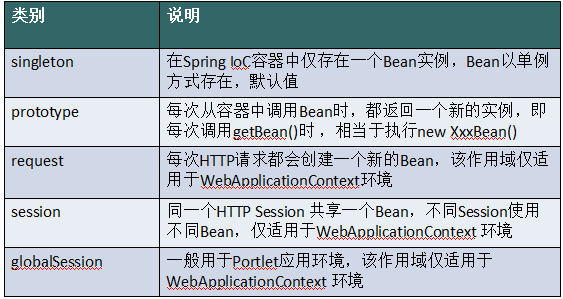
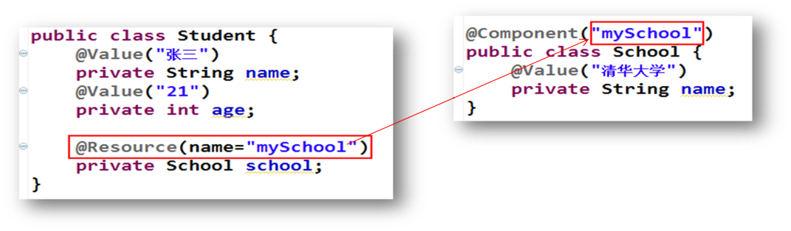
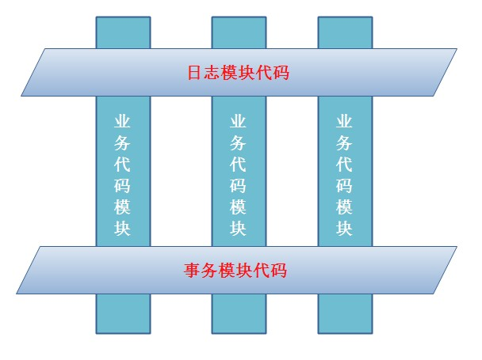
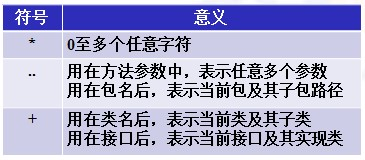
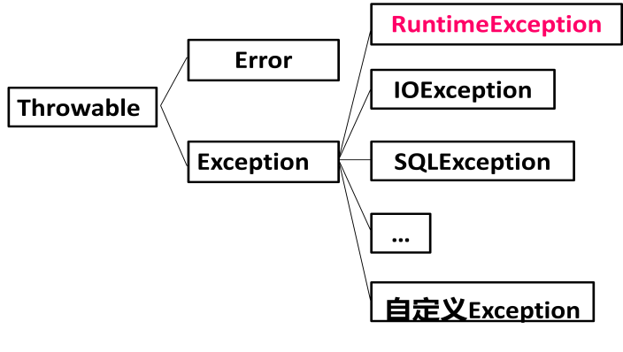
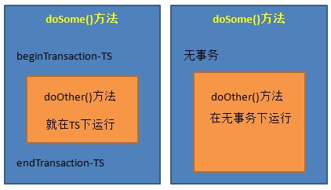

# 第 1 章 Spring 概述

## 1.1 简介

Spring 的核心是控制反转（IoC）和面向切面编程（AOP）。

Spring 的主要作用就是为代码“解耦"，降低代码间的耦合度。就是让对象和对象（模块和模块）之间关系不是使用代码关联，而是通过配置来说明。即在 Spring 中说明对象（模块）的关系。

Spring 根据代码的功能特点，使用 Ioc 降低业务对象之间耦合度。IoC 使得主业务在相互调用过程中，不用再自己维护关系了，即不用再自己创建要使用的对象了。而是由 Spring 容器统一管理，自动“注入",注入即赋值。 而 AOP 使得系统级服务得到了最大复用，且不用再由程序员手工将系统级服务“混杂"到主业务逻辑中了，而是由 Spring 容器统一完成“织入"。

## 1.2 Spring 优点？

Spring 是一个框架，是一个半成品的软件。有 20 个模块组成。它是一个容器管理对象，容器是装东西的，Spring 容器不装文本，数字。装的是对象。Spring 是存储对象的容器。

- （方便解耦，简化开发 （高内聚低耦合）

  - Spring 就是一个大工厂（容器），可以将所有对象创建和依赖关系维护，交给 Spring 管理

  - spring 工厂是用于生成 bean

- AOP 编程的支持

  - Spring 提供面向切面编程，可以方便的实现对程序进行权限拦截、运行监控等功能

- 声明式事务的支持

  - 只需要通过配置就可以完成对事务的管理，而无需手动编程

- 方便程序的测试

  - Spring 对 Junit4 支持，可以通过注解方便的测试 Spring 程序

- 方便集成各种优秀框架

  - Spring 不排斥各种优秀的开源框架，其内部提供了对各种优秀框架（如：Struts、Hibernate、MyBatis、Quartz 等）的直接支持

- 降低 JavaEE API 的使用难度

  - Spring
    对 JavaEE 开发中非常难用的一些 API（JDBC、JavaMail、远程调用等），都提供了封装，使这些 API 应用难度大大降低

Spring **体系结构**


## 1.3：核心容器

**beans、core、context、expression**

Spring 由 20 多个模块组成，它们可以分为数据访问/集成（DataAccess/Integration）、Web、面向切面编程（AOP, Aspects）、提供
JVM 的代理（Instrumentation）、消息发送（Messaging）、核心容器（CoreContainer）和测试（Test）。

## 1.4：事件

Spring 提供了以下 5 种标准的事件：

（1）上下文更新事件（ContextRefreshedEvent）：在调用 ConfigurableApplicationContext
接口中的 refresh()方法时被触发。

（2）上下文开始事件（ContextStartedEvent）：当容器调用 ConfigurableApplicationContext 的 Start()方法开始/重新开始容器时触发该事件。

（3）上下文停止事件（ContextStoppedEvent）：当容器调用 ConfigurableApplicationContext 的 Stop()方法停止容器时触发该事件。

（4）上下文关闭事件（ContextClosedEvent）：当 ApplicationContext 被关闭时触发该事件。容器被关闭时，其管理的所有单例 Bean 都被销毁。

（5）请求处理事件（RequestHandledEvent）：在 Web 应用中，当一个 http 请求（request）结束触发该事件。

如果一个 bean 实现了 ApplicationListener 接口，当一个 ApplicationEvent
被发布以后，bean 会自动被通知。

## 1.5：原理

spring 框架的原理其实主要是 dom4j+反射+xml.原理就是将 xml 用 dmo4j 解析，然后取出 xml 中的元素赋值到实体类中，实体类用反射机制获取其中的属性。

# 第 2 章 IOC 控制反转

**对象控制权的转移**IoC 是一个概念，是一种思想，其实现方式多种多样。当前比较流行的实现方式是依赖注入。好处在于一方面可以将资源集中管理，实现资源的可配置和易管理。第二，降低了资源双方的依赖程度，就是是耦合度。默认是使用单例模式。

依赖：

classA 类中含有 classB 的实例，在 classA 中调用 classB 的方法完成功能，即 classA 对 classB 有依赖。BeanDefinition 对象负责记录和管理各个业务对象自建的依赖关系：容器中的每一个 bean 都会有一个对应的 BeanDefinition 实例，该实例负责保存 bean 对象的所有必要信息，包括 bean 对象的 class 类型、是否是抽象类、构造方法和参数、其它属性等等。

Ioc 的实现：

依赖注入 DI
是指程序运行过程中，若需要调用另一个对象协助时，无须在代码中创建被调用者，而是依赖于外部容器，由外部容器创建后传递给程序。

## 2.2 Spring 的第一个程序

举例：01-primay

2.2.1 创建 maven 项目

2.2.2 引入 maven 依赖 pom.xml

```xml
<dependency>
  <groupId>org.springframework</groupId>
  <artifactId>spring-context</artifactId>
  <version>5.2.5.RELEASE</version>
</dependency>
<build>
	<plugins>
       <plugin>
            <artifactId>maven-compiler-plugin</artifactId>
            <version>3.1</version>
            <configuration>
                <source>1.8</source>
                <target>1.8</target>
            </configuration>
    	</plugin>
 	</plugins>
</build>
```

> **核心开发包说明：**

- spring-core-3.2.2.RELEASE.jar

  - 包含 Spring 框架基本的核心工具类，Spring 其它组件要都要使用到这个包里的类,是其它组件的基本核心。

- spring-beans-3.2.2.RELEASE.jar

  - 所有应用都要用到的，它包含访问配置文件、创建和管理 bean

  - 以及进行 Inversion of Control(IoC) / Dependency
    Injection(DI)操作相关的所有类

- spring-context-3.2.2.RELEASE.jar

  - Spring 提供在基础 IoC 功能上的扩展服务，此外还提供许多企业级服务的支持,

  - 如邮件服务、任务调度、JNDI 定位、EJB 集成、远程访问、缓存以及各种视图层框架的封装等。

- spring-expression-3.2.2.RELEASE.jar

  - Spring 表达式语言

- com.springsource.org.apache.commons.logging-1.1.1.jar

  - 第三方的主要用于处理日志

    2.2.3 定义接口与实体类

```java
**public interface** SomeService { **void** doSome();

  }

**public class** SomeServiceImpl **implements** SomeService {
    **public**SomeServiceImpl() {
        **super**();
		System.**out**.println("SomeServiceImpl无参数构造方法");
	}

@Override

**public void** doSome() {
		System.**out**.println("====业务方法doSome()===");
  }
}
```

2.2.4 创建 Spring 配置文件

位置：在 src/main/resources/目录现创建一个 xml 文件，

名称：文件名可以随意，但 Spring 建议的名称为 applicationContext.xml。

内容：spring 配置中需要加入约束文件才能正常使用，约束文件是 xsd 扩展名。

<bean /\>：用于定义一个实例对象。一个实例对应一个 bean 元素。

id：该属性是 Bean 实例的唯一标识，程序通过 id 属性访问 Bean，Bean 与 Bean 间的依赖关系也是通过 id 属性关联的。

class：指定该 Bean 所属的类，注意这里只能是类，不能是接口。

2.2.5 定义测试类

```java
@Test
public void test01(){
    //指定spring配置文件的位置和名称
    String resource="applicationContext.xml";/创建spring容器对象
    ApplicationContext ac = new ClassPathXm1ApplicationContext(resource);//从spring容器中获取对象,使用id
    SomeService service = (SomeService)ac.getBean("someService");//执行对象的业务方法
    service.doSome();
}

```

2.2.6 使用 spring 创建非自定义类对象

spring 配置文件加入 java.util.Date 定义：

\<bean id="myDate" class="java.util.Date" /\>

MyTest 测试类中：调用 getBean(“myDate"); 获取日期类对象。

2.2.7 容器接口和实现类

ApplicationContext **接口（容器）**

ApplicationContext 用于加载 Spring 的配置文件，在程序中充当“容器"的角色。其实现类有两个。

A、 配置文件在类路径下

若 Spring 配置文件存放在项目的类路径下，则使用 ClassPathXmlApplicationContext 实现类进行加载。

```java
@Test
public void test02(){
    //spring配置文件在类路径下(clas.spath)
    String resource="applicationContext.xml";
    //创建spring容器对象
    Applicationcontext ac = new classPathXm1ApplicationContext(resource);
    //从spring容器中获取对象,使用id
    Someservice service = (Someservice) ac.getBean("someService");
    service.doSome();
}

```

B**、** ApplicationContext **容器中对象的装配时机**

ApplicationContext 容器，会在容器对象初始化时，将其中的所有对象一次性全部装配好。以后代码中若要使用到这些对象，只需从内存中直接获取即可。执行效率较高。但占用内存。

```java
// ApplicationContext容器对对象的装配时机@Test
public void test07() {
    //获取容器:此时容器中的所有对象均已装配完毕
    ApplicationContext context =
    	new ClassPathXmlApplicationContext("applicationContext.xml");
}

```

C**、** 使用 spring 容器创建的 java 对象


## 2.3：Bean

### 2.3.1：实例化方式

三种 bean 实例化的方式：默认构造，静态工厂，实例工厂

Bean的配置方式：通过全类名（反射），通过工厂方法）静态工厂方法&实例工厂方法）FactoryBean

#### 1：默认构造：

\<bean id="" class=""\> 必须提供默认构造

#### 2：静态工厂

**BeanFactory 和 ApplicationContext 有什么区别？**

**两大核心接口，都可以当做 Spring 的容器，其中 ApplicationContext 是 BeanFactory 的子接口。**

包含了各种 Bean 的定义，读取 bean 配置文档，管理 bean 的加载、实例化，控制 bean 的生命周期，维护 bean 之间的依赖关系。

BeanFactroy 采用的是 `延迟加载` 形式来注入 Bean 的，即只有在使用到某个 Bean 时(调用 getBean())，才对该 Bean 进行加载实例化。ApplicationContext，它是在容器启动时，一次性创建了所有的 Bean。

BeanFactory 通常以编程的方式被创建，ApplicationContext 还能以声明的方式创建，如使用 ContextLoader。

- 常用与 spring 整合其他框架（工具）

- 静态工厂：用于生成实例对象，所有的方法必须是 static

```xml
<bean id="" class="工厂全限定类名" factory-method="静态方法">
```

创建实例

```java
public class MyBeanFactory {

	/**
	 * 创建实例
	 * @return
	 */
	public static UserService createService(){
		return new UserServiceImpl();
	}
}

```

Spring 配置

```xml
	<!-- 将静态工厂创建的实例交予spring
		class 确定静态工厂全限定类名
		factory-method 确定静态方法名
	-->
	<bean id="userServiceId" class="com.xqc.c_inject.b_static_factory.MyBeanFactory" factory-method="createService"></bean>

```

#### 3：实例工厂

- 实例工厂：必须先有工厂实例对象，通过实例对象创建对象。提供所有的方法都是“非静态"的。

1：工厂

```java
/**
 * 实例工厂,所有方法非静态
 *
 */
public class MyBeanFactory {

	/**
	 * 创建实例
	 * @return
	 */
	public UserService createService(){
		return new UserServiceImpl();
	}

}

```

2：Spring 配置

```xml
<!-- 创建工厂实例 -->
	<bean id="myBeanFactoryId" class="com.itheima.c_inject.c_factory.MyBeanFactory"></bean>
	<!-- 获得userservice
		* factory-bean 确定工厂实例
		* factory-method 确定普通方法
	-->
	<bean id="userServiceId" factory-bean="myBeanFactoryId" factory-method="createService"></bean>
```

### 2.3.2 Bean 种类

- 普通 bean：之前操作的都是普通 bean。\<bean id="" class="A"\>，spring 直接创建 A 实例，并返回
- FactoryBean：是一个特殊的 bean，具有工厂生成对象能力，只能生成特定的对象。bean 必须使用 FactoryBean 接口，此接口提供方法 getObject() 用于获得特定 bean。

```xml
<bean id="" class="FB"> 先创建FB实例，使用调用getObject()方法，并返回方法的返回值
		FB fb = new FB();
		return fb.getObject();
```

- BeanFactory 和 FactoryBean 对比？

BeanFactory：工厂，用于生成任意 bean。是 ApplicationContext 顶级接口，底层是利用 工厂 + 反射 + 配置文件

FactoryBean：特殊 bean，用于生成另一个特定的 bean。例如：ProxyFactoryBean，此工厂 bean 用于生产代理。\<bean id="" class="....ProxyFactoryBean"\>获得代理对象实例。AOP 使用

### 2.3.3：作用域

用于确定 spring 创建 bean 实例个数



单例的 bean

- 取值：

singleton 单例，默认值。

prototype
多例，每执行一次 getBean 将获得一个实例。例如：struts 整合 spring，配置 action 多例。

- 配置信息

```xml
<bean id="" class="" scope="">
```


```xml
<bean id=*"userServiceId"* class=*"com.xqc.d_scope.UserServiceImpl"*   scope=*"prototype"* ></bean>
```

2：Spring 如何解决线程并发问题？

只有无状态的 Bean 才可以在多线程环境下共享，在 Spring 中，绝大部分 Bean 都可以声明为 singleton 作用域，因为 Spring 对一些 Bean 中非线程安全状态采用 ThreadLocal 进行处理，解决线程安全问题。

ThreadLocal 和线程同步机制都是为了解决多线程中相同变量的访问冲突问题。同步机制采用了“时间换空间"的方式，仅提供一份变量，不同的线程在访问前需要获取锁，没获得锁的线程则需要排队。而 ThreadLocal 采用了“空间换时间"的方式。

### 2.3.4 生命周期


Spring 容器启动扫描，把 BeanName 变成 BeanDefinition 存到 BeanDefinitionMap 中，然后进行遍历，遍历完成之后。对 Spring 的 BeanDefinition 做一系列的验证(是否单例，是否抽象，是否懒加载等等)，验证完成，接着实例化之前，去单例池中看这个 bean 是否已经被创建，如果没有被创建，再查看是否在二级缓存中，看有没有被提前暴露，如果都没有，则继续执行，创建 X 对象，然后对对象做一些初始化工作，（填充属性，在填充属性的过程中，他发现 X 依赖了 Y，就会继续走 Y 的生命周期，）

**（1）实例化 Bean：在堆中开辟空间**

对于 BeanFactory 容器，当客户向容器请求一个尚未初始化的 bean 时，或初始化 bean 的时候需要注入另一个尚未初始化的依赖时，容器就会调用 createBean 进行实例化。

对于 ApplicationContext 容器，当容器启动结束后，通过获取 BeanDefinition 对象中的信息，实例化所有的 bean。

**（2）设置对象属性（依赖注入）：**

实例化后的对象被封装在 BeanWrapper 对象中，紧接着，Spring 根据 BeanDefinition 中的信息以及 通过 BeanWrapper 提供的设置属性的接口完成依赖注入。

**（3）处理 Aware 接口：一些需要的属性**

接着，Spring 会检测该对象是否实现了 xxxAware 接口，并将相关的 xxxAware 实例 set 给 Bean：

① 如果这个 Bean 已经实现了 BeanNameAware 接口，会调用它实现的 setBeanName(StringbeanId)方法，此处传递的就是 Spring 配置文件中 Bean 的 id 值；

② 如果这个 Bean 已经实现了 BeanFactoryAware 接口，会调用它实现的 setBeanFactory()方法，传递的是 Spring 工厂自身。

③ 如果这个 Bean 已经实现了 ApplicationContextAware 接口，会调用 setApplicationContext(ApplicationContext)方法，传入 Spring 上下文；

**（4）BeanPostProcessor：：后置处理器（增强器）**

两个方法，一个初始化之前的方法，一个初始化之后的方法

如果想对 Bean 进行一些自定义的处理，那么可以让 Bean 实现了 BeanPostProcessor 接口，那将会调用 postProcessBeforeInitialization(Object obj, String s)方法。

**（5）InitializingBean 与 init-method：对属性进行赋值**

如果 Bean 在 Spring 配置文件中配置了 init-method 属性，则会自动调用其配置的初始化方法。

（6）如果这个 Bean 实现了 BeanPostProcessor 接口，将会调用**postProcessAfterInitialization(Object obj, String s)方法**；由于这个方法是在 Bean 初始化结束时调用的，所以可以被应用于内存或缓存技术；

以上几个步骤完成后，Bean 就已经被正确创建了，之后就可以使用这个 Bean 了。

**（7）DisposableBean：**

当 Bean 不再需要时，会经过清理阶段，如果 Bean 实现了 DisposableBean 这个接口，会调用其实现的 destroy()方法；

**（8）destroy-method：**

最后，如果这个 Bean 的 Spring 配置中配置了 destroy-method 属性，会自动调用其配置的销毁方法。

### 2.3.5：循环依赖

1：什么是循环依赖？

A 依赖 B，B 依赖 A，Spring 容器启动时会创建对象时就会产生循环依赖。

2：循环依赖怎么解决？

给 B 中 A 赋值的方法：set 方法和构造器的方法，当使用构造器是不能解决的，当使用 set 的方法时可以使用三级缓存解决。

3：Spring 中为什么要使用三级缓存解决循环依赖

#### 三级缓存

Spring 中的三级缓存分别为：

- singletonObjects：完成初始化的单例对象的 cache（一级缓存）
- earlySingletonObjects ：完成实例化但是尚未初始化的，提前暴光的单例对象的 Cache （二级缓存）
- singletonFactories ： 进入实例化阶段的单例对象工厂的 cache （三级缓存）

Spring 获取 Bean 的过程

```java
protected Object getSingleton(String beanName, boolean allowEarlyReference) {
	// Quick check for existing instance without full singleton lock
	// 从一级缓存中获取
	Object singletonObject = this.singletonObjects.get(beanName);
	// 如果没有，且依赖的A正在初始化，那我们去尝试看看earlySingletonObjects（二级缓存）是否有对象
	// earlySingletonObjects（二级缓存）存放的是还未实例化好对象
	if (singletonObject == null && isSingletonCurrentlyInCreation(beanName)) {
		// 从二级缓存中获取
		singletonObject = this.earlySingletonObjects.get(beanName);
		// 如果获取不到 但是支持获取EarlyReference
		if (singletonObject == null && allowEarlyReference) {
			// 这里应该是Spring 5.x的优化，只有一二级缓存中都获取不到的时候才进行加锁，相对于5.x以前的一开始就加锁后移了，提高了性能
			synchronized (this.singletonObjects) {
				// Consistent creation of early reference within full singleton lock
				// 这里与5.x以前的一致
				singletonObject = this.singletonObjects.get(beanName);
				if (singletonObject == null) {
					singletonObject = this.earlySingletonObjects.get(beanName);
					if (singletonObject == null) {
						// 从三级缓存中获取,需要注意的是这里获取的不是singletonObject了，而是一个ObjectFactory
						// 这个ObjectFactory就是 addSingletonFactory(beanName, () -> getEarlyBeanReference(beanName, mbd, bean)); 中的() -> getEarlyBeanReference(beanName, mbd, bean)
						ObjectFactory<?> singletonFactory = this.singletonFactories.get(beanName);
						if (singletonFactory != null) {
							// 通过从三级缓存中拿到的是一个工厂对象，这个工厂对象可以用于生产singletonObject并放入二级缓存中
							singletonObject = singletonFactory.getObject();
							// 把工厂生产出来的singletonObject放入二级缓存中
							this.earlySingletonObjects.put(beanName, singletonObject);
							this.singletonFactories.remove(beanName);


							// 也就是说，这里的逻辑是 从三级缓存中拿到的是一个工厂对象，这个工厂对象可以用于生产singletonObject并放入二级缓存中
							// 为什么不把原对象直接放入二级缓存中呢？因为可能有AOP，所以需要生成代理对象
							// 那为什么不直接把生成好的代理对象放入二级缓存中呢？因为为了性能考虑，如果没有循环引用，是不需要生成对象的。如果我们早早的就在doCreateBean方法中生成好了对象并放入二级缓存中，那是不是影响性能呢？
						}
					}
				}
			}
		}
	}
	return singletonObject;
}

```

如果一二三级缓存都没有，就会走新建方法，走三步：

- createBeanInstance：实例化，其实也就是调用对象的构造方法实例化对象
- populateBean：填充属性，这一步主要是多 bean 的依赖属性进行填充
- initializeBean：调用 spring xml 中的 init 方法。

循环依赖创建流程：

A 实例化，放到半成品池中，填充属性填充 B，B 没有，创建 B，实例化 B，填充属性 A，先到单例池，单例池没有，再到半成品池，有直接注入，B 填充属性完成初始化，放入单例池，A 继续将 B 填充给自己，初始化完成

二级缓存可以解决循环依赖吗？

如果仅仅解决循环依赖，二级缓存也可以，但是对象使用了代理对象（AOP 的几乎都用了），那注入的时候拿到的不是最终的代理对象，而是原始对象。如果使用三级缓存，就会创建一个代理对象暴露在二级缓存中，这样就可以拿到代理对象了。

在三个级别的缓存中放的对象是有区别的，一级放的是实例化初始化的对象，二级放的是实例化未初始化的，三级缓存放实例化和匿名内部类，如果只有一级缓存，并发环境下就有可能取到实例化未初始化的值；

三级缓存的匿名内部类，这个匿名内部类可能是代理类，也可能是普通的实例对象，而使用三级缓存就保证了不管是否都能保证使用的是一个对象，而不会出现前面使用 bean，后面使用代理类的情况

三级缓存解决代理对象循环依赖过程：


A 实例化，在工厂池中添加 factoty(a) ，调用 a 的提前引用方法，执行动态代理引用，（提前引用就是为了如果在本身实例化过程中，如果有别人调用我，就会执行提前引用，否则就不执行），填充 B，B 没有，创建 B，填充 A，调用 A 的 factory(a)方法，创建动态代理，将 A 的动态代理放入到半成品池，然后从半成品池中取得填充到 B 中，B 填充完之后就会进行初始化，然后执行后置处理方法，同时就会创建一个动态代理的 B，将创建的代理 B 放到单例池中去，然后重单例池中取出 B 填充到 A 中。

**为什么使用构造器不能解决循环依赖问题？**

此方式是通过实例化和初始化的方式，使用构造器必须使用构造方法，就必须将实例化与初始化搞到一起，

## 2.3：Spring 的类加载机制

OverridingClassLoader 继承自 DecoratingClassLoader ，DecoratingClassLoader 又继承自 ClassLoader


DecoratingClassLoader 很简单，内部维护了两个集合，如果你不想你的类被自定义的类加载器管理，可以把它添加到这两个集合中，这样仍使用 JDK 的默认类加载机制。

OverridingClassLoader 是 Spring 自定义的类加载器，默认会先自己加载，(excludedPackages 或 excludedClasses 例外)，只有加载不到才会委托给双亲加载，这就破坏了 JDK 的双亲委派模式。方法 loadClassForOverriding 也是从 classpath 直接找到对应的 .class 文件，然后重新加载。

### IOC 步骤

大体上：创建 BenaFactory——>读取资源——>实例化 Bean——>放入 Map 中，具体如下

加载并且保存 Spring 配置文件路径信息然后保存到 configLocation 中，

刷新 Spring 上下文环境

创建并且载入 DefaultListableBeanFactory（即 BeanFactory）

根据 DefaultListableBeanFactory 创建 XMLBeanDefinitionReader，用于后面读取 xml 配置文件信息

创建 BeanDefinitionDelegate 代理类，用于解析 XML 配置信息，便于可以使用不同的解析器进行解析；

通过 XMLBeanDefinitionReader 结合 location 路径信息读取 Resource 资源信息，并保存到 BeanDefinitionRegistry 中；

容器扫描 BeanDefinitionRegistry 中的 BeanDefinition，使用 Java 的反射机制自动识别出 Bean 工厂后处理后器（实现 BeanFactoryPostProcessor 接口）的 Bean，然后调用这些 Bean 工厂后处理器对 BeanDefinitionRegistry 中的 BeanDefinition 进行加工处理。

使用 BeanDefinitionDelegate 代理类解析 Bean 元素并且依次进行实例化，实例化完毕之后将 Bean 信息注册（put）到 BeanDefinitionMap 中以便于下次使用。

## 2.3 基于 XML 的 DI

property 注入属性，还有构造方法注入属性，还有 map，list 等数据结构注入的方式又是什么？P 命名空间注入

不再写 `<bean>` 标签，使用注解方式

### 2.3.1 注入分类

bean 实例在调用无参构造器创建对象后，就要对 bean 对象的属性进行初始化。初始化是由容器自动完成的，称为注入。

> 根据注入方式的不同，常用的有两类：set 注入、构造注入。

#### **（**1**）** set **注入**(**掌握**)

set 注入也叫设值注入是指，通过 setter 方法传入被调用者的实例。这种注入方式简单、直观，因而在 Spring 的依赖注入中大量使用。

**A**、 简单类型

```xml
<bean id="myStudent" class="com. xqc.ba01.Student">
    <!--简单类型的属性赋值-->
    <property name="name" value="张三"/><!-- setName(张三)-->
    <property name="age" value="20"/><!-- setAge(20)-->
</bean>

```

测试：

```java
@Test
public void testo1()i
    string configLocation="com/xqc/ba01/applicationContext.xml";
    ApplicationContext ctx = new ClassPathXmlApplicationContext(configLocation);
	student student = (Student) ctx.getBean( "myStudent");
    system.out.print1n( "student: "+student);
}

```

**B**、 引用类型

当指定 bean 的某属性值为另一 bean 的实例时，通过 ref 指定它们间的引用关系。ref 的值必须为某 bean 的 id 值。

```xml
<!--语法格式1:使用ref作为属性-->
<bean id="mystudent" class="com.bjpowernode.ba02.Student">
    <!--简单类型的属性赋值-->
    <property name="name" value="张三"/><!-- setName("张三")-->
    <property name="age" value="20"/><!-- setAge(20) -->
    <!--引用类型的属性赋值-->
    <property name="school" ref="mySchool" /><!-- setSchool(mySchool) -->
</bean>

```

对于其它 Bean 对象的引用，使用\<bean/\>标签的 ref 属性

C、特殊类型

使用![CDATA[]]注入特殊字符><=等符号

注入 list

```xml
<property name="list">
    <list>
        <value>篮球</value>
    </list>
</property>
```

注入 set 类似

注入 map

```xml
<property>
    <map>
        <entry>
            <key>
                <value>football</value>
            </key>
            <value>足球</value>
        </entry>
    </map>
</property>
```

注入 Properties

#### （2） 构造注入(理解)

构造注入是指，在构造调用者实例的同时，完成被调用者的实例化。即，使用构造器设置依赖关系。

举例 1：

如果有了有参构造，那默认的无参构造器就失效了，尽量还是要把无参的写出来

```xml
<bean id="myStudent" class="com.bjpowernode. ba03.Student">
    <constructor-arg name= "myage" value="22"/>
    <constructor-arg name= "myname" value="李四"/>
    <constructor-arg name="myXueXiao" ref="mySchool"/>
</bean>

```

\<constructor-arg /\>标签中用于指定参数的属性有：

- name：指定参数名称。
- index：指明该参数对应着构造器的第几个参数，从 0 开始。不过，该属性不要也行，但要注意，若参数类型相同，或之间有包含关系，则需要保证赋值顺序要与构造器中的参数顺序一致。

必须与构造方法的一样的参数数量，不够灵活。

#### （3）P 命名空间注入

其实还是依赖的 setter 方法注入

```xml
<bean id = "user3" class = "com,xqc.entity.User"
      p:userName = "娃娃" p:age = "20" p:gender="男">
</bean>
<!--如果是一个外部类，使用p:gender-ref = ""-->
```

### 2.3.2 引用类型属性自动注入

对于引用类型属性的注入，也可不在配置文件中显示的注入。可以通过为\<bean/\>标签设置 autowire 属性值，为引用类型属性进行隐式自动注入（默认是不自动注入引用类型属性）。根据自动注入判断标准的不同，可以分为两种：

byName：根据名称自动注入

byType： 根据类型自动注入

#### **（**1**）** byName **方式自动注入**

当配置文件中被调用者 bean 的 id 值与代码中调用者 bean 类的属性名相同时，可使用 byName 方式，让容器自动将被调用者 bean 注入给调用者 bean。容器是通过调用者的 bean 类的属性名与配置文件的被调用者 bean 的 id 进行比较而实现自动注入的。

#### **（**2**）** byType **方式自动注入**

使用 byType 方式自动注入，要求：配置文件中被调用者 bean 的 class 属性指定的类，要与代码中调用者 bean 类的某引用类型属性类型同源。即要么相同，要么有 is-a 关系（子类，或是实现类）。但这样的同源的被调用 bean 只能有一个。多于一个，容器就不知该匹配哪一个了。

```xml
<!--声明school对象-->
<bean id="mySchool" class="com.xqc.ba05.School">
    <property name="name" value="人民大学"/>
    <property name="address" value="北京的海淀区"/>
</bean>
<bean id="myStudent" class="com.xqc.ba05.Student" autowire="byType">
    <!--简单类型的属性赋值-->
    <property name="name" value="张三"/>
    <property name="age" value="20"/>
    <!--引用类型的属性赋值-->
	<!-- <property name="school" ref="mySchool"/>-->
</bean>

```

### 2.3.3 为应用指定多个 Spring 配置文件

在实际应用里，随着应用规模的增加，系统中 Bean 数量也大量增加，导致配置文件变得非常庞大、臃肿。为了避免这种情况的产生，提高配置文件的可读性与可维护性，可以将 Spring 配置文件分解成多个配置文件。包含关系的配置文件：

多个配置文件中有一个总文件，总配置文件将各其它子文件通过\<import/\>引入。在 Java 代码中只需要使用总配置文件对容器进行初始化即可。

**Spring** 配置文件：

```xml
<!--包含关系中可以使用通配符*,表示任意个字符
注意:总的配置文件（total.xml)名称不能包含在通配符的范围内，不能叫spring-total.xml-->
<import resource="cLasspath:com/xqc/ba06/spring-*.xmL " />
```

## 2.4 基于注解的 DI

自动装配：在 spring 中，对象无需自己查找或创建与其关联的其他对象，由容器负责把需要相互协作的对象引用赋予各个对象，使用 autowire 来配置自动装载模式。

在 Spring 框架 xml 配置中共有 5 种**自动装配：**

（1）no：默认的方式是不进行自动装配的，通过手工设置 ref 属性来进行装配 bean。

（2）byName：通过 bean 的名称进行自动装配，如果一个 bean 的 property 与另一 bean 的 name 相同，就进行自动装配。

（3）byType：通过参数的数据类型进行自动装配。

（4）constructor：利用构造函数进行装配，并且构造函数的参数通过 byType 进行装配。

（5）autodetect：自动探测，如果有构造方法，通过 construct 的方式自动装配，否则使用 byType 的方式自动装配。

```xml
<context:component-scan base-package="com.xqc.service"/>
```

指定多个包的三种方式：

1)使用多个 **context:component-scan** 指定不同的包路径

```xml
<context:component-scan base-package="com.xqc.service1"/>
<context:component-scan base-package="com.xqc.service2"/>
```

2)指定 **base-package** 的值使用分隔符分隔符可以使用逗号（，）分号（；）还可以使用空格，不建议使用空格。

逗号分隔：

```xml
<context:component-scan base-package="com.xqc.service1,com.xqc.service2"/>
```

3)base-package 是指定到父包名

base-package 的值表是基本包，容器启动会扫描包及其子包中的注解，当然也会扫描到子包下级的子包。所以 base-package 可以指定一个父包就可以。

```xml
<context:component-scan base-package="com.xqc"/>
```

但不建议使用顶级的父包，扫描的路径比较多，导致容器启动时间变慢。指定到目标包和合适的。也就是注解所在包全路径。例如注解的类在 com.xqc.beans 包中

```xml
<context:component-scan base-package="com.xqc.benas"/>
```

### 2.4.1 定义 Bean 的注解@Component(掌握)

需要在类上使用注解@Component，该注解的 value 属性用于指定该 bean 的 id 值。

```java
//注解参数中省略了value属性，该属性用于指定Bean的ID
@Component("myStudent")
public class Student{
    private String name;
    private int age;
}
```

另外，Spring 还提供了 3 个创建对象的注解：

- @Repository 用于对 DAO 实现类进行注解

- @Service 用于对 Service 实现类进行注解

- @Controller 用于对 Controller 实现类进行注解

这三个注解与@Component 都可以创建对象，但这三个注解还有其他的含义，@Service 创建业务层对象，业务层对象可以加入事务功能，@Controller
注解创建的对象可以作为处理器接收用户的请求。@Repository，@Service，@Controller 是对@Component 注解的细化，标注不同层的对象。即持久层对象，业务层对象，控制层对象。

@Component 不指定 value 属性，bean 的 id 是类名的首字母小写。

### 2.4.2 简单类型属性注入@Value(掌握)

需要在属性上使用注解@Value，该注解的 value 属性用于指定要注入的值。

使用该注解完成属性注入时，类中无需 setter。当然，若属性有 setter，则也可将其加到 setter 上。

```java
//注解参数中省略了value属性，该属性用于指定Bean的id
public class Student{
    @Value("zhangsan")
    private String name;
    @Value("21")
    private String age;
}
```

### 2.4.3 byType 自动注入@Autowired(掌握)

需要在引用属性上使用注解@Autowired，该注解**默认使用按类型自动装配** Bean 的方式。使用该注解完成属性注入时，类中无需 setter。当然，若属性有
setter，则也可将其加到 setter 上。

```java
@Component("myStudent")
public class Student{
    @Value("zhangsan")
    private String name;
    @Value("21")
    private String age;
    @Autowired
    private School school;
}
```

### 2.4.4 byName 自动注入@Autowired 与@Qualifier(掌握)

需要在引用属性上联合使用注解@Autowired 与@Qualifier。@Qualifier 的 value 属性用于指定要匹配的 Bean 的 id 值。类中无需 set 方法，也可加到 set 方法上。


@Autowired 还有一个属性 required，默认值为 true，表示当匹配失败后，会终止程序运行。若将其值设置为 false，则匹配失败，将被忽略，未匹配的属性值为 null。

### 2.4.5 JDK 注解@Resource 自动注入(掌握)

Spring 提供了对 jdk 中@Resource 注解的支持。**@Resource** 注解既可以按名称匹配 Bean，也可以按类型匹配 Bean。**默认是按名称注入**。使用该注解，要求 JDK 必须是 6 及以上版本。

@Resource 可在属性上，也可在 set 方法上。

**（**1**）** byType **注入引用类型属性**

@Resource 注解若不带任何参数，采用默认按名称的方式注入，按名称不能注入 bean，则会按照类型进行 Bean 的匹配注入。

> 举例：


**（**2**）** byName **注入引用类型属性**

@Resource 注解指定其 name 属性，则 name 的值即为按照名称进行匹配的 Bean 的 id。

> 举例：



### 2.4.6 注解与 XML 的对比

注解优点是：

- 方便

- 直观

- 高效（代码少，没有配置文件的书写那么复杂）。

其弊端也显而易见：以硬编码的方式写入到 Java 代码中，修改是需要重新编译代码的。

XML 方式优点是：

- 配置和代码是分离的

- 在 xml 中做修改，无需编译代码，只需重启服务器即可将新的配置加载。

  xml 的缺点是：编写麻烦，效率低，大型项目过于复杂。

# 第**3**章 **AOP** 面向切面编程

面向切面编程，就是将交叉业务逻辑封装成切面，利用 AOP 容器的功能将切面织入到主业务逻辑中。所谓交叉业务逻辑是指，通用的、与主业务逻辑无关的代码，如安全检查、事务、日志、缓存等。

AOP 实现的关键就在于 AOP 框架自动创建的 AOP 代理，AOP 代理则可分为静态代理和动态代理两大类，其中静态代理是指使用 AOP 框架提供的命令进行编译，从而在编译阶段就可生成 AOP 代理类，因此也称为编译时增强；而动态代理则在运行时借助于 JDK 动态代理、CGLIB 等在内存中“临时"生成 AOP 动态代理类，因此也被称为运行时增强。

## 3.1 简介

AOP（Aspect OrientProgramming），面向切面编程。面向切面编程是从动态角度考虑程序运行过程。

AOP 底层，就是采用动态代理模式实现的。采用了两种代理：JDK 的动态代理，与 CGLIB 的动态代理

若不使用 AOP，则会出现代码纠缠，即交叉业务逻辑与主业务逻辑混合在一起。这样，会使主业务逻辑变的混杂不清。

例如：不使用 AOP 实现日志

- doTransaction()：用于事务处理

- doLog()：用于日志处理

方法一：

```java
public class SomeserviceImpl implements SomeService {
    @Override
    public void dosome() {
        ServiceTools.doLog;
        System.out.print1n("执行了业务方法doSome" );
        ServiceTools.doTrans();
    }
    @Override
    public void doother) {
        ServiceTools.doLog();
        System.out.print1n("执行了业务方法do0ther");
        ServiceToo1s.doTrans();
    }
}
```

主业务深度耦合在一起。当交叉业务逻辑较多时，在主业务代码中会出现大量的交叉业务逻辑代码调用语句，大大影响了主业务逻辑的可读性，降低了代码的可维护性，同时也增加了开发难度。

所以，可以采用动态代理方式。在不修改主业务逻辑的前提下，扩展和增强其功能。

功能增强：

```java
public class MyInvocationHandler implements InvocationHandler {
    private object target;
    public MyInvocationHandler(object target) i
        super();
        this.target = target;
    }
    public MyInvocationHandler() {
        super();
    }
    @Override
    public object invoke(Object proxy,Method method,object[] arg)throws Throwable {
        Object obj = null;
        //在方法之前输出日志
        ServiceTools.doLog();
        //执行目标方法,执行target对象的方法
        obj = method.invoke(target, args);//doSome
        //在方法之后,执行事务
        ServiceTools.doTrans();
        //目标方法的执行结果
        return obj;
    }
}

```

测试：

```java
public class MyTest {
	public static void main(String[]args) {
        //创建代理对象
        SomeService target = new SomeServiceImp1();
        MyInvocationHandler handler = new MyInvocationHandler(target);
        SomeService proxy = (SomeService) Proxy.newProxyInstance(
            target.getClass().getclassLoader(),
            target·getC1ass().getInterfaces(),
            handler);
            //通过代理对象执行业务方法,实现日志,事务的增强
        proxy.doSome();
        proxy.doother();
    }
}

```

## 3.3 好处

1.减少重复；

2.专注业务；

注意：面向切面编程只是面向对象编程的一种补充。

使用 **AOP** 减少重复代码，专注业务实现：

它将应用系统拆分分了 2 个部分：核心业务逻辑（Core business concerns）及横向的通用逻辑，



## 3.3 动态代理

SpringAOP 就是使用动态代理实现的，当 Bean 实现接口时，Spring 就会用 JDK 的动态代理，没有实现接口，就会使用 cglib 的动态代理。JDK 动态代理通过反射来接受被代理的类，但是被代理的类必须实现接口，核心是 InvocationHandler 类和 Proxy 类，cglib 动态代理的类一般是没有实现接口的类，cglib 是一个代码生成的类库，可以在运行时动态生成某个类的紫烈，所以，GBLIB 是通过集成的方式做的动态代理，因此如果某各类被标记为 final，那么他是无法使用 cglib 做动态代理的。

对于目标类，在程序运行过程中会构建一个新的代理对象，这个代理对象比原对象多了一些增强，将一些程序织入到原有方法中去，调用者调用代理对象。

### JDK 

获取代理对象源码：

```java
@override
public object getProxy(classLoader classLoader) {
    if (Logger.isDebugEnabled()) {
    logger.debug( "creating JDK dynamic proxy: target source is
    " + this.advised.getTargetsource());
    }
    class<?>[] proxiedInterfaces = AopProxyUtils.completeProxiedInterfaces(this.advised,true);
                 findDefinedEqualsAndHashCodeMethods(proxiedInterfaces);
    return Proxy.newProxyInstance(classLoader, proxiedInterfaces,this);
}
```

切面的织入：

InvocationHandler接口 是 JDK 动态代理的核心，生成代理对象的方法，都会委托到他的 invoke 方法中，在 invoke 进行织入，先获取一个应用到原始方法的拦截列表，如果没有拦截列表，直接反射调用原本的，如果有就加入代理的逻辑代码。

Proxy类，我们可以通过这个类的newProxyInstance方法，返回一个代理对象。

为什么JDK动态代理必须要接口？

生成的代理类继承了Proxy，由于java是单继承，所以只能实现接口，通过接口实现。

### CGLIB 

没有接口，只有实现类。

采用ASM字节码增强框架 cglib，在运行时 创建目标类的子类，从而对目标类进行增强。

应用：在Spring中@Configuration注解使用了CGLib动态代理，一个class添加了@Configuration注解，就被认为是一个全注解的类。

### 对比

1：JDK 是基于接口实现，而 CGLIB 继承代理类，通常建议使用 jdk 代理

- CGLib 不能对声明为 final 的方法进行代理

- JDK 动态代理只能对实现了接口的类生成代理，而不能针对类。

- CGLIB 是针对类实现代理，主要是对指定的类生成一个子类，覆盖其中的方法，并覆盖其中方法实现增强，但是因为采用的是继承，所以该类或方法最好不要声明成 final， 对于 final 类或方法，是无法继承的

  使用 CGLib 实现动态代理，CGLib 底层采用 ASM 字节码生成框架，使用字节码技术生成代理类，在 jdk6 之前比使用 Java 反射效率要高。但是后来JDK的效率优化的比CGLib更快了。唯一需要注意的是，CGLib 不能对声明为 final 的方法进行代理，因为 CGLib 原理是动态生成被代理类的子类

## 3.4 AOP 编程术语(掌握)

### （1） 切面（Aspect）

切面泛指交叉业务逻辑。上例中的事务处理、日志处理就可以理解为切面。

常用的切面是通知（Advice）。实际就是对主业务逻辑的一种增强。

切面用 Spring 的 Advisor 或拦截器实现。

### （2） 连接点（JoinPoint）

连接点指可以被切面织入的具体方法。通常业务接口中的方法均为连接点。

### （3） 切入点（Pointcut）

> 切入点指声明的一个或多个连接点的集合。通过切入点指定一组方法。

被标记为 final 的方法是不能作为连接点与切入点的。因为最终的是不能被修改的，不能被增强的。

### （4） 目标对象（Target）

目标对象指将要被增强的对象。即包含主业务逻辑的类的对象。上例中的 StudentServiceImpl 的对象若被增强，则该类称为目标类，该类对象称为目标对象。当然，不被增强，也就无所谓目标不目标了。

### （5） 通知（Advice）

通知表示切面的执行时间，Advice 也叫增强。上例中的 MyInvocationHandler 就可以理解为是一种通知。换个角度来说，通知定义了增强代码切入到目标代码的时间点，是目标方法执行之前执行，还是之后执行等。通知类型不同，切入时间不同。

> 切入点定义切入的位置，通知定义切入的时间。

Spring 按照通知 Advice 在目标类方法的连接点位置，可以分为 5 类

- 前置通知 Before advice

  在目标方法执行前实施增强，但这个通知不能阻止连接点前的执行。
  ApplicationContext 中在\<aop:aspect>里面使用\<aop:before>元素进行声明。

- 后置通知 After advice

  在目标方法执行后实施增强(不论是正常返回还是异常退出)

  ApplicationContext 中在\<aop:aspect>里面使用\<aop:after>元素进行声明。

- After returnadvice：

在某连接点正常完成后执行的通知，不包括抛出
异常的情况。
ApplicationContext 中在\<aop:aspect>里面使用\<aop:after-returning>
元素进行声明。

- 环绕通知 Around advice

  包围一个连接点的通知，类似 Web 中 Servlet 规范中的 Filter 的 doFilter 方法。可以在方法的调用前后完成自定义的行为，也可以选择不执。ApplicationContext 中在\<aop:aspect>里面使用\<aop:around>元素进行声明。

- 异常抛出通知

  在方法抛出异常后实施增强

- 引介通知 org.springframework.aop.IntroductionInterceptor

  在目标类中添加一些新的方法和属性

## 3.5 AspectJ 对 AOP 的实现(掌握)

对于 AOP 这种编程思想，很多框架都进行了实现。Spring 就是其中之一，可以完成面向切面编程。然而，AspectJ 也实现了 AOP 的功能，且其实现方式更为简捷，使用更为方便，而且还支持注解式开发。所以，Spring 又将 AspectJ 的对于 AOP 的实现也引入到了自己的框架中。在 Spring 中使用 AOP 开发时，一般使用 AspectJ 的实现方式。

### 1：AspectJ 简介

AspectJ 是一个优秀面向切面的框架，它扩展了 Java 语言，提供了强大的切面实现。

@AspectJ 是 AspectJ1.5 新增功能，通过 JDK5 注解技术，允许直接在 Bean 类中定义切面

新版本 Spring 框架，建议使用 AspectJ 方式来开发 AOP

官网地址：<http://www.eclipse.org/aspectj/>[ ](http://www.eclipse.org/aspectj/)

**AspetJ** 是 **Eclipse** 的开源项目，官网介绍如下：

a seamless aspect-oriented extension to the Javatm programminglanguage（一种基于 Java 平台的面向切面编程的语言）

Java platform compatible（兼容 Java 平台，可以无缝扩展） easy to learn and use（易学易用）

### 2： AspectJ 的通知类型(理解)

AspectJ 中常用的通知有五种类型：

- before:前置通知(应用：各种校验)

在方法执行前执行，如果通知抛出异常，阻止方法运行

- afterReturning:后置通知(应用：常规数据处理)

方法正常返回后执行，如果方法中抛出异常，通知无法执行

必须在方法执行后才执行，所以可以获得方法的返回值。

- around:环绕通知(应用：十分强大，可以做任何事情)

方法执行前后分别执行，可以阻止方法的执行

必须手动执行目标方法

- afterThrowing:抛出异常通知(应用：包装异常信息)

方法抛出异常后执行，如果方法没有抛出异常，无法执行

- after:最终通知(应用：清理现场)

方法执行完毕后执行，无论方法中是否出现异常

```java
环绕 try{
    //前置：before
    //手动执行目标方法
    //后置：afterRetruning
} catch(){
    //抛出异常 afterThrowing
} finally{
    //最终 after
}
```

同一个 aspect，不同 advice 的执行顺序：

① 没有异常情况下的执行顺序：

around before advice

before advice

target method 执行

around after advice

after advice

afterReturning

② 有异常情况下的执行顺序：

around before advice

before advice

target method 执行

around after advice

after advice

afterThrowing:异常发生

java.lang.RuntimeException: 异常发生

### 3 ：AspectJ 的切入点表达(掌握)

AspectJ 定义了专门的表达式用于指定切入点。表达式的原型是：

modifiers-pattern] 访问权限类型 ret-type-pattern 返回值类型 declaring-type-pattern 包名类名

name-pattern(param-pattern) 方法名(参数类型和参数个数) throws-pattern 抛出异常类型

？表示可选的部分

以上表达式共 4 个部分。

execution(访问权限 方法返回值 方法声明(参数) 异常类型)

切入点表达式要匹配的对象就是目标方法的方法名。所以，execution 表达式中明显就是方法的签名。注意，表达式中黑色文字表示可省略部分，各部分间用空格分开。在其中可以使用以下符号：



举例：

execution(public \* \*(..)) 指定切入点为：任意公共方法。

execution(\* set\*(..)) 指定切入点为：任何一个以“set"开始的方法。

execution(\* com.xyz.service.\*.\*(..)) 指定切入点为：定义在 service 包里的任意类的任意方法。

execution(\* com.xyz.service..\*.\*(..))指定切入点为：定义在 service 包或者子包里的任意类的任意方法。“.."出现在类名中时，后面必须跟“\*"，表示包、子包下的所有类。

execution(\* \*..service.\*.\*(..))指定所有包下的 serivce 子包下所有类（接口）中所有方法为切入点

execution(\*\*.service.\*.\*(..))指定只有一级包下的 serivce 子包下所有类（接口）中所有方法为切入点

execution(\*\*.ISomeService.\*(..))指定只有一级包下的 ISomeSerivce 接口中所有方法为切入点

execution(\* \*..ISomeService.\*(..))指定所有包下的 ISomeSerivce 接口中所有方法为切入点

execution(\* com.xyz.service.IAccountService.\*(..))指定切入点为：IAccountService 接口中的任意方法。

execution(\* com.xyz.service.IAccountService+.\*(..))指定切入点为：IAccountService 若为接口，则为接口中的任意方法及其所有实现类中的任意方法；若为类，则为该类及其子类中的任意方法。

execution(\* joke(String,int)))指定切入点为：所有的 joke(String,int)方法，且 joke()方法的第一个参数是 String，第二个参数是 int。如果方法中的参数类型是 java.lang 包下的类，可以直接使用类名，否则必须使用全限定类名，如 joke( java.util.List,int)。

execution(\* joke(String,\*)))

指定切入点为：所有的 joke()方法，该方法第一个参数为
String，第二个参数可以是任意类

型，如 joke(String s1,String s2)和 joke(String s1,double d2)都是，但 joke(String
s1,double d2,String s3)不是。

execution(\* joke(String,..)))

指定切入点为：所有的 joke()方法，该方法第一个参数为
String，后面可以有任意个参数且参数类型不限，如 joke(String s1)、joke(String
s1,String s2)和 joke(String s1,double d2,String s3) 都是。

execution(\* joke(Object))

指定切入点为：所有的 joke()方法，方法拥有一个参数，且参数是 Object
类型。joke(Object ob) 是，但，joke(String s)与 joke(User u)均不是。

execution(\* joke(Object+))) 指定切入点为：所有的
joke()方法，方法拥有一个参数，且参数是 Object 类型或该类的子类。不仅 joke(Object
ob)是，joke(String s)和 joke(User u)也是。

### 4： AspectJ 的开发环境(掌握)

(1） maven 依赖

```xml
<dependency>
 <groupId>junit</groupId>
 <artifactId>junit</artifactId>
 <version>4.11</version>
 <scope>test</scope>
</dependency>
<dependency>
 <groupId>org.springframework</groupId>
 <artifactId>spring-context</artifactId>
 <version>5.2.5.RELEASE</version>
</dependency>

<dependency>
 <groupId>org.springframework</groupId>
 <artifactId>spring-aspects</artifactId>
 <version>5.2.5.RELEASE</version>
</dependency>
<build>
<plugins>
       <plugin>
            <artifactId>maven-compiler-plugin</artifactId>
            <version>3.1</version>
            <configuration>
                <source>1.8</source>
                <target>1.8</target>
            </configuration>
       </plugin>
</plugins>
</build>

```

**（**2**） 引入** AOP **约束**

在 AspectJ 实现 AOP 时，要引入 AOP 的约束。配置文件中使用的 AOP 约束中的标签，均是 AspectJ 框架使用的，而非 Spring 框架本身在实现 AOP 时使用的。

AspectJ 对于 AOP 的实现有注解和配置文件两种方式，常用是注解方式。

### 5： AspectJ 基于注解的 AOP 实现(掌握)

AspectJ 提供了以注解方式对于 AOP 的实现。

（1） 实现步骤

A、 Step1：定义业务接口与实现类

```java
public class SomeServiceImpl implements SomService{
    @Override
    public void doSome(String name,int age){
        System.out.println("执行doSome");
    }
}
```

B、 Step2：定义切面类

类中定义了若干普通方法，将作为不同的通知方法，用来增强功能。

```java
/**
*/
@Aspect
public class MyAspect{
    /**
    * @Before:前置通知
    * 属性：value切入点表达式，表示切面执行的位置
    * 位置：方法的定义上面
    */
    @Before(value="execution(* com.xqc.SomeServiceImpl.doSome(..))")
    public void myBefore(){
        //就是切面代码的功能，例如日志的输出，事务的处理
        System.out.println("前置通知：在目标方法之前先执行，例如输出日志")
    }
}
```

C、 Step3：声明目标对象切面类对象

```xml
<!--声明目标类对象-->
<bean id="someServcieTarget" class="com.xqc.SomeServiceImpl"></bean>
<!--声明切面类对象-->
<bean id="myAspect" class="com.xqc.MyAspect"></bean>
```

D、 Step4：注册 AspectJ 的自动代理

在定义好切面 Aspect 后，需要通知 Spring 容器，让容器生成“目标类+切面"的代理对象。这个代理是由容器自动生成的。只需要在 Spring 配置文件中注册一个基于 aspectj 的自动代理生成器，其就会自动扫描到@Aspect 注解，并按通知类型与切入点，将其织入，并生成代理。

```xml
<!--声明目标类对象-->
<bean id="someServiceTarget" class="com.xqc. ba01.SomeServiceImpl"/>
<!--声明切面类对象-->
<bean id="myAspect" class="com.xqc.ba01.MyAspect"/>
<!--声明自动代理生成器,创建代理-->
<aop:aspectj-autoproxy />

```

\<aop:aspectj-autoproxy/\>的底层是由 AnnotationAwareAspectJAutoProxyCreator 实现的。从其类名就可看出，是基于 AspectJ 的注解适配自动代理生成器。

其工作原理是，\<aop:aspectj-autoproxy/\>通过扫描找到@Aspect 定义的切面类，再由切面类根据切入点找到目标类的目标方法，再由通知类型找到切入的时间点。

E、 Step5：测试类中使用目标对象的 id

```java
@Test
public void test01(){
    String configLocation="com/xqc/ba01/applicationContext.xml";
    ApplicationContext ctx = new classPathXmlApplicationContext(configLocation);
    //从spring容器中获取目标对象,目标就是经过aspectj修改后的代理对象
    SomeService proxy = (SomeService)ctx.getBean( "someServiceTarget");
    // com.sun.proxy .$Proxy6 :目标对象有接口使用jdk动态代理
    //System.out.print1n("proxy: "+proxy.getclass().getName());
    //通过代理执行业务方法,实现功能增强
    proxy.doSome("zs",20);
}

```

（2） [掌握]@Before 前置通知-方法有 JoinPoint 参数

在目标方法执行之前执行。被注解为前置通知的方法，可以包含一个 JoinPoint 类型参数。该类型的对象本身就是切入点表达式。通过该参数，可获取切入点表达式、方法签名、目标对象等。

不光前置通知的方法，可以包含一个 JoinPoint 类型参数，所有的通知方法均可包含该参数。

```java
/**
*通知方法:使用了通知注解修饰的方法。
*通知方法可以有参数,但是参数不是任意。
*1.JoinPoint:表示连接点方法。
*/
@Before(value="execution(* *..SomeServiceImpl.do*(..))")
public void myBeforez(oinPoint jp){
    //JoinPoint能够获取到方法的定义,方法的参数等信息
    System.out.print1n("连接点的方法定义: "+jp.getSignature());
    system.out.print1n("连接点方法的参数个数: "+jp.getArgs().length);
    //方法参数的信息
    Object args []= jp.getArgs();
    for(object arg: args){
        System.out.print1n(arg);
    }
}
//就是切面代码的功能,例如日志的输出,事务的处理
system.out.print1n("前置通知:在目标方法之前先执行，例如输出日志");
}

```

（3）[掌握]@AfterReturning 后置通知-注解有 returning
**属性**

在目标方法执行之后执行。由于是目标方法之后执行，所以可以获取到目标方法的返回值。该注解的 returning 属性就是用于指定接收方法返回值的变量名的。所以，被注解为后置通知的方法，除了可以包含 JoinPoint 参数外，还可以包含用于接收返回值的变量。该变量最好为 Object 类型，因为目标方法的返回值可能是任何类型。

定义切面：

```java
/**
*@AfterReturning:后置通知
*/
@AfterReturning(value="execution(**..SomeServiceImpl.do0ther(..))" ,returning="result")
public void myAfterReturning(object result){
    //修改目标方法的执行结果
    if(result != nu11){
    	String s = (String)result;result = s.toUpperCase();
    }
    System.out.println("后置通知:在目标方法之后执行的功能增强，例如执行事务处理（切面)" + result);
}
```

（4） [掌握]@Around 环绕通知-增强方法有 ProceedingJoinPoint

**参数**

在目标方法执行之前之后执行。被注解为环绕增强的方法要有返回值，Object 类型。并且方法可以包含一个 ProceedingJoinPoint 类型的参数。接口
ProceedingJoinPoint 其有一个 proceed()方法，用于执行目标方法。若目标方法有返回值，则该方法的返回值就是目标方法的返回值。最后，环绕增强方法将其返回值返回。该增强方法实际是拦截了目标方法的执行。

定义切面：

```java
/**
*@Around:环绕通知
*/
@Around(value="execution(**..SomeServiceImpl.doFirst(..))")
public Object myAround(ProceedingJoinPoint pjp)throws Throwable{
    Object obj = nul1;
    //增强功能
    System.out.print1n("环绕通知:在目标方法之前执行的，例如输出日志");
    //执行目标方法的调用,等同于method.invoke(target,args.)
    obj = pjp.proceed();
    //增强功能
    System.out.println("环绕通知:在目标方法之后执行的，例如处理事务");
    //返回目标方法的执行结果
    return obj;
}

```

（5）@AfterThrowing 异常通知-注解中有 throwing
**属性**

在目标方法抛出异常后执行。该注解的 throwing 属性用于指定所发生的异常类对象。当然，被注解为异常通知的方法可以包含一个参数
Throwable，参数名称为 throwing 指定的名称，表示发生的异常对象。

定义切面：

```java
/**
*@AfterThrowing:异常通知
*/
@AfterThrowing(value="execution(**..SomeServiceImp1.doSecond(..))" ,throwing="ex")
public void myAfterThrowing(Throwable ex)i
    //把异常发生的时间,位置,原因记录到数据库,日志文件等等，
    //可以在异常发生时,把异常信息通过短信,邮件发送给开发人员。
    System.out.print1n("异常通知:在目标方法抛出异常时执行的，异常原因:"+ex.getMessage());
}

```

**（**6**）** [**了解**]@After **最终通知**

无论目标方法是否抛出异常，该增强均会被执行。

定义切面：

```java
/**
* @After:最终通知
*/
@After(value="execution(* * ..SomeServiceImpl.doThird(..))")
public void myAfter(){
    System.out.print("最终通知：总会被执行的方法");
}
```

**（**7**）** @Pointcut **定义切入点**

当较多的通知增强方法使用相同的 execution 切入点表达式时，编写、维护均较为麻烦。

AspectJ 提供了@Pointcut 注解，用于定义 execution 切入点表达式。

其用法是，将@Pointcut 注解在一个方法之上，以后所有的 execution 的 value 属性值均可使用该方法名作为切入点。代表的就是@Pointcut 定义的切入点。这个使用@Pointcut 注解的方法一般使用 private 的标识方法，即没有实际作用的方法。

```java
@After(value="mypt()")
public void myAfter(){
	System.out.print1n("最终通知:总是会被执行的方法");
}
/**
*@Pointcut:用来定义和管理切面点。简化切入点的定义。
*/
@Pointcut(value="execution(**..SomeServiceImp1.doThird(..))")
private void mypt(){
	//无需代码
}

```

## AspectJ 和 Spring AOP 的区别？

Spring AOP

1、基于动态代理来实现，默认如果使用接口的，用 JDK 提供的动态代理实现，如果是方法则使用 CGLIB 实现

2、Spring AOP 需要依赖 IOC 容器来管理，并且只能作用于 Spring 容器，使用纯 Java 代码实现

3、在性能上，由于 Spring AOP 是基于动态代理来实现的，在容器启动时需要生成代理实例，在方法调用上也会增加栈的深度，使得 Spring AOP 的性能不如 AspectJ 的那么好

AspectJ

AspectJ 属于静态织入，通过修改代码来实现，有如下几个织入的时机：

1、编译期织入（Compile-time weaving）： 如类 A 使用 AspectJ 添加了一个属性，类 B 引用了它，这个场景就需要编译期的时候就进行织入，否则没法编译类 B。

2、编译后织入（Post-compile weaving）： 也就是已经生成了 .class 文件，或已经打成 jar 包了，这种情况我们需要增强处理的话，就要用到编译后织入。

3、类加载后织入（Load-time weaving）： 指的是在加载类的时候进行织入，要实现这个时期的织入，有几种常见的方法。

- 自定义类加载器来干这个，这个应该是最容易想到的办法，在被织入类加载到 JVM 前去对它进行加载，这样就可以在加载的时候定义行为了。
- 在 JVM 启动的时候指定 AspectJ 提供的 agent：`-javaagent:xxx/xxx/aspectjweaver.jar`。

AspectJ 可以做 Spring AOP 干不了的事情，它是 AOP 编程的完全解决方案，Spring AOP 则致力于解决企业级开发中最普遍的 AOP（方法织入）。而不是成为像 AspectJ 一样的 AOP 方案

因为 AspectJ 在实际运行之前就完成了织入，所以说它生成的类是没有额外运行时开销的

## 代理失效

在同一个类中方法互相调用，例如 GoodServicce 的 a()方法调用了本类中的 b()方法，Aop 就会失效，同时被调用的 b()方法的事务也失效。

解决办法（一）：拿到 Spring 给我们创建的代理，用代理调用就可以解决

```java
public class GoodServicce{
    public int a(){
        System.out.println("a");
        GoodServicce proxy = (GoodServicce)AopContext.currentProxy();
        proxy.b();
        return 1;
    }
    public void b(){
        System.out.println("b");
    }
}
```

解决办法（二）：移出本类，然后自动注入使用

# 第**5**章 **Spring** 事务

## 回顾

- 事务：一组业务操作 ABCD，要么全部成功，要么全部不成功。

- 特性：ACID

原子性：整体

一致性：完成

隔离性：并发

持久性：结果

- 隔离问题：

脏读：一个事务读到另一个事务没有提交的数据

不可重复读：一个事务读到另一个事务已提交的数据（update）

虚读(幻读)：一个事务读到另一个事务已提交的数据（insert）

- 隔离级别：

read uncommitted：读未提交。存在 3 个问题

read committed：读已提交。解决脏读，存在 2 个问题

repeatable read：可重复读。解决：脏读、不可重复读，存在 1 个问题。

serializable ：串行化。都解决，单事务。

## 5.1 Spring 的事务管理

Spring 事务的本质其实就是数据库对事务的支持，没有数据库的事务支持，spring 是无法提供事务功能的。真正的数据库层的事务提交和回滚是通过 unlog 或者 redolog 实现的。

**分类：**

- ① 编程式事务管理：使用 TransactionTemplate 或者直接使用底层的 PlatformTransactionManager。对于编程式事务管理，spring 推荐使用 TransactionTemplate。

- ② 声明式事务管理建立在 AOP 之上的。其本质是对方法前后进行拦截，然后在目标方法开始之前创建或者加入一个事务，在执行完目标方法之后根据执行情况提交或者回滚事务。声明式事务最大的优点就是不需要通过编程的方式管理事务，这样就不需要在业务逻辑代码中掺杂事务管理的代码，只需在配置文件中做相关的事务规则声明(或通过基于@Transactional 注解的方式)，便可以将事务规则应用到业务逻辑中。

  声明式事务管理也有两种常用的方式，一种是基于 tx 和 aop 名字空间的 xml 配置文件，另一种就是基于@Transactional 注解。显然基于注解的方式更简单易用，更清爽。

显然声明式事务是优于编程式事务的，他对代码的侵入性较小。

事务原本是数据库中的概念，在 Dao 层。但一般情况下，需要将事务提升到业务层，即 Service 层。这样做是为了能够使用事务的特性来管理具体的业务。

> 在 Spring 中通常可以通过以下两种方式来实现对事务的管理：

1.  使用 Spring 的事务注解管理事务

2.  使用 AspectJ 的 AOP 配置管理事务

## 5.2 Spring 事务管理 API

Spring 的事务管理，主要用到两个事务相关的接口。 **三个顶级接口**

- PlatformTransactionManager（平台事务管理器）
  spring 所有的事务管理策略类都继承自它，spring 管理事务，必须使用事务管理器，进行事务配置时，必须**配置事务管理器**。

- TransactionDefinition：事务详情（事务定义、事务属性），spring 用于确定事务具体详情，

例如：隔离级别、是否只读、超时时间 等

进行事务配置时，**必须配置详情**。spring 将配置项封装到该对象实例。

- TransactionStatus：事务状态，spring 用于记录当前事务运行状态。例如：是否有保存点，事务是否完成。

### （1） PlatformTransactionManager (重点)

事务管理器是 PlatformTransactionManager 接口对象。其主要用于完成事务的提交、回滚，及获取事务的状态信息。


A、 常用的两个实现类

> PlatformTransactionManager 接口有两个常用的实现类：

> DataSourceTransactionManager：使用 JDBC 或 MyBatis 进行数据库操作时使用。

> HibernateTransactionManager：使用 Hibernate 进行持久化数据时使用。

B**、** Spring **的回滚方式**(**理解**)

Spring 事务的默认回滚方式是：发生运行时异常和 error 时回滚，发生受查(编译)异常时提交。不过，对于受查异常，程序员也可以手工设置其回滚方式。

**C**、 回顾错误与异常**(**理解**)**



Throwable 类是 Java 语言中所有错误或异常的超类。只有当对象是此类(或其子类之一)
的实例时，才能通过 Java 虚拟机或者 Java 的 throw 语句抛出。

> Error 是程序在运行过程中出现的无法处理的错误，比如 OutOfMemoryError、ThreadDeath、NoSuchMethodError 等。当这些错误发生时，程序是无法处理（捕获或抛出）的，JVM 一般会终止线程。

> 程序在编译和运行时出现的另一类错误称之为异常，它是 JVM 通知程序员的一种方式。

通过这种方式，让程序员知道已经或可能出现错误，要求程序员对其进行处理。

> 异常分为运行时异常与受查异常。

运行时异常，是 RuntimeException 类或其子类，即只有在运行时才出现的异常。如，NullPointerException，ArrayIndexOutOfBoundsException、IllegalArgumentException 等均属于运行时异常。这些异常由 JVM 抛出，在编译时不要求必须处理（捕获或抛出）。但，只要代码编写足够仔细，程序足够健壮，运行时异常是可以避免的。

受查异常，也叫编译时异常，即在代码编写时要求必须捕获或抛出的异常，若不处理，则无法通过编译。如
SQLException，ClassNotFoundException，IOException 等都属于受查异常。

RuntimeException 及其子类以外的异常，均属于受查异常。当然，用户自定义的
Exception 的子类，即用户自定义的异常也属受查异常。程序员在定义异常时，只要未明确声明定义的为
RuntimeException 的子类，那么定义的就是受查异常。

### （2） TransactionDefinition 事务定义接口

事务定义接口 TransactionDefinition 中定义了事务描述相关的三类常量：事务隔离级别、事务传播行为、事务默认超时时限，及对它们的操作。


#### A、 五个事务隔离级别常量(掌握)

这些常量均是以 ISOLATION\_开头。即形如 ISOLATION_XXX。

isolation_default：采用 DB 默认的事务隔离级别。MySql 的默认为 REPEATABLE_READ； Oracle 默认为 READ_COMMITTED

isolation_read_uncommitted：读未提交。未解决任何并发问题。允许另外一个事务可以看到这个事务未提交的数据。

isolation_read_committed：读已提交。解决脏读，存在不可重复读与幻读。保证一个事务修改的数据提交后才能被另一事务读取，而且能看到该事务对已有记录的更新。

repeatable_read：可重复读。解决脏读、不可重复读，存在幻读。保证一个事务修改的数据提交后才能被另一事务读取，但是不能看到该事务对已有记录的更新。

solation_serializable：串行化。不存在并发问题。
**一个事务在执行的过程中完全看不到其他事务对数据库所做的更新。**

#### B、 七个事务传播行为常量(掌握)

spring 事务的传播行为说的是，当多个事务同时存在的时候，spring 如何处理这些事务的行为。

所谓事务传播行为是指，处于不同事务中的方法在相互调用时，执行期间事务的维护情况。如，A 事务中的方法 doSome()调用 B 事务中的方法 doOther()，在调用执行期间事务的维护情况，就称为事务传播行为。事务传播行为是加在方法上的。事务传播行为常量都是以
PROPAGATION\_ 开头，形如 PROPAGATION_XXX

> propagation_required

> propagation_requires_new

> propagation_supports

> propagation_mandatory

> propagation_nested

> propagation_never

> Propagation_not_supported

a**、** PROPAGATION_REQUIRED （propagation_required）

指定的方法必须在事务内执行。**若当前存在事务，就加入到当前事务中；若当前没有事务，则创建一个新事务**。这种传播行为是最常见的选择，也是 Spring 默认的事务传播行为。如该传播行为加在 doOther()方法上。

若 doSome()方法在调用 doOther()方法时就是在事务内运行的，则 doOther()方法的执行也加入到该事务内执行。若 doSome()方法在调用 doOther()方法时没有在事务内执行，则 doOther()方法会创建一个事务，并在其中执行。


b**、** PROPAGATION_SUPPORTS （propagation_supports）

指定的方法支持当前事务，但若当前没有事务，也可以以非事务方式执行。



c**、** PROPAGATION_REQUIRES_NEW (propagation_requires_new)

> 总是新建一个事务，若当前存在事务，就将当前事务挂起，直到新事务执行完毕。


**D：PROPAGATION_MANDATORY（propagation_mandatory）：支持当前事务，如果当前存在事务，就加入该事务，如果当前不存在事务，就抛出异常。**

**E:PROPAGATION_NOT_SUPPORTED（Propagation_not_supported）：以非事务方式执行操作，如果当前存在事务，就把当前事务挂起。**

**F:** PROPAGATION_NEVER(propagation_never)：**以非事务方式执行，如果当前存在事务，则抛出异常。**

**G：PROPAGATION_NESTED(propagation_nested)：如果当前存在事务，则在嵌套事务内执行。如果当前没有事务，则按 REQUIRED 属性执行。**

#### **C**、 默认事务超时时限

所谓事务超时，就是指一个事务所允许执行的最长时间，如果超过该时间限制但事务还没有完成，则自动回滚事务。在 TransactionDefinition 中以 int 的值来表示超时时间，其单位是秒。

默认设置为底层事务系统的超时值，如果底层数据库事务系统没有设置超时值，那么就是 none，没有超时限制。

常量 TIMEOUT_DEFAULT 定义了事务底层默认的超时时限，sql 语句的执行时长。

注意，事务的超时时限起作用的条件比较多，且超时的时间计算点较复杂。所以，该值一般就使用默认值即可。

## 5.4 注解@Transactional

通过@Transactional 注解方式，可将事务织入到相应 public 方法中，实现事务管理。

@Transactional 的所有可选属性如下所示：

- propagation：用于设置事务传播属性。该属性类型为 Propagation 枚举，默认值为
  Propagation.REQUIRED。

- isolation：用于设置事务的隔离级别。该属性类型为 Isolation 枚举，默认值为

  Isolation.DEFAULT。

- readOnly：用于设置该方法对数据库的操作是否是只读的。该属性为
  boolean，默认值为 false。

- timeout：用于设置本操作与数据库连接的超时时限。单位为秒，类型为
  int，默认值为

  \-1，即没有时限。

- rollbackFor：指定需要回滚的异常类。类型为
  Class[]，默认值为空数组。当然，若只有一个异常类时，可以不使用数组。

- rollbackForClassName：指定需要回滚的异常类类名。类型为
  String[]，默认值为空数组。当然，若只有一个异常类时，可以不使用数组。

- noRollbackFor：指定不需要回滚的异常类。类型为
  Class[]，默认值为空数组。当然，若只有一个异常类时，可以不使用数组。

- noRollbackForClassName：指定不需要回滚的异常类类名。类型为
  String[]，默认值为空数组。当然，若只有一个异常类时，可以不使用数组。

需要注意的是，@Transactional 若用在方法上，只能用于 public 方法上。对于其他非 public 方法，如果加上了注解@Transactional，虽然 Spring 不会报错，但不会将指定事务织入到该方法中。因为 Spring 会忽略掉所有非 public方法上的@Transaction 注解。

若@Transaction 注解在类上，则表示该类上所有的方法均将在执行时织入事务。

实现注解的事务步骤：

1：声明事务管理器

```xml
<!--声明事务管理器-->
<bean id="transactionManager"
class="org. springframework.jdbc.datasource.DataSourceTransactionManager">
	<property name="datasource" ref="datasource"/>
</bean>

```

2：开启注解驱动

```xml
<!--声明事务注解驱动-->
<tx:annotation-driven transaction-manager="transactionManager"/>
```

transaction-manager：事务管理器 bean 的 id

3：业务层 **public** 方法加入事务属性

```java
@Transactional(propagation = Propagation.REQUIRED,
	rollbackFor = { NotEnoughException.class,
				Nu11PointerException.class })
public void buy(Integer goodsId，Integer amount) {
    Sale sale = new Sale();
    sale.setGid(goodsId);
    sale.setNums ( amount);
    saleDao.insertsale(sale);
    Goods goods = goodsDao.selectGoods(goodsId);
    if (goods == nul1) {
    	throw new Nu11PointerException("无此商品");
    }
    if (goods.getAmount() <amount) {
    	throw new NotEnoughException("库存不足");
    }
    goods = new Goods();
    goods.setAmount(amount);goods.setId(goodsId);
    goodsDao.updateGoods(goods);
}

```

#### 实现原理：

在一个方法上添加了@Transactional注解，同样会使用注入的类进行代理，通过代理对象实现事务的管理；

主要是通过反射获取 bean 的注解信息，利用 AOP 对编程式事务进行封装实现。

注解的属性先加入到 Spring 容器中，通过 Cglib 动态代理将注解加入到拦截链中，

## 5.5 使用 AspectJ 的 AOP 配置管理事务(掌握)

使用 XML 配置事务代理的方式的不足是，每个目标类都需要配置事务代理。当目标类较多，配置文件会变得非常臃肿。使用 XML 配置方式可以自动为每个符合切入点表达式的类生成事务代理。其用法很简单，只需将前面代码中关于事务代理的配置删除，再替换为如下内容即可。

Step1：复制项目

Step2：maven 依赖 pom.xml

Step3：在容器中添加事务管理器

```xml
<!--声明事务管理器-->
<bean id="transactionManager"
class="org.springframework.jdbc.datasource.DataSourceTransactionManager"><property name="datasource" ref="dataSource"/>
</bean>

```

Step4：配置事务通知

为事务通知设置相关属性。用于指定要将事务以什么方式织入给哪些方法。

例如，应用到 buy 方法上的事务要求是必须的，且当 buy 方法发生异常后要回滚业务。

```xml
<!--事务通知(切面)-->
<tx:advice id="buyAdvice" transaction-manager="transactionManager">
    <tx: attributes>
        <tx:method name="buy" propagation="REQUIRED" isolation="DEFAULT"
        rollback-for="java.lang.NullPointerException, com.xqc.exceptions.NotEnoughException"/>
            <tx:method name="add*" propagation="REQUIRED" isolation="DEFAULT"
            rol1back-for="java.Lang. Exception"/>
            <tx :method name="*” propagation="SUPPORTS"/>
    </tx: attributes>
</tx: advice>

```

Step5：配置增强器

指定将配置好的事务通知，织入给谁。

```xml
<!-- aop配置:通知应用的切入点-->
<aop: config>
<aop:pointcut expression="execution(**..service..*.*(..))" id="servicePt"/>
    <!--声明增强器:通知和切入点的组合-->
<aop: advisor advice-ref="buyAdvice" pointcut-ref="servicePt"/></aop:config>

```

Step6：测试类中要从容器中获取的是目标对象。

```java
@Test
public void testBuy()i
    String configLocation="applicationContext.xm1" ;
    Applicationcontext ctx = new ClassPathXm1ApplicationContext(configLocation);
    BuyGoodsService service = (BuyGoodsService)ctx.getBean( "buyService");
	service.buy ( 1001,20);
}

```

## 事务失效

1：@Transaction 只能放到 public 方法上

2：Spring 和 SpringMVC 的配置文件如果都扫描了 Service 层，事务失效；因为 Spring 会先加载 srpingMVC 的配置文件，再加载 Spring 的配置文件，如果此时在加载 srpingMVC 配置文件的时候，把 service 也给注册了，但是此时事物还没加载，也就导致后面的事物无法成功注入到 service 中。所以把对 service 的扫描放在 spring 配置文件中或是其他配置文件中。

3：如使用 mysql 且引擎是 MyISAM，则事务会不起作用，原因是 MyISAM 不支持事务，可以改成 InnoDB 引擎

4：在类 A 里面有方法 a 和方法 b， 然后方法 b 上面用 @Transactional 加了方法级别的事务，在方法 a 里面 调用了方法 b， 方法 b 里面的事务不会生效。原因是在同一个类之中，方法互相调用，切面无效 ，而不仅仅是事务。这里事务之所以无效，是因为 spring 的事务是通过 aop 实现的。

解决：

```java
@Transactional
public void save(){
    
}
public void savefunc2(){
            EmployeeService proxy =(EmployeeService) AopContext.currentProxy();
        proxy.saveEmployee()
}
```


# 第**6**章 **Spring** 与 **Web**

在 Web 项目中使用 Spring 框架，首先要解决在 web 层（这里指 Servlet）中获取到 Spring 容器的问题。只要在 web 层获取到了 Spring 容器，便可从容器中获取到 Service 对象。

当表单提交，跳转到 success.jsp 后，多刷新几次页面，查看后台输出，发现每刷新一次页面，就 new 出一个新的 Spring 容器。即，每提交一次请求，就会创建一个新的 Spring 容器。对于一个应用来说，只需要一个 Spring 容器即可。所以，将 Spring 容器的创建语句放在 Servlet 的 doGet()或 doPost()方法中是有问题的。此时，可以考虑，将 Spring 容器的创建放在 Servlet 进行初始化时进行，即执行 init()方法时执行。并且，Servlet 还是单例多线程的，即一个业务只有一个 Servlet 实例，所有执行该业务的用户执行的都是这一个 Servlet 实例。这样，Spring 容器就具有了唯一性了。

但是，Servlet 是一个业务一个 Servlet 实例，即 LoginServlet 只有一个，但还会有 StudentServlet、TeacherServlet 等。每个业务都会有一个 Servlet，都会执行自己的 init()方法，也就都会创建一个 Spring 容器了。这样一来，Spring 容器就又不唯一了。

## 6.2 使用 Spring 的监听器 ContextLoaderListener(掌握)

对于 Web 应用来说，ServletContext 对象是唯一的，一个 Web 应用，只有一个 ServletContext 对象，该对象是在 Web 应用装载时初始化的。若将 Spring
容器的创建时机，放在 ServletContext 初始化时，就可以保证 Spring 容器的创建只会执行一次，也就保证了 Spring 容器在整个应用中的唯一性。

当 Spring 容器创建好后，在整个应用的生命周期过程中，Spring 容器应该是随时可以被访问的。即，Spring 容器应具有全局性。而放入 ServletContext 对象的属性，就具有应用的全局性。所以，将创建好的 Spring 容器，以属性的形式放入到 ServletContext 的空间中，就保证了 Spring 容器的全局性。上述的这些工作，已经被封装在了如下的 Spring 的 Jar 包的相关
API 中：

Step1：maven 依赖 pom.xml

Step2：注册监听器 ContextLoaderListener

若要在 ServletContext 初始化时创建 Spring 容器，就需要使用监听器接口 ServletContextListener 对 ServletContext 进行监听。在 web.xml 中注册该监听器。

```xml
<listener>
	<listener-class>org.springframework.web.context.ContextLoaderListener</ listener-class>
</listener>
```

Spring 为该监听器接口定义了一个实现类 ContextLoaderListener，完成了两个很重要的工作：创建容器对象，并将容器对象放入到了 ServletContext 的空间中。打开 ContextLoaderListener 的源码。看到一共四个方法，两个是构造方法，一个初始化方法，一个销毁方法。


所以，在这四个方法中较重要的方法应该就是 contextInitialized()，context 初始化方法。

跟踪 initWebApplicationContext()方法，可以看到，在其中创建了容器对象。

并且，将创建好的容器对象放入到了 ServletContext 的空间中，key 为一个常量：WebApplicationContext.ROOT_WEB_APPLICATION_CONTEXT_ATTRIBUTE。

Step3：指定 Spring 配置文件的位置\<context-param\>

ContextLoaderListener 在对 Spring 容器进行创建时，需要加载 Spring 配置文件。其默认的 Spring 配置文件位置与名称为：WEB/INF/applicationContext.xml。但，一般会将该配置文件放置于项目的 classpath 下，即 src 下，所以需要在 web.xml 中对 Spring
配置文件的位置及名称进行指定。

```xml
<context-param>
	<param-name>contextConfigLocationk</param-name>
	<param-value>classpath:applicationcontext.xml</ param-value>
</ context-param>

```

从监听器 ContextLoaderListener 的父类 ContextLoader 的源码中可以看到其要读取的配置文件位置参数名称 contextConfigLocation。

Step4：获取 Spring 容器对象

在 Servlet 中获取容器对象的常用方式有两种：

（1） 直接从 ServletContext 中获取

从对监听器 ContextLoaderListener 的源码分析可知，容器对象在 ServletContext 的中存放的 key 为
WebApplicationContext.ROOT_WEB_APPLICATION_CONTEXT_ATTRIBUTE。所以，可以直接通过 ServletContext 的 getAttribute()方法，按照指定的 key 将容器对象获取到。

（2） 通过 WebApplicationContextUtils 获取

工具类 WebApplicationContextUtils 有一个方法专门用于从 ServletContext 中获取
Spring 容器对象：getRequiredWebApplicationContext(ServletContext sc)

调用 Spring 提供的方法获取容器对象

查其源码，看其调用关系，就可看到其是从 ServletContext 中读取的属性值，即 Spring
容器。

以上两种方式，无论使用哪种获取容器对象，刷新 success 页面后，可看到代码中使用的
Spring 容器均为同一个对象。

# 七：配置文件

内容说明：


拆分组合结构

## 拆分

项目较大，配置文件可读性维护性差。可以采用：公用配置（数据源、事务等）+ 每个系统模块一个单独配置文件。

```xml
<import resource="applicationContext-dao.xml"/>
<import resource="applicationContext-service.xml"/>
```


