 

# 第1章 Spring 概述

## 1.1 简介

Spring 是于 2003 年兴起的一个轻量级的 Java开发框架，它是为了解决企业应用开发的复杂性而创建的。

Spring 的核心是控制反转（IoC）和面向切面编程（AOP）。Spring 是可以在 JavaSE/EE 中使用的轻量级开源框架。

Spring的主要作用就是为代码“解耦”，降低代码间的耦合度。就是让对象和对象（模块和模块）之间关系不是使用代码关联，而是通过配置来说明。即在Spring 中说明对象（模块）的关系。

Spring 根据代码的功能特点，使用 Ioc 降低业务对象之间耦合度。IoC使得主业务在相互调用过程中，不用再自己维护关系了，即不用再自己创建要使用的对象了。而是由Spring 容器统一管理，自动“注入”,注入即赋值。 而 AOP使得系统级服务得到了最大复用，且不用再由程序员手工将系统级服务“混杂”到主业务逻辑中了，而是由
Spring 容器统一完成“织入”。

轻量级：与EJB对比，依赖资源少，销毁的资源少。

分层： 一站式，每一个层都提供的解决方案

web层：struts，spring-MVC

service层：spring

dao层：hibernate，mybatis ， jdbcTemplate --\> spring-data

官网：<https://spring.io/>[ ](https://spring.io/)

## 1.2 Spring 优点？ 

Spring 是一个框架，是一个半成品的软件。有 20个模块组成。它是一个容器管理对象，容器是装东西的，Spring容器不装文本，数字。装的是对象。Spring 是存储对象的容器。

-   （方便解耦，简化开发 （高内聚低耦合）

    -   Spring就是一个大工厂（容器），可以将所有对象创建和依赖关系维护，交给Spring管理

    -   spring工厂是用于生成bean

-   AOP编程的支持

    -   Spring提供面向切面编程，可以方便的实现对程序进行权限拦截、运行监控等功能

-   声明式事务的支持

    -   只需要通过配置就可以完成对事务的管理，而无需手动编程

-   方便程序的测试

    -   Spring对Junit4支持，可以通过注解方便的测试Spring程序

-   方便集成各种优秀框架

    -   Spring不排斥各种优秀的开源框架，其内部提供了对各种优秀框架（如：Struts、Hibernate、MyBatis、Quartz等）的直接支持

-   降低JavaEE API的使用难度

    -   Spring
        对JavaEE开发中非常难用的一些API（JDBC、JavaMail、远程调用等），都提供了封装，使这些API应用难度大大降低

Spring **体系结构**


## 1.3：核心容器

**beans、core、context、expression**

Spring 由 20 多个模块组成，它们可以分为数据访问/集成（DataAccess/Integration）、Web、面向切面编程（AOP, Aspects）、提供
JVM的代理（Instrumentation）、消息发送（Messaging）、核心容器（CoreContainer）和测试（Test）。

## 1.4：事件

Spring 提供了以下5种标准的事件：

（1）上下文更新事件（ContextRefreshedEvent）：在调用ConfigurableApplicationContext
接口中的refresh()方法时被触发。

（2）上下文开始事件（ContextStartedEvent）：当容器调用ConfigurableApplicationContext的Start()方法开始/重新开始容器时触发该事件。

（3）上下文停止事件（ContextStoppedEvent）：当容器调用ConfigurableApplicationContext的Stop()方法停止容器时触发该事件。

（4）上下文关闭事件（ContextClosedEvent）：当ApplicationContext被关闭时触发该事件。容器被关闭时，其管理的所有单例Bean都被销毁。

（5）请求处理事件（RequestHandledEvent）：在Web应用中，当一个http请求（request）结束触发该事件。

如果一个bean实现了ApplicationListener接口，当一个ApplicationEvent
被发布以后，bean会自动被通知。

## 1.5：原理

 spring框架的原理其实主要是dom4j+反射+xml.原理就是将xml用dmo4j解析，然后取出xml中的元素赋值到实体类中，实体类用反射机制获取其中的属性。


# 第2章 IOC控制反转

**对象控制权的转移**

IoC是一个概念，是一种思想，其实现方式多种多样。当前比较流行的实现方式是依赖注入。

依赖：

classA 类中含有 classB 的实例，在 classA 中调用 classB 的方法完成功能，即classA 对 classB 有依赖。BeanDefinition对象负责记录和管理各个业务对象自建的依赖关系：容器中的每一个bean都会有一个对应的BeanDefinition实例，该实例负责保存bean对象的所有必要信息，包括bean对象的class类型、是否是抽象类、构造方法和参数、其它属性等等。

Ioc 的实现：

依赖注入 DI
是指程序运行过程中，若需要调用另一个对象协助时，无须在代码中创建被调用者，而是依赖于外部容器，由外部容器创建后传递给程序。

## 2.2 Spring 的第一个程序 

举例：01-primay

2.2.1 创建 maven 项目 


2.2.2 引入 maven 依赖 pom.xml

```xml
<dependency> 
  <groupId>org.springframework</groupId> 
  <artifactId>spring-context</artifactId> 
  <version>5.2.5.RELEASE</version> 
</dependency> 
<build> 
	<plugins> 
       <plugin> 
            <artifactId>maven-compiler-plugin</artifactId> 
            <version>3.1</version> 
            <configuration> 
                <source>1.8</source> 
                <target>1.8</target> 
            </configuration>        
    	</plugin> 
 	</plugins> 
</build>
```

>   **核心开发包说明：**

-   spring-core-3.2.2.RELEASE.jar

    -   包含Spring框架基本的核心工具类，Spring其它组件要都要使用到这个包里的类,是其它组件的基本核心。

-   spring-beans-3.2.2.RELEASE.jar

    -   所有应用都要用到的，它包含访问配置文件、创建和管理bean

    -   以及进行Inversion of Control(IoC) / Dependency
        Injection(DI)操作相关的所有类

-   spring-context-3.2.2.RELEASE.jar

    -   Spring提供在基础IoC功能上的扩展服务，此外还提供许多企业级服务的支持,

    -   如邮件服务、任务调度、JNDI定位、EJB集成、远程访问、缓存以及各种视图层框架的封装等。

-   spring-expression-3.2.2.RELEASE.jar

    -   Spring表达式语言

-   com.springsource.org.apache.commons.logging-1.1.1.jar

    -   第三方的主要用于处理日志

2.2.3 定义接口与实体类 

```java
**public interface** SomeService { **void** doSome();

  }

**public class** SomeServiceImpl **implements** SomeService { 
    **public**SomeServiceImpl() { 
        **super**();
		System.**out**.println("SomeServiceImpl无参数构造方法");
	}

@Override

**public void** doSome() {
		System.**out**.println("====业务方法doSome()===");
  }
}
```


2.2.4 创建 Spring 配置文件 

位置：在 src/main/resources/目录现创建一个 xml 文件，

名称：文件名可以随意，但 Spring 建议的名称为 applicationContext.xml。

内容：spring 配置中需要加入约束文件才能正常使用，约束文件是 xsd 扩展名。


<bean /\>：用于定义一个实例对象。一个实例对应一个 bean 元素。 

id：该属性是Bean实例的唯一标识，程序通过 id 属性访问 Bean，Bean 与 Bean间的依赖关系也是通过 id 属性关联的。 

class：指定该 Bean所属的类，注意这里只能是类，不能是接口。

2.2.5 定义测试类 


2.2.6 使用 spring 创建非自定义类对象 

spring 配置文件加入 java.util.Date 定义：

\<bean id="myDate" class="java.util.Date" /\>

MyTest 测试类中：调用 getBean(“myDate”); 获取日期类对象。

2.2.7 容器接口和实现类 

ApplicationContext **接口（容器）**

ApplicationContext 用于加载 Spring
的配置文件，在程序中充当“容器”的角色。其实现类有两个。

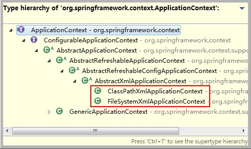

A、 配置文件在类路径下 

若 Spring 配置文件存放在项目的类路径下，则使用 ClassPathXmlApplicationContext
实现类进行加载。


B**、** ApplicationContext **容器中对象的装配时机** 

ApplicationContext
容器，会在容器对象初始化时，将其中的所有对象一次性全部装配好。以后代码中若要使用到这些对象，只需从内存中直接获取即可。执行效率较高。但占用内存。


C**、** 使用 spring 容器创建的 java 对象 


## 2.3：Bean

### 2.3.1：实例化方式

三种bean实例化的方式：默认构造，静态工厂，实例工厂

#### 1：默认构造：

\<bean id="" class=""\> 必须提供默认构造

#### 2：静态工厂

**BeanFactory和ApplicationContext有什么区别？**

**两大核心接口，都可以当做Spring的容器，其中ApplicationContext是BeanFactory的子接口。**

包含了各种Bean的定义，读取bean配置文档，管理bean的加载、实例化，控制bean的生命周期，维护bean之间的依赖关系。


BeanFactroy采用的是 `延迟加载` 形式来注入Bean的，即只有在使用到某个Bean时(调用getBean())，才对该Bean进行加载实例化。ApplicationContext，它是在容器启动时，一次性创建了所有的Bean。


BeanFactory通常以编程的方式被创建，ApplicationContext还能以声明的方式创建，如使用ContextLoader。

-   常用与spring整合其他框架（工具）

-   静态工厂：用于生成实例对象，所有的方法必须是static

 ```xml
<bean id="" class="工厂全限定类名" factory-method="静态方法"> 
 ```

创建实例

```java
public class MyBeanFactory {
	
	/**
	 * 创建实例
	 * @return
	 */
	public static UserService createService(){
		return new UserServiceImpl();
	}
}

```

Spring配置

```xml
	<!-- 将静态工厂创建的实例交予spring 
		class 确定静态工厂全限定类名
		factory-method 确定静态方法名
	-->
	<bean id="userServiceId" class="com.xqc.c_inject.b_static_factory.MyBeanFactory" factory-method="createService"></bean>

```


#### 3：实例工厂

-   实例工厂：必须先有工厂实例对象，通过实例对象创建对象。提供所有的方法都是“非静态”的。

1：工厂

```java
/**
 * 实例工厂,所有方法非静态
 *
 */
public class MyBeanFactory {
	
	/**
	 * 创建实例
	 * @return
	 */
	public UserService createService(){
		return new UserServiceImpl();
	}

}

```

2：Spring配置

```xml
<!-- 创建工厂实例 -->
	<bean id="myBeanFactoryId" class="com.itheima.c_inject.c_factory.MyBeanFactory"></bean>
	<!-- 获得userservice 
		* factory-bean 确定工厂实例
		* factory-method 确定普通方法
	-->
	<bean id="userServiceId" factory-bean="myBeanFactoryId" factory-method="createService"></bean>
```

### 2.3.2 Bean种类

-   普通bean：之前操作的都是普通bean。\<bean id="" class="A"\>，spring直接创建A实例，并返回
    
-   FactoryBean：是一个特殊的bean，具有工厂生成对象能力，只能生成特定的对象。bean必须使用 FactoryBean接口，此接口提供方法 getObject() 用于获得特定bean。

```xml
<bean id="" class="FB"> 先创建FB实例，使用调用getObject()方法，并返回方法的返回值
		FB fb = new FB();
		return fb.getObject();
```

-   BeanFactory 和 FactoryBean 对比？

BeanFactory：工厂，用于生成任意bean。

FactoryBean：特殊bean，用于生成另一个特定的bean。例如：ProxyFactoryBean，此工厂bean用于生产代理。\<bean id="" class="....ProxyFactoryBean"\>
获得代理对象实例。AOP使用

### 2.3.3：作用域

用于确定spring创建bean实例个数


单例的bean

-   取值：

singleton 单例，默认值。

prototype
多例，每执行一次getBean将获得一个实例。例如：struts整合spring，配置action多例。

-   配置信息

```xml
<bean id="" class="" scope="">
```


```xml
<bean id=*"userServiceId"* class=*"com.xqc.d_scope.UserServiceImpl"*   scope=*"prototype"* ></bean>
```


2：Spring如何解决线程并发问题？

只有无状态的Bean才可以在多线程环境下共享，在Spring中，绝大部分Bean都可以声明为singleton作用域，因为Spring对一些Bean中非线程安全状态采用ThreadLocal进行处理，解决线程安全问题。

ThreadLocal和线程同步机制都是为了解决多线程中相同变量的访问冲突问题。同步机制采用了“时间换空间”的方式，仅提供一份变量，不同的线程在访问前需要获取锁，没获得锁的线程则需要排队。而ThreadLocal采用了“空间换时间”的方式。

### 2.3.4生命周期


Spring容器启动扫描，把BeanName变成BeanDefinition存到BeanDefinitionMap中，然后进行遍历，遍历完成之后。对Spring的BeanDefinition做一系列的验证(是否单例，是否抽象，是否懒加载等等)，验证完成，接着实例化之前，去单例池中看这个bean是否已经被创建，如果没有被创建，再查看是否在二级缓存中，看有没有被提前暴露，如果都没有，则继续执行，创建X对象，然后对对象做一些初始化工作，（填充属性，在填充属性的过程中，他发现X依赖了Y，就会继续走Y的生命周期，）


**（1）实例化Bean：在堆中开辟空间**

对于BeanFactory容器，当客户向容器请求一个尚未初始化的bean时，或初始化bean的时候需要注入另一个尚未初始化的依赖时，容器就会调用createBean进行实例化。

对于ApplicationContext容器，当容器启动结束后，通过获取BeanDefinition对象中的信息，实例化所有的bean。

**（2）设置对象属性（依赖注入）：**

实例化后的对象被封装在BeanWrapper对象中，紧接着，Spring根据BeanDefinition中的信息以及 通过BeanWrapper提供的设置属性的接口完成依赖注入。

**（3）处理Aware接口：一些需要的属性**

接着，Spring会检测该对象是否实现了xxxAware接口，并将相关的xxxAware实例set给Bean：

①如果这个Bean已经实现了BeanNameAware接口，会调用它实现的setBeanName(StringbeanId)方法，此处传递的就是Spring配置文件中Bean的id值；

②如果这个Bean已经实现了BeanFactoryAware接口，会调用它实现的setBeanFactory()方法，传递的是Spring工厂自身。

③如果这个Bean已经实现了ApplicationContextAware接口，会调用setApplicationContext(ApplicationContext)方法，传入Spring上下文；

**（4）BeanPostProcessor：：后置处理器（增强器）**

两个方法，一个初始化之前的方法，一个初始化之后的方法

如果想对Bean进行一些自定义的处理，那么可以让Bean实现了BeanPostProcessor接口，那将会调用postProcessBeforeInitialization(Object obj, String s)方法。

**（5）InitializingBean 与 init-method：对属性进行赋值**

如果Bean在Spring配置文件中配置了 init-method属性，则会自动调用其配置的初始化方法。

（6）如果这个Bean实现了BeanPostProcessor接口，将会调用**postProcessAfterInitialization(Object obj, String s)方法**；由于这个方法是在Bean初始化结束时调用的，所以可以被应用于内存或缓存技术；

以上几个步骤完成后，Bean就已经被正确创建了，之后就可以使用这个Bean了。

**（7）DisposableBean：**

当Bean不再需要时，会经过清理阶段，如果Bean实现了DisposableBean这个接口，会调用其实现的destroy()方法；

**（8）destroy-method：**

最后，如果这个Bean的Spring配置中配置了destroy-method属性，会自动调用其配置的销毁方法。

### 2.3.5：循环依赖

1：什么是循环依赖？

A依赖B，B依赖A，Spring容器启动时会创建对象时就会产生循环依赖。


2：循环依赖怎么解决？

给B中A赋值的方法：set方法和构造器的方法，当使用构造器是不能解决的，当使用set的方法时可以使用三级缓存解决。


3：Spring中为什么要使用三级缓存解决循环依赖


**源码分析循环依赖的创建过程**

在项目启动时refresh方法，创建对象

源码中：

singletonObjects

earlySingletonObjects

singletonFactories

分别代表一二三级缓存


获取单例实例

先从一级缓存中是否有对象，如果该对象正在创建（发生了循环依赖）

一级缓存没有，调三级缓存singletonFactory


三级缓存的类型是ObjectFactory


先实例化A放到三级缓存，给A注入实例化B，放到三级缓存，给B赋值从三级缓存获取A，此时发现A没有注入完成，将放入二级缓存，然后将三级缓存中的A清除掉，直接返回给B，使B完成初始化，此时B还在三级缓存，


然后将B放入到一级缓存，然后将三级缓存中的B清除掉，然后再初始化注入A，

为什么使用构造器不能解决循环依赖问题？

此方式是通过实例化和初始化的方式，使用构造器必须使用构造方法，就必须将实例化与初始化搞到一起，

为什么二级缓存不能解决循环依赖问题？

不能，在三个级别的缓存中放的对象是有区别的，一级放的是实例化初始化的对象，二级放的是实例化未初始化的，三级缓存放实例化和匿名内部类，如果只有一级缓存，并发环境下就有可能取到实例化未初始化的值；

三级缓存的匿名内部类，这个匿名内部类可能是代理类，也可能是普通的实例对象，而使用三级缓存就保证了不管是否都能保证使用的是一个对象，而不会出现前面使用bean，后面使用代理类的情况


## 2.3 基于 XML 的 DI

property注入属性，还有构造方法注入属性，还有map，list等数据结构注入的方式又是什么？P命名空间注入

不再写 `<bean>` 标签，使用注解方式

### 2.3.1 注入分类 

bean 实例在调用无参构造器创建对象后，就要对 bean对象的属性进行初始化。初始化是由容器自动完成的，称为注入。

>   根据注入方式的不同，常用的有两类：set 注入、构造注入。

#### **（**1**）** set **注入**(**掌握**) 

set 注入也叫设值注入是指，通过 setter方法传入被调用者的实例。这种注入方式简单、直观，因而在 Spring的依赖注入中大量使用。

**A**、 简单类型

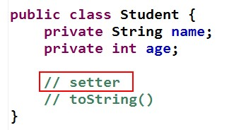

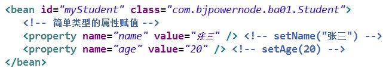

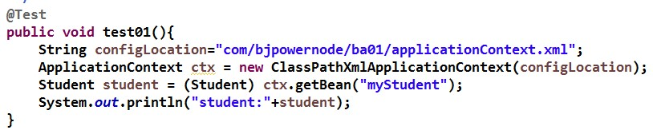

创建 java.util.Date 并设置初始的日期时间：

Spring 配置文件：


测试方法：


**B**、 引用类型

当指定 bean 的某属性值为另一 bean 的实例时，通过 ref 指定它们间的引用关系。ref
的值必须为某 bean 的 id 值。

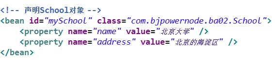

对于其它 Bean 对象的引用，使用\<bean/\>标签的 ref 属性


>   测试方法：


C、特殊类型

使用![CDATA[]]注入特殊字符><=等符号

注入list

```xml
<property name="list">
    <list>
        <value>篮球</value>
    </list>
</property>
```

注入set类似

注入map

```xml
<property>
    <map>
        <entry>
            <key>
                <value>football</value>
            </key>
            <value>足球</value>
        </entry>
    </map>
</property>
```

注入Properties

#### （2） 构造注入(理解) 

构造注入是指，在构造调用者实例的同时，完成被调用者的实例化。即，使用构造器设置依赖关系。

举例 1：

如果有了有参构造，那默认的无参构造器就失效了，尽量还是要把无参的写出来


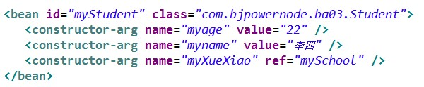

\<constructor-arg /\>标签中用于指定参数的属性有：

-   name：指定参数名称。
-   index：指明该参数对应着构造器的第几个参数，从 0开始。不过，该属性不要也行，但要注意，若参数类型相同，或之间有包含关系，则需要保证赋值顺序要与构造器中的参数顺序一致。

必须与构造方法的一样的参数数量，不够灵活。

举例 2：使用构造注入创建一个系统类 **File** 对象

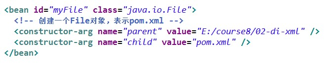

测试类：


#### （3）P命名空间注入

其实还是依赖的setter方法注入

```xml
<bean id = "user3" class = "com,xqc.entity.User"
      p:userName = "娃娃" p:age = "20" p:gender="男">
</bean>
<!--如果是一个外部类，使用p:gender-ref = ""-->
```


### 2.3.2 引用类型属性自动注入 

对于引用类型属性的注入，也可不在配置文件中显示的注入。可以通过为\<bean/\>标签设置autowire属性值，为引用类型属性进行隐式自动注入（默认是不自动注入引用类型属性）。根据自动注入判断标准的不同，可以分为两种：
byName：根据名称自动注入  byType： 根据类型自动注入

#### **（**1**）** byName **方式自动注入** 

当配置文件中被调用者 bean 的 id 值与代码中调用者 bean 类的属性名相同时，可使用
byName 方式，让容器自动将被调用者 bean 注入给调用者 bean。容器是通过调用者的
bean 类的属性名与配置文件的被调用者 bean 的 id 进行比较而实现自动注入的。


#### **（**2**）** byType **方式自动注入** 

使用 byType 方式自动注入，要求：配置文件中被调用者 bean 的 class
属性指定的类，要与代码中调用者 bean
类的某引用类型属性类型同源。即要么相同，要么有 is-a
关系（子类，或是实现类）。但这样的同源的被调用 bean
只能有一个。多于一个，容器就不知该匹配哪一个了。


### 2.3.3 为应用指定多个 Spring 配置文件 

在实际应用里，随着应用规模的增加，系统中 Bean
数量也大量增加，导致配置文件变得非常庞大、臃肿。为了避免这种情况的产生，提高配置文件的可读性与可维护性，可以将

Spring 配置文件分解成多个配置文件。

包含关系的配置文件：

多个配置文件中有一个总文件，总配置文件将各其它子文件通过\<import/\>引入。在 Java
代码中只需要使用总配置文件对容器进行初始化即可。

举例：代码：

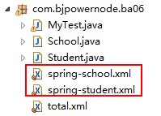

**Spring** 配置文件：


也可使用通配符\*。但，此时要求父配置文件名不能满足\*所能匹配的格式，否则将出现循环递归包含。就本例而言，父配置文件不能匹配
spring-\*.xml 的格式，即不能起名为 spring-total.xml。

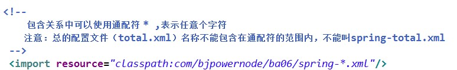

>   测试代码：


## 2.4 基于注解的 DI 

自动装配：在spring中，对象无需自己查找或创建与其关联的其他对象，由容器负责把需要相互协作的对象引用赋予各个对象，使用autowire来配置自动装载模式。

在Spring框架xml配置中共有5种**自动装配：**

（1）no：默认的方式是不进行自动装配的，通过手工设置ref属性来进行装配bean。

（2）byName：通过bean的名称进行自动装配，如果一个bean的 property 与另一bean的name 相同，就进行自动装配。

（3）byType：通过参数的数据类型进行自动装配。

（4）constructor：利用构造函数进行装配，并且构造函数的参数通过byType进行装配。

（5）autodetect：自动探测，如果有构造方法，通过construct的方式自动装配，否则使用 byType的方式自动装配。

>   举例：di-annotation 项目

对于 DI 使用注解，将不再需要在 Spring 配置文件中声明 bean 实例。Spring中使用注解，需要在原有 Spring 运行环境基础上再做一些改变。

需要在 Spring 配置文件中配置组件扫描器，用于在指定的基本包中扫描注解。

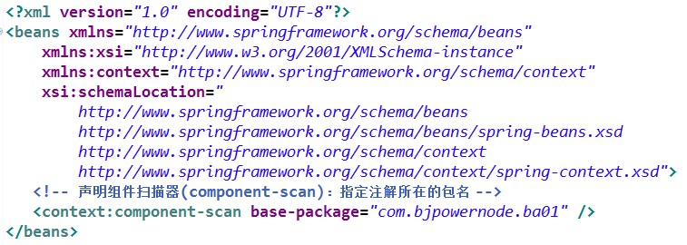

指定多个包的三种方式：

**1)**使用多个 **context:component-scan** 指定不同的包路径

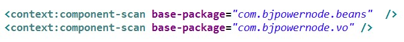

**2)**指定 **base-package** 的值使用分隔符

分隔符可以使用逗号（，）分号（；）还可以使用空格，不建议使用空格。

逗号分隔：


>   分号分隔：


**3)base-package** 是指定到父包名

base-package
的值表是基本包，容器启动会扫描包及其子包中的注解，当然也会扫描到子包下级的子包。所以
base-package 可以指定一个父包就可以。


>   或者最顶级的父包


但不建议使用顶级的父包，扫描的路径比较多，导致容器启动时间变慢。指定到目标包和合适的。也就是注解所在包全路径。例如注解的类在
com.xqc.beans 包中

```xml
<context:component-scan base-package="com.xqc.benas"/>
```

### 2.4.1 定义 Bean 的注解@Component(掌握) 

需要在类上使用注解@Component，该注解的 value 属性用于指定该 bean 的 id 值。

```java
//注解参数中省略了value属性，该属性用于指定Bean的ID
@Component("myStudent")
public class Student{
    private String name;
    private int age;
}
```

另外，Spring 还提供了 3 个创建对象的注解：

-   @Repository 用于对 DAO 实现类进行注解

-   @Service 用于对 Service 实现类进行注解

-   @Controller 用于对 Controller 实现类进行注解

这三个注解与@Component 都可以创建对象，但这三个注解还有其他的含义，@Service创建业务层对象，业务层对象可以加入事务功能，@Controller
注解创建的对象可以作为处理器接收用户的请求。@Repository，@Service，@Controller 是对@Component注解的细化，标注不同层的对象。即持久层对象，业务层对象，控制层对象。

@Component 不指定 value 属性，bean 的 id 是类名的首字母小写。

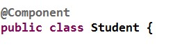


### 2.4.2 简单类型属性注入@Value(掌握) 

需要在属性上使用注解@Value，该注解的 value 属性用于指定要注入的值。

使用该注解完成属性注入时，类中无需 setter。当然，若属性有 setter，则也可将其加到setter 上。

```java
//注解参数中省略了value属性，该属性用于指定Bean的id
public class Student{
    @Value("zhangsan")
    private String name;
    @Value("21")
    private String age;
}
```

### 2.4.3 byType 自动注入@Autowired(掌握) 

需要在引用属性上使用注解@Autowired，该注解**默认使用按类型自动装配** Bean的方式。使用该注解完成属性注入时，类中无需 setter。当然，若属性有
setter，则也可将其加到 setter 上。

```java
@Component("myStudent")
public class Student{
    @Value("zhangsan")
    private String name;
    @Value("21")
    private String age;
    @Autowired
    private School school;
}
```

### 2.4.4 byName 自动注入@Autowired 与@Qualifier(掌握) 

需要在引用属性上联合使用注解@Autowired 与@Qualifier。@Qualifier 的 value属性用于指定要匹配的 Bean 的 id 值。类中无需 set 方法，也可加到 set 方法上。


@Autowired 还有一个属性 required，默认值为true，表示当匹配失败后，会终止程序运行。若将其值设置为false，则匹配失败，将被忽略，未匹配的属性值为 null。

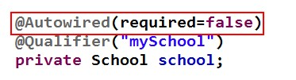

### 2.4.5 JDK 注解@Resource 自动注入(掌握) 

Spring 提供了对 jdk 中@Resource 注解的支持。**@Resource** 注解既可以按名称匹配Bean，也可以按类型匹配 Bean。**默认是按名称注入**。使用该注解，要求 JDK 必须是 6及以上版本。

@Resource 可在属性上，也可在 set 方法上。

**（**1**）** byType **注入引用类型属性**

@Resource 注解若不带任何参数，采用默认按名称的方式注入，按名称不能注入bean，则会按照类型进行 Bean 的匹配注入。

>   举例：


**（**2**）** byName **注入引用类型属性**

@Resource 注解指定其 name 属性，则 name 的值即为按照名称进行匹配的 Bean 的id。

>   举例：


### 2.4.6 注解与 XML 的对比 

注解优点是：

-   方便

-   直观

-   高效（代码少，没有配置文件的书写那么复杂）。

其弊端也显而易见：以硬编码的方式写入到 Java代码中，修改是需要重新编译代码的。

XML 方式优点是：

-   配置和代码是分离的

-   在 xml 中做修改，无需编译代码，只需重启服务器即可将新的配置加载。

    xml 的缺点是：编写麻烦，效率低，大型项目过于复杂。


# 第**3**章 **AOP** 面向切面编程

面向切面编程，就是将交叉业务逻辑封装成切面，利用 AOP容器的功能将切面织入到主业务逻辑中。所谓交叉业务逻辑是指，通用的、与主业务逻辑无关的代码，如安全检查、事务、日志、缓存等。

AOP实现的关键就在于AOP框架自动创建的AOP代理，AOP代理则可分为静态代理和动态代理两大类，其中静态代理是指使用AOP框架提供的命令进行编译，从而在编译阶段就可生成 AOP 代理类，因此也称为编译时增强；而动态代理则在运行时借助于JDK动态代理、CGLIB等在内存中“临时”生成AOP动态代理类，因此也被称为运行时增强。

## 3.1 简介 

AOP（Aspect OrientProgramming），面向切面编程。面向切面编程是从动态角度考虑程序运行过程。

AOP 底层，就是采用动态代理模式实现的。采用了两种代理：JDK 的动态代理，与 CGLIB的动态代理


若不使用AOP，则会出现代码纠缠，即交叉业务逻辑与主业务逻辑混合在一起。这样，会使主业务逻辑变的混杂不清。

例如：不使用AOP实现日志

-   doTransaction()：用于事务处理

-   doLog()：用于日志处理

方法一：

接口：

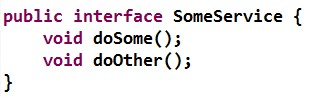

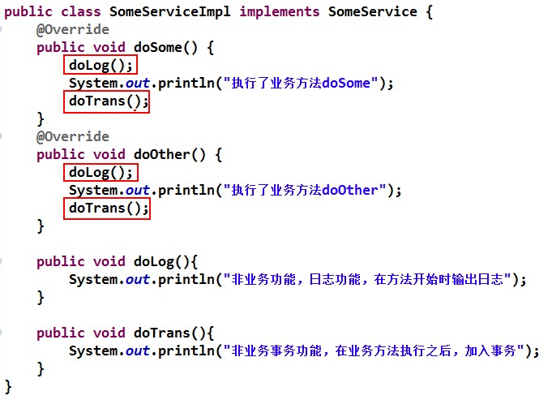

方法二：

当然，也可以有另一种解决方案：将这些交叉业务逻辑代码放到专门的工具类或处理类中，由主业务逻辑调用。

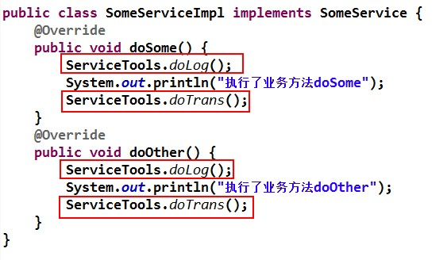


方法三：

主业务深度耦合在一起。当交叉业务逻辑较多时，在主业务代码中会出现大量的交叉业务逻辑代码调用语句，大大影响了主业务逻辑的可读性，降低了代码的可维护性，同时也增加了开发难度。

>   所以，可以采用动态代理方式。在不修改主业务逻辑的前提下，扩展和增强其功能。

功能增强：


## 3.3 面向切面编程对有什么好处？ 

1.减少重复；

2.专注业务；

注意：面向切面编程只是面向对象编程的一种补充。

使用 **AOP** 减少重复代码，专注业务实现：

它将应用系统拆分分了2个部分：核心业务逻辑（Core business concerns）及横向的通用逻辑，


## 3.3动态代理

SpringAOP就是使用动态代理实现的，当Bean实现接口时，Spring就会用JDK的动态代理，没有实现接口，就会使用cglib的动态代理。JDK动态代理通过反射来接受被代理的类，但是被代理的类必须实现接口，核心是InvocationHandler类和Proxy类，cglib动态代理的类一般是没有实现接口的类，cglib是一个代码生成的类库，可以在运行时动态生成某个类的紫烈，所以，GBLIB是通过集成的方式做的动态代理，因此如果某各类被标记为final，那么他是无法使用cglib做动态代理的。

1：JDK动态代理

2：CGLIB动态代理

-   没有接口，只有实现类。
-   采用字节码增强框架 cglib，在运行时 创建目标类的子类，从而对目标类进行增强。
-   导入jar包：

不同的与优缺点：

- JDK 是基于接口实现，而 CGLIB 继承代理类，通常建议使用jdk代理

- CGLib不能对声明为final的方法进行代理

- JDK动态代理只能对实现了接口的类生成代理，而不能针对类。

- CGLIB是针对类实现代理，主要是对指定的类生成一个子类，覆盖其中的方法，并覆盖其中方法实现增强，但是因为采用的是继承，所以该类或方法最好不要声明成final， 对于final类或方法，是无法继承的

  使用CGLib实现动态代理，CGLib底层采用ASM字节码生成框架，使用字节码技术生成代理类，在jdk6之前比使用Java反射效率要高。唯一需要注意的是，CGLib不能对声明为final的方法进行代理，因为CGLib原理是动态生成被代理类的子类


自己导包（了解）：

核心：hibernate-distribution-3.6.10.Final\\lib\\bytecode\\cglib\\cglib-2.2.jar

依赖：struts-2.3.15.3\\apps\\struts2-blank\\WEB-INF\\lib\\asm-3.3.jar

spring-core..jar 已经整合以上两个内容

## 3.4 AOP 编程术语(掌握) 

### （1） 切面（Aspect） 

切面泛指交叉业务逻辑。上例中的事务处理、日志处理就可以理解为切面。

常用的切面是通知（Advice）。实际就是对主业务逻辑的一种增强。

切面用Spring 的Advisor 或拦截器实现。

### （2） 连接点（JoinPoint） 

连接点指可以被切面织入的具体方法。通常业务接口中的方法均为连接点。

### （3） 切入点（Pointcut） 

>   切入点指声明的一个或多个连接点的集合。通过切入点指定一组方法。

被标记为 final
的方法是不能作为连接点与切入点的。因为最终的是不能被修改的，不能被增强的。

### （4） 目标对象（Target） 

目标对象指将要被增强的对象。即包含主业务逻辑的类的对象。上例中的
StudentServiceImpl的对象若被增强，则该类称为目标类，该类对象称为目标对象。当然，不被增强，也就无所谓目标不目标了。

### （5） 通知（Advice） 

通知表示切面的执行时间，Advice 也叫增强。上例中的 MyInvocationHandler
就可以理解为是一种通知。换个角度来说，通知定义了增强代码切入到目标代码的时间点，是目标方法执行之前执行，还是之后执行等。通知类型不同，切入时间不同。

>   切入点定义切入的位置，通知定义切入的时间。

Spring按照通知Advice在目标类方法的连接点位置，可以分为5类

- 前置通知Before advice

  在目标方法执行前实施增强，但这个通知不能阻止连接点前的执行。
ApplicationContext 中在\<aop:aspect>里面使用\<aop:before>元素进行声明。
  
- 后置通知After advice

  在目标方法执行后实施增强(不论是正常返回还是异常退出)

  ApplicationContext 中在\<aop:aspect>里面使用\<aop:after>元素进行声明。

-   After returnadvice：

在某连接点正常完成后执行的通知，不包括抛出
异常的情况。
ApplicationContext 中在\<aop:aspect>里面使用\<aop:after-returning>
元素进行声明。

- 环绕通知 Around advice

  包围一个连接点的通知，类似Web 中Servlet 规范中的Filter 的doFilter 方法。可以在方法的调用前后完成自定义的行为，也可以选择不执。ApplicationContext 中在\<aop:aspect>里面使用\<aop:around>元素进行声明。
  
-   异常抛出通知

    在方法抛出异常后实施增强

-   引介通知 org.springframework.aop.IntroductionInterceptor

    在目标类中添加一些新的方法和属性

## 3.5 AspectJ 对 AOP 的实现(掌握) 

对于 AOP 这种编程思想，很多框架都进行了实现。Spring就是其中之一，可以完成面向切面编程。然而，AspectJ 也实现了 AOP的功能，且其实现方式更为简捷，使用更为方便，而且还支持注解式开发。所以，Spring又将 AspectJ 的对于 AOP 的实现也引入到了自己的框架中。在 Spring 中使用 AOP 开发时，一般使用 AspectJ 的实现方式。

### 1：AspectJ 简介 

AspectJ 是一个优秀面向切面的框架，它扩展了 Java 语言，提供了强大的切面实现。

@AspectJ 是AspectJ1.5新增功能，通过JDK5注解技术，允许直接在Bean类中定义切面

新版本Spring框架，建议使用AspectJ方式来开发AOP

官网地址：<http://www.eclipse.org/aspectj/>[ ](http://www.eclipse.org/aspectj/)

**AspetJ** 是 **Eclipse** 的开源项目，官网介绍如下：

a seamless aspect-oriented extension to the Javatm programminglanguage（一种基于 Java 平台的面向切面编程的语言）

Java platform compatible（兼容 Java 平台，可以无缝扩展） easy to learn and use（易学易用）

### 2： AspectJ 的通知类型(理解) 

AspectJ 中常用的通知有五种类型：

- before:前置通知(应用：各种校验)


在方法执行前执行，如果通知抛出异常，阻止方法运行

- afterReturning:后置通知(应用：常规数据处理)


方法正常返回后执行，如果方法中抛出异常，通知无法执行

必须在方法执行后才执行，所以可以获得方法的返回值。

- around:环绕通知(应用：十分强大，可以做任何事情)


方法执行前后分别执行，可以阻止方法的执行

必须手动执行目标方法

- afterThrowing:抛出异常通知(应用：包装异常信息)


方法抛出异常后执行，如果方法没有抛出异常，无法执行

- after:最终通知(应用：清理现场)

方法执行完毕后执行，无论方法中是否出现异常

```java
环绕 try{  
    //前置：before  
    //手动执行目标方法  
    //后置：afterRetruning 
} catch(){  
    //抛出异常 afterThrowing 
} finally{  
    //最终 after 
} 
```


同一个aspect，不同advice的执行顺序：

①没有异常情况下的执行顺序：

around before advice

before advice

target method 执行

around after advice

after advice

afterReturning

②有异常情况下的执行顺序：

around before advice

before advice

target method 执行

around after advice

after advice

afterThrowing:异常发生

java.lang.RuntimeException: 异常发生

### 3 ：AspectJ 的切入点表达(掌握) 

AspectJ 定义了专门的表达式用于指定切入点。表达式的原型是：

modifiers-pattern] 访问权限类型 ret-type-pattern 返回值类型 declaring-type-pattern 包名类名

name-pattern(param-pattern) 方法名(参数类型和参数个数) throws-pattern 抛出异常类型

？表示可选的部分

以上表达式共 4 个部分。

execution(访问权限 方法返回值 方法声明(参数) 异常类型)

切入点表达式要匹配的对象就是目标方法的方法名。所以，execution表达式中明显就是方法的签名。注意，表达式中黑色文字表示可省略部分，各部分间用空格分开。在其中可以使用以下符号：


举例：

execution(public \* \*(..))  指定切入点为：任意公共方法。

execution(\* set\*(..)) 指定切入点为：任何一个以“set”开始的方法。

execution(\* com.xyz.service.\*.\*(..)) 指定切入点为：定义在 service包里的任意类的任意方法。

execution(\* com.xyz.service..\*.\*(..))指定切入点为：定义在 service包或者子包里的任意类的任意方法。“..”出现在类名中时，后面必须跟“\*”，表示包、子包下的所有类。

execution(\* \*..service.\*.\*(..))指定所有包下的 serivce 子包下所有类（接口）中所有方法为切入点

execution(\*\*.service.\*.\*(..))指定只有一级包下的 serivce 子包下所有类（接口）中所有方法为切入点

execution(\*\*.ISomeService.\*(..))指定只有一级包下的 ISomeSerivce 接口中所有方法为切入点

execution(\* \*..ISomeService.\*(..))指定所有包下的 ISomeSerivce 接口中所有方法为切入点

execution(\* com.xyz.service.IAccountService.\*(..))指定切入点为：IAccountService 接口中的任意方法。

execution(\* com.xyz.service.IAccountService+.\*(..))指定切入点为：IAccountService若为接口，则为接口中的任意方法及其所有实现类中的任意方法；若为类，则为该类及其子类中的任意方法。

execution(\* joke(String,int)))指定切入点为：所有的 joke(String,int)方法，且 joke()方法的第一个参数是String，第二个参数是 int。如果方法中的参数类型是 java.lang包下的类，可以直接使用类名，否则必须使用全限定类名，如 joke( java.util.List,int)。

execution(\* joke(String,\*)))

指定切入点为：所有的 joke()方法，该方法第一个参数为
String，第二个参数可以是任意类

型，如 joke(String s1,String s2)和 joke(String s1,double d2)都是，但 joke(String
s1,double d2,String s3)不是。

execution(\* joke(String,..)))

指定切入点为：所有的 joke()方法，该方法第一个参数为
String，后面可以有任意个参数且参数类型不限，如 joke(String s1)、joke(String
s1,String s2)和 joke(String s1,double d2,String s3) 都是。

execution(\* joke(Object))

指定切入点为：所有的 joke()方法，方法拥有一个参数，且参数是 Object
类型。joke(Object ob) 是，但，joke(String s)与 joke(User u)均不是。

execution(\* joke(Object+))) 指定切入点为：所有的
joke()方法，方法拥有一个参数，且参数是 Object 类型或该类的子类。不仅 joke(Object
ob)是，joke(String s)和 joke(User u)也是。

### 4： AspectJ 的开发环境(掌握) 

(1） maven 依赖

```xml
<dependency> 
 <groupId>junit</groupId> 
 <artifactId>junit</artifactId> 
 <version>4.11</version> 
 <scope>test</scope> 
</dependency> 
<dependency> 
 <groupId>org.springframework</groupId> 
 <artifactId>spring-context</artifactId> 
 <version>5.2.5.RELEASE</version> 
</dependency> 
 
<dependency> 
 <groupId>org.springframework</groupId> 
 <artifactId>spring-aspects</artifactId> 
 <version>5.2.5.RELEASE</version> 
</dependency>  
<build> 
<plugins> 
       <plugin> 
            <artifactId>maven-compiler-plugin</artifactId> 
            <version>3.1</version> 
            <configuration> 
                <source>1.8</source> 
                <target>1.8</target> 
            </configuration> 
       </plugin> 
</plugins> 
</build> 

```

**（**2**） 引入** AOP **约束**

在 AspectJ 实现 AOP 时，要引入 AOP 的约束。配置文件中使用的 AOP约束中的标签，均是 AspectJ 框架使用的，而非 Spring 框架本身在实现 AOP 时使用的。

AspectJ 对于 AOP 的实现有注解和配置文件两种方式，常用是注解方式。

### 5： AspectJ 基于注解的 AOP 实现(掌握) 

AspectJ 提供了以注解方式对于 AOP 的实现。

（1） 实现步骤

A、 Step1：定义业务接口与实现类

```java
public class SomeServiceImpl implements SomService{
    @Override
    public void doSome(String name,int age){
        System.out.println("执行doSome");
    }
}
```

B、 Step2：定义切面类

类中定义了若干普通方法，将作为不同的通知方法，用来增强功能。

```java
/**
*/
@Aspect
public class MyAspect{
    /**
    * @Before:前置通知
    * 属性：value切入点表达式，表示切面执行的位置
    * 位置：方法的定义上面
    */
    @Before(value="execution(* com.xqc.SomeServiceImpl.doSome(..))")
    public void myBefore(){
        //就是切面代码的功能，例如日志的输出，事务的处理
        System.out.println("前置通知：在目标方法之前先执行，例如输出日志")
    }
}
```

C、 Step3：声明目标对象切面类对象

```xml
<!--声明目标类对象-->
<bean id="someServcieTarget" class="com.xqc.SomeServiceImpl"></bean>
<!--声明切面类对象-->
<bean id="myAspect" class="com.xqc.MyAspect"></bean>
```

D、 Step4：注册 AspectJ 的自动代理

在定义好切面 Aspect 后，需要通知 Spring 容器，让容器生成“目标类+切面”的代理对象。这个代理是由容器自动生成的。只需要在 Spring配置文件中注册一个基于 aspectj 的自动代理生成器，其就会自动扫描到@Aspect注解，并按通知类型与切入点，将其织入，并生成代理。


\<aop:aspectj-autoproxy/\>的底层是由 AnnotationAwareAspectJAutoProxyCreator实现的。从其类名就可看出，是基于 AspectJ 的注解适配自动代理生成器。

其工作原理是，\<aop:aspectj-autoproxy/\>通过扫描找到@Aspect定义的切面类，再由切面类根据切入点找到目标类的目标方法，再由通知类型找到切入的时间点。

E、 Step5：测试类中使用目标对象的 **id**

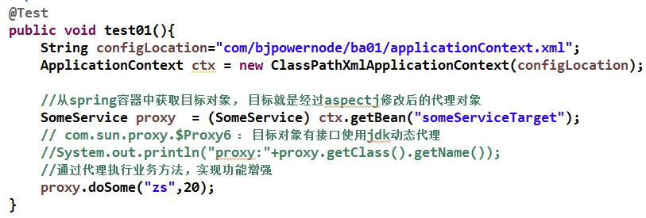

（2） [掌握]@Before 前置通知-方法有 JoinPoint 参数

在目标方法执行之前执行。被注解为前置通知的方法，可以包含一个 JoinPoint类型参数。该类型的对象本身就是切入点表达式。通过该参数，可获取切入点表达式、方法签名、目标对象等。

不光前置通知的方法，可以包含一个 JoinPoint类型参数，所有的通知方法均可包含该参数。

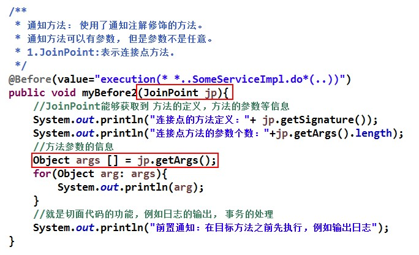

（3）[掌握]@AfterReturning 后置通知-注解有 returning
**属性**

在目标方法执行之后执行。由于是目标方法之后执行，所以可以获取到目标方法的返回值。该注解的returning属性就是用于指定接收方法返回值的变量名的。所以，被注解为后置通知的方法，除了可以包含JoinPoint 参数外，还可以包含用于接收返回值的变量。该变量最好为 Object类型，因为目标方法的返回值可能是任何类型。

接口增加方法：

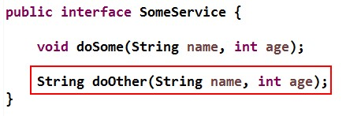

实现方法：

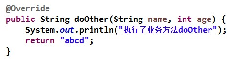

定义切面：


（4） [掌握]@Around 环绕通知-增强方法有 ProceedingJoinPoint
**参数**

在目标方法执行之前之后执行。被注解为环绕增强的方法要有返回值，Object类型。并且方法可以包含一个 ProceedingJoinPoint 类型的参数。接口
ProceedingJoinPoint 其有一个proceed()方法，用于执行目标方法。若目标方法有返回值，则该方法的返回值就是目标方法的返回值。最后，环绕增强方法将其返回值返回。该增强方法实际是拦截了目标方法的执行。

接口增加方法：

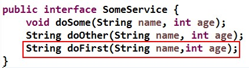

接口方法的实现：

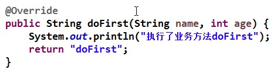

定义切面：

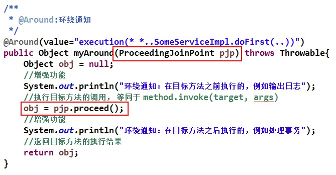

（5）@AfterThrowing 异常通知-注解中有 throwing
**属性**

在目标方法抛出异常后执行。该注解的 throwing属性用于指定所发生的异常类对象。当然，被注解为异常通知的方法可以包含一个参数
Throwable，参数名称为 throwing 指定的名称，表示发生的异常对象。

增加业务方法：

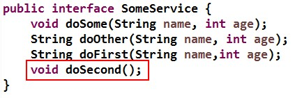

方法实现：


定义切面：

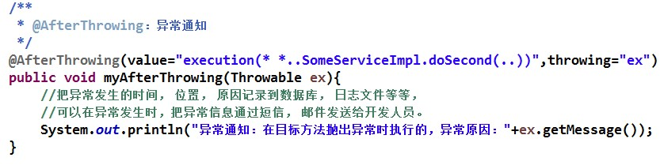

**（**6**）** [**了解**]@After **最终通知**

无论目标方法是否抛出异常，该增强均会被执行。

增加方法：

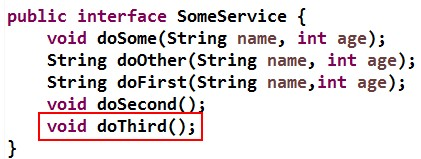

方法实现：

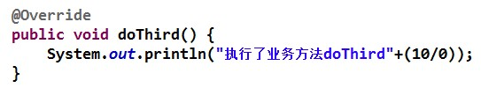

定义切面：


**（**7**）** @Pointcut **定义切入点**

>   当较多的通知增强方法使用相同的 execution
>   切入点表达式时，编写、维护均较为麻烦。

AspectJ 提供了\@Pointcut 注解，用于定义 execution 切入点表达式。

其用法是，将\@Pointcut 注解在一个方法之上，以后所有的 execution 的 value
属性值均可使用该方法名作为切入点。代表的就是\@Pointcut
定义的切入点。这个使用\@Pointcut 注解的方法一般使用 private
的标识方法，即没有实际作用的方法。

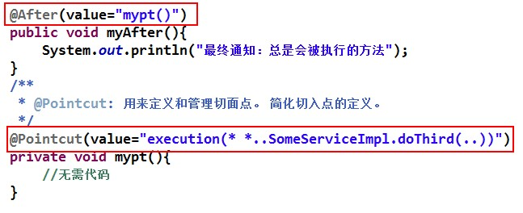

## AspectJ和Spring AOP的区别？

Spring AOP

1、基于动态代理来实现，默认如果使用接口的，用JDK提供的动态代理实现，如果是方法则使用CGLIB实现

2、Spring AOP需要依赖IOC容器来管理，并且只能作用于Spring容器，使用纯Java代码实现

3、在性能上，由于Spring AOP是基于动态代理来实现的，在容器启动时需要生成代理实例，在方法调用上也会增加栈的深度，使得Spring AOP的性能不如AspectJ的那么好

AspectJ

AspectJ属于静态织入，通过修改代码来实现，有如下几个织入的时机：

 1、编译期织入（Compile-time weaving）： 如类 A 使用 AspectJ 添加了一个属性，类 B 引用了它，这个场景就需要编译期的时候就进行织入，否则没法编译类 B。

 2、编译后织入（Post-compile weaving）： 也就是已经生成了 .class 文件，或已经打成 jar 包了，这种情况我们需要增强处理的话，就要用到编译后织入。

3、类加载后织入（Load-time weaving）： 指的是在加载类的时候进行织入，要实现这个时期的织入，有几种常见的方法。

- 自定义类加载器来干这个，这个应该是最容易想到的办法，在被织入类加载到 JVM 前去对它进行加载，这样就可以在加载的时候定义行为了。
- 在 JVM 启动的时候指定 AspectJ 提供的 agent：`-javaagent:xxx/xxx/aspectjweaver.jar`。


AspectJ可以做Spring AOP干不了的事情，它是AOP编程的完全解决方案，Spring AOP则致力于解决企业级开发中最普遍的AOP（方法织入）。而不是成为像AspectJ一样的AOP方案

因为AspectJ在实际运行之前就完成了织入，所以说它生成的类是没有额外运行时开销的


# 第**5**章 **Spring** 事务 

## 回顾

-   事务：一组业务操作ABCD，要么全部成功，要么全部不成功。

-   特性：ACID

原子性：整体

一致性：完成

隔离性：并发

持久性：结果

-   隔离问题：

脏读：一个事务读到另一个事务没有提交的数据

不可重复读：一个事务读到另一个事务已提交的数据（update）

虚读(幻读)：一个事务读到另一个事务已提交的数据（insert）

-   隔离级别：

read uncommitted：读未提交。存在3个问题

read committed：读已提交。解决脏读，存在2个问题

repeatable read：可重复读。解决：脏读、不可重复读，存在1个问题。

serializable ：串行化。都解决，单事务。

## 5.1 Spring 的事务管理 

Spring事务的本质其实就是数据库对事务的支持，没有数据库的事务支持，spring是无法提供事务功能的。真正的数据库层的事务提交和回滚是通过binlog或者redolog实现的。

分类：

①编程式事务管理使用TransactionTemplate。

②声明式事务管理建立在AOP之上的。其本质是通过AOP功能，对方法前后进行拦截，将事务处理的功能编织到拦截的方法中，也就是在目标方法开始之前加入一个事务，在执行完目标方法之后根据执行情况提交或者回滚事务。

事务原本是数据库中的概念，在 Dao 层。但一般情况下，需要将事务提升到业务层，即Service 层。这样做是为了能够使用事务的特性来管理具体的业务。

>   在 Spring 中通常可以通过以下两种方式来实现对事务的管理：

1.  使用 Spring 的事务注解管理事务

2.  使用 AspectJ 的 AOP 配置管理事务

## 5.2 Spring 事务管理 API 

>   Spring 的事务管理，主要用到两个事务相关的接口。 **三个顶级接口**

-   PlatformTransactionManager
    平台事务管理器，spring管理事务，必须使用事务管理器

进行事务配置时，必须**配置事务管理器**。

-   TransactionDefinition：事务详情（事务定义、事务属性），spring用于确定事务具体详情，

例如：隔离级别、是否只读、超时时间 等

进行事务配置时，**必须配置详情**。spring将配置项封装到该对象实例。

-   TransactionStatus：事务状态，spring用于记录当前事务运行状态。例如：是否有保存点，事务是否完成。

### （1） PlatformTransactionManager (重点) 

事务管理器是 PlatformTransactionManager接口对象。其主要用于完成事务的提交、回滚，及获取事务的状态信息。


#### A、 常用的两个实现类 

>   PlatformTransactionManager 接口有两个常用的实现类：

>   DataSourceTransactionManager：使用 JDBC 或 MyBatis 进行数据库操作时使用。

>   HibernateTransactionManager：使用 Hibernate 进行持久化数据时使用。

#### B**、** Spring **的回滚方式**(**理解**) 

Spring 事务的默认回滚方式是：发生运行时异常和 error时回滚，发生受查(编译)异常时提交。不过，对于受查异常，程序员也可以手工设置其回滚方式。

#### **C**、 回顾错误与异常**(**理解**)** 


Throwable 类是 Java 语言中所有错误或异常的超类。只有当对象是此类(或其子类之一)
的实例时，才能通过 Java 虚拟机或者 Java 的 throw 语句抛出。

>   Error 是程序在运行过程中出现的无法处理的错误，比如OutOfMemoryError、ThreadDeath、NoSuchMethodError等。当这些错误发生时，程序是无法处理（捕获或抛出）的，JVM 一般会终止线程。

>   程序在编译和运行时出现的另一类错误称之为异常，它是 JVM通知程序员的一种方式。

通过这种方式，让程序员知道已经或可能出现错误，要求程序员对其进行处理。

>   异常分为运行时异常与受查异常。

运行时异常，是 RuntimeException 类或其子类，即只有在运行时才出现的异常。如，NullPointerException，ArrayIndexOutOfBoundsException、IllegalArgumentException等均属于运行时异常。这些异常由 JVM抛出，在编译时不要求必须处理（捕获或抛出）。但，只要代码编写足够仔细，程序足够健壮，运行时异常是可以避免的。

受查异常，也叫编译时异常，即在代码编写时要求必须捕获或抛出的异常，若不处理，则无法通过编译。如
SQLException，ClassNotFoundException，IOException 等都属于受查异常。

RuntimeException 及其子类以外的异常，均属于受查异常。当然，用户自定义的
Exception的子类，即用户自定义的异常也属受查异常。程序员在定义异常时，只要未明确声明定义的为
RuntimeException 的子类，那么定义的就是受查异常。

### （2） TransactionDefinition事务定义接口 

事务定义接口 TransactionDefinition中定义了事务描述相关的三类常量：事务隔离级别、事务传播行为、事务默认超时时限，及对它们的操作。


#### A、 五个事务隔离级别常量(掌握) 

这些常量均是以 ISOLATION_开头。即形如 ISOLATION_XXX。

isolation_default：采用 DB 默认的事务隔离级别。MySql 的默认为REPEATABLE_READ； Oracle 默认为 READ_COMMITTED

isolation_read_uncommitted：读未提交。未解决任何并发问题。允许另外一个事务可以看到这个事务未提交的数据。

isolation_read_committed：读已提交。解决脏读，存在不可重复读与幻读。保证一个事务修改的数据提交后才能被另一事务读取，而且能看到该事务对已有记录的更新。

 repeatable_read：可重复读。解决脏读、不可重复读，存在幻读。保证一个事务修改的数据提交后才能被另一事务读取，但是不能看到该事务对已有记录的更新。

solation_serializable：串行化。不存在并发问题。
**一个事务在执行的过程中完全看不到其他事务对数据库所做的更新。**

#### B、 七个事务传播行为常量(掌握) 

spring事务的传播行为说的是，当多个事务同时存在的时候，spring如何处理这些事务的行为。

所谓事务传播行为是指，处于不同事务中的方法在相互调用时，执行期间事务的维护情况。如，A事务中的方法 doSome()调用 B 事务中的方法doOther()，在调用执行期间事务的维护情况，就称为事务传播行为。事务传播行为是加在方法上的。事务传播行为常量都是以
PROPAGATION\_ 开头，形如 PROPAGATION_XXX

>   propagation_required

>   propagation_requires_new

>   propagation_supports

>   propagation_mandatory

>   propagation_nested

>   propagation_never

>   Propagation_not_supported

a**、** PROPAGATION_REQUIRED （propagation_required）

指定的方法必须在事务内执行。**若当前存在事务，就加入到当前事务中；若当前没有事务，则创建一个新事务**。这种传播行为是最常见的选择，也是Spring 默认的事务传播行为。如该传播行为加在 doOther()方法上。

若doSome()方法在调用 doOther()方法时就是在事务内运行的，则doOther()方法的执行也加入到该事务内执行。若 doSome()方法在调用doOther()方法时没有在事务内执行，则 doOther()方法会创建一个事务，并在其中执行。


b**、** PROPAGATION_SUPPORTS （propagation_supports）

指定的方法支持当前事务，但若当前没有事务，也可以以非事务方式执行。


c**、** PROPAGATION_REQUIRES_NEW (propagation_requires_new)

>   总是新建一个事务，若当前存在事务，就将当前事务挂起，直到新事务执行完毕。


**D：PROPAGATION_MANDATORY（propagation_mandatory）：支持当前事务，如果当前存在事务，就加入该事务，如果当前不存在事务，就抛出异常。**

**E:PROPAGATION_NOT_SUPPORTED（Propagation_not_supported）：以非事务方式执行操作，如果当前存在事务，就把当前事务挂起。**

**F:** PROPAGATION_NEVER(propagation_never)：**以非事务方式执行，如果当前存在事务，则抛出异常。**

**G：PROPAGATION_NESTED(propagation_nested)：如果当前存在事务，则在嵌套事务内执行。如果当前没有事务，则按REQUIRED属性执行。**

#### **C**、 默认事务超时时限 

>   常量 TIMEOUT_DEFAULT 定义了事务底层默认的超时时限，sql 语句的执行时长。

注意，事务的超时时限起作用的条件比较多，且超时的时间计算点较复杂。所以，该值一般就使用默认值即可。

## 5.3 程序举例环境搭建 

举例：购买商品 trans_sale 项目

本例要实现购买商品，模拟用户下订单，向订单表添加销售记录，从商品表减少库存。

实现步骤：

**Step0**：创建数据库表 

创建两个数据库表 sale , goods sale 销售表


**goods** 商品表

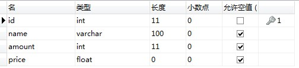

**goods** 表数据


**Step1: maven** 依赖 **pom.xml** 

>   \<dependency\>

\<groupId\>junit\</groupId\>

\<artifactId\>junit\</artifactId\>

\<version\>4.11\</version\>

\<scope\>test\</scope\>

\</dependency\>

\<dependency\>

\<groupId\>org.springframework\</groupId\>

\<artifactId\>spring-context\</artifactId\>

\<version\>5.2.5.RELEASE\</version\>

\</dependency\>

\<dependency\>

\<groupId\>org.springframework\</groupId\>

\<artifactId\>spring-tx\</artifactId\>

\<version\>5.2.5.RELEASE\</version\>

\</dependency\>

\<dependency\>

\<groupId\>org.springframework\</groupId\>

\<artifactId\>spring-jdbc\</artifactId\>

\<version\>5.2.5.RELEASE\</version\>

\</dependency\>

\<dependency\>

\<groupId\>org.mybatis\</groupId\>

\<artifactId\>mybatis\</artifactId\>

\<version\>3.5.1\</version\>

\</dependency\>

\<dependency\>

\<groupId\>org.mybatis\</groupId\>

\<artifactId\>mybatis-spring\</artifactId\>

\<version\>1.3.1\</version\>

\</dependency\>

\<dependency\>

\<groupId\>mysql\</groupId\>

\<artifactId\>mysql-connector-java\</artifactId\>

\<version\>5.1.9\</version\>

\</dependency\>

\<dependency\>

\<groupId\>com.alibaba\</groupId\>

\<artifactId\>druid\</artifactId\>

\<version\>1.1.12\</version\>

\</dependency\>

>   插件

>   \<build\>

>   \<resources\>

>   \<resource\>

>   \<directory\>src/main/java\</directory\>\<!--所在的目录--\>

>   \<includes\>\<!--包括目录下的.properties,.xml文件都会扫描到--\>

>   \<include\>\*\*/\*.properties\</include\>

>   \<include\>\*\*/\*.xml\</include\>

>   \</includes\>

>   \<filtering\>false\</filtering\>

>   \</resource\>

>   \</resources\>

>   \<plugins\>

>   \<plugin\>

>   \<artifactId\>maven-compiler-plugin\</artifactId\>

>   \<version\>3.1\</version\>

>   \<configuration\>

>   \<source\>1.8\</source\>

>   \<target\>1.8\</target\>

>   \</configuration\>

>   \</plugin\>

>   \</plugins\>

>   \</build\>

**Step2**：创建实体类 

创建实体类 Sale 与 Goods


**Step3**：定义 **dao** 接口 

>   定义两个 dao 的接口 SaleDao , GoodsDao


**Step4**：定义 **dao** 接口对应的 **sql** 映射文件 

SaleDao.xml


**GoodsDao.xml**

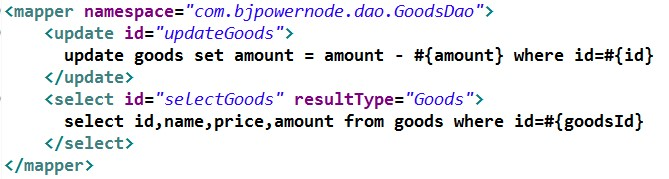

**Step5**：定义异常类 

定义 service 层可能会抛出的异常类 NotEnoughException

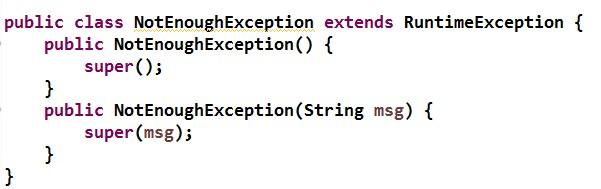

**Step6**：定义 **Service** 接口 

定义 Service 接口 BuyGoodsService


**Step7**：定义 **service** 的实现类 

定义 service 层接口的实现类 BuyGoodsServiceImpl

1.  类定义

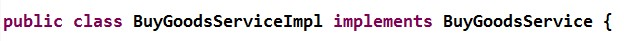

1.  **Dao** 属性


1.  **Buy** 方法


**Step8**：修改 **Spring** 配置文件内容 

声明 **Mybatis** 对象


声明业务层对象

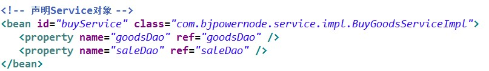

**Step9**：定义测试类 

定义测试类 MyTest。现在就可以在无事务代理的情况下运行了。

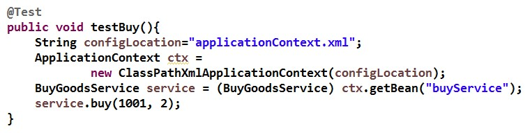

## 5.4 注解@Transactional

通过@Transactional 注解方式，可将事务织入到相应 public方法中，实现事务管理。

@Transactional 的所有可选属性如下所示：

-   propagation：用于设置事务传播属性。该属性类型为 Propagation 枚举，默认值为
    Propagation.REQUIRED。

-   isolation：用于设置事务的隔离级别。该属性类型为 Isolation 枚举，默认值为

    Isolation.DEFAULT。

-   readOnly：用于设置该方法对数据库的操作是否是只读的。该属性为
    boolean，默认值为 false。

-   timeout：用于设置本操作与数据库连接的超时时限。单位为秒，类型为
    int，默认值为

    \-1，即没有时限。

-   rollbackFor：指定需要回滚的异常类。类型为
    Class[]，默认值为空数组。当然，若只有一个异常类时，可以不使用数组。

-   rollbackForClassName：指定需要回滚的异常类类名。类型为
    String[]，默认值为空数组。当然，若只有一个异常类时，可以不使用数组。

-   noRollbackFor：指定不需要回滚的异常类。类型为
    Class[]，默认值为空数组。当然，若只有一个异常类时，可以不使用数组。

-   noRollbackForClassName：指定不需要回滚的异常类类名。类型为
    String[]，默认值为空数组。当然，若只有一个异常类时，可以不使用数组。

需要注意的是，@Transactional 若用在方法上，只能用于 public 方法上。对于其他非public 方法，如果加上了注解@Transactional，虽然 Spring不会报错，但不会将指定事务织入到该方法中。因为 Spring 会忽略掉所有非 public
方法上的@Transaction 注解。

若@Transaction 注解在类上，则表示该类上所有的方法均将在执行时织入事务。

实现注解的事务步骤：

复制 **trans_sale** 项目，新项目 **trans_sale_annotation**

1.  声明事务管理器


1.  开启注解驱动

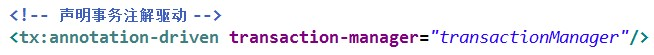

transaction-manager：事务管理器 bean 的 id

1.  业务层 **public** 方法加入事务属性


#### 实现原理：

主要是通过反射获取bean的注解信息，利用AOP对编程式事务进行封装实现。

注解的属性先加入到Spring容器中，通过Cglib动态代理将注解加入到拦截链中，

## 5.5 使用 AspectJ 的 AOP 配置管理事务(掌握) 

>   使用 XML 配置事务代理的方式的不足是，每个目标类都需要配置事务代理。当目标类

较多，配置文件会变得非常臃肿。

>   使用 XML 配置顾问方式可以自动为每个符合切入点表达式的类生成事务代理。其用法

很简单，只需将前面代码中关于事务代理的配置删除，再替换为如下内容即可。

Step1：复制项目

复制 trans_sale 项目，并重命名为 trans_sal_aspectj。在此基础上修改。

Step2：maven 依赖 pom.xml

新加入 aspectj 的依赖坐标

\<dependency\>

\<groupId\>org.springframework\</groupId\>

\<artifactId\>spring-aspects\</artifactId\>

\<version\>5.2.5.RELEASE\</version\>

\</dependency\>

Step3：在容器中添加事务管理器

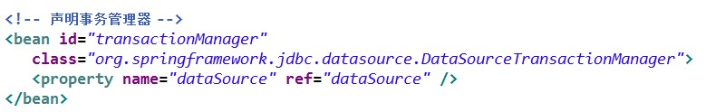

Step4：配置事务通知

为事务通知设置相关属性。用于指定要将事务以什么方式织入给哪些方法。

例如，应用到 buy 方法上的事务要求是必须的，且当 buy 方法发生异常后要回滚业务。


Step5：配置增强器

指定将配置好的事务通知，织入给谁。


Step6：修改测试类

测试类中要从容器中获取的是目标对象。

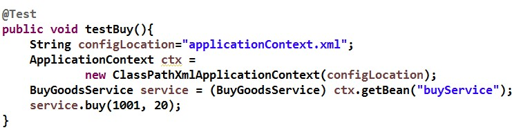

# 第**6**章 **Spring** 与 **Web** 

在 Web 项目中使用 Spring 框架，首先要解决在 web 层（这里指 Servlet）中获取到Spring 容器的问题。只要在 web 层获取到了 Spring 容器，便可从容器中获取到 Service对象。

## 6.1 Web 项目使用 Spring 的问题(了解) 

举例：springWeb 项目（在 spring-mybatis 基础上修改）

###  Step1：新建一个 Maven Project 

类型 maven-archetype-webapp

### Step2: 复制代码，配置文件 

将 spring-mybatis 项目中以下内容复制到当前项目中：

1.  Service 层、Dao 层全部代码

2.  配置文件 applicationContext.xml 及 jdbc.properties，mybatis.xml

3.  pom.xml

4.  加入 servlet ,jsp 依赖

    在之前原有的 pom.xml 文件中再加入以下的内容：

    \<!-- servlet依赖 --\>

    \<dependency\>

    \<groupId\>javax.servlet\</groupId\>

    \<artifactId\>javax.servlet-api\</artifactId\>

    \<version\>3.1.0\</version\>

    \<scope\>provided\</scope\>

    \</dependency\>

    \<!-- jsp依赖 --\>

    \<dependency\>

    \<groupId\>javax.servlet.jsp\</groupId\>

    \<artifactId\>jsp-api\</artifactId\>

    \<version\>2.2.1-b03\</version\>

    \<scope\>provided\</scope\>

    \</dependency\>

### Step3：定义 index 页面 


### Step4：定义 RegisterServlet（重点代码） 

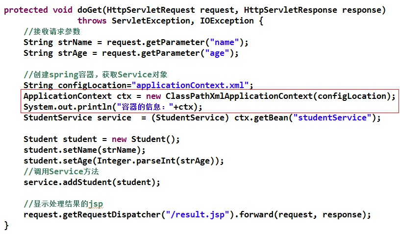

### Step5：定义 success 页面 


### Step6：web.xml 注册 Servlet 

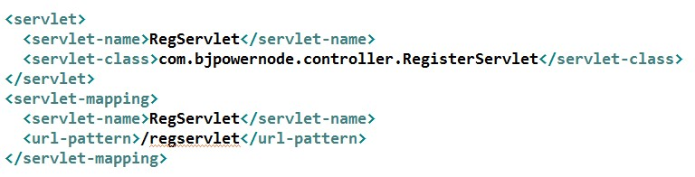

### Step7：运行结果分析 

当表单提交，跳转到 success.jsp
后，多刷新几次页面，查看后台输出，发现每刷新一次页面，就 new 出一个新的 Spring
容器。即，每提交一次请求，就会创建一个新的 Spring
容器。对于一个应用来说，只需要一个 Spring 容器即可。所以，将 Spring
容器的创建语句放在 Servlet 的 doGet()或 doPost()方法中是有问题的。

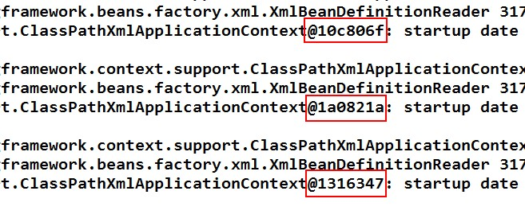

此时，可以考虑，将 Spring 容器的创建放在 Servlet 进行初始化时进行，即执行
init()方法时执行。并且，Servlet 还是单例多线程的，即一个业务只有一个 Servlet
实例，所有执行该业务的用户执行的都是这一个 Servlet 实例。这样，Spring
容器就具有了唯一性了。

但是，Servlet 是一个业务一个 Servlet 实例，即 LoginServlet 只有一个，但还会有
StudentServlet、TeacherServlet 等。每个业务都会有一个 Servlet，都会执行自己的
init()方法，也就都会创建一个 Spring 容器了。这样一来，Spring 容器就又不唯一了。

## 6.2 使用 Spring 的监听器 ContextLoaderListener(掌握) 

>   举例：springweb-2 项目（在 spring-web 项目基础上修改）

>   对于 Web 应用来说，ServletContext 对象是唯一的，一个 Web 应用，只有一个

ServletContext 对象，该对象是在 Web 应用装载时初始化的。若将 Spring
容器的创建时机，放在 ServletContext 初始化时，就可以保证 Spring
容器的创建只会执行一次，也就保证了

Spring 容器在整个应用中的唯一性。

>   当 Spring 容器创建好后，在整个应用的生命周期过程中，Spring
>   容器应该是随时可以被访问的。即，Spring 容器应具有全局性。而放入
>   ServletContext 对象的属性，就具有应用的全局性。所以，将创建好的 Spring
>   容器，以属性的形式放入到 ServletContext 的空间中，就保证了 Spring
>   容器的全局性。上述的这些工作，已经被封装在了如下的 Spring 的 Jar 包的相关
>   API 中：

>   spring-web-5.2.5.RELEASE

### Step1：maven 依赖 pom.xml 

>   \<dependency\>

\<groupId\>org.springframework\</groupId\>

\<artifactId\>spring-web\</artifactId\>

\<version\>5.2.5.RELEASE\</version\>

\</dependency\>

### Step2：注册监听器 ContextLoaderListener 

>   若要在 ServletContext 初始化时创建 Spring 容器，就需要使用监听器接口

ServletContextListener 对 ServletContext 进行监听。在 web.xml 中注册该监听器。

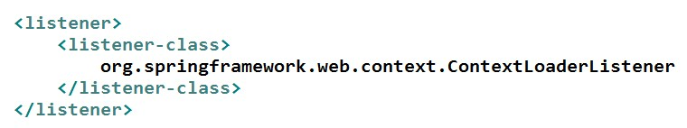

Spring 为该监听器接口定义了一个实现类
ContextLoaderListener，完成了两个很重要的工作：创建容器对象，并将容器对象放入到了
ServletContext 的空间中。

打开 ContextLoaderListener
的源码。看到一共四个方法，两个是构造方法，一个初始化方法，一个销毁方法。


>   所以，在这四个方法中较重要的方法应该就是 contextInitialized()，context
>   初始化方法。


跟踪 initWebApplicationContext()方法，可以看到，在其中创建了容器对象。

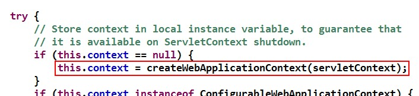

并且，将创建好的容器对象放入到了 ServletContext 的空间中，key 为一个常量：

WebApplicationContext.ROOT_WEB_APPLICATION_CONTEXT_ATTRIBUTE。

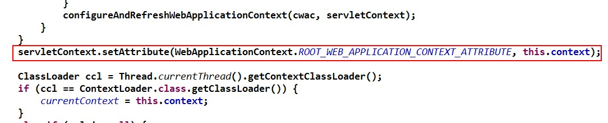

### Step3：指定 Spring 配置文件的位置\<context-param\> 

ContextLoaderListener 在对 Spring 容器进行创建时，需要加载 Spring
配置文件。其默认的 Spring
配置文件位置与名称为：WEB-INF/applicationContext.xml。但，一般会将该配置文件放置于项目的
classpath 下，即 src 下，所以需要在 web.xml 中对 Spring
配置文件的位置及名称进行指定。

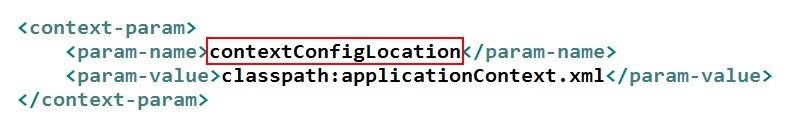

从监听器 ContextLoaderListener 的父类 ContextLoader
的源码中可以看到其要读取的配置文件位置参数名称 contextConfigLocation。

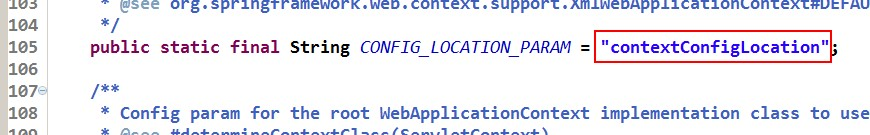

### Step4：获取 Spring 容器对象 

在 Servlet 中获取容器对象的常用方式有两种：

（1） 直接从 ServletContext 中获取

从对监听器 ContextLoaderListener 的源码分析可知，容器对象在 ServletContext
的中存放的 key 为
WebApplicationContext.ROOT_WEB_APPLICATION_CONTEXT_ATTRIBUTE。所以，可以直接通过
ServletContext 的 getAttribute()方法，按照指定的 key 将容器对象获取到。

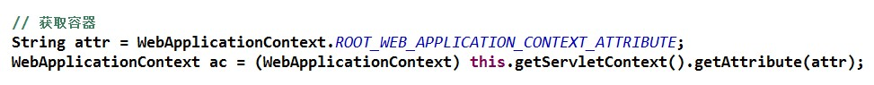

（2） 通过 WebApplicationContextUtils 获取

工具类 WebApplicationContextUtils 有一个方法专门用于从 ServletContext 中获取
Spring 容器对象：getRequiredWebApplicationContext(ServletContext sc)

调用 Spring 提供的方法获取容器对象：

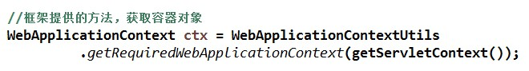

查其源码，看其调用关系，就可看到其是从 ServletContext 中读取的属性值，即 Spring
容器。


以上两种方式，无论使用哪种获取容器对象，刷新 success 页面后，可看到代码中使用的
Spring 容器均为同一个对象。


