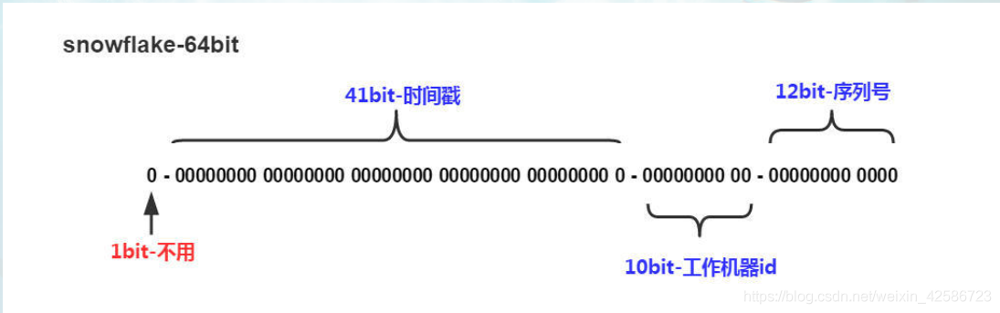

https://blog.csdn.net/weixin_42586723/article/details/106499751

数据库出现重复ID

单一mysql——>读写分离——>数据库同步

写数据水平扩展，复制数据库集群，双活


自增：

第二个也是自增，则同步时会冲突

两个节点的话可以设置步长不同，一个从1开始，一个从2开始


如果对接其他产品或则公司，

ID必须唯一：


UUID

mysql官方明确ID尽量越短越好，不建议使用UUID作为主键，

而且对MYSQL索引不利，如果主键在Innodb引擎下，由于UUID的无序性，可能会导致数据位置频繁变动，严重影响性能


推特的雪花算法：




Snowflake生成的是Long类型的ID，一个Long类型占8个字节，每个字节占8比特，也就是说一个Long类型占64个比特。

符号位第一位恒为0

41位时间戳表示所能容纳的总的毫秒数

工作进程位：

Java进程中唯一，

序列号位：

根据这个算法的逻辑，只需要将这个算法用Java语言实现出来，封装为一个工具方法，那么各个业务应用可以直接使用该工具方法来获取分布式ID，只需保证每个业务应用有自己的工作机器id即可，而不需要单独去搭建一个获取分布式ID的应用。**理论上Snowflake算法方案的QPS大约为409.6w/s**


缺点：

**强依赖于机器时钟**，如果时钟回拨，会导致重复的ID生成，所以一般基于此的算法发现时钟回拨，都会抛异常处理，阻止ID生成，这可能导致服务不可用


全局时钟：

多个JVM获取的时间不同，

NTP网络时间协议取时间

如果JVM已经跑到了45秒，但是全局时钟慢了一秒，去取时间时发现慢了一秒，需要回拨一秒，但是44秒的数据已经生成，回拨后再生成出错

服务部署在内网，只能自己部署时间服务器，导致回退

解决时钟问题：

不进行回拨，直接等待，所有暂停，等待时间到达这一时间，再进行生产


# 分布式ID的生成特性

- 全局唯一

  必须保证ID是全局性唯一

- 高可用低延时

  ID生成响应要快，能够扛住高并发，延时足够低不至于成为业务瓶颈

- 数字类型趋势递增

  从MySQL存储引擎考虑，后面的ID必须必前面的大，并需要保证写入数据的性能

- 长度短

  能够提高查询效率，从MySQL数据库规范考虑，尤其是ID作为主键

- 信息安全

  如果ID连续生成，会导致被猜出从而泄漏业务信息，所以需要无规则

# 分布式ID生成方式

## UUID

- 简介

  UUID具有全球唯一的特性，可以做分布式ID，但不推荐

- 生成方式

  ```java
    public static void main(String[] args) {
      String uuid = UUID.randomUUID().toString().replaceAll("-", "");
      System.out.println(uuid);
    }
  
  
  1234567
  ```

- 分析

  UUID不适用于实际的业务需求，像用作订单号UUID这样的字符串没有丝毫意义，看不出和订单相关的有用信息；而对于数据库来说**用作业务主键ID，它不仅太长而且还是字符串，存储性能差查询也很耗时**

- 优点

  生成简单，本地生成无网络消耗，具有全球唯一性

- 缺点

  长度过长16 字节128位，36位长度的字符串，存储以及查询对MySQL的性能消耗较大，MySQL官方明确建议主键要尽量越短越好，作为**数据库主键 UUID 的无序性会导致数据位置频繁变动，严重影响性能**

## 数据库自增ID

- 简介

  基于数据库的auto_increment自增ID完全可以充当分布式ID，具体实现：**需要一个单独的MySQL实例用来生成ID**

- 生成方式

  ```sql
    CREATE DATABASE `SEQ_ID`;
  
    CREATE TABLE SEQID.SEQUENCE_ID (
        id bigint(20) unsigned NOT NULL auto_increment, 
        value char(10) NOT NULL default '',
        PRIMARY KEY (id),
    ) ENGINE=MyISAM;
  
  
    insert into SEQUENCE_ID(value)  VALUES ('values');
  
  123456789101112
  ```

- 分析

  当需要一个ID的时候，向表中插入一条记录返回主键ID，但存在致命缺点，访问量激增时MySQL本身就是系统瓶颈，不推荐

- 优点

  实现简单，ID单调自增，数值类型查询速度快

- 缺点

  DB单点存在宕机风险，无法扛住高并发场景

## 数据库多主模式

- 简介

  此方式是对上面数据库自增ID的高可用优化，采用主从模式集群。也就是两个MySQL实例都能单独生产自增ID

  **需要设置起始值和自增步长**，避免生成重复ID

- 生成方式

  1. MySQL_1配置

  ```sql
    set @@auto_increment_offset = 1; --起始值
    set @@auto_increment_increment = 2; --步长
  
  1234
  ```

  1. MySQL_2配置

  ```sql
    set @@auto_increment_offset = 2; --起始值
    set @@auto_increment_increment = 2; --步长
  
  1234
  ```

  1. 运行结果

  两个MySQL实例的自增ID分别是：

  1、3、5、7、9
  2、4、6、8、10

- 分析

  如果集群后的性能还是扛不住高并发，就要进行MySQL扩容增加节点

  

  水平扩展的数据库集群，有利于解决数据库单点压力的问题，同时为了ID生成特性，将**自增步长按照机器数量来设置**。

  增加第三台MySQL实例需要人工修改一、二两台MySQL实例的起始值和步长，把第三台机器的ID起始生成位置设定在比现有最大自增ID的位置远一些，但必须在一、二两台MySQL实例ID还没有增长到第三台MySQL实例的起始ID值的时候，否则自增ID就要出现重复了，**必要时可能还需要停机修改**。

- 优点

  解决DB单点问题

- 缺点

  不利于后续扩容，而且实际上单个数据库自身压力还是大，依旧无法满足高并发场景。

## 号段模式

- 简介

  号段模式是当下分布式ID生成器的主流实现方式之一，号段模式可以理解为从数据库批量的获取自增ID，每次从数据库取出一个号段范围，例如 (1,1000] 代表1000个ID，**具体的业务服务将本号段，生成1~1000的自增ID并加载到内存**。

- 生成方式

  ```sql
    CREATE TABLE id_generator (
      id int(10) NOT NULL,
      max_id bigint(20) NOT NULL COMMENT '当前最大id',
      step int(20) NOT NULL COMMENT '号段的布长',
      biz_type	int(20) NOT NULL COMMENT '业务类型',
      version int(20) NOT NULL COMMENT '版本号',
      PRIMARY KEY (`id`)
    ) 
  
  
  
  123456789101112
  ```

  biz_type ：代表不同业务类型

  max_id ：当前最大的可用id

  step ：代表号段的长度

  version ：是一个乐观锁，每次都更新version，保证并发时数据的正确性

- 分析

  该批号段ID用完，再次向数据库申请新号段，对max_id字段做一次update操作，update max_id= max_id + step，update成功则说明新号段获取成功，新的号段范围是(max_id ,max_id +step]

  ```sql
    update id_generator set max_id = #{max_id+step}, version = version + 1 where version = # {version} and biz_type = XXX
  
  123
  ```

  获取分布式ID流程：

  1. 用户服务在注册一个用户时，需要一个用户ID；会请求生成ID服务(是独立的应用)的接口
  2. 生成ID的服务会去查询数据库，找到user_tag的id，现在的max_id为0，step=1000
  3. 生成ID的服务把max_id和step返回给用户服务，并且把max_id更新为max_id = max_id + step，即更新为1000
  4. 用户服务获得max_id=0，step=1000；
  5. 这个用户服务可以用[max_id + 1，max_id+step]区间的ID，即为[1，1000]
  6. 用户服务把这个区间保存到jvm中
  7. 用户服务需要用到ID的时候，在区间[1，1000]中依次获取id，可采用AtomicLong中的getAndIncrement方法。
  8. 如果把区间的值用完了，再去请求生产ID的服务的接口，获取到max_id为1000，即可以用[max_id + 1，max_id+step]区间的ID，即为[1001，2000]

- 优点

  1. 扩张灵活，性能强能够撑起大部分业务场景。
  2. ID号码是趋势递增的，满足数据库存储和查询性能要求。
  3. 可用性高，即使ID生成服务器不可用，也能够使得业务在短时间内可用，为排查问题争取时间。
  4. 可以自定义max_id的大小，方便业务迁移，方便机器横向扩张。

- 缺点

  由于多业务端可能同时操作，所以**采用版本号version乐观锁方式更新**

  1. ID号码不够随机，完整的顺序递增可能带来安全问题。
  2. DB宕机可能导致整个系统不可用，仍然存在这种风险，因为号段只能撑一段时间。
  3. 可能存在分布式环境各节点同一时间争抢分配ID号段的情况，这可能导致并发问题而出现ID重复生成

## Redis

- 简介

  Redis也同样可以实现，原理就是利用redis的 incr命令实现ID的原子性自增

- 生成方式

  ```sh
    set seq_id 1     // 初始化自增ID为1
  
    incr seq_id      // 增加1，并返回递增后的数值
  
  12345
  ```

- 分析

  用redis实现需要注意一点，要考虑到redis持久化的问题。redis有两种持久化方式RDB和AOF：

  1. RDB会定时打一个快照进行持久化，假如连续自增但redis没及时持久化，而这会Redis挂掉了，重启Redis后会出现ID重复的情况。
  2. AOF会对每条写命令进行持久化，即使Redis挂掉了也不会出现ID重复的情况，但由于incr命令的特殊性，会导致Redis重启恢复的数据时间过长。

- 优点

  有序递增，可读性强。

  能够满足一定性能。

- 缺点

  强依赖于Redis，可能存在单点问题。

  占用宽带，而且需要考虑网络延时等问题带来地性能冲击。

## 雪花算法（SnowFlake）

- 简介

  雪花算法（Snowflake）是twitter公司内部分布式项目采用的ID生成算法

  

- 生成方式

  ```java
    /**
    * Twitter的SnowFlake算法,使用SnowFlake算法生成一个整数，然后转化为62进制变成一个短地址URL
    *
    * https://github.com/beyondfengyu/SnowFlake
    */
    public class SnowFlakeShortUrl {
  
        /**
        * 起始的时间戳
        */
        private final static long START_TIMESTAMP = 1480166465631L;
  
        /**
        * 每一部分占用的位数
        */
        private final static long SEQUENCE_BIT = 12;   //序列号占用的位数
        private final static long MACHINE_BIT = 5;     //机器标识占用的位数
        private final static long DATA_CENTER_BIT = 5; //数据中心占用的位数
  
        /**
        * 每一部分的最大值
        */
        private final static long MAX_SEQUENCE = -1L ^ (-1L << SEQUENCE_BIT);
        private final static long MAX_MACHINE_NUM = -1L ^ (-1L << MACHINE_BIT);
        private final static long MAX_DATA_CENTER_NUM = -1L ^ (-1L << DATA_CENTER_BIT);
  
        /**
        * 每一部分向左的位移
        */
        private final static long MACHINE_LEFT = SEQUENCE_BIT;
        private final static long DATA_CENTER_LEFT = SEQUENCE_BIT + MACHINE_BIT;
        private final static long TIMESTAMP_LEFT = DATA_CENTER_LEFT + DATA_CENTER_BIT;
  
        private long dataCenterId;  //数据中心
        private long machineId;     //机器标识
        private long sequence = 0L; //序列号
        private long lastTimeStamp = -1L;  //上一次时间戳
  
        private long getNextMill() {
            long mill = getNewTimeStamp();
            while (mill <= lastTimeStamp) {
                mill = getNewTimeStamp();
            }
            return mill;
        }
  
        private long getNewTimeStamp() {
            return System.currentTimeMillis();
        }
  
        /**
        * 根据指定的数据中心ID和机器标志ID生成指定的序列号
        *
        * @param dataCenterId 数据中心ID
        * @param machineId    机器标志ID
        */
        public SnowFlakeShortUrl(long dataCenterId, long machineId) {
            if (dataCenterId > MAX_DATA_CENTER_NUM || dataCenterId < 0) {
                throw new IllegalArgumentException("DtaCenterId can't be greater than MAX_DATA_CENTER_NUM or less than 0！");
            }
            if (machineId > MAX_MACHINE_NUM || machineId < 0) {
                throw new IllegalArgumentException("MachineId can't be greater than MAX_MACHINE_NUM or less than 0！");
            }
            this.dataCenterId = dataCenterId;
            this.machineId = machineId;
        }
  
        /**
        * 产生下一个ID
        *
        * @return
        */
        public synchronized long nextId() {
            long currTimeStamp = getNewTimeStamp();
            if (currTimeStamp < lastTimeStamp) {
                throw new RuntimeException("Clock moved backwards.  Refusing to generate id");
            }
  
            if (currTimeStamp == lastTimeStamp) {
                //相同毫秒内，序列号自增
                sequence = (sequence + 1) & MAX_SEQUENCE;
                //同一毫秒的序列数已经达到最大
                if (sequence == 0L) {
                    currTimeStamp = getNextMill();
                }
            } else {
                //不同毫秒内，序列号置为0
                sequence = 0L;
            }
  
            lastTimeStamp = currTimeStamp;
  
            return (currTimeStamp - START_TIMESTAMP) << TIMESTAMP_LEFT //时间戳部分
                    | dataCenterId << DATA_CENTER_LEFT       //数据中心部分
                    | machineId << MACHINE_LEFT             //机器标识部分
                    | sequence;                             //序列号部分
        }
        
  
        public static void main(String[] args) {
            SnowFlakeShortUrl snowFlake = new SnowFlakeShortUrl(2, 3);
  
            /**
              * 小知识点：
              * 1 << 4 指将数字1左移4位
              *
              * 1. 首先将1转换为二进制0000 0000 0000 0000 0000 0000 0000 0001（1个字节8个bit位）
              * 2. 然后把该数字高位（左侧）的4个零移出，其他的数字都朝左平移4位，最后在低位（右侧）的4个空位补零
              * 3. 则得到的最终结果是0000 0000 0000 0000 0000 0000 0001 0000，则转换为十进制是16
              **/
            for (int i = 0; i < (1 << 4); i++) {
                //10进制
                System.out.println(snowFlake.nextId());
            }
        }
    }
  
  123456789101112131415161718192021222324252627282930313233343536373839404142434445464748495051525354555657585960616263646566676869707172737475767778798081828384858687888990919293949596979899100101102103104105106107108109110111112113114115116117118
  ```

- 分析

  Snowflake生成的是Long类型的ID，一个Long类型占8个字节，每个字节占8比特，也就是说一个Long类型占64个比特。

  Snowflake ID组成结构：**正数位（占1比特）+ 时间戳（占41比特）+ 机器ID（占5比特）+ 数据中心（占5比特）+ 自增值（占12比特），总共64比特组成的一个Long类型**。

  1. 第一个bit位（1bit）：Java中long的最高位是符号位代表正负，正数是0，负数是1，一般生成ID都为正数，所以默认为0。
  2. 时间戳部分（41bit）：毫秒级的时间，不建议存当前时间戳，而是用（当前时间戳 - 固定开始时间戳）的差值，可以使产生的ID从更小的值开始；41位的时间戳可以使用69年，(1L << 41) / (1000L * 60 * 60 * 24 * 365) = 69年
  3. 工作机器id（10bit）：也被叫做workId，这个可以灵活配置，机房或者机器号组合都可以。
  4. 序列号部分（12bit），自增值支持同一毫秒内同一个节点可以生成4096个ID

  根据这个算法的逻辑，只需要将这个算法用Java语言实现出来，封装为一个工具方法，那么各个业务应用可以直接使用该工具方法来获取分布式ID，只需保证每个业务应用有自己的工作机器id即可，而不需要单独去搭建一个获取分布式ID的应用。**理论上Snowflake算法方案的QPS大约为409.6w/s**

- 优点

  1. 每秒能够生成百万个不同的ID，性能佳。
  2. 时间戳值在高位，中间是固定的机器码，自增的序列在低位，整个ID是趋势递增的。
  3. 能够根据业务场景数据库节点布置灵活挑战bit位划分，灵活度高

- 缺点

  **强依赖于机器时钟**，如果时钟回拨，会导致重复的ID生成，所以一般基于此的算法发现时钟回拨，都会抛异常处理，阻止ID生成，这可能导致服务不可用

## 百度 （Uidgenerator）

- 简介

  uid-generator是由百度技术部开发，项目GitHub地址 https://github.com/baidu/uid-generator

- 生成方式

  https://github.com/baidu/uid-generator/blob/master/README.zh_cn.md

- 分析

  **uid-generator是基于Snowflake算法实现的**，与原始的snowflake算法不同在于，uid-generator**支持自定义时间戳、工作机器ID和序列号**等各部分的位数，而且uid-generator中采用用户自定义workId的生成策略。

  对于uid-generator ID组成结构：

  workId，占用了22个bit位，时间占用了28个bit位，序列化占用了13个bit位，需要注意的是，和原始的snowflake不太一样，**时间的单位是秒，而不是毫秒，workId也不一样，而且同一应用每次重启就会消费一个workId**

  **uid-generator需要与数据库配合使用**，需要新增一个WORKER_NODE表。当应用启动时会向数据库表中去插入一条数据，**插入成功后返回的自增ID就是该机器的workId数据由host，port组成**

## 滴滴出品（TinyID）

- 简介

  Tinyid由滴滴开发，Github地址：https://github.com/didi/tinyid

  Tinyid是基于号段模式原理实现的与Leaf如出一辙，每个服务获取一个号段（1000,2000]、（2000,3000]、（3000,4000]
  

### 生成方式

- Http方式

  1. 导入TInyid源码

  git clone https://github.com/didi/tinyid.git

  1. 创建数据表

  ```sql
    CREATE TABLE `tiny_id_info` (
      `id` bigint(20) unsigned NOT NULL AUTO_INCREMENT COMMENT '自增主键',
      `biz_type` varchar(63) NOT NULL DEFAULT '' COMMENT '业务类型，唯一',
      `begin_id` bigint(20) NOT NULL DEFAULT '0' COMMENT '开始id，仅记录初始值，无其他含义。初始化时begin_id和max_id应相同',
      `max_id` bigint(20) NOT NULL DEFAULT '0' COMMENT '当前最大id',
      `step` int(11) DEFAULT '0' COMMENT '步长',
      `delta` int(11) NOT NULL DEFAULT '1' COMMENT '每次id增量',
      `remainder` int(11) NOT NULL DEFAULT '0' COMMENT '余数',
      `create_time` timestamp NOT NULL DEFAULT '2010-01-01 00:00:00' COMMENT '创建时间',
      `update_time` timestamp NOT NULL DEFAULT '2010-01-01 00:00:00' COMMENT '更新时间',
      `version` bigint(20) NOT NULL DEFAULT '0' COMMENT '版本号',
      PRIMARY KEY (`id`),
      UNIQUE KEY `uniq_biz_type` (`biz_type`)
    ) ENGINE=InnoDB AUTO_INCREMENT=1 DEFAULT CHARSET=utf8 COMMENT 'id信息表';
  
    CREATE TABLE `tiny_id_token` (
      `id` int(11) unsigned NOT NULL AUTO_INCREMENT COMMENT '自增id',
      `token` varchar(255) NOT NULL DEFAULT '' COMMENT 'token',
      `biz_type` varchar(63) NOT NULL DEFAULT '' COMMENT '此token可访问的业务类型标识',
      `remark` varchar(255) NOT NULL DEFAULT '' COMMENT '备注',
      `create_time` timestamp NOT NULL DEFAULT '2010-01-01 00:00:00' COMMENT '创建时间',
      `update_time` timestamp NOT NULL DEFAULT '2010-01-01 00:00:00' COMMENT '更新时间',
      PRIMARY KEY (`id`)
    ) ENGINE=InnoDB AUTO_INCREMENT=1 DEFAULT CHARSET=utf8 COMMENT 'token信息表';
  
    INSERT INTO `tiny_id_info` (`id`, `biz_type`, `begin_id`, `max_id`, `step`, `delta`, `remainder`, `create_time`, `update_time`, `version`)
    VALUES
      (1, 'test', 1, 1, 100000, 1, 0, '2018-07-21 23:52:58', '2018-07-22 23:19:27', 1);
  
    INSERT INTO `tiny_id_info` (`id`, `biz_type`, `begin_id`, `max_id`, `step`, `delta`, `remainder`, `create_time`, `update_time`, `version`)
    VALUES
      (2, 'test_odd', 1, 1, 100000, 2, 1, '2018-07-21 23:52:58', '2018-07-23 00:39:24', 3);
  
  
    INSERT INTO `tiny_id_token` (`id`, `token`, `biz_type`, `remark`, `create_time`, `update_time`)
    VALUES
      (1, '0f673adf80504e2eaa552f5d791b644c', 'test', '1', '2017-12-14 16:36:46', '2017-12-14 16:36:48');
  
    INSERT INTO `tiny_id_token` (`id`, `token`, `biz_type`, `remark`, `create_time`, `update_time`)
    VALUES
      (2, '0f673adf80504e2eaa552f5d791b644c', 'test_odd', '1', '2017-12-14 16:36:46', '2017-12-14 16:36:48');
  
  
  1234567891011121314151617181920212223242526272829303132333435363738394041424344
  ```

  1. 配置数据库

  ```properties
    datasource.tinyid.names=primary
    datasource.tinyid.primary.driver-class-name=com.mysql.jdbc.Driver
    datasource.tinyid.primary.url=jdbc:mysql://ip:port/databaseName?autoReconnect=true&useUnicode=true&characterEncoding=UTF-8
    datasource.tinyid.primary.username=root
    datasource.tinyid.primary.password=123456
  
  
  12345678
  ```

  1. 启动tinyid-server后测试

  ```html
    获取分布式自增ID: http://localhost:9999/tinyid/id/nextIdSimple?bizType=test&token=0f673adf80504e2eaa552f5d791b644c'
    返回结果: 3
  
    批量获取分布式自增ID:
    http://localhost:9999/tinyid/id/nextIdSimple?bizType=test&token=0f673adf80504e2eaa552f5d791b644c&batchSize=10'
    返回结果:  4,5,6,7,8,9,10,11,12,13
  
  12345678
  ```

- tinyid-client(Java客户端)

  1. 重复Http方式的（2）（3）操作
  2. 引入依赖

  ```xml
    <dependency>
        <groupId>com.xiaoju.uemc.tinyid</groupId>
        <artifactId>tinyid-client</artifactId>
        <version>${tinyid.version}</version>
    </dependency>
  
  
  12345678
  ```

  1. 配置文件

  ```properties
    tinyid.server =localhost:9999
    tinyid.token =0f673adf80504e2eaa552f5d791b644c
  
  1234
  ```

  test 、tinyid.token是在数据库表中预先插入的数据，test 是具体业务类型，tinyid.token表示可访问的业务类型

  1. 测试方式

  ```java
    // 获取单个分布式自增ID
    Long id =  TinyId.nextId("test");
  
    // 按需批量分布式自增ID
    List<Long> ids =  TinyId.nextId("test" ,10);
  
  1234567
  ```

### 分析

```
Tinyid是基于号段模式原理实现的与Leaf如出一辙，每个服务获取一个号段（1000,2000]、（2000,3000]、（3000,4000]
1
```

## 美团（Leaf）

- 简介

  Leaf由美团开发，github地址：https://github.com/Meituan-Dianping/Leaf

  Leaf同时支持**号段模式和snowflake算法模式**，可以切换使用

### 号段模式

- 生成方式

  1. 先导入源码 https://github.com/Meituan-Dianping/Leaf
  2. 在建一张表leaf_alloc

  ```sql
    DROP TABLE IF EXISTS `leaf_alloc`;
  
    CREATE TABLE `leaf_alloc` (
      `biz_tag` varchar(128)  NOT NULL DEFAULT '' COMMENT '业务key',
      `max_id` bigint(20) NOT NULL DEFAULT '1' COMMENT '当前已经分配了的最大id',
      `step` int(11) NOT NULL COMMENT '初始步长，也是动态调整的最小步长',
      `description` varchar(256)  DEFAULT NULL COMMENT '业务key的描述',
      `update_time` timestamp NOT NULL DEFAULT CURRENT_TIMESTAMP ON UPDATE CURRENT_TIMESTAMP COMMENT '数据库维护的更新时间',
      PRIMARY KEY (`biz_tag`)
    ) ENGINE=InnoDB;
  
  
  
  1234567891011121314
  ```

  1. 然后在项目中开启号段模式，配置对应的数据库信息，并关闭snowflake模式

  ```properties
    leaf.name=com.sankuai.leaf.opensource.test
    leaf.segment.enable=true
    leaf.jdbc.url=jdbc:mysql://localhost:3306/leaf_test?useUnicode=true&characterEncoding=utf8&characterSetResults=utf8
    leaf.jdbc.username=root
    leaf.jdbc.password=root
  
    leaf.snowflake.enable=false
    #leaf.snowflake.zk.address=
    #leaf.snowflake.port=
  
  
  
  12345678910111213
  ```

  1. 启动leaf-server 模块的 LeafServerApplication

  号段模式获取分布式自增ID的测试url ：http：//localhost：8080/api/segment/get/leaf-segment-test

  监控号段模式：http://localhost:8080/cache

- 分析

  美团技术团队Leaf-segment对此做了优化，**将获取一个号段的方式优化成获取两个号段，在一个号段用完之后不用立马去更新号段，还有一个缓存号段备用**，这样能够有效解决这种冲突问题，而且采用双buffer的方式，**在当前号段消耗了10%的时候就去检查下一个号段有没有准备好，如果没有准备好就去更新下一个号段，当当前号段用完了就切换到下一个已经缓存好的号段去使用，同时在下一个号段消耗到10%的时候，又去检测下一个号段有没有准备好，如此往复**。

  1. 当前获取ID在buffer1中，每次获取ID在buffer1中获取
  2. 当buffer1中的Id已经使用到了100，也就是达到区间的10%
  3. 达到了10%，先判断buffer2中有没有去获取过，如果没有就立即发起请求获取ID线程，此线程把获取到的ID，设置到buffer2中。
  4. 如果buffer1用完了，会自动切换到buffer2
  5. buffer2用到10%了，也会启动线程再次获取，设置到buffer1中
  6. 依次往返

- 优点

  1. 基本的数据库问题都解决了，而且行之有效。
  2. 基于JVM存储双buffer的号段，减少了数据库查询，减少了网络依赖，效率更高。

- 缺点

  1. segment号段长度是固定的，业务量大时可能会频繁更新号段，因为原本分配的号段会一下子用完。
  2. 如果号段长度设置的过长，但凡缓存中有号段没有消耗完，其他节点重新获取的号段与之前相比可能跨度会很大。

- 其他

  针对上面的缺点，美团有重新提出**动态调整号段长度**的方案

  假设服务QPS为Q，号段长度为L，号段更新周期为T，那么Q * T = L。**最开始L长度是固定的，导致随着Q的增长，T会越来越小**。但是本方案本质的需求是希望T是固定的。那么如果L可以和Q正相关的话，T就可以趋近一个定值了。所以本方案每次更新号段的时候，会根据上一次更新号段的周期T和号段长度step，来决定下一次的号段长度nextStep，下面是一个简单的算法，意在说明动态更新的意思：

  ```java
    T < 15min，nextStep = step * 2
    15min < T < 30min，nextStep = step
    T > 30min，nextStep = step / 2
  
  
  123456
  ```

### snowflake模式

- 生成方式

  1. 配置说明

  Leaf的snowflake模式依赖于ZooKeeper，不同于原始snowflake算法也主要是在workId的生成上，Leaf中workId是基于ZooKeeper的顺序Id来生成的，**每个应用在使用Leaf-snowflake时，启动时都会都在Zookeeper中生成一个顺序Id，相当于一台机器对应一个顺序节点，也就是一个workId**。

  1. 配置

  ```properties
    leaf.snowflake.enable=true
    leaf.snowflake.zk.address=127.0.0.1
    leaf.snowflake.port=2181
  
  
  123456
  ```

  1. 测试

  snowflake模式获取分布式自增ID的测试url：http://localhost:8080/api/snowflake/get/test

## 自研设计

