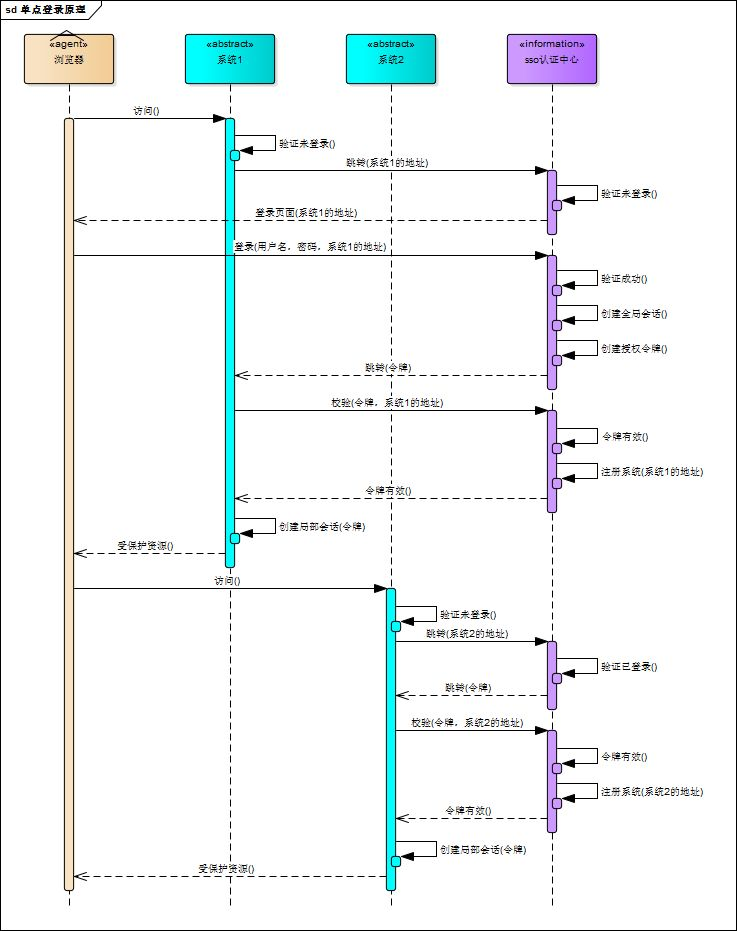
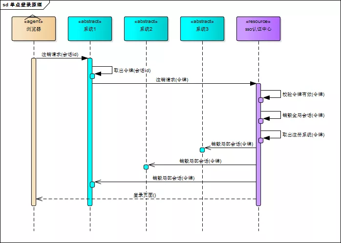
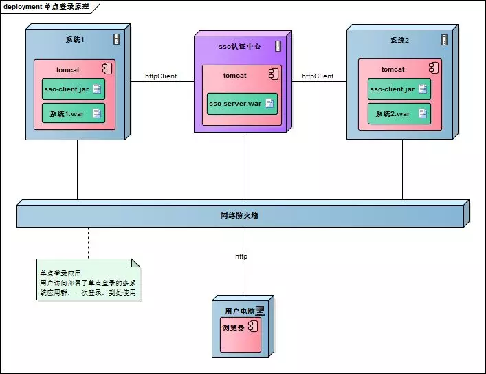
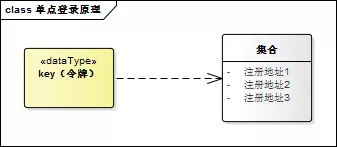

多应用群：当一个系统登录时，其他应用也登录，一个系统退出，其他也退出；

单系统登录解决方案的核心是cookie，cookie携带会话id在浏览器与服务器之间维护会话状态。但cookie是有限制的，这个限制就是cookie的域（通常对应网站的域名），浏览器发送http请求时会自动携带与该域匹配的cookie，而不是所有cookie。

既然这样，为什么不将web应用群中所有子系统的域名统一在一个顶级域名下，例如“*.baidu.com”，然后将它们的cookie域设置为“baidu.com”，这种做法理论上是可以的，甚至早期很多多系统登录就采用这种同域名共享cookie的方式。

然而，可行并不代表好，共享cookie的方式存在众多局限。首先，应用群域名得统一；其次，应用群各系统使用的技术（至少是web服务器）要相同，不然cookie的key值（tomcat为JSESSIONID）不同，无法维持会话，共享cookie的方式是无法实现跨语言技术平台登录的，比如java、php、.net系统之间；第三，cookie本身不安全。

因此，我们需要一种全新的登录方式来实现多系统应用群的登录，这就是单点登录

# 一：单点登录

## 1：登录

相比于单系统登录，sso需要一个独立的认证中心，只有认证中心能接受用户的用户名密码等安全信息，其他系统不提供登录入口，只接受认证中心的间接授权。间接授权通过令牌实现，sso认证中心验证用户的用户名密码没问题，创建授权令牌。



浏览器登录系统2时，SSO认证中心怎么判断是同一个浏览器？

用户登录成功之后，会与sso认证中心及各个子系统建立会话，用户与sso认证中心建立的会话称为全局会话，用户与各个子系统建立的会话称为局部会话，局部会话建立之后，用户访问子系统受保护资源将不再通过sso认证中心，全局会话与局部会话有如下约束关系

1. 局部会话存在，全局会话一定存在
2. 全局会话存在，局部会话不一定存在
3. 全局会话销毁，局部会话必须销毁

## 2：注销



# 二：部署

单点登录涉及sso认证中心与众子系统，子系统与sso认证中心需要通信以交换令牌、校验令牌及发起注销请求，因而子系统必须集成sso的客户端，sso认证中心则是sso服务端，整个单点登录过程实质是sso客户端与服务端通信的过程，用下图描述。



sso认证中心与sso客户端通信方式有多种，这里以简单好用的httpClient为例，web service、rpc、restful api都可以。

# 三：实现

只是简要介绍下基于java的实现过程，不提供完整源码，明白了原理，我相信你们可以自己实现。sso采用客户端/服务端架构，我们先看sso-client与sso-server要实现的功能（下面：sso认证中心=sso-server）

**sso-client**

1. 拦截子系统未登录用户请求，跳转至sso认证中心
2. 接收并存储sso认证中心发送的令牌
3. 与sso-server通信，校验令牌的有效性
4. 建立局部会话
5. 拦截用户注销请求，向sso认证中心发送注销请求
6. 接收sso认证中心发出的注销请求，销毁局部会话

**sso-server**

1. 验证用户的登录信息
2. 创建全局会话
3. 创建授权令牌
4. 与sso-client通信发送令牌
5. 校验sso-client令牌有效性
6. 系统注册
7. 接收sso-client注销请求，注销所有会话

接下来，我们按照原理来一步步实现sso吧！

#### 1、sso-client拦截未登录请求

java拦截请求的方式有servlet、filter、listener三种方式，我们采用filter。在sso-client中新建LoginFilter.java类并实现Filter接口，在doFilter()方法中加入对未登录用户的拦截

```java
public void doFilter(ServletRequest request, ServletResponse response, FilterChain chain) 
                                 throws IOException, ServletException {
    HttpServletRequest req = (HttpServletRequest) request;
    HttpServletResponse res = (HttpServletResponse) response;
    HttpSession session = req.getSession();

    if (session.getAttribute("isLogin")) {
        chain.doFilter(request, response);
        return;
    }
    //跳转至sso认证中心
    res.sendRedirect("sso-server-url-with-system-url");
}
```

#### 2、sso-server拦截未登录请求

拦截从sso-client跳转至sso认证中心的未登录请求，跳转至登录页面，这个过程与sso-client完全一样。

#### 3、sso-server验证用户登录信息

用户在登录页面输入用户名密码，请求登录，sso认证中心校验用户信息，校验成功，将会话状态标记为“已登录”。

```java
@RequestMapping("/login")
public String login(String username, String password, HttpServletRequest req) {
    this.checkLoginInfo(username, password);
    req.getSession().setAttribute("isLogin", true);
    return "success";
}
```

#### 4、sso-server创建授权令牌

授权令牌是一串随机字符，以什么样的方式生成都没有关系，只要不重复、不易伪造即可，下面是一个例子

```java
String token = UUID.randomUUID().toString();
```

#### 5、sso-client取得令牌并校验

sso认证中心登录后，跳转回子系统并附上令牌，子系统（sso-client）取得令牌，然后去sso认证中心校验，在LoginFilter.java的doFilter()中添加几行]

```java
// 请求附带token参数
String token = req.getParameter("token");
if (token != null) {
    // 去sso认证中心校验token
    boolean verifyResult = this.verify("sso-server-verify-url", token);
    if (!verifyResult) {
        res.sendRedirect("sso-server-url");
        return;
    }
    chain.doFilter(request, response);
}
```

verify()方法使用httpClient实现，这里仅简略介绍，httpClient详细使用方法请参考官方文档

```java
HttpPost httpPost = new HttpPost("sso-server-verify-url-with-token");
HttpResponse httpResponse = httpClient.execute(httpPost);
```

#### 6、sso-server接收并处理校验令牌请求

用户在sso认证中心登录成功后，sso-server创建授权令牌并存储该令牌，所以，sso-server对令牌的校验就是去查找这个令牌是否存在以及是否过期，令牌校验成功后sso-server将发送校验请求的系统注册到sso认证中心（就是存储起来的意思）

令牌与注册系统地址通常存储在key-value数据库（如redis）中，redis可以为key设置有效时间也就是令牌的有效期。redis运行在内存中，速度非常快，正好sso-server不需要持久化任何数据。

令牌与注册系统地址可以用下图描述的结构存储在redis中，可能你会问，为什么要存储这些系统的地址？如果不存储，注销的时候就麻烦了，用户向sso认证中心提交注销请求，sso认证中心注销全局会话，但不知道哪些系统用此全局会话建立了自己的局部会话，也不知道要向哪些子系统发送注销请求注销局部会话。



#### 7、sso-client校验令牌成功创建局部会话

令牌校验成功后，sso-client将当前局部会话标记为“已登录”，修改LoginFilter.java，添加几行

```java
if (verifyResult) {
    session.setAttribute("isLogin", true);
}
```

sso-client还需将当前会话id与令牌绑定，表示这个会话的登录状态与令牌相关，此关系可以用java的hashmap保存，保存的数据用来处理sso认证中心发来的注销请求

#### 8、注销过程

用户向子系统发送带有“logout”参数的请求（注销请求），sso-client拦截器拦截该请求，向sso认证中心发起注销请求。

```java
String logout = req.getParameter("logout");
if (logout != null) {
    this.ssoServer.logout(token);
}
```

sso认证中心也用同样的方式识别出sso-client的请求是注销请求（带有“logout”参数），sso认证中心注销全局会话

```java
@RequestMapping("/logout")
public String logout(HttpServletRequest req) {
    HttpSession session = req.getSession();
    if (session != null) {
        session.invalidate();//触发LogoutListener
    }
    return "redirect:/";
}
```

sso认证中心有一个全局会话的监听器，一旦全局会话注销，将通知所有注册系统注销

```java
public class LogoutListener implements HttpSessionListener {
    @Override
    public void sessionCreated(HttpSessionEvent event) {}
    @Override
    public void sessionDestroyed(HttpSessionEvent event) {
        //通过httpClient向所有注册系统发送注销请求
    }
}
```

