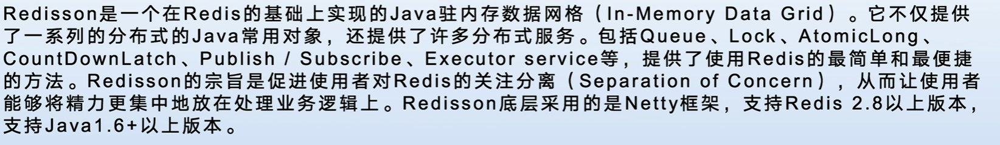

单机系统中，对一些并发场景读取公共资源时如扣库存，卖车票之类的需求可以简单的使用[同步](https://crossoverjie.top/2018/01/14/Synchronize/)或者是[加锁](https://crossoverjie.top/2018/01/25/ReentrantLock/)就可以实现。

业界常用的解决方案通常是借助于一个第三方组件并利用它自身的排他性来达到多进程的互斥。如：

- 基于 DB 的唯一索引。
- 基于 ZK 的临时有序节点。
- 基于 Redis 的 `NX EX` 参数。

这里主要基于 Redis 进行讨论。

# 高效的分布式锁

当我们在设计分布式锁的时候，我们应该考虑分布式锁至少要满足的一些条件，同时考虑如何高效的设计分布式锁，

1、互斥

​		在分布式高并发的条件下，我们最需要保证，同一时刻只能有一个线程获得锁，这是最基本的一点。

2、防止死锁

​		在分布式高并发的条件下，比如有个线程获得锁的同时，还没有来得及去释放锁，就因为系统故障或者其它原因使它无法执行释放锁的命令,导致其它线程都无法获得锁，造成死锁。

所以分布式非常有必要设置锁的`有效时间`，确保系统出现故障后，在一定时间内能够主动去释放锁，避免造成死锁的情况。

3、性能

​		对于访问量大的共享资源，需要考虑减少锁等待的时间，避免导致大量线程阻塞。

所以在锁的设计时，需要考虑两点。

​			1）、`锁的颗粒度要尽量小`。比如你要通过锁来减库存，那这个锁的名称你可以设置成是商品的ID,而不是任取名称。这样这个锁只对当前商品有效,锁的颗粒度小。

​			2）、`锁的范围尽量要小`。比如只要锁2行代码就可以解决问题的，那就不要去锁10行代码了。

4、重入

​		我们知道ReentrantLock是可重入锁，那它的特点就是：同一个线程可以重复拿到同一个资源的锁。重入锁非常有利于资源的高效利用。

针对上述要求，引入使用redission

# 二：redisson

## 基础概念和使用

### 简介：



官网：

### 对比Jedis

redis在Java端的客户端，同样对比于jedis


### 常用功能：

1：分布式锁

- 可重入锁：以线程为单位，当一个线程获取对象锁之后，这个线程可以再次获取本对象上的锁，而其他的线程不可以。

- 公平锁：当一个线程释放资源后，对于其他线程的资源怎么进行分配，每隔线程抢占锁的顺序为先后调用lock方法的顺序依次获取锁。

- 闭锁：类似于Java的中CountDownLatch对象，先初始化几个线程，每个线程执行完毕后，总数就会减一，当变成0即所有线程都执行完毕后，CountDownLatch会触发一个完成的事件。


2：限流器

分布式环境下对请求方的一个限制，下单时直接限制下单线程请求

基于Redis的分布式限流器（RateLimiter）可以用来在分布式环境下限制请求方的调用频率，既适用于不同Redisson实例下的多线程限流，也使用与相同Redisson实例下的多线程限流。

该算法不保证公平性，除了同步接口外，还提供了异步（Async），反射式（Reactive）和RxJava2标准接口。

3：话题（订阅分发）

订阅话题后当接收到消息进行消费

4：事务

redis并不支持事务，redisson提供了事务机制。

为RMap，RMapCache，RLocalCachedMap，RSet,RSetCache和RBucket这样的对象提供具有ACID属性的事务功能，Redisson事务通过分布式锁保证了连续写入的原子性，同时在内部通过操作指令队列实现了Redis原本没有的提交与回滚功能。当提交与回滚遇到问题的时候，将通过org.redisson.transaction.TransactionExceprion告知用户。

5：队列

提供了有界无界，阻塞非阻塞队列

6：分布式服务

- 分布式远程服务：远程调用RPC
- 执行任务服务：类似于线程池，实现了java.util.concurrent.ExecutorService接口，支持在不同的独立节点里执行基于Java.util.concurrent.Callable接口或者java.lang.Runable接口或Lambda的任务。这样的任务也可以通过使用Redisson实例，实现对存储在Redis里的数据进行操作。Redisson分布式执行服务最快速和最有效的方法。
- 调度任务服务：定时任务，实现了java中ScheduleExecutorService接口

7：布隆过滤器

某些东西一定不存在后者有可能存在

### 配置方式

a，单Redis节点模式

```java
//默认连接地址
RedissionClient redission = Redission。create();
Config config = new Config();
config.useSingleServer().setAddress("myredisserver:6379");
RedissionClient redission = Redission.create(config);
```

b：微服务SpringBoot配置

引入启动器依赖：

配置

```yml
spring:
	redis:
		host:127.0.0.1
		password:123456
		database:8
```


### 使用锁

阻塞式获取锁

```java
    //阻塞获取锁，没有获取到锁阻塞线程
    public void testgetLock(){
        RLock lock = null;
        try{
            lock = redissonClient.getLock("lock");
            lock.lock();
            System.out.println(Thread.currentThread().getName() + "获取到锁");
            Thread.sleep(2000);
        }catch (InterruptedException e){
            e.printStackTrace();
        }finally {
            if (null!=lock && lock.isHeldByCurrentThread()){
                lock.unlock();
            }
        }
    }
```


非阻塞的锁

```java
    //立即返回获取锁的状态
    public void testTryLock(){
        RLock lock = null;
        try{
            lock = redissonClient.getLock("lock");
            if (lock.tryLock()){
                System.out.println(Thread.currentThread().getName() + "获取到锁");
                Thread.sleep(2000);
            }else{
                System.out.println(Thread.currentThread().getName() + "没有获取到锁");
            }
        }catch (InterruptedException e){
            e.printStackTrace();
        }finally {
            if (null!=lock && lock.isHeldByCurrentThread()){
                lock.unlock();
            }
        }
    }
```


加最长等待时间，防止死锁

```java
//立即返回获取锁的状态
public void testFairLockAndtryTime(){
    RLock lock = null;
    try{
        //非公平锁，随机取一个等待中的线程分配锁
        //lock = redissonClient.getLock("lock");
        //公平锁，按照先后顺序依次分配锁
        lock = redissonClient.getFairLock("lock");
        //尝试获取锁，最多等待锁4秒，如果一个线程10秒则强制释放锁
        if (lock.tryLock(4,10, TimeUnit.SECONDS)){
            System.out.println(Thread.currentThread().getName() + "获取到锁");
            Thread.sleep(2000);
        }else{
            System.out.println(Thread.currentThread().getName() + "没有获取到锁");
        }
    }catch (InterruptedException e){
        e.printStackTrace();
    }finally {
        if (null!=lock && lock.isHeldByCurrentThread()){
            lock.unlock();
        }
    }
}
```


### 使用限流器

```java
    //初始化限流器
    public void init(){
        RRateLimiter limiter = redissonClient.getRateLimiter("rateLimiter");
        //每1秒产生5个令牌，一秒内只有五个令牌可用，如果过来10个线程，只有五个能用
        limiter.trySetRate(RateType.PER_CLIENT,5,1, RateIntervalUnit.SECONDS);
    }
```

每1秒产生5个令牌，一秒内只有五个令牌可用，如果过来10个线程，只有五个能用

```java
//获取令牌
public void thread(){
    RRateLimiter limiter = redissonClient.getRateLimiter("rateLimiter");
    //尝试获取1个令牌
    if (limiter.tryAcquire()){
        System.out.println(Thread.currentThread().getName() + "ch");
    }else{
        System.out.println(Thread.currentThread().getName() + "未获取到令牌");
    }
}
```

### Map

Redission中的Map是有序的，理论上大小没有限制，但是受Redis的内存大小限制其实是有限制的

Redisson提供了一系列的映射类型的数据结果，这些结构按特性分为三类：

- 元素淘汰类
- 本地缓存类
- 数据分片类

实现类


RMapCache可以设置过期时间

RLocalCachedMap支持本地缓存


### Set

淘汰机制，设置过期时间


List

队列

闭锁

话题

### 自定义使用

```java
public class RedissionLockUtil<T> {
	private static Logger logger = LoggerFactory.getLogger(RedissionLockUtil.class);
	
	private static RedissonClient redisson = (RedissonClient) SpringContextHolder.getBean("standalone");
	
	/**
	 * 
	 * @param lockId 锁id(对应业务唯一ID)
	 * @param timeout 最大等待获取锁时间
	 * @param unit 等待时间单位
	 * @param callback 回调方法
	 * @return
	 */
	public static<T> T execute(String lockId, Integer timeout, TimeUnit unit, Callback<T> callback) {

		org.redisson.api.RLock lock = null;
        boolean getLock = false;
        try {
            lock = redisson.getLock(lockId);
            getLock = lock.tryLock(timeout, unit);
            if(getLock){
            	   System.out.println(Thread.currentThread().getId()+"拿到锁:"+lockId);
                // 拿到锁
                return callback.onGetLock();
            }else{
                // 未拿到锁
                System.out.println(Thread.currentThread().getId()+"未拿到锁:"+lockId);
                return callback.onTimeout();
            }
        }catch(InterruptedException ex){
        	logger.error(ex.getMessage(), ex);
            Thread.currentThread().interrupt();
        }catch (Exception e) {
        	throw e;
        }finally {
            if(getLock) {
            	  // 释放锁
                System.out.println(Thread.currentThread().getId()+"释放锁:"+lockId);
                lock.unlock();
            }
        }
        return null;
    }	
	/**
	 * 默认都调用此方法：执行方法<br>
	 * 自动续期
	 * @param lockId 锁id(对应业务唯一ID)
	 * @param callback 回调方法
	 * @return
	 */
	public static<T> T execute(String lockId, Callback<T> callback) {

		org.redisson.api.RLock lock = null;
        boolean getLock = false;
        try {
            lock = redisson.getLock(lockId);
            
            
            getLock = lock.tryLock();
            if(getLock){

                System.out.println(Thread.currentThread().getId()+"拿到锁:"+lockId);
                // 拿到锁
                return callback.onGetLock();
            }else{
                // 未拿到锁
                System.out.println(Thread.currentThread().getId()+"未拿到锁:"+lockId);
                return callback.onTimeout();
            }
        }catch(InterruptedException ex){
        	logger.error(ex.getMessage(), ex);
            Thread.currentThread().interrupt();
        }catch (Exception e) {
        	 System.out.println(e);
        	throw e;
        }finally {
            if(getLock) {
                // 释放锁
                System.out.println(Thread.currentThread().getId()+"释放锁:"+lockId);
                lock.unlock();
            }
        }
        return null;
    }
}
```

承运人编辑

```java
/**
 * 承运人信息编辑
 * 其他逻辑已经进行删除
 */
@Override
@Transactional
public void save(Carrier carrier) throws ServiceException {
   boolean result=RedissionLockUtil.execute("save_"+carrier.getCarrierId(), new Callback<Boolean>() {
      @Override
      public Boolean onGetLock() throws InterruptedException {
         Carrier c = carrierDao.getCarrierListById(carrier.getCarrierId());
         if (null != c) {
            carrierDao.update(carrier);
         } else {
            carrierDao.insert(carrier);
         }
         return true;
      }

      @Override
      public Boolean onTimeout() throws InterruptedException {
         return false;
      }
   });
}
```


# 二、Redission分布式锁的底层原理

获取锁以及防止锁失效


1.线程1，线程2，线程3同时去获取锁；

2.线程1获取到锁，线程2，线程3未获取到锁；

3.线程2，线程3while循环，进行自旋获取锁

4.线程1后台开启线程，每1/3超时时间执行一次锁延迟动作，防止锁失效

使用lua语言将其发送给redis，保证复杂业务逻辑的原子性

**lua字段解释**
KEYS[1]:表示你加锁的那个key，比如说
RLock lock = redisson.getLock(“myLock”);
这里你自己设置了加锁的那个锁key就是“myLock”。
ARGV[1]:表示锁的有效期，默认30s
ARGV[2]:表示表示加锁的客户端ID,类似于下面这样：
8743c9c0-0795-4907-87fd-6c719a6b4586:1


## 加锁机制


## 锁互斥机制

第一个if判断会执行“exists myLock”，发现myLock这个锁key已经存在了。

接着第二个if判断，判断一下，myLock锁key的hash数据结构中，是否包含客户端2的ID，但是明显不是的，因为那里包含的是客户端1的ID。

所以，客户端2会获取到pttl myLock返回的一个数字，这个数字代表了myLock这个锁key的**剩余生存时间。**比如还剩15000毫秒的生存时间。

此时客户端2会进入一个while循环，不停的尝试加锁。

## 可重入锁机制

第一个if判断肯定不成立，“exists myLock”会显示锁key已经存在了。

第二个if判断会成立，因为myLock的hash数据结构中包含的那个ID，就是客户端1的那个ID，也就是“8743c9c0-0795-4907-87fd-6c719a6b4586:1”

此时就会执行可重入加锁的逻辑，他会用：

incrby myLock 

 8743c9c0-0795-4907-87fd-6c71a6b4586:1 1

通过这个命令，对客户端1的加锁次数，累加1。

## 释放锁机制

lua源码

```lua
if (redis.call('exists', KEYS[1]) == 0) then
       redis.call('publish', KEYS[2], ARGV[1]);
        return 1; 
        end;
if (redis.call('hexists', KEYS[1], ARGV[3]) == 0) then 
     return nil;
     end;
local counter = redis.call('hincrby', KEYS[1], ARGV[3], -1); 
if (counter > 0) then
     redis.call('pexpire', KEYS[1], ARGV[2]); 
     return 0; 
else redis.call('del', KEYS[1]); 
     redis.call('publish', KEYS[2], ARGV[1]); 
     return 1;
     end;
return nil;
```

执行lock.unlock()，就可以释放分布式锁，此时的业务逻辑也是非常简单的。

就是每次都对myLock数据结构中的那个加锁次数减1。如果发现加锁次数是0了，说明这个客户端已经不再持有锁了，此时就会用：“del myLock”命令，从redis里删除这个key。

然后另外的客户端2就可以尝试完成加锁了。

## watch dog自动延期机制

Redisson中客户端1一旦加锁成功，就会启动一个watch dog看门狗，他是一个后台线程，会每隔1/3的超时时间（设定生存时间为30秒，每隔10秒）检查一下，如果客户端1还持有锁key，那么就会不断的延长锁key的生存时间。

默认情况下，看门狗的续期时间是30s，也可以通过修改Config.lockWatchdogTimeout来另行指定。

另外Redisson 还提供了可以指定leaseTime参数的加锁方法来指定加锁的时间。超过这个时间后锁便自动解开了。不会延长锁的有效期！！！

,默认情况下,加锁的时间是30秒.如果加锁的业务没有执行完,那么有效期到 30-10 = 20秒的时候,就会进行一次续期,把锁重置成30秒.那这个时候可能又有同学问了,那业务的机器万一宕机了呢?宕机了定时任务跑不了,就续不了期,那自然30秒之后锁就解开了呗.