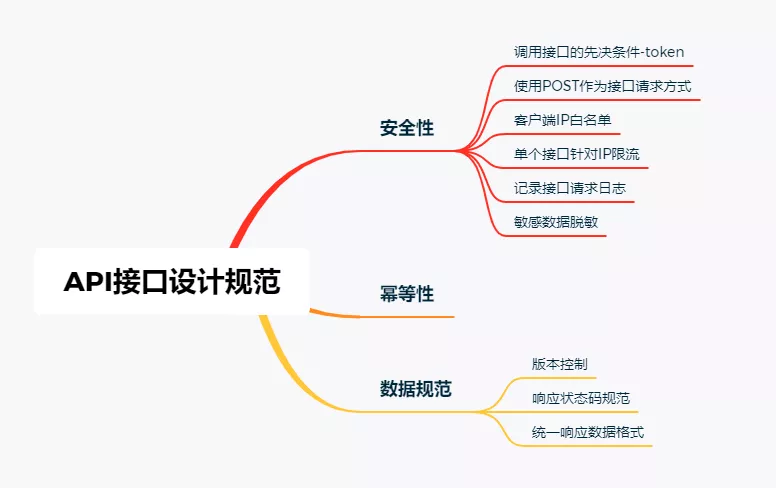
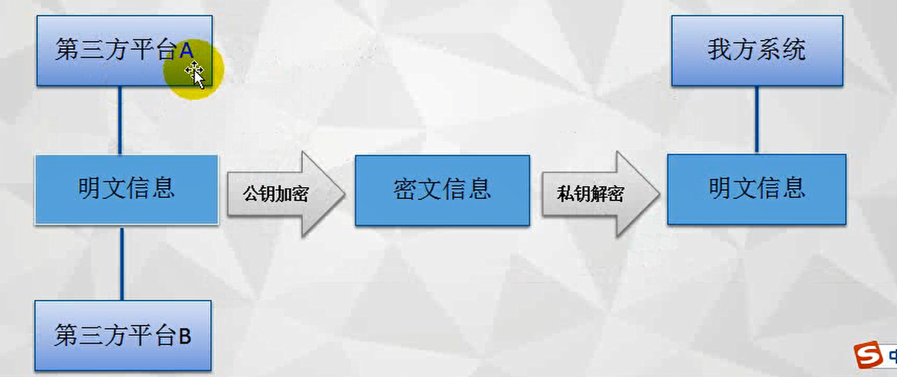

# 一：安全性

1：Token调用

2：所有接口都使用POST作为接口请求方式。

3：客户端白名单设置：接口的访问权限对部分ip进行开放。这样就能避免其他ip进行访问攻击

设置ip白名单比较麻烦的一点就是当你的客户端进行迁移后，就需要重新联系服务提供者添加新的ip白名单。设置ip白名单的方式很多，除了传统的防火墙之外，spring cloud alibaba提供的组件sentinel也支持白名单设置。为了降低api的复杂度，推荐使用防火墙规则进行白名单设置。

4：单个接口针对IP限流

限流是为了更好的维护系统稳定性。使用redis进行接口调用次数统计，ip+接口地址作为key，访问次数作为value，每次请求value+1，设置过期时长来限制接口的调用频率。

5：记录接口请求日志

使用aop全局记录请求日志，快速定位异常请求位置，排查问题原因。

6：敏感数据脱敏

在接口调用过程中，可能会涉及到订单号等敏感数据，这类数据通常需要脱敏处理，最常用的方式就是加密。加密方式使用安全性比较高的`RSA`非对称加密。非对称加密算法有两个密钥，这两个密钥完全不同但又完全匹配。只有使用匹配的一对公钥和私钥，才能完成对明文的加密和解密过程。

# 二：幂等性设计

幂等性是指任意多次请求的执行结果和一次请求的执行结果所产生的影响相同。

# 三：数据规范

1：版本控制

一套成熟的API文档，一旦发布是不允许随意修改接口的。这时候如果想新增或者修改接口，就需要加入版本控制，版本号可以是整数类型，也可以是浮点数类型。一般接口地址都会带上版本号，http://ip:port//v1/list。

2：响应状态码规范

一个牛逼的API，还需要提供简单明了的响应值，根据状态码就可以大概知道问题所在。我们采用http的状态码进行数据封装，例如200表示请求成功，4xx表示客户端错误，5xx表示服务器内部发生错误。

3：统一响应数据格式

为了方便给客户端响应，响应数据会包含三个属性，状态码（code）,信息描述（message）,响应数据（data）。客户端根据状态码及信息描述可快速知道接口，如果状态码返回成功，再开始处理数据。

# 四：接口文档

：Swagger，Wiki，

希望能保留接口记录，

# 五：开放API接口

## 1：安全性

数据窃取

数据篡改

数据泄露

加密：签名

RSA加密：

公钥加密，私钥解密，

RSA签名

