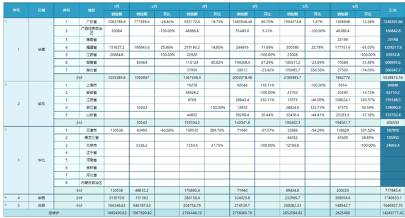
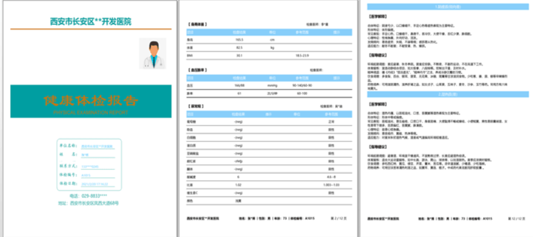
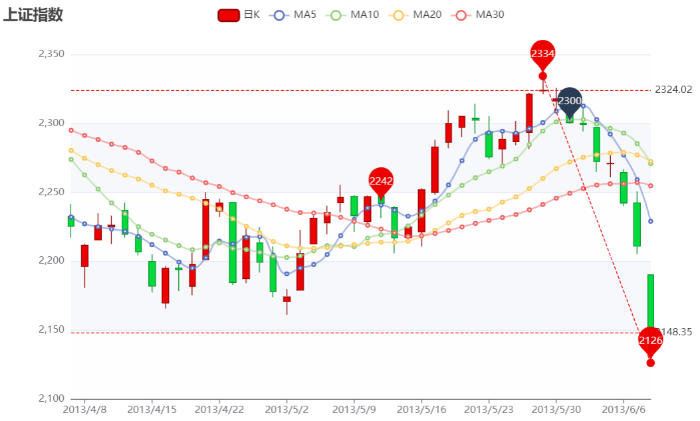

# 一：研发背景

甲方客户对于各种报表的形式多样性，图表信息等使用Echart进行生成，由于Echart对图片在前端进行渲染有一定时间，利用爬虫，判定图片是否生成成功。生成成功后，将页面进行爬取，生成Word或转成PDF，并伴随文档合并，骑缝章，预览等功能；

1：需要支持普通界面的Excel文档导出，模板导出，自定义导出；

2：类Word文档的文档导出，这种主要考虑的是文档类报表的比如页眉页脚，子报表，图片嵌套，文档合并，自动换页等功能；

3：图表的样式，需要更加直观的显示数据，需要加入更多的如散点图，饼图等流行的图表类型；

4：文档格式的转换；

账单类的；

# 二：整体思路

1：一方面，对于数据的来源，Excel好说，直接调用查询方法然后只需要写一个通用的方法即可；而对于其他不同类型的报告之类的，不同公司要求的内容不同，数据来源不同，可以采用计算引擎进行配置，写方法给公司配置不同的数据模块；(可以思考下有没有可能做成用户自己自定义设计的报告模板的，我们开发基本组件，客户想要什么数据自己进行拖拽组合，对于表头等信息也需要自定义进行)

2：对于类Word文档，直接使用HTML进行定制，然后根据HTML转换成Word；预览功能即可使用；

3：对于图表信息，采用 ` Echarts ` 进行，完成度高，展示效果好，可以基本完成大部分的需求；

